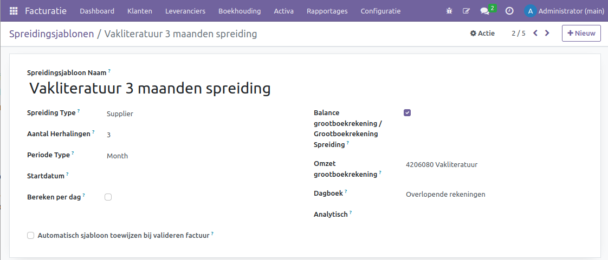

Spreiden van kosten
===================

Uitgestelde uitgaven zijn kosten die al zijn gemaakt voor producten of diensten die nog moeten worden ontvangen. Denk hierbij aan bijvoorbeeld juridische kosten of investeringsbankkosten bij het uitgeven van obligaties. Deze kosten worden gelijkmatig afgeschreven over de levensduur van de obligatie (bijvoorbeeld 20 of 30 jaar). Aan de andere kant zijn vooruitbetaalde uitgaven aankopen die een bedrijf vooraf doet en die binnen een jaar na aankoop worden gebruikt of opgebruikt. Denk hierbij aan verzekeringen, huur of belastingen. Deze vooruitbetaalde kosten worden op de balans vermeld als een huidig activum totdat het voordeel van de aankoop wordt gerealiseerd. Kortom, uitgestelde uitgaven zijn voor langere tijd, terwijl vooruitbetaalde uitgaven binnen een jaar worden gebruikt of opgebruikt.

Curq biedt ondersteuning bij het spreiden van langdurige kosten. Hierdoor kunnen bedrijven de impact van dergelijke kosten over meerdere periodes verdelen, waardoor een nauwkeuriger financieel beeld ontstaat. Het is een handige methode om de financiële rapportage te verbeteren en de effecten van grote uitgaven te verzachten.

Voorbeeld: Stel dat je jaarlijks €1200 aan verzekeringen betaalt. Deze kosten zijn bedoeld voor het gebruik van de verzekering gedurende het hele jaar. Als je deze kosten in één maand zou laten vallen, lijkt het alsof de verzekering alleen voor die ene maand geldig is en heb je die maand onevenredig hoge uitgaven. Om een beter beeld te krijgen, kun je deze kosten beter over 12 maanden spreiden. Op die manier maak je elke maand €100 aan verzekeringskosten en boek je het totale bedrag op een vooruitbetaalde grootboekrekening.

.. Note::
    Dit proces wordt in de financiële wereld op verschillende manieren aangeduid. Naast transitorisch boeken wordt het ook wel permanence boekhouden of overlopende kosten genoemd. 

Sjablonen voor spreiden van kosten configureren
-----------------------------------------------
Je kunt een voorgedefinieerd sjabloon voor spreiding aanmaken via het menu Facturatie > Configuratie > Spreidingsjablonen. Dit sjabloon stelt je in staat om de juiste instellingen te definiëren wanneer je een spreiding wilt uitvoeren of een factuurregel wilt koppelen. Op basis van deze instellingen berekent en boekt Curq vervolgens de juiste gegevens in.

- **Spreidingsjabloon Naam:** 
- **Spreiding Type:** 
- **Aantal Herhalingen:** 
- **Periode Type:** 
- **Startdatum:** 
- **Bereken per dag:** 
- **Balans grootboekrekening / Grootboekrekening Spreiding:** 
- **Spreiding Balans Grootboekrekening:** 
- **Dagboek:** 
- **Analytisch:** 
- **Automatisch sjabloon toewijzen bij valideren factuur:** 

