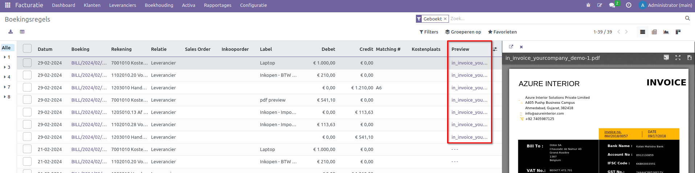

Facturen Preview
================

CURQ heeft een nieuwe functionaliteit toegevoegd waarmee facturen kunnen worden voorzien van een PDF-preview. Deze preview is bijzonder handig bij het coderen van inkoopfacturen, omdat het gebruikers in staat stelt de factuur visueel te inspecteren en snel belangrijke informatie, zoals bedragen, datums en leveranciersgegevens, te achterhalen. Deze visuele controle draagt bij aan een nauwkeuriger coderingsproces en versnelt de workflow door directe toegang tot de visuele weergave, wat cruciaal is voor een efficiënte en foutloze financiële administratie.

Beoordelen inkoopfactuur
------------------------

Een inkoopfactuur kan op verschillende manieren worden aangemaakt binnen Curq:

1. Via de knop [UPLOAD] bij de Facturatie Dashboard
2. Via de knop [UPLOAD] bij Facturatie > Leveranciers > Leveranciersfacturen
3. Via de knop [NIEUW] bij Facturatie > Leveranciers > Leveranciersfacturen

Bij optie 3 moet de PDF-factuur apart worden geüpload via de bijlage-optie boven de logging.

.. image:: Leveranciersfactuur/Leveranciersfacturen_preview001.png

Na het uploaden wordt de PDF aan de rechterkant getoond. Het tonen hiervan is afhankelijk van jouw schermgrootte. Als het scherm te klein is, wordt de PDF-preview niet weergegeven.

.. image:: Leveranciersfactuur/Leveranciersfacturen_preview002.png

We zullen de volgende veelgebruikte knoppen bespreken:

1. **Bladeren door pagina's:** Als de PDF uit meerdere pagina's bestaat, kun je met deze knoppen door de pagina's navigeren.
2. **In- en uitzoomen:** Hiermee kun je in- en uitzoomen op het bestand.
3. **Printen of downloaden:** Gebruik deze knop om het bestand af te drukken of te downloaden.
4. **Bladeren door meerdere PDF-bestanden:** Als er meerdere PDF-bestanden zijn, kun je met deze knop (zowel aan de linker- als rechterkant) door de bestanden bladeren.

Indien het PDF-bestand dit ondersteunt, kunnen ook de teksten worden geselecteerd en gekopieerd voor gebruik bij het coderen van de inkoopfactuur. Dit maakt het proces efficiënter en nauwkeuriger.

Controle vanuit boekingsregels
------------------------------

De boekhouder of accountant controleert vaak de boekhouding aan de hand van de boekingsregels. In Curq is het tevens mogelijk om vanuit dit systeem een voorbeeld van de factuur op te vragen. Dit kan handig zijn om te verifiëren of bepaalde facturen correct zijn geboekt op de juiste grootboekrekening. Bijvoorbeeld, is jouw opleidingsfactuur geboekt op de juiste kostenrekening? 

Je kunt het overzicht van boekingsregels vinden onder Facturatie > Boekhouding > Boekingsregels

In de kolom “Preview” kun je op de gekoppelde PDF klikken. Zodra je dit doet, verschijnt de PDF-factuur aan de rechterkan