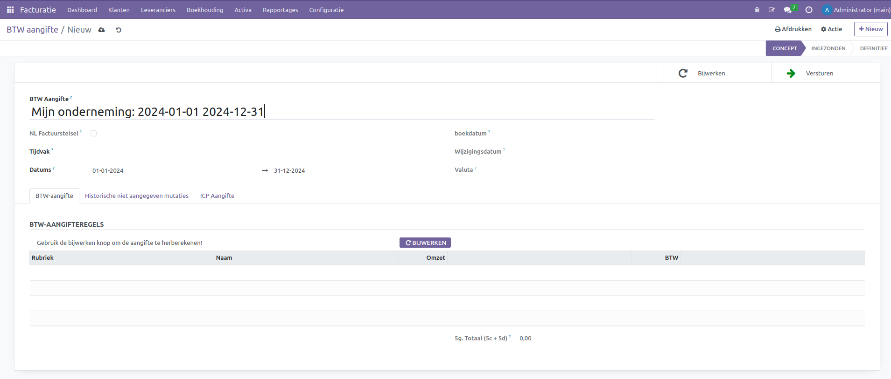

BTW-Aangifte
============

Bedrijven met een geregistreerd BTW-nummer dienen periodiek belastingaangiften in, hetzij maandelijks of kwartaal, afhankelijk van de omzet en registratieregels. Een BTW-aangifte, ook wel bekend als een belastingaangifte, verschaft de belastingautoriteiten gedetailleerde informatie over belastbare transacties. Deze aangifte is essentieel om de uitvoerbelasting op verkochte goederen en diensten te berekenen en de invoerbelasting op aangekochte goederen en diensten te registreren. Op basis van deze gegevens kan een bedrijf nauwkeurig het verschuldigde belastingbedrag bepalen of in sommige gevallen een teruggave aanvragen.

Naast het voldoen aan wettelijke verplichtingen draagt de correcte indiening van de BTW-aangifte bij aan de financiële transparantie van het bedrijf en biedt het inzicht in de fiscale gezondheid. Het proces is van cruciaal belang om boetes en juridische complicaties te vermijden, en het vergemakkelijkt deelname aan internationale handel door de juiste belastingdocumentatie te waarborgen. Kortom, de BTW-aangifte is niet alleen een administratieve formaliteit, maar ook een waardevol instrument voor bedrijven om financiële integriteit te handhaven en fiscale verplichtingen na te komen.

.. Note::
   Meer informatie over BTW Omzetbelasting vind je hier op de website van de belastingdienst `BTW (omzetbelasting) <https://www.belastingdienst.nl/wps/wcm/connect/nl/btw/btw>`_

BTW-Aangifte aanmaken
---------------------

Een BTW-aangifte kan in Curq aangemaakt worden via Facturatie > Rapportages > BTW Aangifte.

- **Lay-out:** Hier zijn vier opties beschikbaar om het ontwerp van jouw facturen of andere documenten te configureren.
- **Lettertype:** Kies hier een van de beschikbare lettertypes
- **Bedrijfslogo:** Upload hier je Bedrijfslogo.
- **Kleuren:** Curq stelt de kleuren voor op basis van je bedrijfslogo.
- **Achtergrond lay-out:** Kies een optie of upload je eigen achtergrond.
- **Bedrijfsslogan:** Vul hier jouw slogan in. Dit is optioneel.
- **Bedrijfsgegevens:** Vul hier jouw bedrijfsgegevens in.
- **Voettekst:** Vul hier de voettekst in. Denk aan je telefoonnummer, website, mailadres, KvK, BTW-Nummer of je bankrekeningnummer.
- **Papierformaat:** Kies het juiste formaat.