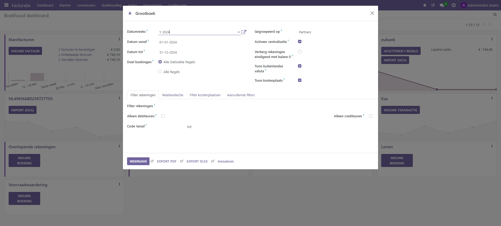

Boekhoud rapportages
----

In Curq maken we gebruik van de standaard boekhoudrapportages zoals die door de OCA (Odoo Communiity Organisation) worden onderhouden. De rapportages worden hieronder besproken.

Grootboek
----

Dit overzicht geeft een overzicht van alle boekingen per grootboek. Er zijn een aantal filteropties om het gewenste overzicht te zien:

**Datumreeks**. Hier geef je het gewenste boekjaar in

** Gegroepeerd op**. Je kan kiezen om het rapport per klant/leverancier te tonen, per belastinggroep, of zonder selectie. Wanneer je eeen totaal overzicht wil hebben van het openstaande saldo dan is het advies om te kiezen niet te groeperen.

**Datum vanaf - tot**. Gebruik de datumselectie als je een afwijkende periode wil controleren.

**Doel boekingen**. Hier selecteer je of je alleen de geboekte regels wil zien, of dat je ook alle conceptboekingen mee wil nemen in het rapport.

Filter opties
----

Je kan het rapport filteren zodat bijvoorbeeld alleen de debiteuren of crediteuren getoond worden. Het is ook mogelijk het rapport via een apa

.. image:: My-Ponto-Bank-Feed-Media/online_betalen_betaalproviders.png
       :width: 6.3in
       :height: 2.93264in
