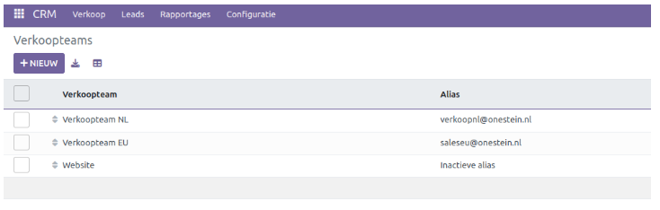
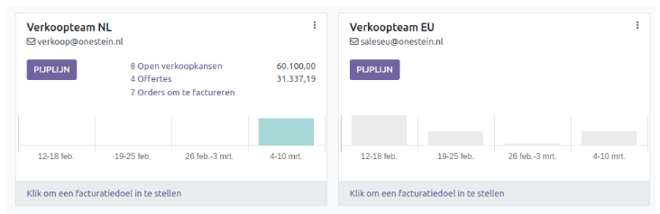
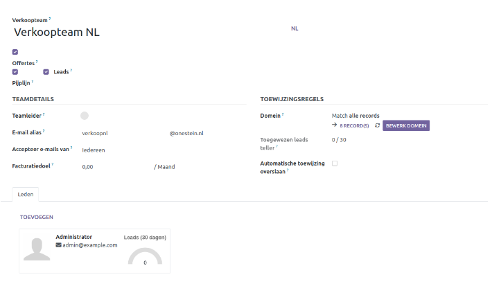
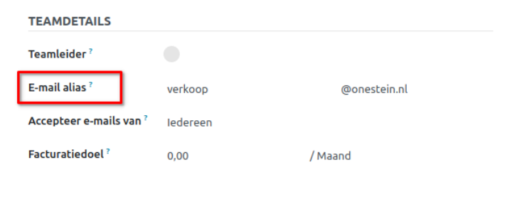
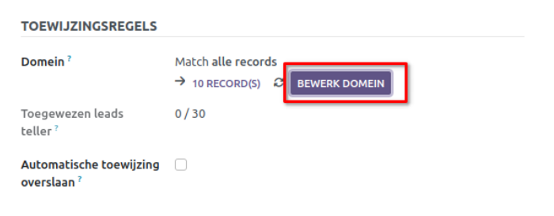
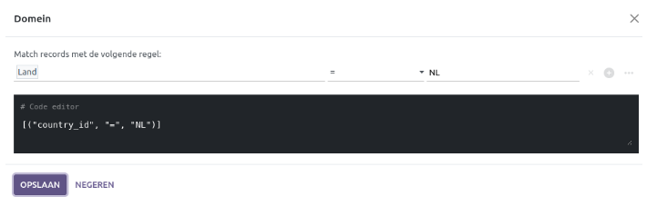
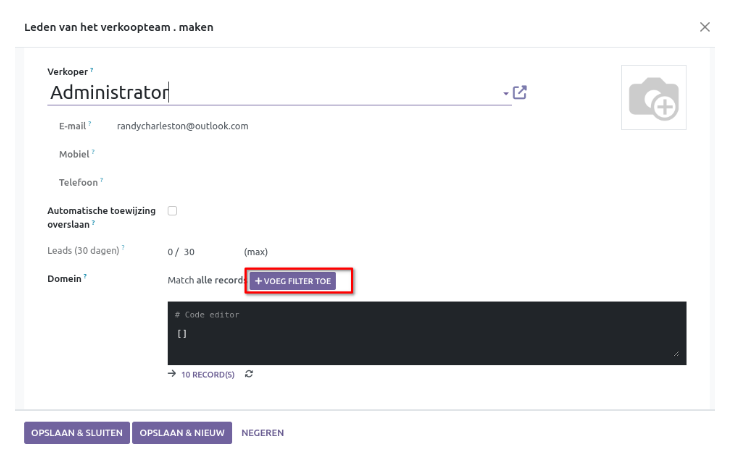
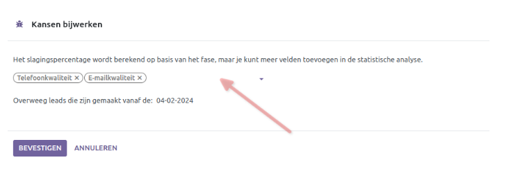

CRM - Advanced
=================================================================================================

In deze handleiding duiken we wat dieper in de settings voor o.a. de volgende functionaliteiten: 

1. Meerdere Verkoop Teams
2. Op regels gebaseerde toewijzing
3. Predictive Lead Scoring

Instellingen
---------------------------------------------------------------------------------------------------------------------
Ga hiervoor naar **Configuratie - Instellingen**. Hiermee wordt het volgende overzicht geopend:

.. image:: Media/001.png

**Herhaalde omzetten**:  Met deze functionaliteit kun je herhalende plannen en inkomsten definiëren voor verkoopkansen. De standaard ingestelde frequenties zijn: Maandelijks, Jaarlijks, Over 3 jaar en Over 5 jaar. Er is een mogelijkheid om een andere frequentie aan te maken.

**Leads**:  Met Leads wordt er een extra kwalificatie stap toegevoegd alvorens het een verkoopkans wordt.  Zodra de lead voldoet aan bepaalde criteria volgens het bedrijf, kan deze daarna worden omgezet naar verkoopkans.

**Meerdere Teams**:  Er kunnen verschillende Verkoop Teams worden aangemaakt die gerelateerd zijn aan een productgroep of dienst. Zo kunnen de leads & verkoopkansen verdeeld worden en krijgt u een helder beeld wat in de pijplijn zit per team. 

**Op regels gebaseerde toewijzing**:  In de CRM module kunnen leads en kansen worden toegewezen aan verkoopteams en verkopers op basis van specifieke regels. Door toewijzingsregels te creëren op basis van de kans op succes van de leads, kunnen prioriteiten worden gesteld aan leads die een grotere kans hebben om tot een deal te leiden. 

**Predictive Lead Scoring**:  Dit is een machine-learning model dat historische gegevens uit de CRM module gebruikt om open leads en kansen te beoordelen op basis van hun 'waarschijnlijkheid' om te resulteren in een succesvolle deal. 

Verkoop Teams
--------------------------------------------------------------------------------------------------
Om verkoopteams te beheren ga je naar **Configuratie - Verkoopteams**. In dit overzicht staan de reeds aangemaakte verkoopteams.

Om toegang te krijgen tot het dashboard van het verkoopteam, navigeer je naar het menu *Verkoop* en selecteer je *Teams*. In Curq worden de teams waarvan gebruikers deel uitmaken weergegeven als dashboard tegels.

Elke tegel biedt een samenvatting van de *open verkoopkansen, offertes, verkooporders* en *verwachte omzet* van het verkoopteam. Daarnaast bevat het een staafdiagram dat de nieuwe kansen per week weergeeft, evenals een voortgangsbalk voor facturatie.

Bij het aanklikken van een verkoopteam wordt het instellingenmenu geopend van dit verkoopteam waarbij er een aantal belangrijke settings gemaakt kan worden.  

Je kunt een *E-mail Alias* instellen om automatisch een lead of opportunity te genereren voor dit verkoopteam telkens wanneer een bericht naar dat unieke e-mailadres wordt verzonden. Je kunt kiezen of je e-mails wilt accepteren van iedereen, geauthenticeerde partners of alleen volgers.

Als dit team specifieke maandelijkse facturatie doelen heeft, kun je dit instellen.  

Om teamleden toe te voegen, ga je naar het tabblad *Leden* wanneer je de configuratiepagina van het verkoopteam bewerkt. 

Klik op *Toevoegen* en selecteer een verkoper uit het vervolgkeuzemenu of maak een nieuwe verkoper aan. Je kunt ook een maximum aantal leads instellen dat aan deze verkoper kan worden toegewezen in een periode van 30 dagen om ervoor te zorgen dat ze niet overwerken.  

Eén persoon kan als teamlid of teamleider worden toegevoegd aan meerdere verkoopteams, zodat ze toegang hebben tot alle pijplijn overzichten. 

Op regels gebaseerde toewijzing
---------------------------------------------------------------------------------------------------------
Je kunt één of meerdere filters instellen om leads of verkoopkansen aan een verkoopteam toe te wijzen op basis van specifieke eigenschappen, zoals bijvoorbeeld land, taal of campagne.

Klik op 'Bewerk Domein' om deze in te stellen. Klik vervolgens op  + voeg filter toe om een filter (of meerdere) in te stellen. 

Het instellen van filters kan ook op *verkoper* niveau die toegevoegd zijn aan een verkoopteam. 

Predictive Lead Scoring
-----------------------------------------------------------------------------------------------------------
Predictive lead scoring is een machine-learning model dat historische gegevens uit Curq CRM analyseert om open leads en kansen te beoordelen en te scoren. Terwijl een bedrijf kansen door de CRM-pijplijn verwerkt, verzamelt Curq gegevens over welke kansen worden gewonnen en verloren. 

Met behulp van de beschikbare data voorspelt predictive lead scoring de kans dat een nieuwe lead of kans succesvol zal zijn.
Naarmate er meer kansen door de CRM-pijplijn gaan, verzamelt Curq meer gegevens, wat leidt tot nauwkeurigere voorspellingen van waarschijnlijkheid. 

Wanneer je op *Kansen bijwerken* klikt (in het menu **configuratie - instellingen**), opent zich een pop-upvenster waarin je naast de standaardcriteria verschillende andere criteria kan instellen t.b.v. het voorspellen van lead scores. 

Elk van de volgende variabelen kan worden geactiveerd:

- **Status**: de geografische provincie waar de kans vandaan komt
- **Land**: het geografische land waar de opportunity vandaan komt
- **Telefoon Kwaliteit**: of er al dan niet een telefoonnummer wordt vermeld voor de opportunity
- **Email Kwaliteit**: of er al dan niet een e-mailadres wordt vermeld voor de opportunity
- **Bron**: de bron van een kans (bijv. zoekmachine, sociale media)
- **Taal**: de gesproken taal van de opportunity
- **Labels**: de tags die op de opportunity zijn geplaatst

