=========
CRM Basis
=========

De CRM-module binnen Curq is van onschatbare waarde voor het beheer van leadgeneratie en klantenwerving. Het stelt gebruikers in staat om leads van diverse bronnen te verzamelen en te organiseren, waardoor ze effectief kunnen worden omgezet in kansen. De naadloze integratie met andere modules, zoals bijvoorbeeld Verkoop, bevordert de productiviteit bij het omzetten van leads in kansen. 

Instellingen
------------
Voordat we beginnen met de flow van CRM, lopen we eerst even de instellingen met je door. 
Ga hiervoor naar **Configuratie - Instellingen**. Hiermee wordt het volgende overzicht geopend:

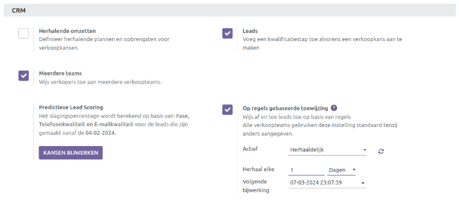

**Herhaalde omzetten**:  Met deze functionaliteit kun je herhalende plannen en inkomsten definiëren voor verkoopkansen. De standaard ingestelde frequenties zijn: Maandelijks, Jaarlijks, Over 3 jaar en Over 5 jaar. Er is een mogelijkheid om een andere frequentie aan te maken.

**Leads**:  Met Leads wordt er een extra kwalificatie stap toegevoegd alvorens het een verkoopkans wordt.  Zodra de lead voldoet aan bepaalde criteria volgens het bedrijf, kan deze daarna worden omgezet naar verkoopkans.

**Meerdere Teams**:  Er kunnen verschillende Verkoop Teams worden aangemaakt die gerelateerd zijn aan een productgroep of dienst. Zo kunnen de leads & verkoopkansen verdeeld worden en krijgt u een helder beeld wat in de pijplijn zit per team. Meer info vind je in de handleiding 'CRM Advanced <CRM Advanced>'.

**Op regels gebaseerde toewijzing**:  In de CRM module kunnen leads en kansen worden toegewezen aan verkoopteams en verkopers op basis van specifieke regels. Door toewijzingsregels te creëren op basis van de kans op succes van de leads, kunnen prioriteiten worden gesteld aan leads die een grotere kans hebben om tot een deal te leiden. Meer info vind je in de handleiding CRM Advanced.

**Predictive Lead Scoring**:  Dit is een machine-learning model dat historische gegevens uit de CRM module gebruikt om open leads en kansen te beoordelen op basis van hun 'waarschijnlijkheid' om te resulteren in een succesvolle deal. Meer info vind je in de handleiding CRM Advanced.

Leadgeneratie
-------------
Met de leadgeneratie settings heeft u een aantal opties om bestaande leads te verrijken met aanvullende bedrijfsgegevens en om nieuwe leads te creëren op basis van bijvoorbeeld land, industrie, grootte, enz. 

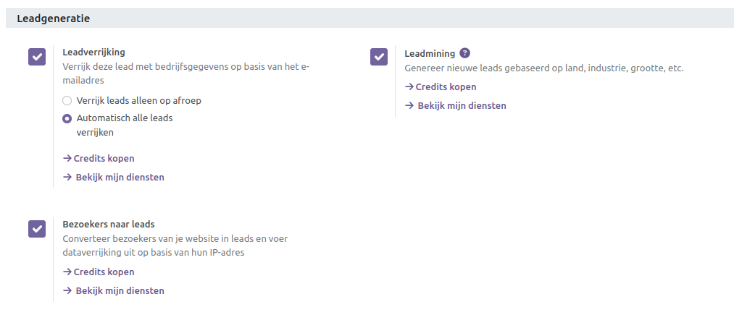

Een nieuwe lead aanmaken
------------------------
Ga naar het menu 'Leads' waarmee het overzicht van alle leads worden getoond. Klik op 'Nieuw' om een nieuwe lead aan te maken. 

Vul zoveel mogelijk gegevens in. De naam van de verkoopkans is het enige verplichte veld voor de lead. Zoveel mogelijk gegevens zorgt ervoor dat de lead sneller beoordeeld kan worden als reële verkoopkans. 

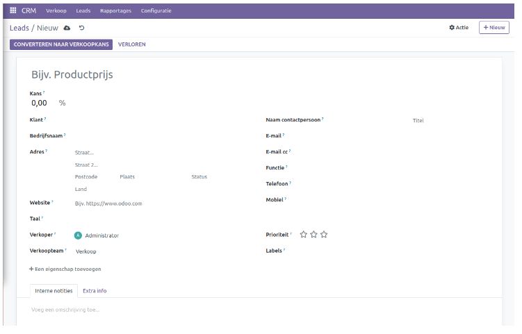

Velden zoals bijvoorbeeld Labels is handig om sneller te kunnen filteren op alle openstaande leads. Het is mogelijk om direct iets in het veld te typen of vooraf aan te maken via **Configuratie - Pijplijn - Labels**.

Via 'Een eigenschap toevoegen' kun je zelf extra velden aanmaken. Voor het soort veld kan er gekozen worden voor bijvoorbeeld tekst, datum, selectievakje, enz. 

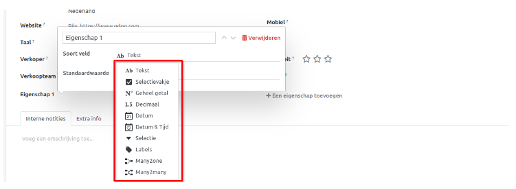

Via Interne notities kan meer info worden toegevoegd aan de lead. Met de Tab 'Extra Info' kan ingesteld worden waar bijvoorbeeld de lead vandaan komt (zie sectie Marketing).
Als de lead zo veel mogelijk gevuld is en rijp genoeg is voor een verkoopkans, dan kan deze worden omgezet.

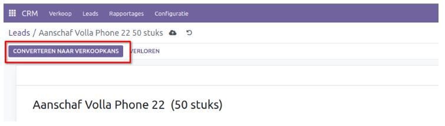

Er wordt een extra scherm geopend waarmee de lead kan worden omgezet naar nieuwe verkoopkans of kan worden samengevoegd met bestaande kansen. Dat geldt ook voor de klant sectie. Zonder klantgegevens is het altijd mogelijk om een nieuwe klant aan te maken of deze te koppelen aan een bestaande klant. Er is tevens een optie om een verkoper en verkoopteam toe te wijzen om aan deze verkoopkans te werken. 

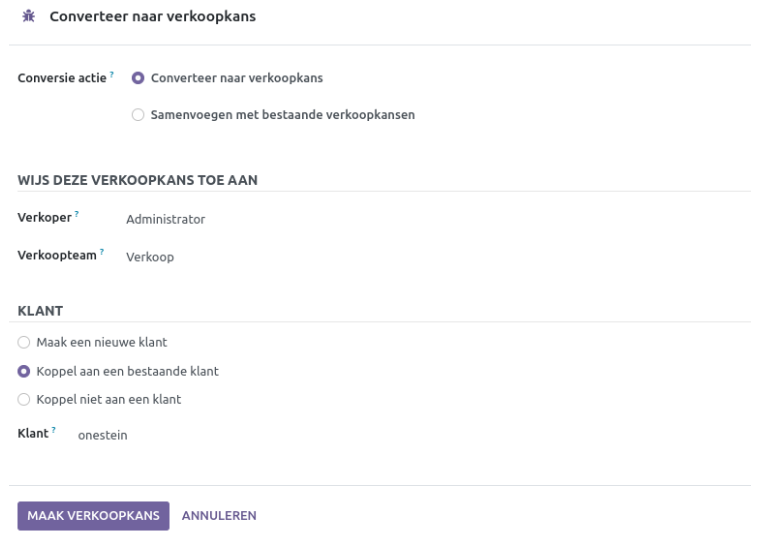

Klik op 'Maak Verkoopkans' om de lead om te zetten naar een verkoopkans.

Alle details van nieuw geconverteerde leads zijn beschikbaar in het Pijplijn Venster. Om toegang te krijgen tot dit gebied, klik je op 'Mijn pijplijn' in het menu van tabblad Verkoop. Hier zie je een overzicht van kansen ingedeeld in verschillende stadia op basis van hun voortgang, zoals Nieuw, Gekwalificeerd, Voorstel en Gewonnen. Als je een nieuwe fase wilt toevoegen, klik dan op '+ Fase'.  Je kunt de fase van een specifieke verkoopkans eenvoudig wijzigen door deze naar de gewenste fase te slepen.

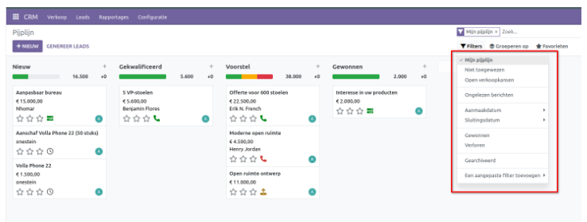

Het Pijplijn Venster toont standaard de inhoud in de Kanban-weergave. Je kunt deze weergave aanpassen naar Lijst-, Kalender-, Draai- en Grafiekweergaven met behulp van de respectievelijke pictogrammen in de rechterbovenhoek van het venster. Met de opties 'Filters' en 'Groeperen op' kun je de gewenste gegevens verkrijgen op basis van de door jou gekozen parameters.

Gebruik 'Filters' om records te scheiden door verschillende criteria toe te passen en zo de informatie te verkrijgen die voor jou relevant is.

De vervolgkeuzelijst 'Filters' biedt verschillende opties, waaronder *Mijn pijplijn, Niet toegewezen, Openstaande kansen, Ongelezen berichten, Aanmaakdatum, Sluitingsdatum, Gewonnen, Verloren, Gearchiveerd*, en *Aangepast filter toevoegen*. Je kunt elke filter naar wens selecteren en de benodigde gegevens naar eigen inzicht kiezen.

Het menu 'Groeperen op' heeft een vergelijkbare functie door de records te categoriseren in groepen op basis van de voorwaarden die je toepast.

Onder *Groepeer op* kun je opties vinden zoals **Verkoper, Verkoopteam, Fase, Plaats, Land, Verlies Reden, Campagne, Medium, Bron, Aanmaakdatum, Conversiedatum, Verwachte sluitingsdatum, Sluitingsdatum** en **Aangepaste groep toevoegen**. De gegroepeerde gegevens verschijnen op basis van de criteria die u heeft gekozen.

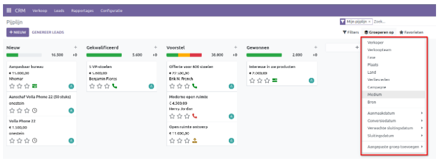

Met *Favorieten* kun je belangrijke filters opslaan, zodat je ze niet telkens opnieuw hoeft toe te passen. De vervolgkeuzelijst *Favorieten* biedt drie opties: *Huidige zoekopdracht opslaan, Records importeren* en *Toevoegen aan mijn dashboard*. Met *Huidige zoekopdracht opslaan* kun je de reeds toegepaste filters en groepen toevoegen aan *Favorieten*. *Records importeren* importeert de gegevens van kansen in het systeem vanuit de formulierweergave, zodat je deze records niet handmatig hoeft in te voeren. Als je wilt dat de gefilterde gegevens in de dashboardmodule verschijnen, klik je op *Aan mijn Dashboard toevoegen*. 

In het overzicht van de Pijplijn kun je direct vanuit hetzelfde venster verkoopkansen creëren. Om van deze functie gebruik te maken, klik je op de + knop. Hierdoor wordt een dialoogvenster geopend waarin je de benodigde informatie kunt invoeren.

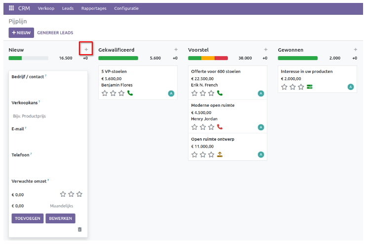

Vul zoveel mogelijk velden in, zoals de bedrijfsnaam of contactpersoon, de omschrijving van de verkoopkans, e-mail, telefoon en verwachte omzet. Als je meer details wilt toevoegen of bewerken, dan kun je op de knop *Bewerken* klikken om de verkoopkans in een gedetailleerd venster aan te passen. Nadat alle benodigde informatie is ingevoerd, klik je op *Toevoegen*. Het nieuw aangemaakte record zal vervolgens verschijnen in het Pipeline-venster.

Een offerte aanmaken vanuit een verkoopkans
-------------------------------------------
Vanuit een verkoopkans is eenvoudig om een nieuwe offerte te maken. Om dit te doen, klik je op *Nieuwe Offerte*. 

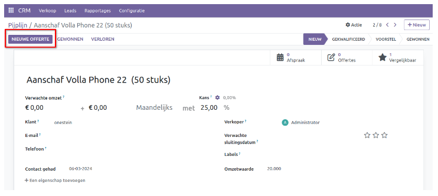

Naast de knop *Nieuwe offerte* heb je de opties *Gewonnen* en *Verloren*. Klik op *Gewonnen* als de verkoopkans aan de vereisten voldoet om een definitieve order te maken. 

Klik vervolgens op *Nieuwe offerte* om deze aan te maken. Er verschijnt een dialoogvenster waarin je drie opties krijgt met betrekking tot de klantgegevens: *Maak een nieuwe klant, Koppel aan een bestaande klant* en *Niet koppelen aan een klant*. Kies de gewenste optie en klik op *Bevestigen*.

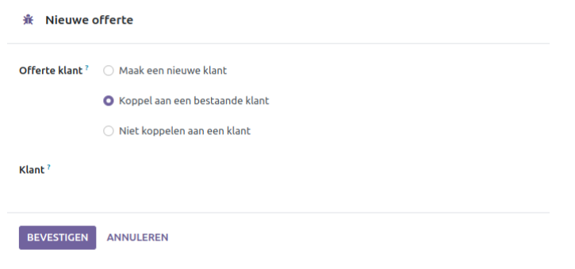

Je wordt nu naar een nieuw venster geleid waar je de klantgegevens kunt invoeren. Nadat de gegevens zijn ingevoerd, klik je op *Bevestigen*. 

Om alle offertes te bekijken, ga je naar het menu *Verkoop*. Selecteer *Mijn offertes* om dit venster te openen. Hier vind je de details van de offertes zoals **Offertenummer, Aanmaakdatum, Klant, Verkoper, Activiteiten, Totaal** en **Status**. Als je meer kolommen wilt weergeven, klik je op de knop in de rechterbovenhoek van het venster en selecteer je de gewenste categorieën.

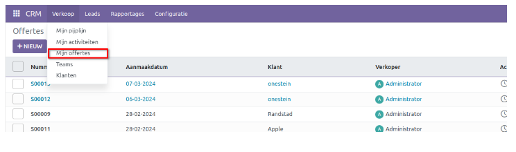

Standaard wordt het venster weergegeven in de lijstweergave, maar je kunt dit gemakkelijk wijzigen naar de weergaven Kanban, Kalender, Pivot en Grafiek.

Met de opties *Filters* en *Groeperen op* kun je moeiteloos een individueel record of gegevensset vinden. Gebruik *Favorieten* om herhaalde toepassing van filters te voorkomen door ze op te slaan. Je kunt ook standaard filters instellen met deze optie.

Klik op het pictogram Activiteit om verschillende activiteiten met betrekking tot uw klanten te plannen en te bekijken.

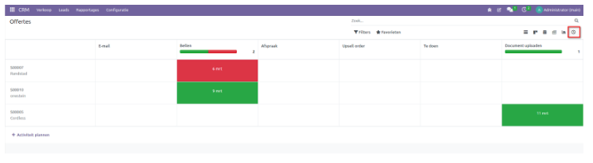

In dit venster zie je alle geplande activiteiten en de respectievelijke vervaldata. Om een nieuwe planning te maken, klik je op het + pictogram in een willekeurige cel of klik je op de al bezette cellen en gebruik je *Een activiteit plannen*. 

Hierop volgend verschijnt het volgende venster.

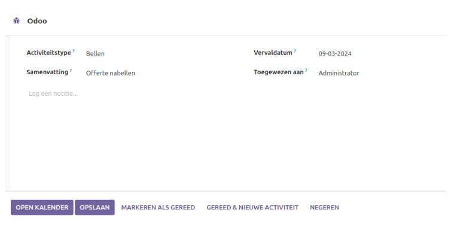

Voer de details van de activiteit in en klik op de opties *Opslaan, Markeren als Gereed* of *Gereed* en *Nieuwe Activiteit*, afhankelijk van uw voorkeur.

Om een bepaald record te bewerken, klik je er gewoon op en wijzig je de details. 
Je kunt een offerte direct vanuit hetzelfde venster converteren naar een verkooporder. Als u een offerte kiest, verschijnt het volgende venster.

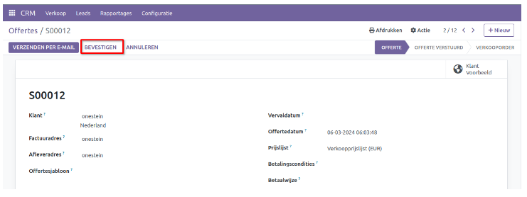

Klik op 'Bevestigen' om de offerte om te zetten in een verkooporder. Als je de bevestigingsmail naar de klant wilt sturen, klik je op *Verzenden per e-mail*.
Nadat je de inhoud van de e-mail in het pop-upvenster heebt gecontroleerd, klik je op *Verzenden*. Hiermee wordt het proces van het maken van een nieuwe verkooporder afgerond.

Activiteiten plannen
--------------------

Het plannen van bedrijfsgerelateerde activiteiten op een gecoördineerde manier helpt bij het micromanagen en efficiënt gebruiken van tijd. Je kunt verschillende acties voor je klanten plannen en uitvoeren, of evenementen met hen plannen in het Pijplijn overzicht. 

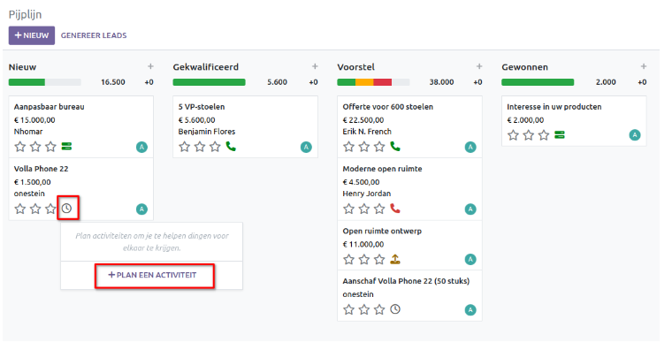

Als er geen activiteit is gepland, zie je de klok pictogram in de Kanban-weergave, dat verschuift naar de vorm van een telefoon, e-mail, enz., afhankelijk van het type gebeurtenis dat het vertegenwoordigt. Wanneer je op het betreffende pictogram klikt, verschijnt er een dialoogvenster waarin je kunt kiezen voor *Plan een activiteit*. Dit opent een pop-upvenster.

In dit venster zie je velden zoals Activiteitstype, Vervaldatum, Samenvatting en Toegewezen aan. U kunt ook een beschrijving toevoegen in *Log een notitie*. Vul deze gegevens in en klik op *Inplannen*. De specifieke activiteit is nu ingepland.

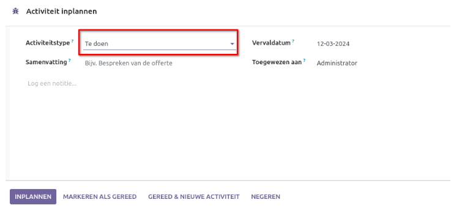

