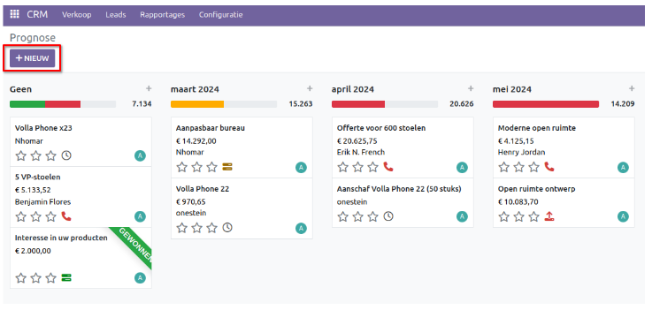
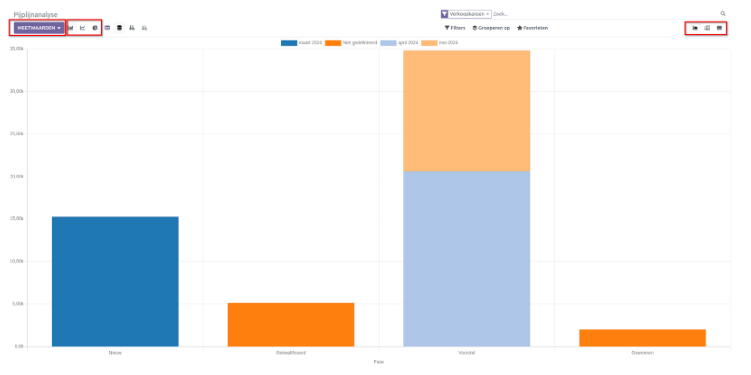
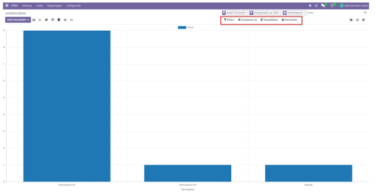
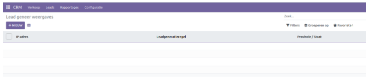

CRM - Reports
=============

De CRM module heeft een aantal rapportage mogelijkheden voor het gedetailleerd analyseren van verschillende activiteiten en hun status. In het menu *Rapportage* vind je een vervolgkeuzelijst met menu's voor **Prognose, Pijplijn, Leads, Activiteiten** en **Lead Genereer Weergave**. 

Prognose
--------

De Prognose Venster toont kansen die zijn gecategoriseerd op basis van verwachte 'sluiting' maanden. Je kunt de weergave van deze details aanpassen met behulp van de vier pictogrammen in de rechterbovenhoek van het venster: *Kanban, Grafiek, Pivot* en *Lijst(. De opties *Filters* en *Groeperen op* bieden meer flexibiliteit om specifieke gegevens te tonen. Je kunt ook *Favorieten* gebruiken om veelgebruikte filters op te slaan of standaardcriteria in te stellen voor het segmenteren van leads. 

Klik op de knop *Nieuw* om direct vanuit dit venster een nieuwe mogelijkheid aan te maken. Er wordt een nieuw dialoogvenster geopend waarin je de benodigde gegevens kunt invoeren, zoals Organisatie/Contact, Opportunity, E-mail, Telefoon en Verwachte omzet. Klik ten slotte op *Toevoegen*.

Pijplijn
--------

Je kunt de activiteiten van de pijplijn analyseren aan de hand van verschillende maatregelen. 
In het venster Pijplijn analyse kun je de rapporten in drie verschillende mogelijkheden bekijken: *Grafiek, Draaitabel* en *Lijstweergave*. Klik op een pictogram in de rechterbovenhoek van het venster. Je kunt ook het type grafische weergave aanpassen, d.w.z. staafdiagram, lijndiagram of cirkeldiagram.
Standaard wordt dit overzicht getoond op basis van de verschillende fases.

Leads
-----

Met de 'Leads' rapportage krijg je een samenvatting te zien van de gemaakte leads op basis van *Datum toewijzing*.  Het overzicht wordt per maand weergegeven. 

Met behulp van de *Filters* en *Groeperen op* opties kunnen leads worden gefilterd en gecategoriseerd op basis van specifieke criteria. Onder *Vergelijking* zijn er twee keuzemogelijkheden: *Aangemaakt op: Vorige periode* en *Aangemaakt op: Vorig jaar*. Hiermee kun je leads filteren op basis van de vorige periode of het vorige jaar, om ze nauwkeurig te vergelijken. De Favorieten-optie maakt het mogelijk om specifieke filters op te slaan en als standaard in te stellen.

Activiteiten
------------

De *Activiteiten* rapportage biedt een diepgaande analyse van alle activiteiten binnen de pijplijn. Het laat een standaard overzicht zien per maand. 

Lead Genereer Weergave
----------------------

Dit menu genereert een rapportage overzicht van leads die zijn gegenereerd via de *Bezoekers naar Leads Regels* in het Configuratiemenu.  In dit venster worden details zoals het IP-adres, de leadgeneratie regel, de Staat of Provincie en de aanmaakdatum weergegeven. Dit overzicht ordent op een effectieve manier de activiteiten met betrekking tot zowel potentiële als bestaande klanten.

