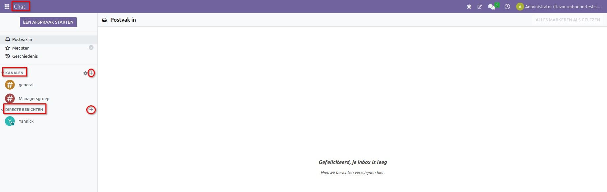
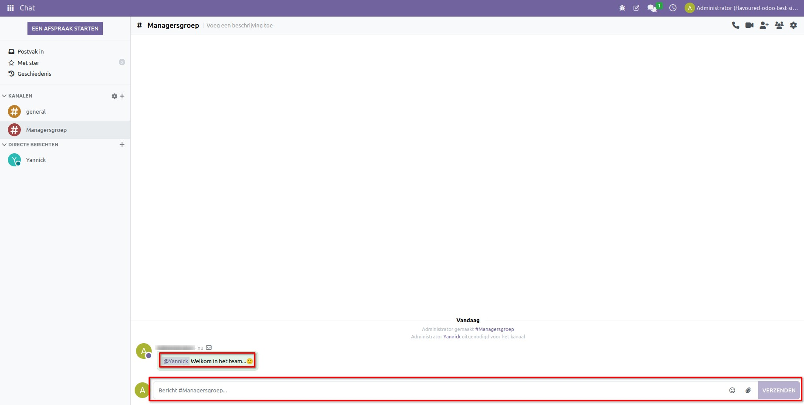
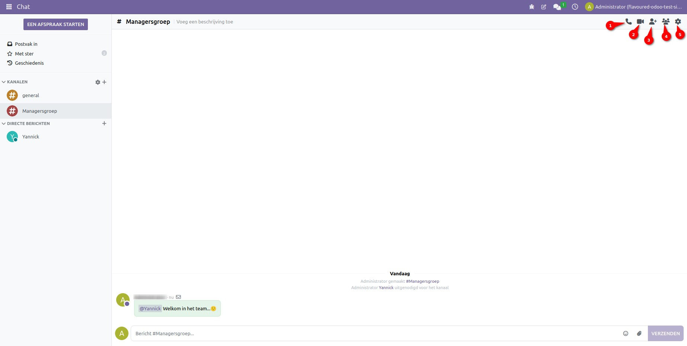
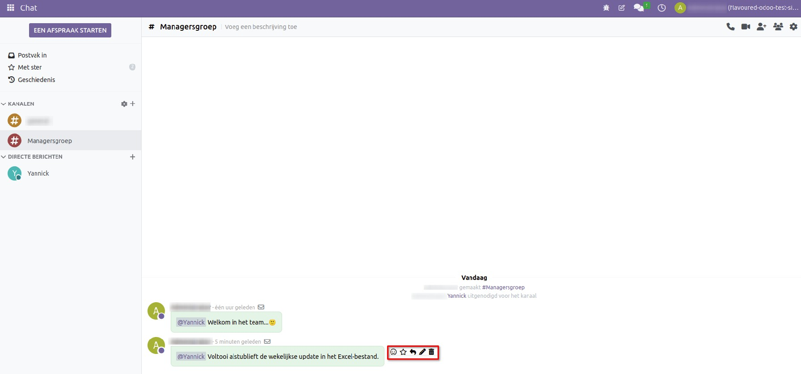
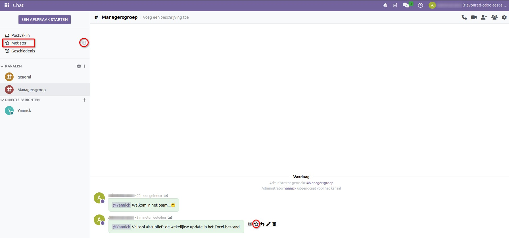
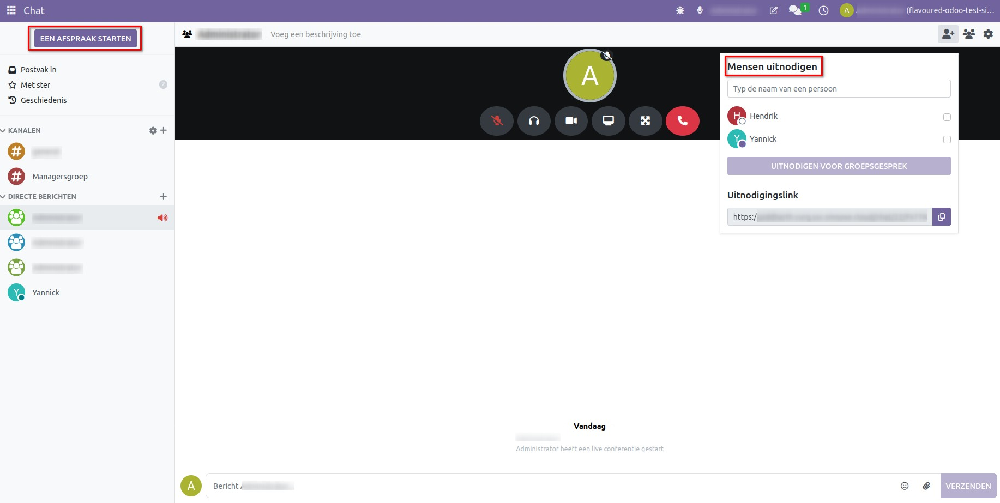
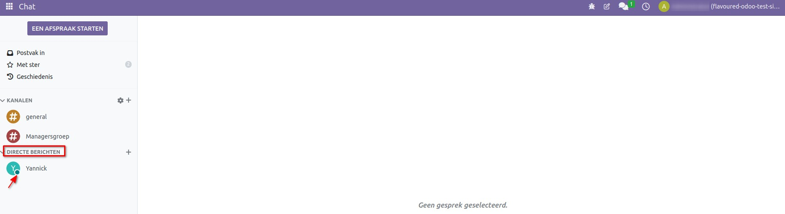
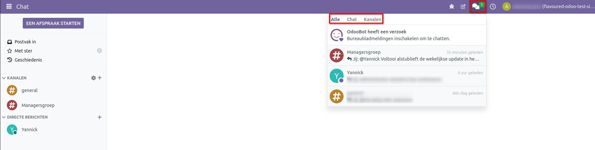

Chat
======

De chat-app in Curq is een krachtige communicatietool die de samenwerking binnen teams verbetert. Het stelt gebruikers in staat om gesprekken te beheren, projectupdates te volgen en efficiënt te communiceren. De app ondersteunt directe berichten, groepskanalen, video- en spraakoproepen, en het delen van bestanden, wat het een alles-in-één oplossing maakt voor naadloze samenwerking binnen
teams.

Open de chat-app om individueel te chatten door op het + (plus) pictogram naast **"Directe Berichten"** te klikken, waarmee je **een gesprek zoeken of starten**. Om een groepschat te maken, klik op het + pictogram naast **"Kanalen"** in het linker menu van het dashboard, waar je **een kanaal kunt zoeken of aanmaken** door een kanaalnaam in te voeren.

Het stelt gebruikers in staat om berichten te sturen, bestanden te delen, te reageren met emoji's en zelfs audio- en videogesprekken te voeren. Gebruikers kunnen iemand in een groepschat vermelden door @ gevolgd door de gebruikersnaam te gebruiken.

Open een chat, en je ziet vijf pictogrammen in de rechterbovenhoek:

1. **Een gesprek starten** – Door hierop te klikken wordt een audiogesprek gestart met alle gebruikers die al in het kanaal zitten.

2. **Een videogesprek starten** - Door hierop te klikken wordt een video-oproep gestart met alle gebruikers die al in het kanaal zitten.

3. **Gebruikers toevoegen** – Hiermee kun je nieuwe leden aan het kanaal toevoegen. Door op dit pictogram te klikken wordt een dialoogvenster geopend waarin je de naam van de persoon kunt typen die je wilt toevoegen, en vervolgens op de knop **"Uitnodigen voor kanaal"** kunt klikken. Een e-mailmelding wordt naar de gebruiker gestuurd om hen uit te nodigen het kanaal te joinen.

4. **Ledenlijst weergeven** – Toont een lijst van alle leden samen met hun actieve status.

5. **Oproepinstellingen weergeven** - Hiermee kun je de oproepinstellingen aanpassen.

Je kunt ook **voeg een reactie toe** in de vorm van een emoji, **bewerken**, **beantwoorden**, **markeren als nog Te Doen** en een reeds verzonden bericht **verwijderen**.

Door **"Markeren als nog te doen"** op een bericht te klikken, wordt het toegevoegd aan de **"Met Ster"** pagina, die in de linkerbovenhoek te vinden is, samen met het aantal gemarkeerde berichten.

Je kunt ook een audio- of videogesprek starten zonder **kanalen** of **directe berichten** te openen door op de knop **een afspraak Starten** in de rechterbovenhoek te klikken.
Bij het klikken verschijnt er een oproepvenster op het scherm, samen met een dialoogvenster om **mensen uitnodigen** die je wilt laten deelnemen aan de oproep.

Je kunt ook de status van gebruikers bekijken onder de lijst met **Directe Berichten** in de linkerzijbalk. De status wordt weergegeven door verschillende kleuren en iconen:

- **Groen** = Online
- **Oranje** = Afwezig
- **Wit** = Offline
- **Vliegtuig** = Niet op kantoor

In de linkerbovenhoek zie je een gesprekken spictogram. Door erop te klikken, worden drie opties weergegeven: **Alle, Chat en Kanalen**.

- **Alle**: Bekijk alle chats.
- **Chat**: Bekijk alleen directe bericht-chats.
- **Kanalen**: Bekijk groepschats.

