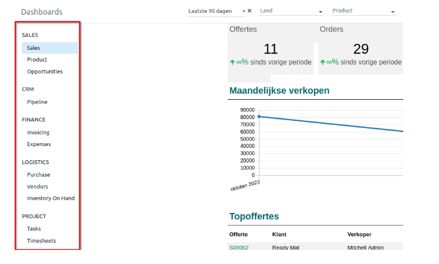
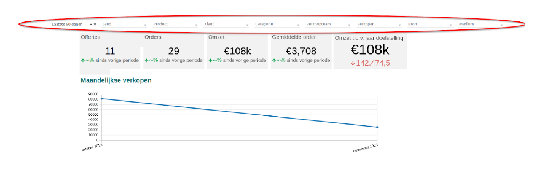
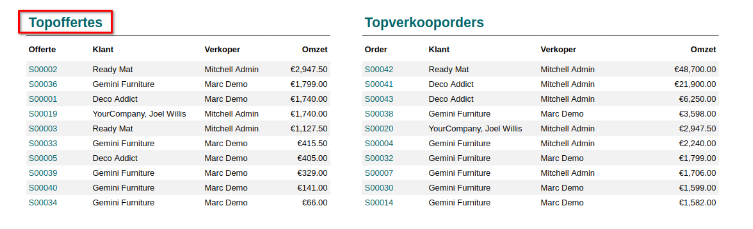
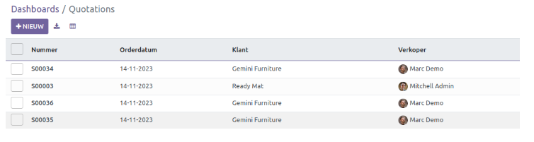
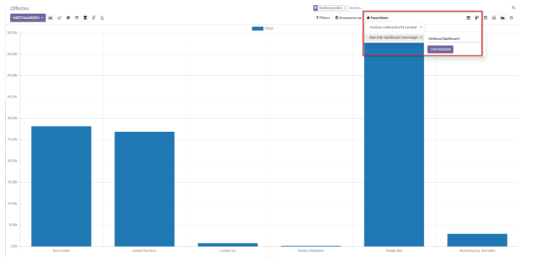
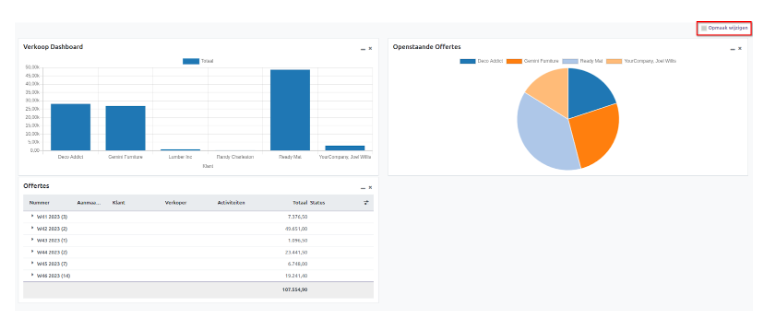

==========
Dashboards
==========

In Curq gebruiken we 'Dashboards' om allerlei info handig bij elkaar te brengen. Het idee is om belangrijke cijfers en data op een makkelijke manier te laten zien. Dat betekent dat we vaak key performance indicators (KPI's) en andere belangrijke bedrijfsinformatie op een overzichtelijke manier kunnen tonen.

Het Curq Dashboard maakt gebruik van een responsive **Bootstrap-Framework** en biedt functionaliteit voor het op maat maken van dashboards. Dashboards kent 3 verschillende opties:

- **Standaard Dashboards**:  deze zijn aangemaakt vanuit Odoo en worden automatisch geüpdate. Er zijn filteropties aanwezig en bestaande spreadsheets kunnen worden aangepast.
- **Mijn Dashboard**:  elke user kan eigen dashboards maken die responsive zijn maar geen filter optie hebben.  
- **Spreadsheets**: met Spreadsheets kun je eigen dashboards maken en toevoegen aan de standaard dashboards.

We nemen de 3 opties met je door.

Standaard Dashboards
--------------------

Zoals zichtbaar in onderstaande schermafbeelding, omvat de module diverse soorten dashboards, waaronder **Verkoop, CRM, Financiën, Logistiek** en **Projecten**. 

Bovendien is het mogelijk om de dashboardgegevens te ordenen en te filteren op verschillende criteria zoals **Periodeduur, Land, Product, Klant, Categorie, Verkoopteam, Verkopers, Bron & Medium**. 
Je kunt de gewenste sorteermethode selecteren uit de vervolgkeuzelijst in het betreffende veld, zoals geïllustreerd in de onderstaande schermafbeelding.

Gebruikers hebben de mogelijkheid om het gedetailleerde analyserapport te bekijken door te klikken op de specifieke gegevens in het dashboard. Als voorbeeld kunnen gebruikers een offerte aanklikken in "Topoffertes" in het verkoopdashboard. Hierdoor worden ze doorgestuurd naar de startpagina van het offertesrapport, zoals hieronder weergegeven.

Mijn Dashboard
--------------

Een andere optie is om gebruik te maken van 'mijn dashboard' en diverse overzichten zelf samen te stellen. Hierbij een voorbeeld.

Ieder overzicht die jezelf samenstelt kun je toevoegen aan je dashboard. Stel ik wil onderstaand staafdiagram toevoegen, dan klik je op *Favorieten - Aan mijn Dashboard toevoegen - Naam van je Dashboard* en klik op toevoegen.

Je kunt overzichten toevoegen in lijstweergave, staafdiagram, lijndiagram en cirkeldiagram (+ gestapeld). Zodra je een overzicht hebt toegevoegd, klik je op Dashboard - mijn dashboard en ververs je de pagina. Dit is een voorbeeld hoe de pagina eruit komt te zien:

Met *Opmaak wijzigen* kun je de indeling van de pagina veranderen en d.m.v. het slepen, het dashboard veranderen.

