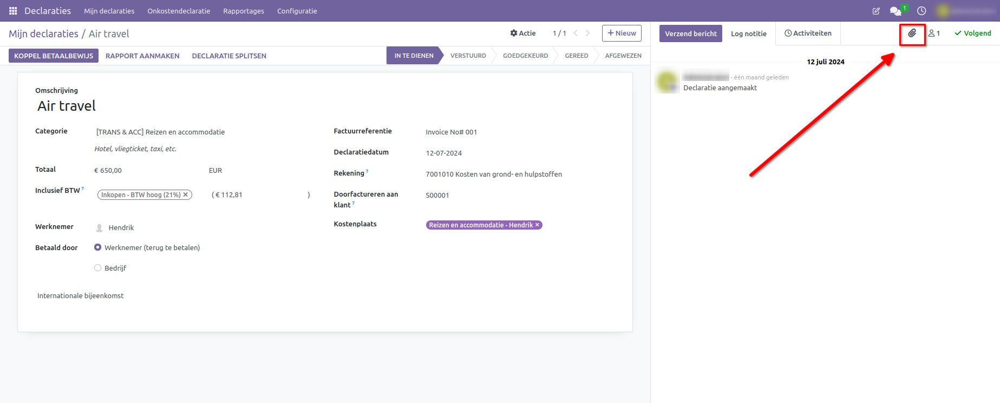
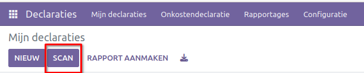
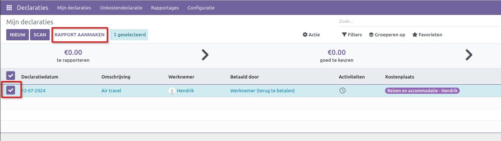
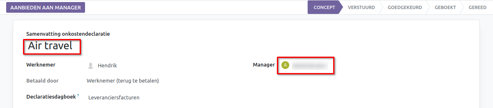
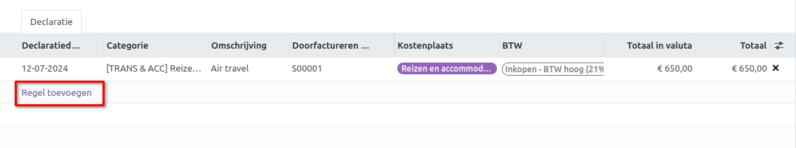

====================================================================
**Uitgaven opnemen**
====================================================================

**Handmatig een nieuwe uitgave aanmaken**
--------------------------------------------------------------------

Om een nieuwe uitgave vast te leggen, start u in het hoofddashboard van de Uitgaven-app, dat de standaardweergave Mijn Uitgaven laat zien. Deze weergave is ook bereikbaar via **Uitgaven app ‣ Mijn Uitgaven ‣ Mijn Uitgaven.** 

Klik eerst op **Nieuw**, en vul vervolgens de verschillende velden in op het formulier.

1) **Omschrijving**: Voer een korte beschrijving in voor de uitgave in het veld Omschrijving. Dit moet kort en informatief zijn, zoals lunch met klant of hotel voor conferentie.

2) **Categorie**: Selecteer de uitgavecategorie uit het dropdown-menu die het meest overeenkomt met de uitgave. Bijvoorbeeld, een vliegticket zou passend zijn voor een uitgavecategorie genaamd Luchtvervoer.

3) **Totaal**: Voer het totaalbedrag in dat is betaald voor de uitgave op een van de volgende manieren:
        1. Als de uitgave voor één enkel item/uitgave is en de geselecteerde categorie was voor een enkel item, voer dan de kosten in het veld Totaal in (het veld Hoeveelheid is verborgen).
        2. Als de uitgave voor meerdere dezelfde items/uitgaven met een vaste prijs is, wordt de Eenheidsprijs weergegeven. Voer de hoeveelheid in het veld Hoeveelheid in, en het totale bedrag wordt automatisch bijgewerkt met het juiste totaal (de Eenheidsprijs × de Hoeveelheid = het totaal).

4) **Inbegrepen belastingen**: Als belastingen zijn geconfigureerd voor de uitgavecategorie, verschijnen het belastingpercentage en bedrag automatisch nadat u het Totaal of de Hoeveelheid heeft ingevoerd.

5) **Medewerker**: Selecteer via het dropdown-menu de medewerker voor wie deze uitgave is.

6) **Betaald door**: Klik op de radioknop om aan te geven wie de uitgave heeft betaald en vergoed moet worden. Als de medewerker de uitgave heeft betaald (en vergoed moet worden), selecteer dan Medewerker (ter vergoeding). Als het bedrijf rechtstreeks heeft betaald (bijvoorbeeld als de bedrijfscreditcard is gebruikt), selecteer dan Bedrijf. Afhankelijk van de geselecteerde uitgavecategorie verschijnt dit veld mogelijk niet.

7) **Factuurreferentie**: Voer indien nodig enige referentietekst in die moet worden opgenomen bij de uitgave.

8) **Uitgavedatum**: Gebruik de kalendermodule om de datum in te voeren waarop de uitgave is gedaan. Gebruik de pijlen < (links) en > (rechts) om naar de juiste maand te navigeren, klik vervolgens op de specifieke dag om deze te selecteren.

9) **Rekening**: Selecteer de kostenrekening waarop deze uitgave moet worden geboekt uit het dropdown-menu.

10) **Klant om door te berekenen**: Als de uitgave door een klant moet worden betaald, selecteer dan de klant die voor deze uitgave moet worden gefactureerd uit het dropdown-menu. Alle verkooporders in de dropdown-lijst tonen zowel de klant als het bedrijf waarvoor de verkooporder is geschreven, maar nadat de uitgave is opgeslagen, verdwijnt de klantnaam en blijft alleen het bedrijf zichtbaar.

11) **Analytisch**: Selecteer via het dropdown-menu de rekening(en) waarop de uitgave moet worden geboekt, voor Projecten, Afdelingen, of beide. Indien nodig kunnen meerdere rekeningen worden vermeld voor elke categorie. Pas het percentage aan voor elke analytische rekening door de waarde in te typen naast de rekening.

12) **Notities...**: Voer eventuele notities in die nodig zijn om de uitgave te verduidelijken.

.. image:: Declaraties_Media/Declaraties001.png

**Voeg een bonnetje toe**
--------------------------

Nadat de uitgave is aangemaakt, is de volgende stap het toevoegen van een bonnetje. Klik op de knop Voeg bonnetje toe, en een verkenner verschijnt. Navigeer naar het bonnetje dat je wilt toevoegen en klik op Openen. Het nieuwe bonnetje wordt geregistreerd in de chatter, en het aantal bonnetjes verschijnt naast het 📎 (paperclip) pictogram onder het uitgavenformulier. Er kan meer dan één bonnetje aan een individuele uitgave worden toegevoegd, indien nodig. Het aantal bonnetjes dat aan de uitgave is toegevoegd, wordt weergegeven op het paperclip-pictogram.

**Nieuwe uitgaven aanmaken vanuit een gescand bonnetje**  
----------------------------------------------------------

In plaats van alle informatie voor een uitgave handmatig in te voeren, kunnen uitgaven worden aangemaakt door een PDF-bonnetje te scannen.  
Klik eerst in het hoofdoverzicht van de **Uitgaven**-app (dit overzicht kan ook worden geopend via **Uitgaven-app ‣ Mijn Uitgaven ‣ Mijn Uitgaven**), op **Scan**, en een verkenner verschijnt. Navigeer naar het bonnetje dat je wilt uploaden, klik erop om het te selecteren, en klik vervolgens op **Openen**.

Het bonnetje wordt gescand, en een nieuwe invoer wordt aangemaakt met de datum van vandaag als **Uitgavedatum**, en andere velden die automatisch worden ingevuld op basis van de gescande gegevens, zoals het totaalbedrag. Klik op de nieuwe invoer om het individuele uitgavenformulier te openen en breng de benodigde wijzigingen aan. Het gescande bonnetje verschijnt in de chatter.

**Maak een uitgavenrapport aan** 
---------------------------------

Wanneer de uitgaven klaar zijn om ingediend te worden (bijvoorbeeld aan het einde van een zakenreis of eenmaal per maand), moet er een **uitgavenrapport** worden aangemaakt. Ga naar het hoofdoverzicht van de **Uitgaven**-app, die de standaard **Mijn Uitgaven**-weergave toont, of ga naar **Uitgaven-app ‣ Mijn Uitgaven ‣ Mijn Uitgaven**.

Uitgaven worden gekleurd op basis van de status. Elke uitgave met de status **Te Rapporteren** (uitgaven die nog aan een uitgavenrapport moeten worden toegevoegd) wordt in het blauw weergegeven. Alle andere statussen (Te Indienen, **Ingediend**, en **Goedgekeurd**) worden in het zwart weergegeven.

Selecteer eerst elke individuele uitgave voor het rapport door het selectievakje naast elke invoer aan te vinken, of selecteer snel alle uitgaven in de lijst door het selectievakje naast **Uitgavedatum** aan te vinken.

Een andere manier om snel alle uitgaven die nog niet in een uitgavenrapport staan toe te voegen, is door op **Maak Rapport Aan** te klikken zonder uitgaven te selecteren. Odoo zal dan automatisch alle uitgaven met de status **Te Indienen** selecteren die nog niet op een rapport staan.

Zodra de uitgaven zijn geselecteerd, klik je op de knop **Maak Rapport Aan**. Het nieuwe rapport verschijnt met alle uitgaven vermeld op het tabblad **Uitgave**. Als er een bonnetje is toegevoegd aan een individuele uitgave, verschijnt een **📎 (paperclip)**-pictogram naast de kolommen **Klant om te Factureren** en **Analytische Verdeling**.

Wanneer het rapport is aangemaakt, verschijnt het datumbereik voor de uitgaven standaard in het veld **Samenvatting Uitgavenrapport**. Het wordt aanbevolen om dit veld te bewerken met een korte samenvatting voor elk rapport om de uitgaven georganiseerd te houden. Vul een korte beschrijving in voor het uitgavenrapport (bijvoorbeeld **Klantreis NYC** of **Herstellingen voor Bedrijfsauto**) in het veld **Samenvatting Uitgavenrapport**. Selecteer vervolgens een **Manager** uit het keuzemenu om een manager aan te wijzen die het rapport moet beoordelen. Indien nodig kan het **Journal** worden gewijzigd. Gebruik het keuzemenu om een ander **Journal** te selecteren.

Als sommige uitgaven die op het rapport zouden moeten staan ontbreken, kunnen ze nog steeds worden toegevoegd. Klik op **Voeg een regel toe** onderaan het tabblad **Uitgave**. Er verschijnt een pop-up met alle beschikbare uitgaven die aan het rapport kunnen worden toegevoegd (met de status **Te Indienen**). Vink het selectievakje naast elke uitgave aan die je wilt toevoegen en klik vervolgens op **Selecteren**. De items verschijnen nu op het net aangemaakte rapport. Als er een nieuwe uitgave moet worden toegevoegd die niet op de lijst staat, klik dan op **Nieuw** om een nieuwe uitgave aan te maken en deze aan het rapport toe te voegen.

