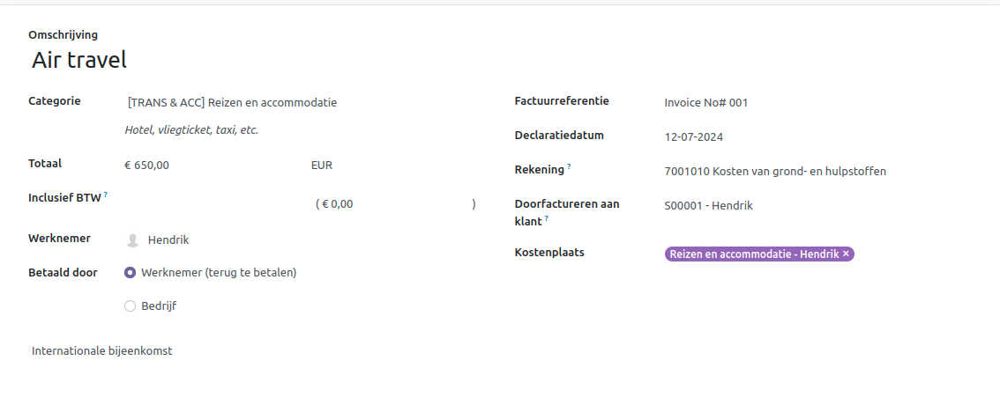

====================================================================
Uitgaven opnemen
====================================================================

Handmatig een nieuwe uitgave aanmaken
-------------------------------------
Om een nieuwe uitgave vast te leggen, start u in het hoofddashboard van de **Uitgaven**-app, dat de standaardweergave *Mijn Uitgaven* laat zien. Deze weergave is ook bereikbaar via **Uitgaven app ‣ Mijn Uitgaven ‣ Mijn Uitgaven.**

Klik eerst op *Nieuw*, en vul vervolgens de verschillende velden in op het formulier.

1. **Omschrijving**: Voer een korte beschrijving in voor de uitgave in het veld Omschrijving. Dit moet kort en informatief zijn, zoals lunch met klant of hotel voor conferentie.

2. **Categorie**: Selecteer de uitgavecategorie uit het dropdown-menu die het meest overeenkomt met de uitgave. Bijvoorbeeld, een vliegticket zou passend zijn voor een uitgavecategorie genaamd Luchtvervoer.

3. **Totaal**: Voer het totaalbedrag in dat is betaald voor de uitgave op een van de volgende manieren:
        a. Als de uitgave voor één enkel item/uitgave is en de geselecteerde categorie was voor een enkel item, voer dan de kosten in het veld Totaal in (het veld Hoeveelheid is verborgen).
        b. Als de uitgave voor meerdere dezelfde items/uitgaven met een vaste prijs is, wordt de Eenheidsprijs weergegeven. Voer de hoeveelheid in het veld Hoeveelheid in, en het totale bedrag wordt automatisch bijgewerkt met het juiste totaal (de Eenheidsprijs × de Hoeveelheid = het totaal).
   
4. **Inbegrepen belastingen**: Als belastingen zijn geconfigureerd voor de uitgavecategorie, verschijnen het belastingpercentage en bedrag automatisch nadat u het Totaal of de Hoeveelheid heeft ingevoerd.

5. **Medewerker**: Selecteer via het dropdown-menu de medewerker voor wie deze uitgave is.

6. **Betaald door**: Klik op de radioknop om aan te geven wie de uitgave heeft betaald en vergoed moet worden. Als de medewerker de uitgave heeft betaald (en vergoed moet worden), selecteer dan Medewerker (ter vergoeding). Als het bedrijf rechtstreeks heeft betaald (bijvoorbeeld als de bedrijfscreditcard is gebruikt), selecteer dan Bedrijf. Afhankelijk van de geselecteerde uitgavecategorie verschijnt dit veld mogelijk niet.

7. **Factuurreferentie**: Voer indien nodig enige referentietekst in die moet worden opgenomen bij de uitgave.

8. **Uitgavedatum**: Gebruik de kalendermodule om de datum in te voeren waarop de uitgave is gedaan. Gebruik de pijlen < (links) en > (rechts) om naar de juiste maand te navigeren, klik vervolgens op de specifieke dag om deze te selecteren.

9. **Rekening**: Selecteer de kostenrekening waarop deze uitgave moet worden geboekt uit het dropdown-menu.

10. **Klant om door te berekenen**: Als de uitgave door een klant moet worden betaald, selecteer dan de klant die voor deze uitgave moet worden gefactureerd uit het dropdown-menu. Alle verkooporders in de dropdown-lijst tonen zowel de klant als het bedrijf waarvoor de verkooporder is geschreven, maar nadat de uitgave is opgeslagen, verdwijnt de klantnaam en blijft alleen het bedrijf zichtbaar.

11. **Analytisch**: Selecteer via het dropdown-menu de rekening(en) waarop de uitgave moet worden geboekt, voor Projecten, Afdelingen, of beide. Indien nodig kunnen meerdere rekeningen worden vermeld voor elke categorie. Pas het percentage aan voor elke analytische rekening door de waarde in te typen naast de rekening.

12. **Notities...**: Voer eventuele notities in die nodig zijn om de uitgave te verduidelijken.

