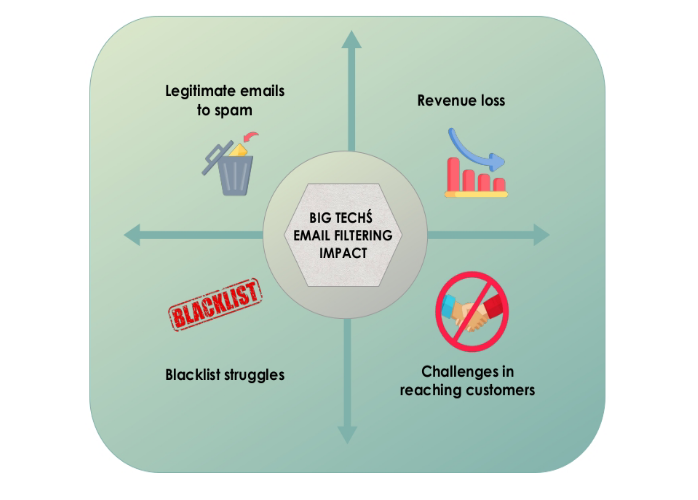
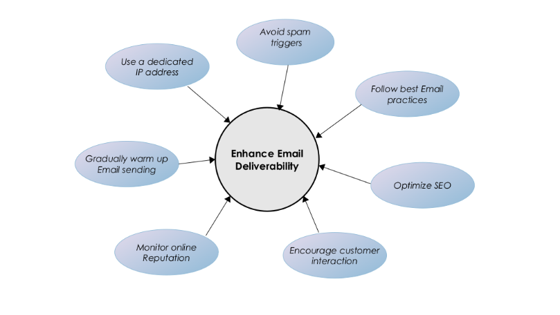

1) **Inleiding**
----------------
In de digitale wereld van vandaag zijn grote technologiebedrijven zoals **Google**, **Microsoft**, **Meta** en **Yahoo** de poortwachters geworden van online communicatie. Hun strikte spamregels, door AI aangestuurde filtersystemen en verborgen algoritmen maken het vrijwel onmogelijk voor kleine bedrijven om op gelijke voet te concurreren.

Hoewel deze bedrijven beweren dat hun maatregelen bedoeld zijn om gebruikers te beschermen tegen spam en kwaadaardige e-mails, is de realiteit dat hun overdreven agressieve filtertechnieken kleine bedrijven verstikken, hen beletten om klanten te bereiken, en uiteindelijk meer macht concentreren in de handen van Big Tech.

Daarom is het voor kleine bedrijven van essentieel belang om de onrealistische spamregels die door Big Tech worden opgelegd te begrijpen en effectieve manieren te vinden om daarmee om te gaan, zodat zij vlot en zonder onderbrekingen kunnen communiceren met hun doelgroep via e-mail.

2) **Wat is Spam en een Spamfilter?**
--------------------------------------
Spam is ongewenste e-mail of bulkmail die wordt gebruikt voor reclame of oplichting. Het vervuilt inboxen en vormt een beveiligingsrisico. Deze e-mails worden vaak ingezet om producten of diensten te promoten, of om frauduleuze praktijken te verspreiden. Spam kan inboxen overvol maken, waardoor het voor gebruikers lastig wordt om belangrijke berichten terug te vinden.

Spamfilters zijn hulpmiddelen of software die zijn ontworpen om spamberichten te herkennen en te beheren. Ze maken gebruik van een combinatie van verborgen technieken, regels, kunstmatige intelligentie en authenticatiemethoden om inkomende e-mails te analyseren en te bepalen of ze in de inbox moeten worden afgeleverd of doorgestuurd naar de spammap.

3) **Impact of Onbedoelde Gevolgen voor Kleine Bedrijven**
------------------------------------------------------------
E-mail blijft een essentieel communicatie en marketingmiddel voor bedrijven. De toenemende controle van grote technologiebedrijven over e-mailfiltering en bezorging heeft echter onbedoelde obstakels gecreëerd voor kleinere ondernemingen.

Van legitieme e-mails die als spam worden gemarkeerd tot problemen met zwarte lijsten deze uitdagingen belemmeren het bereiken van klanten, verminderen de effectiviteit van marketinginspanningen en zorgen voor onnodige operationele lasten.

Hier volgt hoe deze verborgen mechanismen kleine bedrijven beïnvloeden:

**Legitieme e-mails worden als spam gemarkeerd**
Kleine bedrijven merken vaak dat hun transactie-e-mails, facturen en klantvragen in de spammap belanden, zelfs wanneer zij de best practices volgen. Dit vermindert de betrokkenheid en verstoort de bedrijfsvoering.

**De strijd om in beroep te gaan**

Wanneer een e-maildomein wordt gemarkeerd, krijgen bedrijven te maken met lange, kostbare en ondoorzichtige beroepsprocedures bij Gmail, Outlook of Yahoo. Deze beroepen kunnen weken of zelfs maanden duren, wat zowel tijd als geld kost. De vertragingen verstoren cruciale communicatie, hebben invloed op de omzet en leggen een zware last op kleine bedrijven.

**Verminderde effectiviteit van reclame**

Door strikte filtering hebben promotionele e-mails minder zichtbaarheid, wat leidt tot lagere openpercentages en conversies. Kleine bedrijven steken tijd in het opstellen van e-mails die uiteindelijk verdwijnen in de map "Promoties" of in de spammap, waardoor marketingbudgetten worden verspild.

E-mailmarketing is een belangrijk instrument voor kleine bedrijven, maar wanneer e-mails worden gefilterd of geblokkeerd, wordt het moeilijk om leads op te volgen, aanbiedingen te versturen of klanten effectief te betrekken. Dit dwingt bedrijven om in plaats daarvan te vertrouwen op dure advertentieplatforms.

**Problemen met zwarte lijsten**

Als de e-mailserver van een klein bedrijf op een zwarte lijst komt te staan, is het bijna onmogelijk om het vertrouwen terug te winnen. In tegenstelling tot grote bedrijven beschikken zij niet over toegewijde compliance-teams die kunnen onderhandelen over plaatsing op witte lijsten, wat leidt tot langdurige problemen met e-mailbezorging.

De gevolgen van agressieve spamfilterbeleidsmaatregelen door grote technologiebedrijven kunnen rampzalig zijn voor kleine ondernemingen:

• **Omzetverlies** - Essentiële e-mails, waaronder promoties, facturen klantenserviceberichten, bereiken mogelijk nooit de bedoelde ontvanger.
• **Stijgende marketingkosten** – Bedrijven worden mogelijk gedwongen te investeren in alternatieve marketingkanalen, zoals betaalde advertenties.
• **Geschaad klantvertrouwen** – Klanten kunnen belangrijke updates missen of slechte service vermoeden door niet-afgeleverde e-mails.
• **Marktdominantie door Big Tech** – Kleine spelers worden weggedrukt, terwijl grote merken bevoorrechte toegang tot inboxen genieten.
• **Verlies van verkoop en klantvertrouwen** – Als e-mails de inbox niet bereiken of berichten op sociale media niet worden gezien, lopen bedrijven potentiële verkopen en betrokkenheid mis.
• **Gebrek aan transparantie** – Grote technologiebedrijven geven zelden uitleg over waarom bepaalde berichten worden geblokkeerd of verborgen, waardoor kleine bedrijven machteloos staan.

4) **Hoe Big Tech Kleine Bedrijven Onderdrukt?**
--------------------------------------------------

Grote technologiebedrijven hebben enorme controle over digitale communicatie en benadelen daarmee vaak kleine bedrijven door hun legitieme e-mails als spam te markeren. Deze praktijk of die nu opzettelijk is of het gevolg van te agressieve filteralgoritmes beperkt het bereik van kleine ondernemingen en heeft negatieve gevolgen voor klantbetrokkenheid, verkoop en algemene groei.

Terwijl grote bedrijven profiteren van gevestigde reputaties en whitelist-voordelen, hebben startups en onafhankelijke bedrijven moeite met e-mailbezorging. Ze worden hierdoor gedwongen om dure mainstreamdiensten te gebruiken, of lopen het risico geloofwaardigheid en inkomsten te verliezen.

**4.1. Oneerlijke Filtering en Verborgen Algoritmes**

• De AI-systemen van Big Tech filteren e-mails zonder transparantie, waardoor kleine bedrijven geen mogelijkheid hebben om onterecht als spam gemarkeerde berichten aan te vechten.
• Hun ondoorzichtige systemen geven voorrang aan e-mails van grote ondernemingen, terwijl promoties van kleine bedrijven als spam worden gemarkeerd.

**4.2. Reputatievooroordeel en Gecentraliseerde Controle**

• Gedeelde IP-adressen, waar kleine bedrijven vaak op vertrouwen, worden collectief bestraft wanneer één partij misbruik maakt.
• Big Tech beheert de afzenderreputatie en verleent prioritaire whitelisting aan grote bedrijven, waardoor kleine ondernemingen vast blijven zitten in spamfilters.

**4.3. Manipulatie door AI en Machine Learning**

• Voortdurend veranderende spamfilters maken het voor kleine bedrijven moeilijk om zich aan te passen.
• AI geeft prioriteit aan afzenders met grote verzendvolumes, waardoor kleinere bedrijven verder naar beneden worden geduwd in de e-mailhiërarchie.

**4.4. Kostbaar en Onduidelijk Beroepsproces**

• Wanneer een e-mail van een klein bedrijf onterecht wordt gemarkeerd, is het beroepsproces lang, onduidelijk en ineffectief.
• Big Tech biedt premium e-maildiensten aan met betere bezorgbaarheid, wat kleine bedrijven in feite dwingt te betalen voor iets dat grote ondernemingen standaard krijgen.

**4.5. Engagement-gebaseerde Filtering: Een Drempel voor het Succes van Kleine Bedrijven via E-mail**

• Door AI aangestuurde filtering geeft de voorkeur aan bedrijven met al een hoge betrokkenheid, wat het extra moeilijk maakt voor nieuwe bedrijven om geloofwaardigheid op te bouwen.
• Nieuwe bedrijven hebben moeite om hun doelgroep te bereiken, omdat lage openpercentages automatisch leiden tot filtering.

5) **Hoe Spamfiltering Werkt?**
--------------------------------

.. image:: Big tech_Media/Bigtech001.png

.. list-table::
   :widths: 25 25 
   :header-rows: 1

   * - Component 
     - Rol
   * - E-mailafzender (daan@curq.nl)
     - De persoon of het systeem dat de e-mail verzendt.
   * - Authenticatiedaemon
     - Verifieert de identiteit van de afzender via e-mailauthenticatieprotocollen (SPF, DKIM, DMARC).
   * - Afzender SMTP-service
     - De uitgaande mailserver die de e-mail naar de server van de ontvanger stuurt.
   * - Ontvanger SMTP-service (IMAP/POP3)
     - De inkomende mailserver die binnenkomende e-mails verwerkt en opslaat.
   * - IP-blacklistcontrole
     - Controleert of het IP-adres van de afzender op een zwarte lijst staat. Zo ja,dan wordt de e-mail geweigerd.
   * - Spamfiltering
     - Analyseert e-mailinhoud, afzenderreputatie en gebruikersgedrag om te bepalen of een e-mail spam is.
   * - Inboxbezorging
     - Als de e-mail de spamfilters doorstaat, wordt deze afgeleverd in de inbox van de ontvanger.
   * - Spammapbezorging
     - Als de e-mail als spam wordt gemarkeerd, wordt deze in de spammap geplaatst.
   * - Afgewezen e-mail
     - Als het IP-adres van de afzender op een zwarte lijst staat, wordt de e-mail geweigerd en nooit afgeleverd.
   * - E-mailontvanger (john@outlook.com)
     - De persoon of het systeem dat de e-mail ontvangt en de inbox of spammap kan controleren.

**5.1 Verzendproces van de E-mail**

• De afzender (bijv. daan@curq.nl) verstuurt een e-mail.
• De authenticatiedaemon controleert de beveiligingsprotocollen.
• De SMTP-service van de afzender stuurt de e-mail door naar de server van de ontvanger.

**5.2 Ontvangst van E-mail en Spamcontrole**

• De SMTP-service van de ontvanger (IMAP/POP3) verwerkt de binnenkomende e-mails.
• Het systeem controleert of het IP-adres van de afzender op een zwarte lijst staat:
      • **Op zwarte lijst**: De e-mail wordt geweigerd.
      • **Niet op zwarte lijst**: De e-mail gaat door naar de spamfilter.

**5.3 Spamfiltering en Bezorging**

• Het spamfilter controleert de inhoud, de reputatie van de afzender en de gebruikersbetrokkenheid.
• Op basis van de resultaten wordt de e-mail:
   • Inbox: Als de e-mail legitiem is.
   • Spammap: Als de e-mail niet legitiem is, wordt deze als spam gemarkeerd.

**5.4 Ontvangst van de E-mail**

• De ontvanger (bijv. john@outlook.com) controleert de inbox of de spammap.
• Als de e-mail in de spammap staat, verbetert het markeren als "Geen spam" de toekomstige bezorging.

6) **De Controle van Big Tech over Spam**
------------------------------------------
Om te begrijpen waarom e-mails die vanaf platforms van kleine bedrijven worden verzonden als spam worden gemarkeerd, is het essentieel om inzicht te hebben in het “onbetrouwbare” spambeleid van Big Tech-bedrijven zoals Google en Microsoft.

Grote technologiebedrijven domineren e-mailcommunicatie door het handhaven van strikte spamregels die kleine bedrijven vaak benadelen. E-mails die worden verzonden via derde partijen of minder bekende providers zoals Curq, worden vaak geblokkeerd of als spam gemarkeerd, wat hun bereik naar klanten aanzienlijk beperkt.

Inzicht in hoe deze spamfilters werken is cruciaal om de e-mailbezorging te verbeteren en de door Big Tech opgelegde barrières te doorbreken.

**6.1. Spambeleid**

**6.1.1. Verborgen Beperkingen voor Kleine Bedrijven**

Big Tech blokkeert e-mails die niet voldoen aan strikte beveiligingsnormen, wat de contactmogelijkheden van kleine bedrijven belemmert.

• Geen versleuteling: E-mails zonder TLS worden als onveilig gemarkeerd.
• Spamverleden: Als een provider eerder is misbruikt, kunnen al zijn e-mails worden geblokkeerd.

**6.1.2. Strikte Authenticatiebarrières**

Complexe authenticatieregels leiden vaak tot automatische markering van e-mails van kleine bedrijven als spam.

• SPF: Bevestigt de legitimiteit van de afzender; bij falen daalt de geloofwaardigheid.
• DKIM: Voegt een digitale handtekening toe om manipulatie te voorkomen.
• DMARC: Bepaalt hoe e-mails met mislukte SPF- en DKIM-controles worden behandeld. Zonder deze protocollen worden e-mails geblokkeerd, wat klantcontact bemoeilijkt.

**6.1.3. Gekleurde Spamfilters Bevoordelen Big Tech**

Big Tech scant e-mails agressief en blokkeert daarbij vaak legitieme berichten van kleine bedrijven.

• Spamtriggers: Te veel links, misleidende onderwerpregels, grote bijlagen of woorden als "gratis" of "klik hier" activeren de spamfilters.
• Geen personalisatie: Generieke e-mails worden vaak als spam gemarkeerd. Grote bedrijven met een gevestigde reputatie daarentegen genieten van betere plaatsing in de inbox.

**6.1.4. Oneerlijk Afzenderreputatiesysteem**

Big Tech houdt de e-mailreputatie bij en straft daarbij vaak kleine bedrijven.
• Slechte reputatie: Hoge bouncepercentages of spamklachten leiden tot blokkering.
• Problemen met zwarte lijsten: Te veel klachten kunnen leiden tot blokkering van een volledig e-maildomein.

**6.1.5. Strikte Naleving Bevoordeelt Big Tech**

Big Tech handhaaft strikte e-mailwetten (zoals CAN-SPAM, GDPR, CASL), waardoor e-mailmarketing voor kleine bedrijven moeilijker wordt.

• Privacyregels: E-mails van providers zonder strikte gegevensbeleid kunnen worden geweigerd.
• Afmeldmogelijkheid: Ontbrekende opt-out-links leiden tot markering als spam.

**6.2. Spamfilters**

**6.2.1 Zwarte lijsten en witte lijsten**:

• Zwarte lijsten: Lijsten van bekende spamverzenders wiens e-mails automatisch worden geblokkeerd.
• Whitelists: Lijsten van vertrouwde afzenders wiens e-mails strenge filtering omzeilen.

**6.2.2 Strikte authenticatie**: Verifieert de legitimiteit van de afzender met behulp van e-mailauthenticatieprotocollen zoals SPF, DKIM en DMARC.

**6.2.3 AI-gestuurde inhoudsfiltering**: Gebruikt verborgen algoritmen om e-mails te scannen op spamgerelateerde trefwoorden, zinnen of patronen, waarbij vaak legitieme berichten worden gemarkeerd.

**6.2.4 IP- en domeinreputatie**: Beoordeelt het IP-adres en de domeingeschiedenis van de afzender op eerdere spamactiviteiten.

6.2.5 Gebruikersbetrokkenheidsmonitoring: Analyseert hoe ontvangers met e-mails omgaan om te bepalen of toekomstige e-mails van dezelfde afzender in de inbox, de spammap of volledig geblokkeerd moeten worden geplaatst.

**6.3. Veelvoorkomende redenen waarom kleine e-mailserviceprovider (ESP) als spam worden gemarkeerd**

Kleine bedrijven hebben vaak te maken met bezorgproblemen als gevolg van verschillende factoren, waaronder:

• **Gedeelde IP-reputatie** – Veel kleine bedrijven maken gebruik van externe e-maildiensten die werken met gedeelde IP-adressen. Als andere gebruikers van hetzelfde IP spam versturen, lijdt de reputatie van alle afzenders op dat IP daaronder.

• **Gebrek aan juiste authenticatie** – Ontbrekende of verkeerd geconfigureerde SPF, DKIM en DMARC-records kunnen ertoe leiden dat e-mails worden geweigerd of als spam worden gemarkeerd.

• **Lage betrokkenheidspercentages** – E-mails die ontvangers vaak negeren, ongeopend verwijderen of als spam markeren, dragen bij aan een negatieve afzenderreputatie.

• **Gebruik van triggerwoorden** – Bepaalde zinnen zoals “Gratis Aanbieding”, “Handel Nu” of “Gegarandeerd” kunnen spamfilters activeren.

7) **Hoe kleine bedrijven zich kunnen weren om de e-mailbezorging te verbeteren?**
----------------------------------------------------------------------------------

Om de e-mailbezorging te verbeteren en te voorkomen dat berichten als spam worden gemarkeerd, moeten kleine bedrijven de volgende strategieën toepassen:

• **Gebruik een statisch IP-adres** – Vermijd gedeelde IP’s om meer controle te behouden over de afzenderreputatie.
• **Warm e-mailverzending geleidelijk op** – Begin met kleinere e-mailbatches om vertrouwen op te bouwen bij e-mailproviders
• **Stimuleer klantinteractie** – Moedig ontvangers aan om te antwoorden, e-mails als belangrijk te markeren of de afzender toe te voegen aan hun contacten.
• **Vermijd spamtriggers** – Stel e-mailinhoud zorgvuldig op om veelvoorkomende spamwoorden te vermijden.
• **Volg de beste e-mailpraktijken** – Gebruik geverifieerde e-maildomeinen, vermijd spamachtige woorden en bied een eenvoudige manier om af te melden.
• **Optimaliseer SEO op de juiste manier** – Vermijd overmatig gebruik van zoekwoorden, dubbele inhoud en verdachte backlinks.
• **Monitor je online reputatie** – Controleer regelmatig op zwarte lijsten en behandel klachten van klanten snel.

8) **Waarom kiezen voor een kleine, onafhankelijke ESP?**
---------------------------------------------------------

In de wereld van e-mailmarketing kan het kiezen van de juiste e-mailserviceprovider (ESP) het verschil maken in hoe effectief je klanten bereikt. Grote namen zoals
Google, Microsoft en andere toonaangevende aanbieders domineren de markt, maar hanteren strikte en ondoorzichtige filterbeleid die e-mails van kleine bedrijven vaak onterecht als spam markeren.

Daarentegen biedt het kiezen van een kleinere, onafhankelijke ESP die prioriteit geeft aan bezorgbaarheid en eerlijkheid verschillende belangrijke voordelen, zoals:

**8.1. Betere bezorgbaarheid**

• Richt je op het garanderen dat e-mails de inbox bereiken in plaats van te verdwijnen in de spammap.
• Bied gepersonaliseerd reputatiebeheer aan om bedrijven te helpen een hoge e-mailcredibiliteit te behouden.
• Vermijd al te strikte filteralgoritmen die grote bedrijven bevoordelen boven kleinere ondernemingen.

**8.2. Meer controle en transparantie**

• Duidelijke richtlijnen en ondersteuning om je te helpen de e-mailprestaties te optimaliseren.
• Rechtstreekse communicatie met afleveringsdeskundigen in plaats van geautomatiseerde ondersteuningsreacties.
• Aanpasbare filteropties, zodat je e-mails niet onterecht worden geblokkeerd.

**8.3. Geen oneerlijke reputatiegebaseerde filtering**

Grote techbedrijven bestraffen vaak afzenders met een laag e-mailvolume of nieuwe domeinen, omdat ze aannemen dat deze onbetrouwbaar zijn. Kleinere e-mail serviceproviders beoordelen e-mails op basis van daadwerkelijke kwaliteit en betrokkenheid, niet alleen op historische reputatie.

**8.4. Geen pay-to-play-tactieken**

Veel grote e-mailserviceproviders (ESPs) dwingen bedrijven in pay-to-play-modellen, waarbij alleen degenen die betalen voor premiumdiensten of advertenties voorrang krijgen in de inbox. Kleine ESPs bieden:

• Gelijke toegang voor bedrijven van alle groottes, zonder verplichte dure upgrades.
• Geen verborgen bevoordeling van grote bedrijven, wat zorgt voor een gelijk speelveld.
• Een toewijding aan eerlijke bezorging in plaats van het voortrekken van adverteerders.

**8.5. Gepersonaliseerde klantenservice en toegewijde ondersteuning**

In tegenstelling tot grote ESPs die vertrouwen op algemene, geautomatiseerde reacties, bieden onafhankelijke providers vaak:

• Toegewijde ondersteuningsteams die afleverproblemen snel helpen oplossen.
• Persoonlijke begeleiding bij het verbeteren van e-mailcampagnes en het vermijden van spamtriggers.
• Flexibele oplossingen die zijn afgestemd op de specifieke behoeften van jouw bedrijf.

**8.6. Meer flexibiliteit en schaalbaarheid voor groeiende bedrijven**

In tegenstelling tot starre, corporate ESPs bieden onafhankelijke providers schaalbare, flexibele prijsmodellen en op maat gemaakte e-mailoplossingen die meegroeien met de behoeften van jouw bedrijf.

**9) FOSS-oplossingen**
-------------------------

Voor kleine bedrijven die klanten willen bereiken zonder vast te lopen in de spamfilters van grote techbedrijven, zijn er verschillende Free and Open Source Software (FOSS)-oplossingen die kunnen helpen bij het verbeteren van de afleverbaarheid, het verhogen van de betrokkenheid en het omzeilen van spamfilters.

Hier zijn enkele strategieën en tools die nuttig kunnen zijn:

**9.1. Zelfgehoste e-mailservers met geavanceerde configuratie**

Door je eigen e-mailserver te hosten, heb je volledige controle over de configuratie. Dit stelt je in staat om externe spamfilters – zoals die van Gmail, Outlook en andere te omzeilen.

.. list-table::
   :widths: 20 20
   :header-rows: 1

   * - Hulpmiddel
     - Beschrijving
   * - Postfix
     - Een betrouwbare open-source mail transfer agent (MTA) die kan worden geconfigureerd voor het beheren van uitgaande e-mail. Postfix ondersteunt integratie met spamfilteringtools en helpt bij        het waarborgen van een goede afleverbaarheid.
   * - Dovecot
     - Voor het veilig en efficiënt ontvangen van e-mail.
   * - Rspamd
     - Wanneer je je eigen e-mailserver beheert, is het essentieel om spamfiltering in te stellen. Rspamd biedt hoogwaardige filtering en is flexibeler dan het vertrouwen op de spamfilters van            grote techbedrijven.
   * - Let's Encrypt
     - Zorg voor veilige verbindingen tussen de mailserver en gebruikers met SSL/TLS-versleuteling. Dit is steeds belangrijker voor het opbouwen van vertrouwen bij spamfilters.

**9.2. Instellen van DMARC, DKIM en SPF**

Om de afleverbaarheid van e-mails te verbeteren en ervoor te zorgen dat je e-mails niet als spam worden gemarkeerd, is het essentieel om **DMARC** (Domain-based Message Authentication, Reporting & Conformance), **DKIM** (DomainKeys Identified Mail) en **SPF** (Sender Policy Framework) correct te configureren.

Deze protocollen verifiëren je e-maildomein en geven een signaal aan ontvangende mailservers dat je e-mails legitiem zijn. De meeste grote e-mailproviders (zoals Gmail en Outlook) gebruiken deze instellingen om spam effectief te filteren.

.. list-table::
   :widths: 20 20
   :header-rows: 1

   * - Hulpmiddel
     - Beschrijving

   * - OpenDKIM (voor DKIM)
     - Helpt bij het configureren van domeinondertekening voor uitgaande e-mails.

   * - opendmarc (voor DMARC)
     - Helpt bij het implementeren en beheren van DMARC-beleid voor je domein.

   * - SPF (Afzenderbeleid Kader)
     - Zorg ervoor dat je SPF-record correct is ingesteld om de IP-adressen van je uitgaande mailserver te verifiëren.

**9.3. Gebruik van mailinglijstsoftware**

Het gebruik van een zelf-gehoste of open-source e-mailmarketing- en mailinglijsttool zorgt ervoor dat je bedrijf klanten rechtstreeks kan bereiken, zonder afhankelijk te zijn
van de marketingplatforms van grote techbedrijven, die mogelijk strikte regels of spamfilters hanteren.

.. list-table::
   :widths: 20 20
   :header-rows: 1

   * - Hulpmiddel
     - Beschrijving

   * - Mailtrain
     - Helpt je bij het configureren van domeinondertekening voor uitgaande e-mail.

   * - Mautic
     - Helpt je bij het implementeren en beheren van DMARC-beleid voor je domein.

   * - phpList
     - Zorg ervoor dat je SPF-record correct is ingesteld om de IP-adressen van je uitgaande mailserver te verifiëren.

**9.4. SMTP-relayservices (open-source of betaalbaar)**

Als je je eigen e-mailinfrastructuur niet wilt beheren, kun je gebruikmaken van externe SMTP-relayservices om de afleverbaarheid van e-mails te verbeteren. Deze diensten hebben over het algemeen een betere reputatie voor het verzenden van e-mails en helpen spamfilters te omzeilen door strikte standaarden aan te houden.

.. list-table::
   :widths: 20 20
   :header-rows: 1

   * - Hulpmiddel
     - Beschrijving

   * - Postal
     - Een open-source platform voor e-mailverzending waarmee je e-mails kunt versturen met geavanceerde configuratie en tracking.

   * - Sendmail (open-source)
     - Een MTA (Mail Transfer Agent) die wordt gebruikt voor het verzenden,ontvangen en routeren van e-mail. Wordt vaak gebruikt in combinatie met andere tools zoals Postfix.

   * - Mailgun (gratis versie)
     - Hoewel Mailgun niet volledig open-source is, biedt het een open API en een gratis versie die kleine bedrijven kan helpen bij het versturen van transactionele e-mails volgens de beste e-            mailpraktijken.

**9.5. Moedig gebruikers aan om je e-mailadres op de witte lijst te zetten**

Moedig je klanten aan om je e-mailadres of domein op de witte lijst te zetten, zodat je e-mails niet in hun spammap terechtkomen. Dit is vooral belangrijk voor bedrijven
met een loyale klantenbasis, die rechtstreeks invloed kunnen hebben op het succes van e-mailcampagnes.

• **Bevestigingsmail bij inschrijving**: Nadat een gebruiker zich heeft ingeschreven voor je nieuwsbrief of dienst, stuur je een e-mail met het verzoek: “Bevestig je inschrijving”, inclusief instructies om je e-mailadres te whitelisten.
• **Herinnering om toe te voegen aan adresboek**: Voeg in je eerste e-mail of nieuwsbrief een herinnering toe waarin je gebruikers vraagt om je e-mailadres aan hun adresboek toe te voegen, om te voorkomen dat het als spam wordt gemarkeerd.

Er zijn verschillende gratis en open-source (FOSS) oplossingen beschikbaar voor het filteren van spam. Deze tools kunnen bedrijven of individuen helpen om spam effectief te beheren, zonder afhankelijk te zijn van propriëtaire diensten. Hieronder vind je enkele populaire FOSS-tools die je kunt overwegen voor het filteren van e-mail spam:

.. list-table::
   :widths: 20 20
   :header-rows: 1

   * - Hulpmiddel
     - Belangrijkste kenmerken

   * - SpamAssassin
     - • Aanpasbare regelsets.
       • Ondersteunt diverse plug-ins voor extra filtermogelijkheden. 
       • Kan worden geïntegreerd met andere e-mailsystemen (zoals Postfix, Sendmail, Exim).
       • Actieve gemeenschap en regelmatige updates.

   * - Rspamd
     - • Hoge prestaties en ontworpen om grote hoeveelheden e-mail te verwerken.
       • Ingebouwde ondersteuning voor DKIM, DMARC, SPF en greylisting.
       • Machine learning voor verbeterde spamdetectie.
       • Webgebaseerde gebruikersinterface voor configuratie.
       • Integratie met populaire MTA-systemen (Mail Transfer Agent) zoals Postfix, Exim en Sendmail.

   * - Amavisd-new
     - • Integreert met externe spamfiltersystemen zoals SpamAssassin, Razor en Pyzor.
       • Ondersteunt virusscanning met populaire tools zoals ClamAV.
       • Biedt flexibele beleidsinstellingen en eenvoudige integratie met mailservers.

   * - MailScanner
     - • Integratie met SpamAssassin en ClamAV voor spam- en virusfiltering.
       • Biedt een webinterface voor beheer.
       • Zeer configureerbaar, met veel opties voor het verfijnen van het filterproces.
       • Ondersteunt zowel inkomende als uitgaande e-mailfiltering.

   * - Procmail
     - • Regelgebaseerde e-mailfiltering.
       • Ondersteunt integratie met andere tools voor spamdetectie.
       • Kan worden gebruikt voor het beheren van e-mailbezorging en sortering.

   * - Bogofilter
     - • Bayesiaanse filtering voor hoge nauwkeurigheid.
       • Lichtgewicht en efficiënt met een laag geheugengebruik.
       • Eenvoudige configuratie en integratie met andere tools zoals Procmail.

   * - Zerospam
     - • Biedt verschillende filtermechanismen (DNSBL, greylisting en Bayesiaans).
       • Werkt met populaire MTA’s zoals Postfix, Sendmail en Exim.
       • Biedt webgebaseerd beheer.

   * - DSpam
     - • Adaptieve filtering op basis van machine learning.
       • Hoge nauwkeurigheid bij het filteren van spamberichten.
       • Lichtgewicht en laag in hulpbronnenverbruik.

   * - Filterbay
     - • Bayesiaanse filtering voor spamclassificatie.
       • Webinterface voor het beheren van training.
       • Kan worden geïntegreerd met bestaande e-mailsystemen.

   * - ClamAV
     - • Gratis, open-source antivirussoftware.
       • Integratie met e-mailsystemen om inkomende en uitgaande berichten op malware te scannen.
       • Regelmatige handtekeningupdates om up-to-date te blijven met bedreigingen.

**10) Essentiële Hervormingen voor een Eerlijk E-mail Ecosysteem**
------------------------------------------------------------------

Om een eerlijker, transparanter en gedecentraliseerd e-mailecosysteem te creëren, moeten overheden, Big Tech en het publiek samenwerken om de huidige ongelijkheden aan te pakken.

.. image:: Big tech_Media/Bigtech004.png

**Belangrijke hervormingen omvatten**:

**10.1. Voor overheden**:

• **Regulerend Toezicht**: Voer strengere regels in die e-mailproviders (ESP's) verplichten om spamfilteralgoritmes openbaar te maken en eerlijke e-mail bezorging te waarborgen.
• **Transparantievereisten**: Vereis duidelijke opt-in/opt-out mechanismen voor filterbeleidsmaatregelen, zodat gebruikers controle hebben over hun inboxen.
• **Verantwoordelijkheidskaders**: Stel onafhankelijke commissies in om mailbeleid te auditen en naleving van eerlijke praktijken te waarborgen.

**10.2. Voor Big Tech**:

• Meer Transparantie: Leg duidelijk uit waarom e-mails als spam worden gemarkeerd en bied bruikbare feedback aan afzenders.
• Gebalanceerde Filtering: Beoordeel e-mails op basis van authenticiteit en nut, niet op de grootte van de afzender, zodat kleine bedrijven eerlijk worden behandeld.
• Eenvoudigere Beroepsprocedures: Creëer snellere en eenvoudigere processen voor het oplossen van onterechte spammarkeringen.
• Ondersteun Lage-Volume Afzenders: Stop met het bestraffen van infrequente afzenders en focus op e-mailkwaliteit boven kwantiteit.
• Verminder Onterechte Spamlabels: Verbeter de filternauwkeurigheid om te voorkomen dat legitieme e-mails verkeerd worden geclassificeerd.

**10.3. Voor het publiek**:

• **Verhoog Bewustzijn**: Onderwijs anderen over de spambeleidsmaatregelen van Big Tech en de impact ervan.
• **Gebruik Alternatieven**: Stap over naar transparante, gebruiksvriendelijke e-mail platforms.
• **Eis Transparantie**: Zet ESP's onder druk om spamclassificatiemethoden openbaar te maken en vooroordelen te vermijden.
• **Meld Problemen**: Markeer onterecht filteren en eis herziening van onterechte spammarkeringen.
• **Betrek Wetgevers**: Pleit voor strengere regelgeving tegen monopolistische praktijken.
• **Steun Ethische Tech**: Investeer in open-source, verborgen privacygerichte e-mailoplossingen.

Door overheidsactie, bedrijfsverantwoordelijkheid en publieke belangenbehartiging te combineren, kunnen we een eerlijk, transparant en rechtvaardig e-mail ecosysteem voor iedereen opbouwen.

**11) Conclusie**
------------------

**Laat Big Tech niet de communicatie controleren, steun decentralisatie!**

Hun e-mailfilterprocessen, verborgen algoritmes en reputatiegebaseerde vooroordelen hebben een pay-to-play omgeving gecreëerd die grote bedrijven bevoordeelt en kleine bedrijven beperkt in hun e-mailcommunicatie. Het is tijd om de dominantie van Big Tech uit te dagen en een eerlijk, transparant e-mailfilterproces te eisen waarmee alle bedrijven, groot of klein, hun publiek kunnen bereiken zonder censuur of pay-to-play tactieken.

Kleine ESP's bieden eerlijkheid, transparantie en betere bezorging. Door te kiezen voor een kleine, onafhankelijke ESP kunnen bedrijven onterechte blokkades, inbox-onderdrukking en monetisatie ten koste van hen vermijden. In plaats daarvan profiteren ze van eerlijke behandeling, betere e-mailbezorging, persoonlijke ondersteuning en volledige controle over hun communicatie, zonder beperkt te
worden door de regels van Big Tech.

