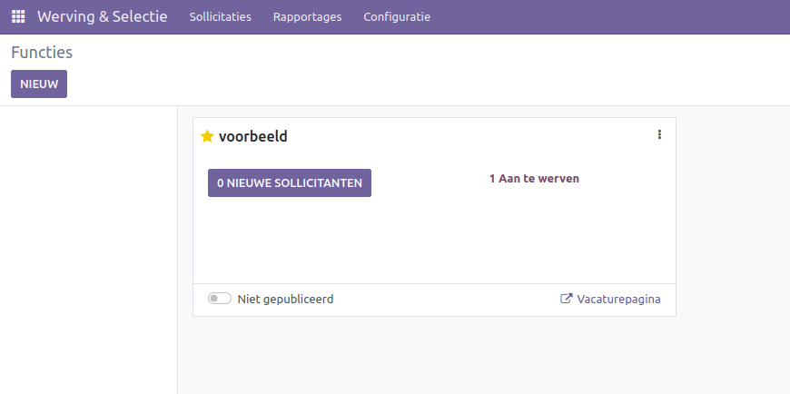
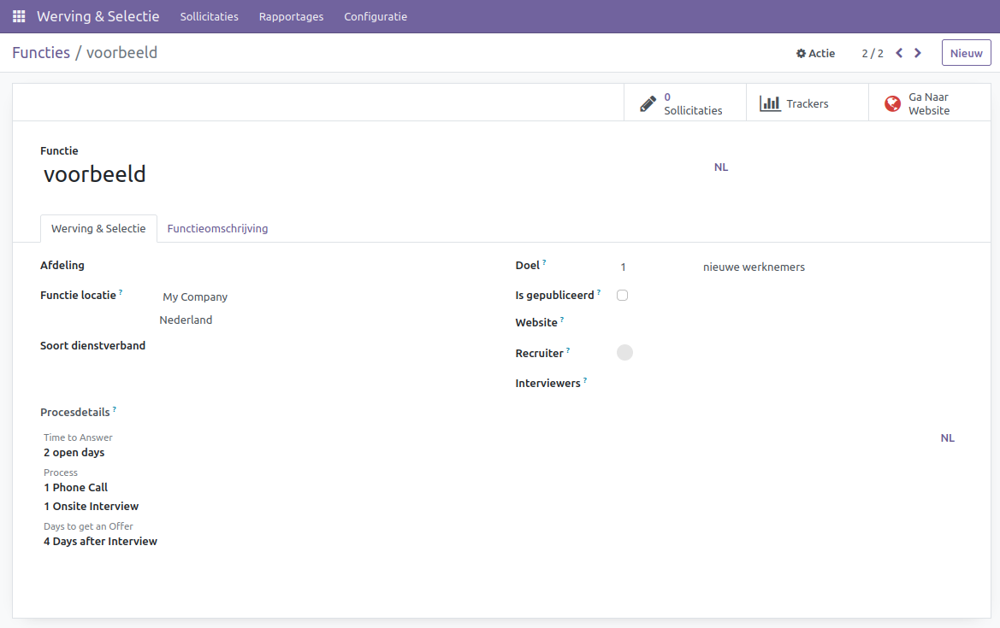
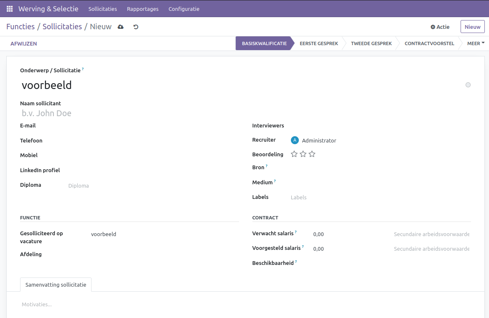
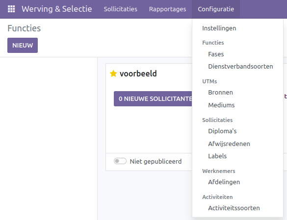

Werving en selectie
====================================================================

Binnen Curq kan het wervings- en selectieproces worden vereenvoudigd en gestroomlijnd met de werving en selectie app. Leg de verschillende stappen binnen het wervingsproces vast en begeleid uw toekomstige werknemers door het selectieproces.

Vacature plaatsen
---------------------------------------------------------------------------------------------------

Wanneer de werving en selectie app wordt geopend, komt u op de vacaturepagina. Hier kunnen alle openstaande vacatures worden gezien en via de 'Nieuw' knop kunnen er meer worden aangemaakt. Wanneer een nieuwe vacature wordt aangemaakt, moet eerst een naam worden opgegeven. Wanneer dit is gedaan, verschijnt deze op de applicatiepagina en via de drie puntjes rechtsboven in de vacaturevelden kan de vacature worden geconfigureerd.

Binnen de configuratie van de vacature is bovenaan de naam te zien en deze kan hier ook worden aangepast. In het recruitmentvlak onder de naam kunnen verschillende velden worden ingevuld en aangepast:

* **Afdeling:** Hier kan geselecteerd worden onder welke afdeling de baan waar de vacature voor is aangemaakt valt.
* **Locatie:** Onder de locatie wordt vermeld waar de baan zal worden uitgevoerd. Standaard is dit het adres van uw bedrijf.
* **Werknemerstype:** hier kan het type werknemer woeden toegevoegd zoals full-time, part-time en tijdelijk.
* **Doel:** Onder doel kan worden aangegeven hoeveel kandidaten gezocht worden voor deze applicatie.
* **Gepubliceerd:** Hier kan geselecteerd worden of de applicatie op de website gepubliceerd wordt onder de /jobs pagina.
* **Recruiter:** Bij de recruiter kan de verantwoordelijke recruiter aan de vacature worden toegewezen.
* **Interviewers:** Hier kunnen alle werknemers toegevoegd worden die meehelpen aan het interviewproces voor de vacature.
* **Process details:** In het detailveld wordt de informatie over het intakeproces dat op de webpagina te zien is, vertoond en aangepast.

Rechtsboven aan de pagina staan drie links, met *Job applications* is te zien hoeveel mensen op de vacature hebben gereageerd en wordt u naar de pagina van de vacature gestuurd. Onder *trackers* kunnen alle locaties van de vacature gezien worden, dit is binnen en buiten Curq, zoals LinkedIn. Met *go to website* wordt u naar de webpagina van de vacature gestuurd.

Wervingsproces
---------------------------------------------------------------------------------------------------

De kandidaten kunnen op verschillende manieren binnenkomen: via de website, enkele externe bronnen of ze kunnen handmatig worden aangemaakt. Wanneer de kandidaat in de vacaturepagina staat, kan deze van stap naar stap versleept worden in de kanbanvelden. Wanneer een kandidaat wordt geselecteerd, krijgt u het venster met alle beschikbare informatie over de kandidaat.

Op de pagina staat bovenaan de naam van de vacature, direct hieronder is het veld voor de naam van de kandidaat. Onder de naam kunnen de contactgegevens worden ingevuld samen met het LinkedIn-profiel en het hoogste behaalde diploma. Rechts van deze informatie kunnen de interviewers en de verantwoordelijke recruiter worden ingevuld. Daaronder kan een eerste indruk worden aangegeven met het aantal sterren en de bron waar de kandidaat de vacature heeft gevonden, samen met het medium, dit is de manier van reageren op de vacature. Als laatste kan hier een label aan de kandidaat worden gehangen.

Onder deze velden kan de informatie van de baan aangegeven worden, zoals of de vacature voor een ledenpositie is, hiermee wordt de kandidaat als lid toegevoegd als de kandidaat wordt aangenomen. De vacature kan geselecteerd en veranderd worden. Als laatste kan de afdeling waar de baan onder valt, worden aangegeven.
Rechts hiervan kan informatie van het contract worden opgegeven. Hieronder vallen het verwachte en aangeboden salaris plus extra voordelen zoals een leaseauto en de startdatum kan worden opgegeven.
Onder aan het scherm kan overige informatie worden opgegeven zoals de motivaties en ambities van de kandidaat.  

Linksboven in de hoek kan de kandidaat afgewezen worden met een reden, deze reden kan ook vanuit de kandidaat zelf komen.

Configuratie
---------------------------------------------------------------------------------------------------

In configuratie kunnen verschillende velden binnen de werving en selectie app worden aangepast.
In settings kan aangegeven worden of de vacatures online kunnen worden gezet, of er een enquête naar de kandidaat wordt gestuurd tijdens het wervingsproces en of het CV zichtbaar is op het kandidatenveld.

Onder werknemerstype kunnen de verschillende types worden ingesteld. Onder *afwijzingsredenen* worden de verschillende redenen opgegeven waarom de kandidaat niet meer in het proces zit, dit kan van beide kanten komen. Onder afdelingen kunnen de verschillende afdelingen waar vacatures worden gemaakt, worden opgezet. In activiteitentypes kunnen de verschillende activiteiten die tijdens het wervingsproces worden gebruikt, worden opgegeven zoals een telefoongesprek of een meeting.

Voor meer opties kan de developer mode aangezet worden. Wanneer deze aan staat, kunnen ook de stadia van het wervingsproces dat te zien is in de vacaturepagina met de kanbanweergave worden aangepast. UTM-sources en mediums waar de conecties met externe job-boards worden gemaakt. de soorten diploma's kunnen worden opgegeven en labels kunnen worden aangemaakt voor de kandidaten.
