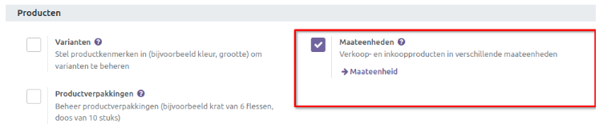
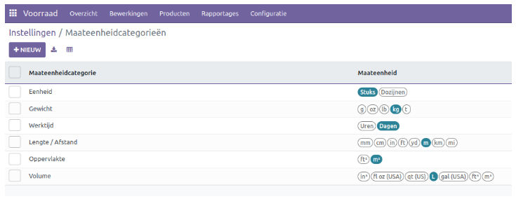
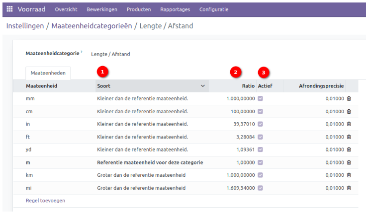
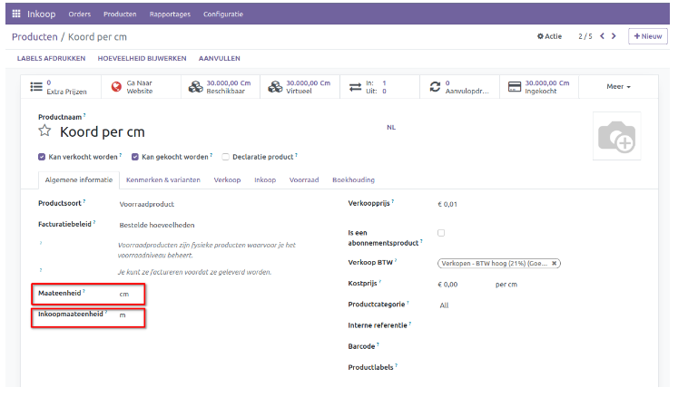
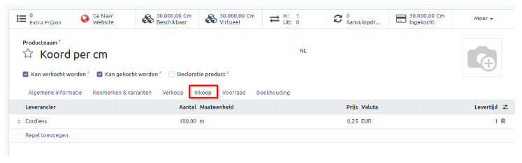
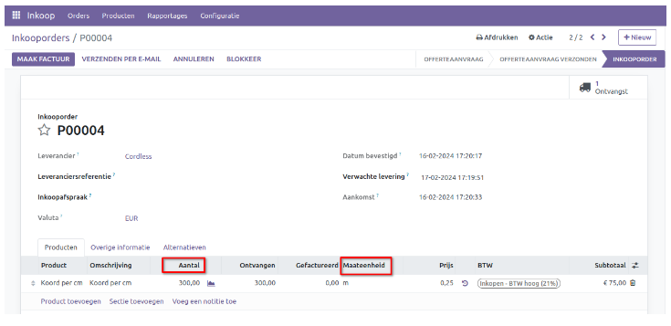
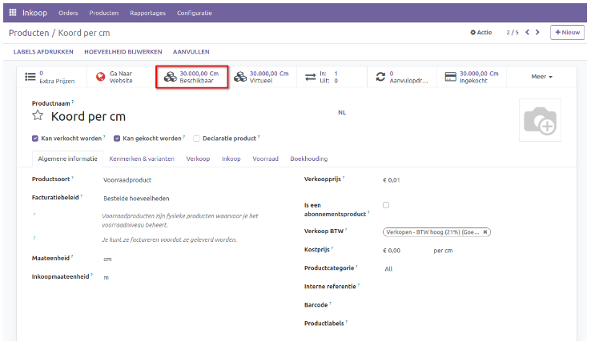
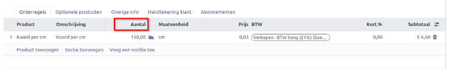

====================================
Inkoop in verschillende maateenheden
====================================

In Odoo is het mogelijk om verschillende maateenheden (UOM) te gebruiken op productniveau. 
Het verwijst naar de eenheid waarin producten worden gemeten, zoals stuks, kilogram, meter, liter, etc. Odoo biedt flexibiliteit bij het beheren van verschillende maateenheden voor producten, wat handig is in situaties waarin producten worden ingekocht en verkocht in verschillende eenheden.

Hierbij de belangrijkste aspecten van het gebruik van maateenheden in Odoo:

UOM-conversies: Odoo maakt het mogelijk om verschillende UOM's toe te wijzen aan een product en definieert conversieratio's tussen deze UOM's. Bijvoorbeeld, een product kan worden gekocht in dozen (doz), maar worden verkocht in stuks (stk). Odoo kan dan de conversieratio tussen dozen en stuks beheren, zodat de voorraadniveaus nauwkeurig worden bijgehouden.

Aankoop- en verkoop-UOM's: Voor elk product kunt u aparte UOM's instellen voor aankoop en verkoop. Dit betekent dat je het product kunt inkopen in één eenheid en verkopen in een andere eenheid. Odoo zal automatisch de conversies toepassen op basis van de gedefinieerde ratio's.

Prijsberekening: Odoo kan ook prijsberekeningen uitvoeren op basis van verschillende UOM's. Bijvoorbeeld, als een product wordt verkocht in kilogram, maar de prijs per gram wordt berekend, kan Odoo automatisch de prijs per kilogram berekenen op basis van de ingevoerde prijs per gram.

-------------------------
Maateenheden instellingen
-------------------------
U kunt de functionaliteit voor Maateenheden inschakelen via het Instellingenmenu:

Zodra de functie is geactiveerd, navigeer je naar 'Configuratie' en klikt u op de optie "Maateenheid".

Er verschijnt een overzicht van 'standaard' maateenheidcategorieën en de bijbehorende maateenheden. 

Laten we 'Lengte/afstand' even van dichtbij bekijken. Zodra er een nieuwe categorie wordt aangemaakt dan is het belangrijk om een maateenheid als 'referentie maateenheid' in te stellen. Alle maateenheden die daarna worden aangemaakt dienen omgerekend te worden via veld 'ratio' (2).

'Soort' geeft u daarna in als kleiner of groter dan de referentie (1). Het voorbeeld cm is kleiner dan de referentie maateenheid meter. Zorg dat de maateenheid 'Actief' staat om deze te gebruiken.

Via de knop 'Regel toevoegen' kunt u een nieuwe maateenheid toevoegen.  Vul de vereiste informatie in, zoals de meeteenheid zelf, soort en de bijbehorende ratio. 

Als er een nieuwe categorie moet worden aangemaakt, dan gaat u naar het overzicht van maateenheidcategorieën en klikt u op 'Nieuw'. Vanuit dit overzicht kunt u de maateenheden toevoegen.  

-------------------------------------
Inkopen in verschillende maateenheden
-------------------------------------

Om in te kopen in verschillende maateenheden nemen we een voorbeeld artikel zoals onderstaand:

Op de productkaart kunt u de maateenheden instellen voor zowel standaard als voor inkoop. Normaliter zijn deze gelijk maar heb als voorbeeld genomen een koord in cm. In dit voorbeeld kopen we het koord in per m, en verkopen we het koord per cm.

Via de inkoop tab kan de leverancier worden ingesteld, per hoeveelheid wordt ingekocht en de inkoopprijs per m. 

Zodra een inkooporder wordt gemaakt van dit specifiek artikel dan is aantal ingevuld wat in de inkoop tab is ingesteld. Deze is in dit voorbeeld aangepast naar 300m. 

Zodra de inkooporder wordt binnengeboekt (ontvangen), dan wordt deze in de standaard eenheid ingevuld, in dit geval cm.

In de verkooporder worden de aantallen in cm ingegeven. Bij het verwerken van de verkooporder, worden de voorraad aantallen bijgewerkt in cm.

