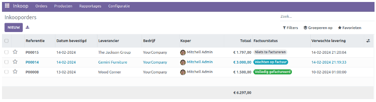
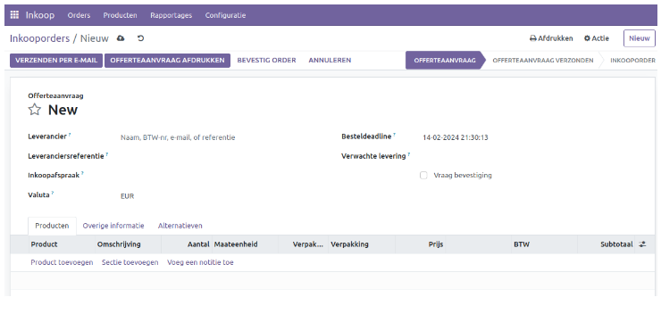
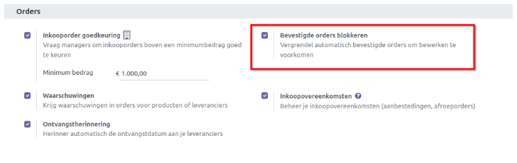
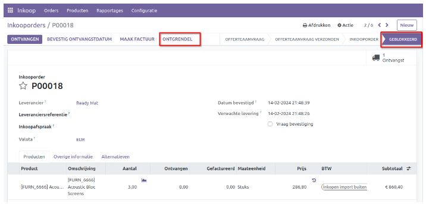
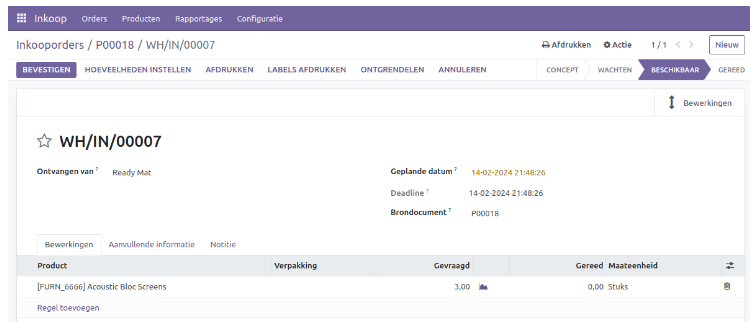
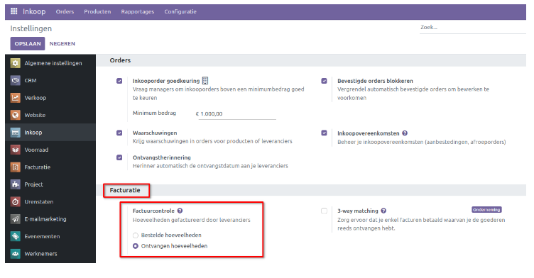
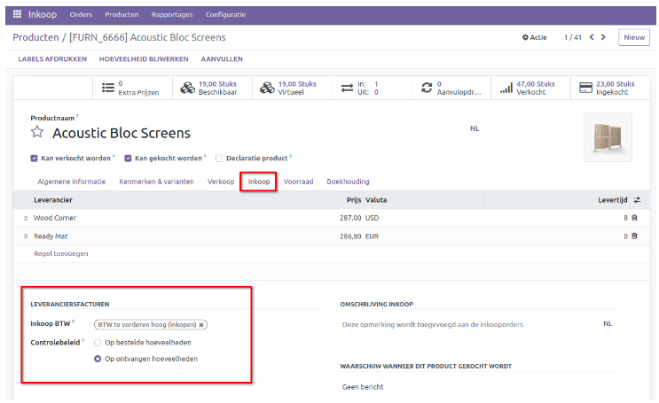
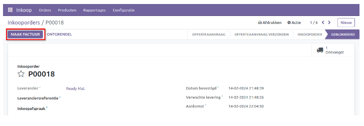
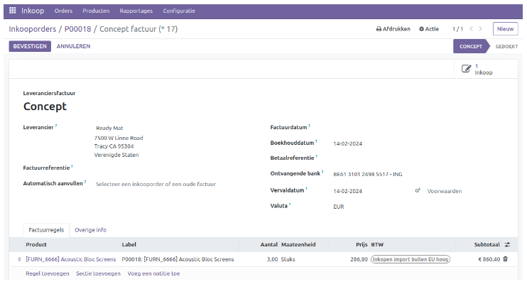

============
Inkoopbeheer
============

Een inkooporder wordt beschouwd als een bindende overeenkomst tussen de verkoper en de koper, waarin gedetailleerde informatie over de aankoop en de prijs van het product wordt vastgelegd. Het bedrijf kan een inkooporder opstellen en naar de leverancier sturen met alle relevante details over de producten die zijn opgenomen in de aankooplijst in de inkoopmodule. Deze inkooporder kan worden gegenereerd vanuit zowel de offerteaanvraag als rechtstreeks vanuit de optie *Inkooporders* in het menu *Orders*.

Indien er een positieve reactie van de leverancier is ontvangen, kan de RFQ direct worden omgezet in een definitieve inkooporder door op de knop *Bevestig Order* te klikken. 

Om een directe inkooporder aan te maken, gaat u naar het menu 'Orders' in de hoofdmenubalk van de module en selecteert u de optie *Inkooporders*. Hier wordt een lijst met inkooporders en hun status weergegeven, zoals hieronder getoond.

Het voorbeeld toont specifieke details zoals het **referentienummer, de bevestigingsdatum, de leverancier, het bedrijf, de verwachte ontvangstdatum, de inkoop vertegenwoordiger, de totale prijs en de factuurstatus** van de inkooporder. Je kunt een inkooporder selecteren om gedetailleerde informatie te bekijken of om de betreffende inkooporder te bewerken. Net als in andere Odoo-modules zijn er sorteeropties en verschillende weergaven van de gegevens beschikbaar. 

Gebruik de knop *Nieuw* om een nieuwe inkooporder te genereren.

De eerste stap bij het creëren van een nieuwe inkooporder is identiek aan het genereren van een RFQ. Vul de relevante velden in met details zoals leverancier, leveranciers referentie en een eventuele inkoopafspraak gegevens. Vergeet niet de deadline en de ontvangstdatum in de daarvoor bestemde velden te vermelden. Voeg vervolgens de producten die je wilt kopen en andere benodigde informatie over de inkooporder toe onder de tabbladen zoals gespecificeerd in het formulier.

Je kunt ervoor kiezen om dit als een offerteaanvraag per e-mail naar de geselecteerde leverancier te sturen door op *Verzenden per e-mail* te klikken, zoals eerder gedaan bij het genereren van de RFQ. Als je echter de order direct wilt bevestigen en verder wilt gaan met de aankoop, kun je de knop *Bevestig order* gebruiken. De status wordt dan weergegeven als **Inkooporder**. 

In het menu **Instellingen** kun je ervoor kiezen om **Bevestigde orders blokkeren** te activeren, waardoor bevestigde orders automatisch worden vergrendeld en bewerken wordt voorkomen.

Zodra je de bestelling hebt bevestigd, wordt deze automatisch vergrendeld zoals hieronder weergegeven. Als u wijzigingen wilt aanbrengen in de bevestigde bestelling, kunt u op de knop *Ontgrendel* klikken.

Nadat de bestelling is bevestigd, wordt het product geleverd op het adres dat is vermeld in de inkooporder. Op het moment van levering kun je de items op voorraad zetten door op de knop *Ontvangen* te klikken.

Als alternatief kun je de smart button gebruiken **Ontvangst**, om de details van de inkomende zending op te vragen.

====================
Leveranciersfacturen
====================

Binnen Odoo kun je leveranciersfacturen genereren op basis van de bestelde hoeveelheden en de geleverde hoeveelheden, conform het bedrijfsbeleid. Je kunt naar het menu "Instellingen" van de inkoopmodule gaan om de beleidsregels voor factuurcontrole in te stellen.

Onder het tabblad 'Facturatie' heb je de optie 'Factuurcontrole'. Hiermee kun je instellen hoe facturen voor aankopen moeten worden gegenereerd. De optie die je hier instelt, zal dienen als het standaard facturering beleid voor alle producten. Later kun je het facturering beleid van een specifiek product wijzigen vanuit de formulierweergave.

Je hebt de keuze om facturen te genereren voor en na levering. Als je facturen wilt genereren voor alle bestelde hoeveelheden, kun je 'Bestelde hoeveelheden' selecteren als factuurcontrole. Hierdoor worden facturen gegenereerd voor alle hoeveelheden die in de inkooporder zijn vermeld. Als je echter 'Ontvangen hoeveelheden' selecteert, zal Odoo alleen factureren voor de hoeveelheden die daadwerkelijk zijn geleverd.

Het is ook mogelijk om het controlebeleid in te stellen vanuit de productconfiguratie van elk product. Onder het tabblad 'Inkoop' vind je de relevante optie, zoals hieronder afgebeeld.

Laten we nu bekijken hoe je een factuur voor een inkooporder genereert.
Zodra je de inkooporder hebt bevestigd, krijg je de optie "Maak Factuur".

Wanneer je op deze knop klikt, opent zich een nieuw venster waar je de conceptversie van de leveranciersfactuur kunt bekijken.

De conceptfactuur bevat de gegevens van de leverancier, factuurreferentie, factuurdatum, betalingsreferentie, ontvangende bank, vervaldatum en valuta. 

Stel de factuurdatum in om een factuur te bevestigen. Aanvullende details zijn beschikbaar op de tabbladen Factuurregels en Overige info. Klik nu op de knop "Bevestigen". Je leveranciersfactuur is nu gereed voor betaling.

