====================================================================
Handleiding Inkoop  |  Prijslijsten en inkoopoffertes
====================================================================

Prijslijsten
---------------------------------------------------------------------------------------------------
Prijslijsten spelen een cruciale rol in zowel de verkoop- als inkoopactiviteiten van een bedrijf. Met de leveranciers prijslijst functie, beschikbaar in de Odoo Inkoopmodule, kun je specifieke inkoopprijzen configureren voor bepaalde leveranciers gedurende een bepaalde periode. Deze prijslijsten kunnen worden toegepast tijdens het inkopen van de gespecificeerde producten van die leverancier. Om deze instellingen te beheren, navigeer je naar het menu *Configuratie - Leveranciers Prijslijsten*. 

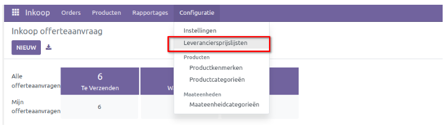

Indien gewenst kun je extra velden toevoegen aan de lijstweergave. Aan de rechterkant van het scherm vind je een specifieke lijst, zoals weergegeven in de afbeelding hieronder, waaruit je de benodigde velden voor de lijstweergave kunt activeren. Je kunt ook velden zoals **productvariant, overeenkomst, leveranciers productnaam, leveranciers productcode, startdatum, einddatum, aantal, maateenheid en levertijd** activeren. Klik op de knop 'Nieuw' om een prijslijst aan te maken.

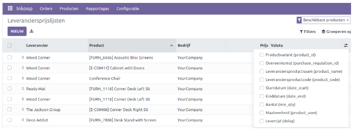

Er wordt een nieuw formulier geopend waarin je een nieuwe inkoopprijs kunt creëren voor een specifieke leverancier. Vul de velden voor de leverancier, productnaam, productcode en levertijd in. De ingevoerde productnaam en -code worden gebruikt bij het afdrukken van een offerteaanvraag met behulp van deze prijslijst. Op het tabblad *Prijslijst* kun je het product, de productvariant, de hoeveelheid, de prijs, de geldigheidsduur en het bedrijf toevoegen. 

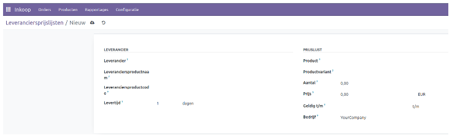

Inkoopoffertes
---------------------------------------------------------------------------------------------------

Voor elke substantiële zakelijke aankoop die jouw bedrijf doet, stelt de betreffende leverancier op verzoek een offerte op voor de te verwerven items. Het antwoord op jouw Offerteaanvraag (RFQ) kan worden omgezet in een inkooporder. Met behulp van deze offertes kun je de prijs en kwaliteit van het product vergelijken met die van andere leveranciers, waardoor je in staat bent de juiste leverancier te selecteren.

Het startscherm van de Inkoopmodule toont alle RFQ's die zijn aangemaakt. Je kunt de details van deze offertes bekijken, zoals het referentienummer, de naam van de leverancier, de bedrijfsnaam, de koper, de uiterste besteldatum, activiteiten, brondocument, totale kosten en de status van de RFQ.

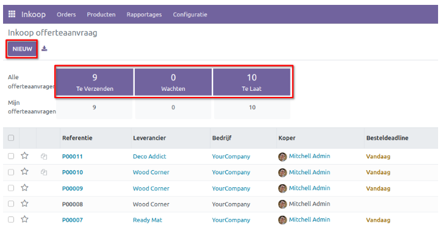

Het bovenstaande venster is verdeeld in twee secties: **Alle offerteaanvragen** en **Mijn offerteaanvragen**, die respectievelijk het aantal RFQ's weergeven die moeten worden verzonden, in afwachting zijn en te laat zijn verzonden. Wanneer je op *Te Verzenden* klikt, toont het venster de details van de RFQ's die moeten worden verzonden. RFQ's die wachten op een antwoord van de leveranciers verschijnen onder *Wachten*, terwijl RFQ's waarvan de deadline is verstreken worden weergegeven onder *Te laat*. **Alle RFQ's** omvat offerteaanvragen die door iedereen zijn toegevoegd, terwijl **Mijn RFQ's** de offerteaanvragen toont die door jou zelf zijn gemaakt. 

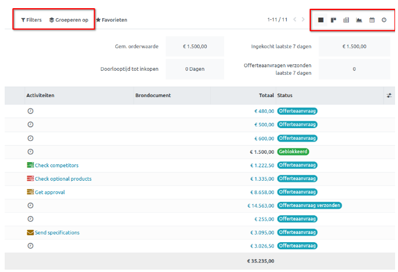

Je kunt details bekijken zoals de **gemiddelde orderwaarde, aankopen in de laatste 7 dagen, doorlooptijd tot aankoop en verzonden RFQ's in de laatste 7 dagen**. De *Gemiddelde orderwaarde* geeft de gemiddelde waarde van de orders in het venster weer, die verandert bij het toepassen van verschillende filters. *Inkopen laatste 7 dagen* toont de totale kosten van alle inkooporders die in de afgelopen zeven dagen zijn bevestigd. *Doorlooptijd tot inkopen* kun je bekijken om de tijd tussen het maken van een bestelling en de aankoopdatum te achterhalen.

In de rechterbovenhoek kun je klikken op pictogrammen voor verschillende weergaven, zoals **Lijst, Kanban, Draaitabel, Grafiek, Kalender en Activiteit**. Als je records wilt scheiden op basis van specifieke criteria, kun je gebruikmaken van de opties *Filters* en *Groeperen op*. De vervolgkeuzelijst met filters bevat opties zoals *Mijn inkopen*, *Met ster*, *Offerteaanvragen*, *Inkooporders*, *Aanvraag*, *Goed te keuren*, *Orderdatum*, *Concept offerteaanvragen*, *Offerteaanvragen in afwachting*, *Late offerteaanvragen* en *Waarschuwingen*.

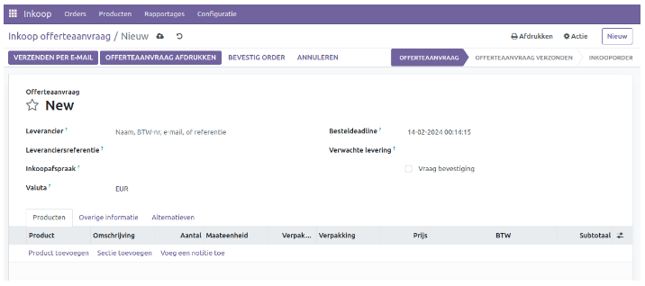

Bij het maken van een nieuwe inkoopofferte selecteer je de naam van de verkoper waar je de bestelling wilt plaatsen. Vermeld een eventuele leveranciers referentie in het daarvoor bestemde veld. Voeg indien nodig de koopovereenkomst bij de RFQ toe, waarin de voorwaarden tussen verkoper en koper worden vastgelegd. De uiterste besteldatum geeft aan wanneer de RFQ wordt omgezet in een bestelling. Als je de ontvangstdatum opgeeft, kun je de knop *Vraag bevestiging* inschakelen, waarmee je een bevestigingsmail naar de verkoper stuurt met betrekking tot de ontvangstdatum.

Op het tabblad **Product** kun je de productenlijst configureren voor de RFQ. Klik op *Een product toevoegen* en selecteer een product uit de geconfigureerde productlijst in de module. Wanneer je een product selecteert, worden andere velden zoals beschrijving, hoeveelheid, eenheidsprijs, belastingen en subtotaal automatisch ingevuld voor het geselecteerde product. Je kunt de hoeveelheid van het product naar wens aanpassen, waarna de totaalprijs dienovereenkomstig wordt bijgewerkt.

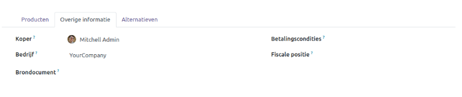

Onder het tabblad **Overige informatie** voeg je de gegevens van de inkoopvertegenwoordiger, het bedrijf, de betalingscondities, de fiscale positie en brondocument voor eventuele referenties (zoals een verkooporder wat leidt tot deze inkoopaanvraag). 

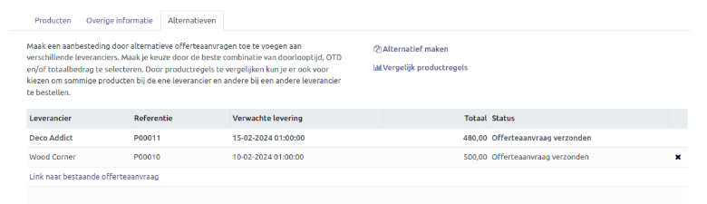

Het tabblad **Alternatieven** is een nieuwe functie in Odoo 16. Hiermee kun je alternatieve inkooporders met hetzelfde product van verschillende leveranciers toevoegen. Wanneer je alternatieve bestellingen toevoegt, wordt er een aanbesteding aangemaakt. Je kunt de alternatieven vergelijken en de beste optie selecteren. Klik op de knop *Alternatief maken* om alternatieven te maken. Er verschijnt een pop-upvenster zoals hieronder afgebeeld.

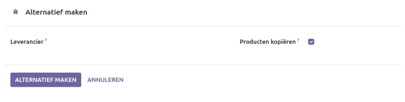

In de daarvoor bestemde ruimte kun je de alternatieve leverancier selecteren. Met de optie **Producten kopiëren** kun je de productgegevens van de huidige inkooporder dupliceren. Klik vervolgens op de knop *Alternatief maken*. Je kunt de alternatieve bestellingen controleren op het bijbehorende tabblad.

De *Link naar bestaande RFQ*-optie kan worden gebruikt om het alternatief te koppelen aan een bestaande RFQ. Om de productregels van de alternatieven te vergelijken, kun je de knop *Vergelijk productregels* gebruiken.

Wanneer je op deze optie klikt, opent er een nieuw venster waarin je het **Product, de Leverancier, Referentie, Status, Omschrijving, Verwachte levering, Aantal, Maateenheid, Prijs per eenheid, Totaal en Valuta kunt bekijken**.

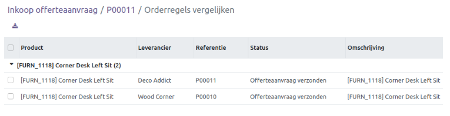

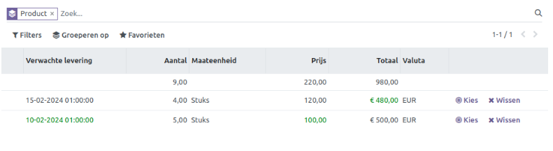

Je kunt de beste optie uit de alternatieven selecteren door op de knop *Kies* te klikken. De andere alternatieven worden dan op 0 gezet. Bij de keuze *Wissen* wordt de regel in de inkoopofferte op 0 gezet.

Nadat je de aanvraag voor een prijsopgave (RFQ) hebt opgeslagen, kun je ervoor kiezen deze per e-mail te versturen. Wanneer je op *Verzenden per e-mail* klikt, wordt er automatisch een e-mail gegenereerd die je naar de desbetreffende leverancier kunt sturen. Na het verzenden van de e-mail kun je de status van de RFQ bekijken, die dan is gewijzigd naar *Offerteaanvraag verzonden*.

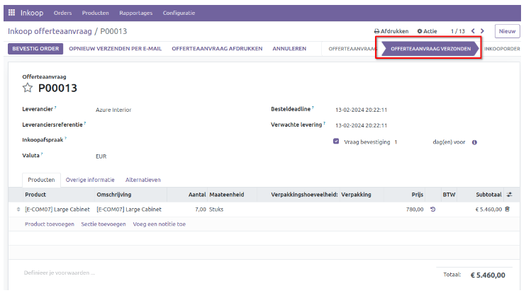
