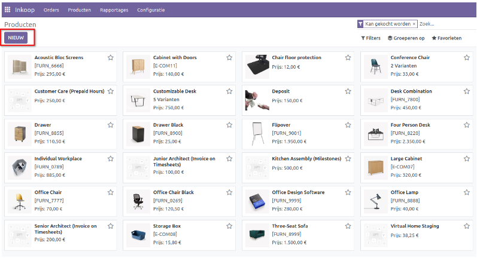
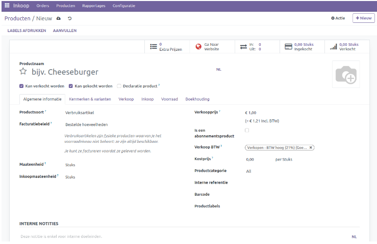
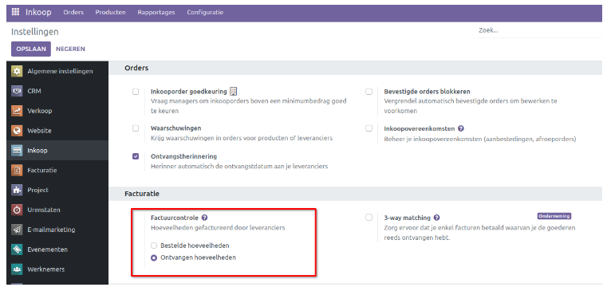
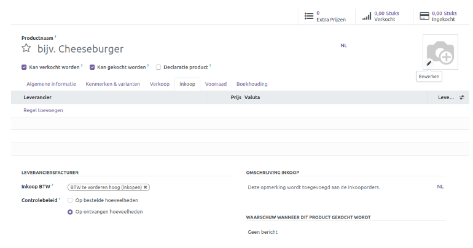
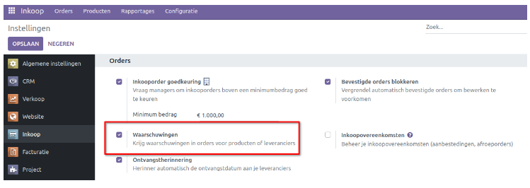
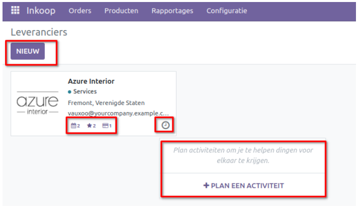
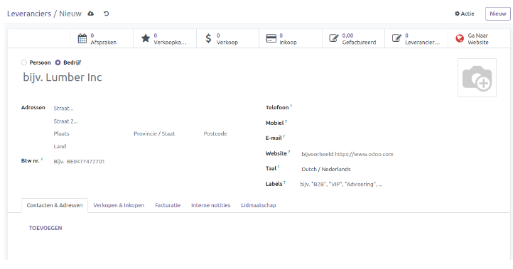

====================================================================
Inkoop
====================================================================

Binnen de Inkoopmodule van Curq heb je volledige controle over alle aspecten met betrekking tot de inkoop van jouw producten. De inkoopmodule vereenvoudigt het beheer van inkooporders, productconfiguraties, leveranciersbeheer en prijs instellingen voor producten/diensten. Bovendien biedt deze module toezicht op inkooporder aanvragen en offertes. De naadloze integratie van de inkoopmodule met andere Curq modules zoals boekhouding, voorraadbeheer, verkoop en facturatie zorgt voor een probleemloos inkoopproces.

Productbeheer
---------------------------------------------------------------------------------------------------
Curq biedt geavanceerde mogelijkheden voor het configureren en beheren van producten binnen de Inkoopmodule. Via het menu *Producten* in deze module kun je de productenlijst, variant details en kosten beheren. Onder het tabblad **Producten** heb je de keuze tussen *Producten* en *Productvarianten*, waar je de details van deze producten/diensten en hun varianten kunt bekijken en aanpassen.

Wanneer je op *Producten* klikt in de vervolgkeuzelijst van het menu **Producten**, opent zich een venster met de volledige lijst van reeds aangemaakte producten. Standaard wordt deze weergegeven in de Kanban-weergave, maar je hebt de mogelijkheid om deze naar wens te wijzigen naar de Lijst-weergave. In de Kanban-weergave tonen voorbeeldkaarten details zoals naam, interne productreferentie, prijs en product afbeelding. Met behulp van de knoppen *Filters* en *Groeperen op* kun je specifieke producten vinden op basis van toegepaste variabelen.

Om een nieuw product aan de lijst toe te voegen, klik je op de knop *Nieuw*. Hierdoor opent zich een venster waarin je de gegevens van het nieuwe product kunt invullen.

Voer de productnaam in het daarvoor bestemde veld in. Klik op het camerapictogram om een foto van het product te uploaden. Hier zie je ook drie opties: **Kan verkocht worden, Kan gekocht worden en Declaratie product**. Selecteer de opties die van toepassing zijn op het product.

In de vervolgkeuzelijst *Productsoort* vind je verschillende opties, zoals **Verbruiksartikel, Dienst, & Evenement ticket**. Kies het juiste productsoort uit deze opties. In het veld *Facturatiebeleid* kun je kiezen tussen **Bestelde hoeveelheden en Geleverde hoeveelheden**. Selecteer *Bestelde hoeveelheden* als je een factuur wilt genereren wanneer een product wordt besteld. Ongeacht of het product wordt geleverd, de factuur geeft de bestelde aantallen op. Klik op *Geleverde hoeveelheden* als je een factuur wilt genereren wanneer een product wordt geleverd. Dit is handig om deellevering te doen incl. deelfacturatie.

Vul de velden in die relevant zijn voor het product, zoals **Maateenheid, Inkoop maateenheid,  Verkoopprijs, Verkoop BTW, Kostprijs, Productcategorie, Interne referentie, Barcode en Productlabels**. Je kunt ook de naam van jouw organisatie selecteren in de vervolgkeuzelijst *Bedrijf*, waardoor het product wordt geconfigureerd voor dat specifieke bedrijf.

Als het product varianten heeft, kun je deze toevoegen op het tabblad *Kenmerken & Varianten*. De configuratie van producten in de Verkoopmodule is eerder al uitgebreid beschreven. Je kunt dezelfde methode volgen om een nieuw product in de module Inkoop te configureren. Op het tabblad Inkoop kun je de leveranciers van het product één voor één specificeren met de knop *Regel toevoegen*. Je kunt op dit tabblad meerdere leveranciers toewijzen aan een product.

.. image:: Media/inkoop3.png

Voer in de respectieve velden de prijs in om dit product te kopen, evenals de valuta en de levertijd. Je kunt de standaard belastingen die worden toegepast bij de aankoop van dit product specificeren in het veld *Inkoop BTW*. De controlemethode voor dit specifieke product kan worden ingesteld op *Bestelde hoeveelheid* of op *Ontvangen hoeveelheden*.

Indien je een standaard controlemethode wilt instellen voor alle producten binnen de Inkoopmodule, navigeer dan naar het menu *Instellingen*. Hier vind je de optie **Factuurcontrole**, waarmee je de factuurcontrole voor alle producten kunt instellen.

Indien je notities wilt toevoegen aan inkooporders, biedt het veld *Omschrijving Inkoop* daarvoor de mogelijkheid. Tevens kun je op het tabblad **Inkoop** een waarschuwing instellen. Hiermee kun je waarschuwingsberichten genereren bij de aankoop van dit product.

Meer info over het inrichten van producten en varianten vind je terug in de handleiding 'Voorraad - Productconfiguratie'

Leveranciersbeheer
---------------------------------------------------------------------------------------------------

Een bedrijfsorganisatie wordt geconfronteerd met diverse inkoopbehoeften, zowel op grote schaal als in de detailhandel. Voor verschillende aangeschafte producten is het noodzakelijk om de gegevens van meerdere leveranciers op te slaan en te beheren. Met Curq is het mogelijk om alle leveranciers die relevant zijn voor een specifiek product te configureren, waardoor klanten gemakkelijker bij hun voorkeursleverancier kunnen kopen. Dankzij de flexibele en geavanceerde gebruikersinterface van Curq is het beheren van de leverancierslijst en het opstellen van leverancier kenmerken efficiënter geworden. Bovendien kun je de gegevens van de leverancier koppelen aan het bijbehorende product, waardoor het volgen van nieuwe inkooporders eenvoudiger wordt.

Om de leveranciersgegevens te beheren, navigeer je naar het menu *Leveranciers* in de vervolgkeuzelijst van het tabblad **Orders**. Hier wordt een gedetailleerde Kanban-weergave van alle toegevoegde leveranciers weergegeven.

In de Kanban-weergave kun je de basisinformatie over een leverancier bekijken. Deze informatie omvat de naam van de leverancier, eventuele tags die zijn toegevoegd en het e-mailadres. Bovendien worden pictogrammen weergegeven waarmee je vergaderingen, kansen en aankopen kunt beheren die aan de betreffende leverancier zijn toegewezen.

De lijstweergave kan worden uitgebreid door de benodigde opties in te schakelen via de geavanceerde werkbalk. De lijst bevat onder andere informatie zoals **provincie, BTW nummer, activiteiten, tags en de huidige lidmaatschap status**.

.. image:: Media/inkoop008.png

Door op de knop *Nieuw* te klikken, ga je naar een nieuw contactkaart waar je de gegevens van de leverancier kunt configureren. Het proces voor het configureren van leveranciers is identiek aan dat voor het configureren van klanten, zoals besproken in een andere handleiding (Toevoegen van een contact). Je kunt dus dezelfde stappen volgen. Vul de tabbladen **Contacten & Adressen**, Verkoop & inkopen en Facturatie in. Na het configureren van de leveranciers kun je de verkoopprijslijst beheren in de Curq Inkoopmodule.

    Inkoop_Inkoop_in_verschillende_maateenheden
    Inkoop_Aanvulopdrachten
