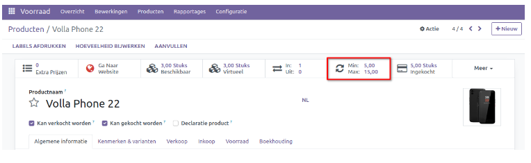
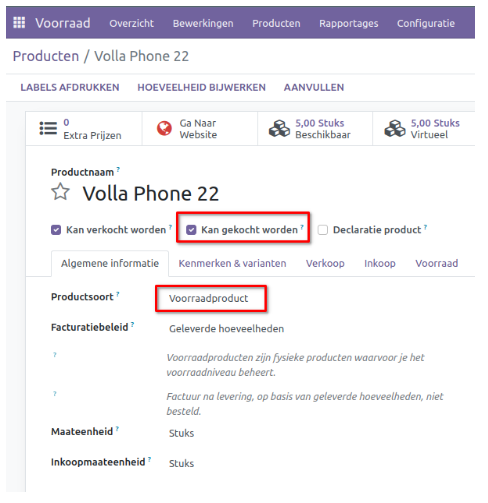
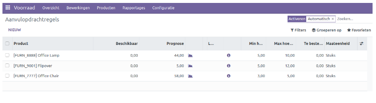
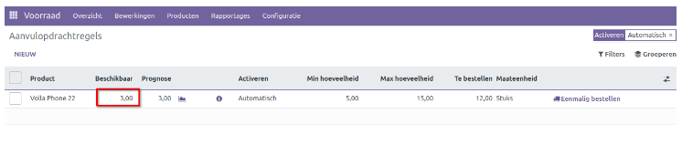
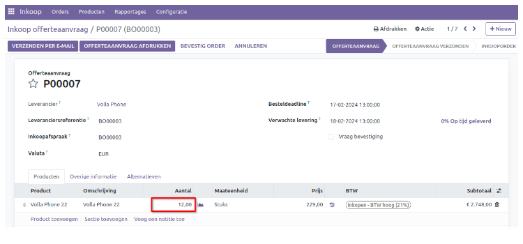

=========================
Inkoop - Aanvulopdrachten
=========================

Voor bepaalde producten is het van essentieel belang om ervoor te zorgen dat er altijd een minimale hoeveelheid beschikbaar is. Dit kan worden bereikt door het toevoegen van een *aanvulopdracht* regel aan het product, waardoor het bestelproces wordt geautomatiseerd. 

Aanvulopdrachten kunnen op 2 manieren worden geconfigureerd. 
Via:
-- **Voorraad app** - **Configuratie** - **Aanvulopdracht regels**
-- Open een product - klik op smartbutton **Aanvulopdrachten** (zie onder)

Houdt er rekening mee dat op productniveau de settings *Kan gekocht worden* en **Voorraad Product** is ingesteld.

We nemen de 1e optie door in deze handleiding.
Ga naar **Voorraad app - Configuratie - Aanvulopdracht regels:** 

In dit overzicht staan alle aanvulopdrachten en worden er verschillende gegevens weergegeven, waaronder het **Product, Beschikbare Voorraad, Prognose, de Voorkeursroute, de Verkoper, de Minimale en Maximale hoeveelheid, Te bestellen hoeveelheid en de gebruikte maateenheid**. 

Er is een veld *Veelvoudige hoeveelheid* beschikbaar dat aangeeft wat de kleinste eenheid is waarin je items van de leverancier kunt kopen. Het systeem zal de inkoophoeveelheid afronden naar boven op het veelvoud dat u in dit veld hebt opgegeven. Als je bijvoorbeeld 0 invoert, zal Curq de exacte hoeveelheid gebruiken.

Je kunt de voorkeuren voor activering instellen op *Automatisch* of *Handmatig* in het venster voor aanvulling. 

De *Minimale hoeveelheid* bepaalt het laagste niveau van het product dat altijd op voorraad moet zijn. Wanneer de voorraad onder deze waarde daalt, zal het systeem automatisch een inkoopofferte klaarzetten voor de ingestelde leverancier om de voorraad weer aan te vullen.

We gaan nu een nieuwe aanvulopdracht instellen, klik hiervoor op *Nieuw*.
Kies vervolgens een product en geef de minimale en maximale hoeveelheid in. 

.. image:: Media/inkoop047.png

In kolom *beschikbaar* staat de huidige voorraad. Kolom *prognose* houdt rekening met gereserveerde aantallen en de aantallen uit openstaande inkooporders. 
In onderstaand voorbeeld is de voorraad aangepast naar 3.

Er wordt nu automatisch een inkoopofferte klaargezet van 12 stuks **(voorraad was 3 + aanvullen tot 15 = 12 stuks)**.

