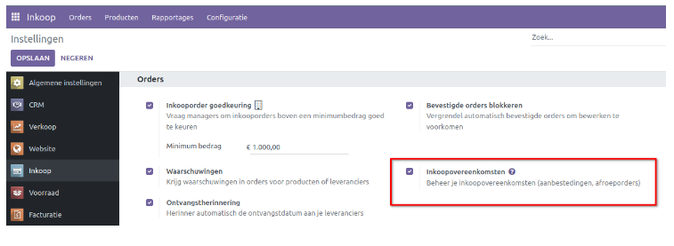
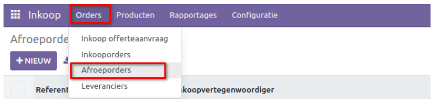
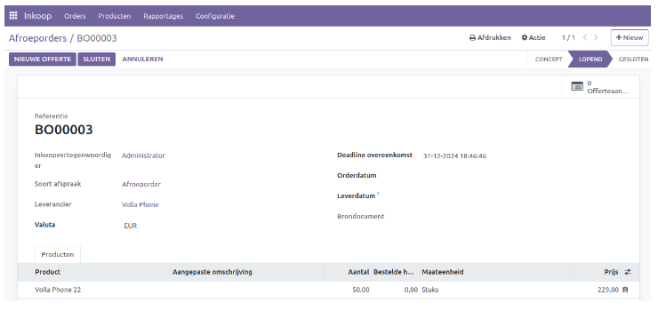
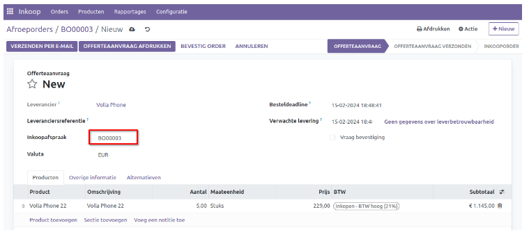

==================
Inkoopovereenkomst
==================

De overeengekomen voorwaarden tussen de klant en de verkoper kunnen worden vastgelegd in een inkoopovereenkomst. Voordat je een inkooporder aanmaakt, is het essentieel dat beide partijen akkoord gaan met de voorwaarden die zijn vastgelegd in de inkoopovereenkomst. Curq biedt een optie om dergelijke inkoopovereenkomsten te beheren. Deze overeenkomsten kunnen vervolgens worden gebruikt om inkooporders te genereren.

Om deze functie te gebruiken, dien je eerst de optie *Inkoopovereenkomsten* activeren in het menu **Instellingen**. Deze optie is beschikbaar onder het tabblad **Orders**, zoals te zien is in de onderstaande schermafbeelding.

In Curq zijn er twee soorten inkoopovereenkomsten beschikbaar, namelijk *Aanbestedingen* en *Afroeporders*. Je kunt de optie **Aanbesteding** gebruiken wanneer je offertes van meerdere leveranciers voor hetzelfde product wilt vergelijken. Deze optie wordt weergegeven wanneer je een nieuwe RFQ aanmaakt in de inkoopmodule, zoals eerder toegelicht bij de inkooporder.

.. image:: Media/inkoop032.png

Het tabblad **Alternatieven** kan worden gebruikt om een aanbesteding te maken door alternatieve inkooporders van verschillende leveranciers te configureren. Deze functie helpt je om de productlijnen gemakkelijk te vergelijken en de beste optie te kiezen.

Je kunt ook **Afroep orders** gebruiken om overeenkomsten te maken met je bestaande klanten. Met deze functie kun je aangepaste producten en prijslijsten maken. Dit type inkoopovereenkomst zal je helpen als je regelmatig inkopen doet bij dezelfde leverancier, voor hetzelfde product bij verschillende leveranciers, of voor verschillende producten van dezelfde leverancier binnen een regelmatige tijdsperiode. Om afroeporders te maken, ga je naar het menu "Orders" binnen de inkoopmodule.

In de lijstweergave van afroeporders worden de **referentie, inkoper, bedrijfsnaam, besteldatum, deadline voor overeenkomst, brondocument en status** weergegeven. Klik op de knop *Nieuw* om een nieuwe afroeporder te maken.

Er wordt een nieuw formulier geopend om een ​​afroeporder aan te maken. Vul de velden in voor de inkoopvertegenwoordiger, het type overeenkomst en de leverancier. Geef de valuta aan die wordt gebruikt voor de transactie tussen de partijen in het relevante veld. Je kunt een deadline instellen voor de overeenkomst om de einddatum vast te leggen. Verder kun je in de bijbehorende velden de orderdatum, leveringsdatum en brondocument invullen. Gebruik de knop *Regel toevoegen* om een product in te voeren, die reeds bestaat of die als *nieuw* wordt aangemaakt. Er is ook een extra veld beschikbaar voor de algemene voorwaarden van de inkooporder. Klik ten slotte op *Bevestigen* en de status wordt bijgewerkt naar **Lopend**.

Zodra de overeenkomst deadline is bereikt, wordt de status automatisch bijgewerkt naar *Gesloten*. Zolang de status **lopend** is kan er een nieuwe inkoopofferte/order aangemaakt worden. 

