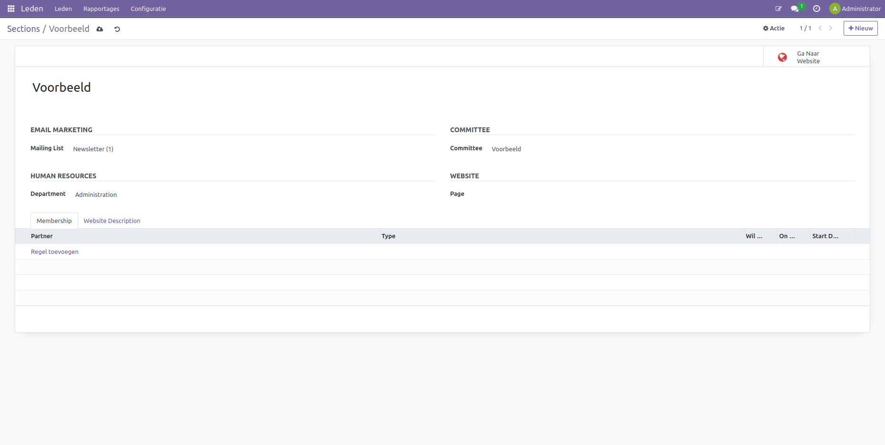
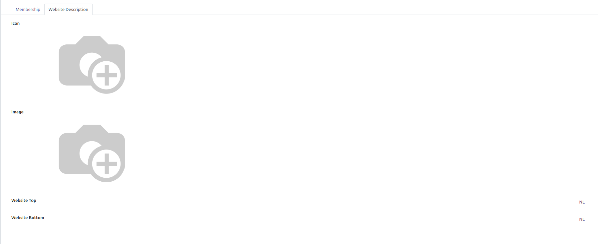
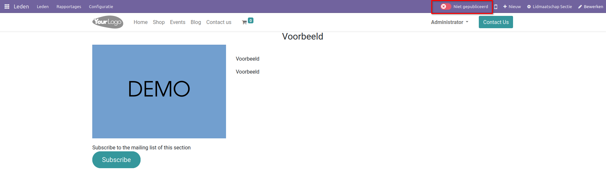
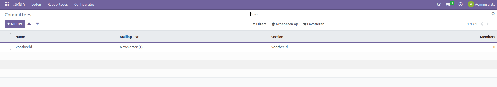
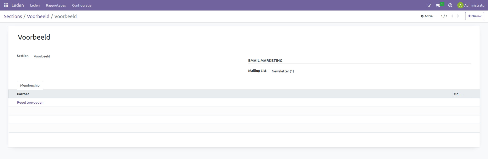

leden, secties en comités
====================================================================

Secties
---------------------------------------------------------------------------------------------------

Binnen de ledenmodule kunnen de leden in secties worden georganiseerd. Deze groepen kunnen worden gebruikt om de samenwerking tussen de leden te verbeteren door samenwerking en het delen van informatie via e-mailcampagnes. Verder kunnen deze secties worden gekoppeld aan een comité om beslissingen te nemen over de toekomst en de richting van de sectie.
Om deze secties aan te maken, navigeer naar Leden > Configuratie > Secties en selecteer +Nieuw.

In het nieuwe sectieveld zijn vier tot vijf vakken aanwezig:
1. De naam van de sectie.
2. De mailinglijst; vanuit deze lijst worden alle leden onder de sectie gemaild over nieuwe informatie. Om te leren hoe een mailinglijst wordt aangemaakt, kijk in onze documentatie.
3. Departement: wordt de sectie gekoppeld aan een personeelszaken- of HR-afdeling. Dit veld is optioneel.
4. Comité: hier kan de sectie aan een comité worden gelinkt. Dit veld is optioneel.
5. Pagina: hier kan de webpagina worden geselecteerd waar de aanmeldpagina van de sectie wordt weergegeven. Wanneer dit veld leeg wordt gelaten, zal een nieuwe webpagina worden aangemaakt.

Onder het tabblad Leden (Membership) staan alle leden die onder de sectie vallen. Via "Regel toevoegen" kunnen leden worden toegevoegd.
Onder "Websitebeschrijving" kan de aanmeldpagina van de website worden aangemaakt.

Hier kan een icoon worden opgegeven; deze zal bij de sectiesselectie op de aanmeldpagina voor leden te zien zijn.
Ook kan een afbeelding worden toegevoegd; deze zal te zien zijn op de sectiesselectiepagina.
In het veld "Websitekop" kan de naam worden opgegeven die te zien zal zijn op de webpagina van de secties.
In het veld "Websitevoet" kan een korte beschrijving worden gegeven.
Om de sectieswebpagina te publiceren, klik op "Ga naar website".

En klik op "Gepubliceerd".

Comités
---------------------------------------------------------------------------------------------------

In de ledenapp kunnen ook comités worden opgezet, en daar kunnen leden aan worden toegevoegd voor een betere samenwerking tussen de leden en een richting voor de sectie of organisatie.

Ga in de ledenapp naar Configuratie > Comités (committees). Hier kunnen nieuwe comités worden aangemaakt en bestaande comités worden aangepast.

Om een nieuw comité aan te maken, selecteer "Nieuw". Hier kan een naam aan het comité worden gegeven en kunnen leden aan het comité worden toegevoegd.

