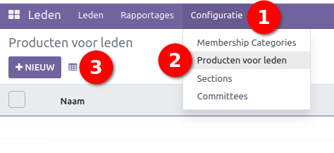
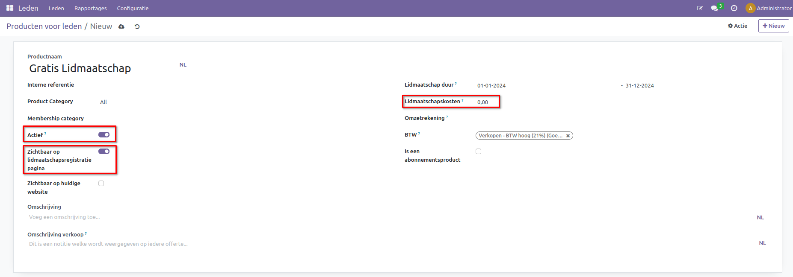
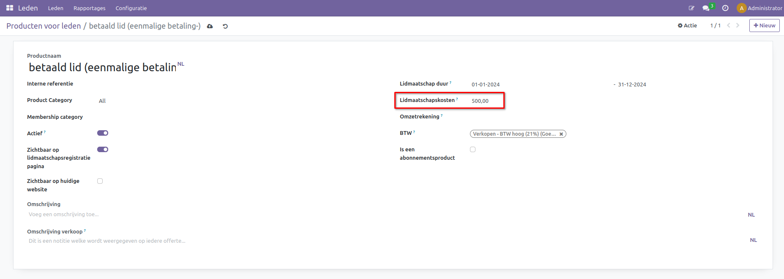
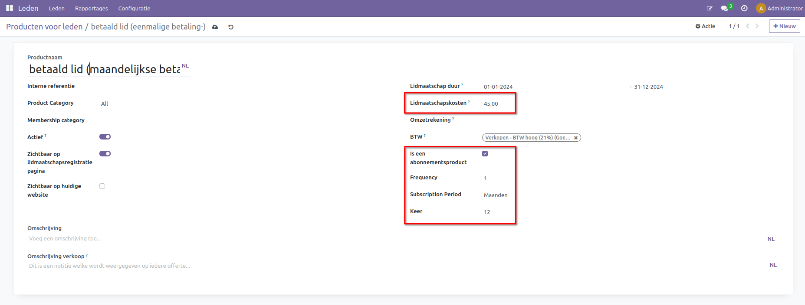

Producten voor leden 
====================================================================

Navigeer naar Leden > Configuratie > Producten voor leden.

Klik op Nieuw en vul de details in: 

* **Productnaam:** De naam van het lidmaatschap.  
	
* **Interne referentie:** Een referentiecode voor het zoeken en groeperen van het lidmaatschapsproduct. 
	
* **Lidmaatschapsduur:** Hier selecteert u de datum vanaf wanneer en tot wanneer het lidmaatschap actief is. 
	
* **Lidmaatschapskosten:** De prijs van het product. 
	
* **Productcategorie:** Selecteer de relevante categorie. 
	
* **Actief:** Wanneer deze optie op non-actief wordt gezet, is het product niet selecteerbaar maar nog wel opgeslagen. 
	
* **Zichtbaar op lidmaatschapsregistratiepagina:** Wanneer deze optie is aangevinkt, kan het lidmaatschap geselecteerd worden op de registratiepagina van de website. 
	
* **Zichtbaar op huidige website:** Met deze optie kan het lidmaatschapsproduct op de gekoppelde website worden verkocht. 
	
* **Omschrijving:** De omschrijving van het ledenproduct voor interne communicatie. 
	
* **Omschrijving verkoop:** De omschrijving die de klant op de factuur kan zien. 
	
* **Omzetrekening:** De rekening waar de verkoop aan wordt gekoppeld; wanneer deze leeg gelaten wordt, is dit de standaard rekening. 
	
* **Btw:** De standaard btw die wordt gebruikt bij het verkopen van het lidmaatschap. 
	
* **Is een abonnementsproduct:** Maak het product een abonnement met een maandelijkse betaling via Mollie.

Een gratis lid Product 
---------------------------------------------------------------------------------------------------
Voor een gratis product moet de lidmaatschapskosten op 0,- worden gezet.
 

Betaald lid Product: eenmalige betaling
---------------------------------------------------------------------------------------------------
Voor de eenmalige betaling vul de lidmaatschapskosten naar wens in.
 

Abonnementsproduct
---------------------------------------------------------------------------------------------------
Naast een gratis en betaald lidmaatschap kan ook een abonnement worden aangemaakt voor meerdere betalingen over een periode. Vink eerst 'Is een abonnementsproduct' aan, dan ziet u drie nieuwe velden: 

* **Frequency:** Hoe vaak er een betaling binnen de periode moet worden gemaakt. 
	
* **Subscription Period:** Moet de betaling per dag, week of maand worden gemaakt. 
	
* **Keer:** De hoeveelheid betalingen die moeten worden gemaakt om het abonnement te voltooien."

