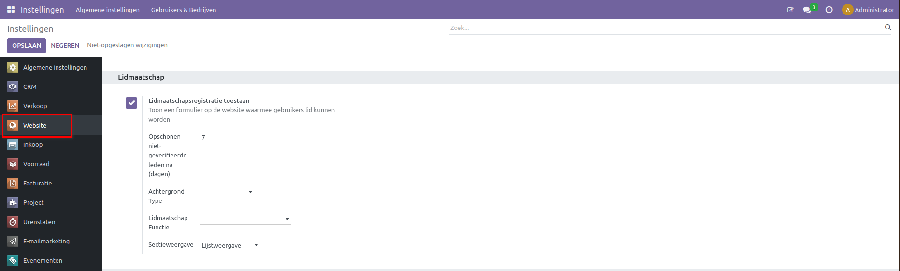
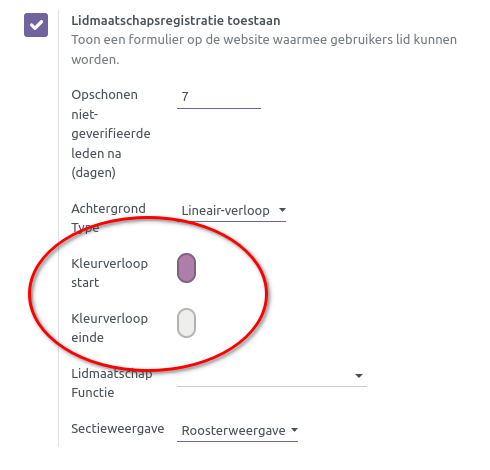
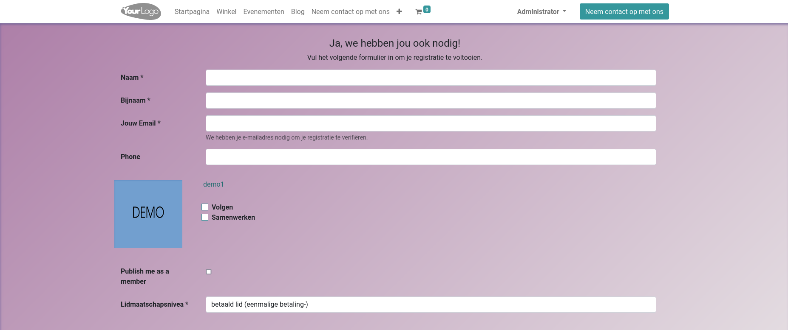
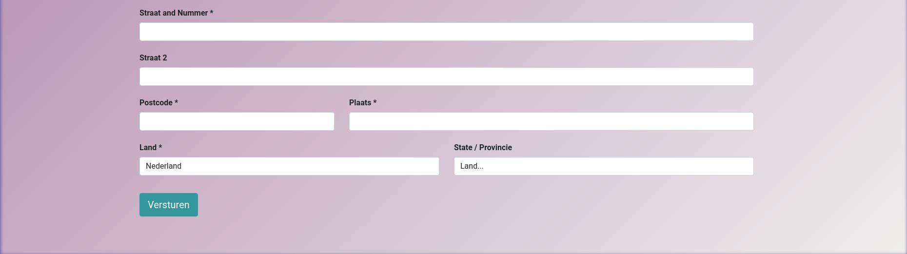

Leden registratie pagina
========================

Voor het aanmaken van een ledenregistratiepagina ga naar Instellingen > Website, of in de module Website onder Configuratie-instellingen, hiermee belandt u op dezelfde pagina.
Scrol naar beneden en vind de leden sectie. Hier ziet u de optie om lidmaatschapsregistratie toe te staan. Wanneer deze optie is aangevinkt, ziet u verschillende nieuwe opties verschijnen.

* **Opschonen niet geverifieerde leden na (dagen):** Hier kan het aantal dagen opgegeven worden voordat een lidmaatschap dat nog niet geverifieerd of betaald is wordt verwijderd.
* **Achtergrondtype:** Hier kan het type achtergrond bepaald worden; er zijn vier opties: kleur, lineair verloop, radiaal verloop en afbeelding. In het geval van de kleur en de verlopen kan er via een pop-up menu de kleuren gekozen worden. Voor de afbeelding kan er een geüpload worden.

* **Lidmaatschapsfunctie:** In dit veld wordt gekozen voor welke functie het potentiële lid zich aanmeldt.
* **Sectieweergave:** In dit veld kan geselecteerd worden op welke manier de secties weergegeven worden. In een lijst onder elkaar wanneer lijstweergave is geselecteerd, of in vlakken naast elkaar onder rooster weergave.

Het registratie formulier kan worden gevonden door het volgen van de volgende link:
https://{Your domain}/membership-registration
