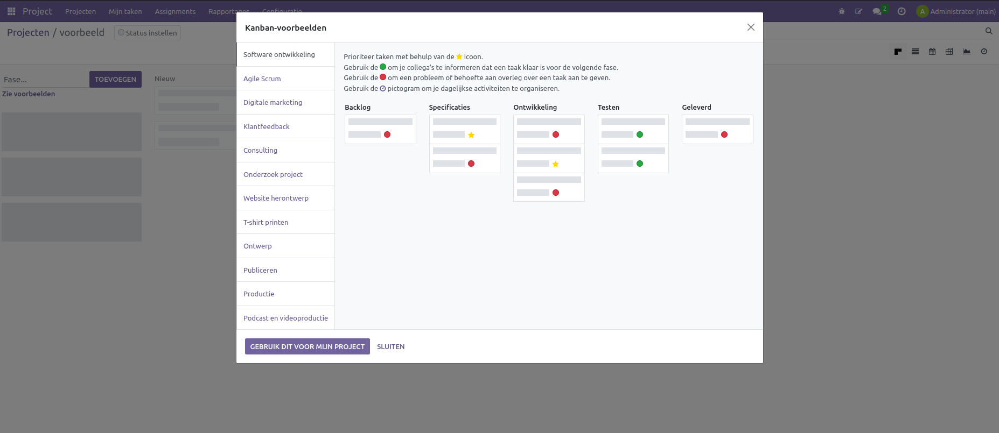
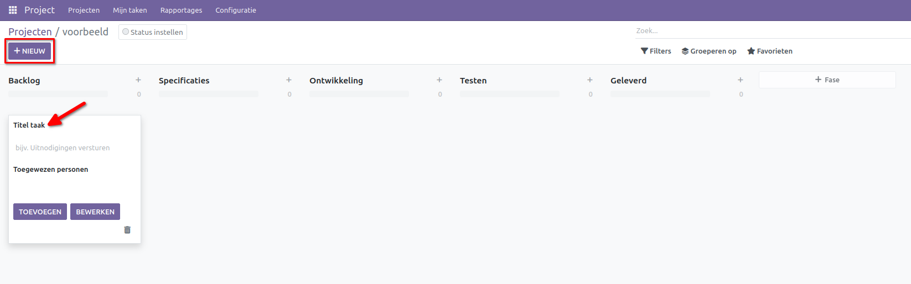
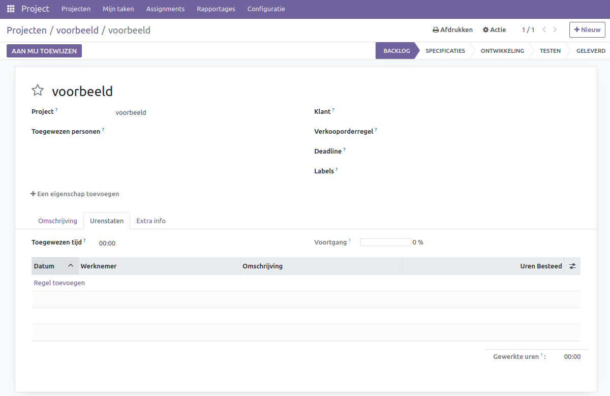
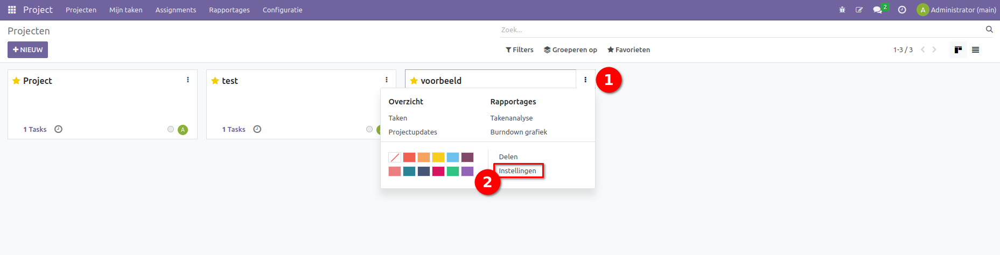
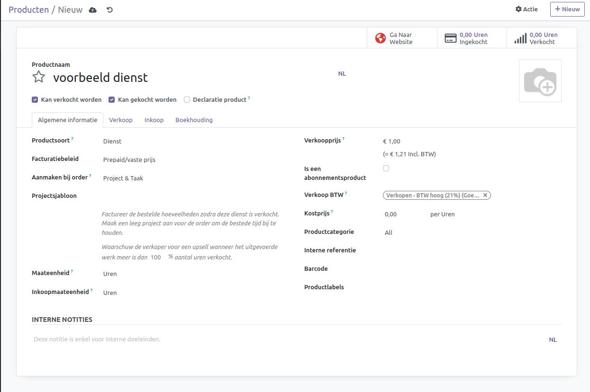

De tekst bevat enkele spelling- en grammaticafouten. Hier is de gecorrigeerde versie:

---

Projecten
====================================================================

In de projectenapplicatie kunnen alle projecten van uw bedrijf worden beheerd, met statussen voor de projecten en de taken die onder het project vallen.

Om een project aan te maken, opent u de projectenmodule en selecteert u op de projectenpagina +Nieuw. Hier verschijnt een pop-upmenu waar de naam van het project kan worden ingevoerd, of waarvoor uren en gebruikte materialen kunnen worden gefactureerd, en of er uren kunnen worden opgegeven in urenstaten.

.. image:: Media/Projecten001.png

Wanneer een project is aangemaakt, verschijnt het op de projectpagina, dit is te zien linksboven in de hoek waar de naam zichtbaar is. Op de projectpagina kunnen de gewenste stadia worden aangemaakt. Dit kan handmatig worden gedaan door elk stadium een naam te geven of door een van de voorbeelden te importeren.

Wanneer de stadia zijn aangemaakt, kunnen er taken worden aangemaakt door op de +Nieuw knop te drukken. Hier kan een naam aan de taak worden gegeven. 

Wanneer de taak is aangemaakt kan deze worden aangepast door bijvoorbeeld de verantwoordelijke te selecteren, een deadline te geven en uren in te vullen. Voor meer informatie ga naar onze taken documentatie.

Om de instellingen van het project aan te passen, ga naar de projectenpagina en selecteer de instellingen onder de drie verticale punten:

Binnen de instellingen van het project kunnen verschillende aanpassingen worden gedaan, zoals de naam van het project veranderen, de naam van de taken aanpassen, de klant voor wie het project wordt uitgevoerd opgeven, labels opgeven voor categorisatie, een projectmanager opgeven, een begin- en einddatum plannen en het maximum aantal te besteden uren opgeven.

.. image:: Media/Projecten005.png

In de tabbladen onder de omschrijving kan een beschrijving van het project worden gegeven. In de instellingen kan de kostenplaats van het project worden opgegeven en voor welke gebruikers het project zichtbaar is:

1. Dit kan voor uitgenodigde interne gebruikers zijn, wanneer het project alleen voor specifieke gebruikers is zoals het management of een specifiek development team.
2. Voor alle interne gebruikers, wanneer het hele bedrijf het project moet kunnen zien en eraan moet kunnen werken.
3. Uitgenodigde portaalgebruikers en alle interne gebruikers, wanneer externe groepen het project moeten kunnen bekijken en eraan moeten kunnen werken.

Hier kan ook worden geselecteerd of de urenstaten ingevuld moeten kunnen worden en of het project factureerbaar moet zijn.

Onder aan de pagina kan worden geselecteerd of de toewijzingen geërfd kunnen worden en of de rollen gelimiteerd zijn aan de toewijzingen.

Met website details kan worden ingesteld onder welke categorie het project op de website wordt weergegeven. Tevens kan een korte omschrijving worden gegeven en daaronder een meer uitgebreide omschrijving voor de website.

.. image:: Media/Projecten006.png

Onder het tabblad "Members" kunnen de verschillende leden worden gezien die het project ondersteunen.

.. image:: Media/Projecten007.png

Facturatie
---------------------------

Om de uren van projecten te factureren moet het project via een dienst product worden aangemaakt.

De dienst kan worden aangemaakt via het productenmenu in de voorraad- en verkoopapplicaties. Maak een nieuw product aan en selecteer onder producttype de optie 'dienst'. Hier verschijnt de optie om een project, taak of een project en taak aan te maken. Ook kan de eenheid als uren worden ingesteld om de opgegeven uren te verkopen.

Wanneer het product is aangemaakt, worden ook meteen de geselecteerde opties aangemaakt met de naam die aan het product is gegeven. Wanneer er uren op het project worden geschreven, kunnen deze gefactureerd worden via de verkoopmodule.

.. toctree::
    :maxdepth: 2
    :hidden:

    projecten_taken
    Urenstaten_gebruiker
    urenstaten_goedkeuren
