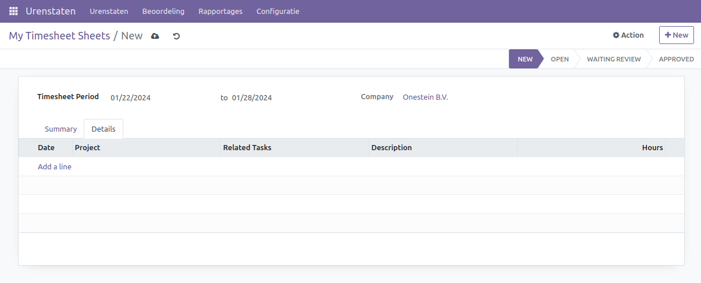
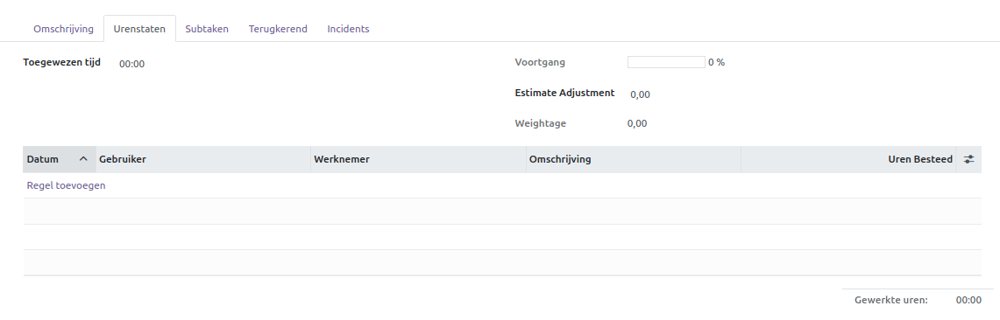

Urenstaten
==========

De Urenstaat module biedt een gestroomlijnde oplossing voor het invoeren en volgen van de gewerkte uren door werknemers. De ingevoerde uren kunnen nauwkeurig worden gekoppeld aan specifieke taken en projecten, waardoor een transparante en efficiënte registratie ontstaat. Bovendien kunnen de ingevoerde uren direct worden gebruikt voor het genereren van facturen.

Mijn Urenstaten
---------------

Binnen het "Mijn Urenstaten" formulier hebben gebruikers de mogelijkheid om de gemaakte uren nauwkeurig in te voeren. De procedure begint met het selecteren van de "+Nieuw" knop. In dit formulier wordt de periode waarin de uren zijn gemaakt gespecificeerd, met een aanbeveling om dit wekelijks in te vullen. In het geval van werken binnen een multi-company omgeving, wordt geadviseerd het relevante bedrijf te selecteren. Het gedeelte onder "Details" biedt de mogelijkheid om uren per taak in te vullen. Gebruikers kunnen "Add a Line" selecteren en alle benodigde informatie invullen.

* De datum waarop de uren zijn gemaakt.
* Het project waaraan de taak is gekoppeld; alleen de projecten waarvoor de gebruiker is opgegeven, worden weergegeven voor selectie.
* Selecteer de specifieke taak waaraan de uren zijn besteed.
* Verstrek een korte beschrijving van de gemaakte uren.
* Voer het aantal gemaakte uren in. Afhankelijk van de instellingen kan de eenheid variëren, bijvoorbeeld per kwartier, vijf minuten, enzovoort.

Onder het tabblad "Opsomming" worden alle ingevoerde uren overzichtelijk weergegeven in een spreadsheet, waardoor snel kan worden gecontroleerd of het juiste aantal uren is opgegeven.

Ook onder de individuele taken kunnen de uren worden ingevoerd. Navigeer naar "Projecten", selecteer het relevante project en vervolgens de taak. Onderaan het scherm verschijnt het "Urenstaat" tabblad, waar gebruikers de uren kunnen invoeren voor de werknemers die aan de taak hebben gewerkt. Daarnaast kan worden aangegeven hoeveel uren maximaal aan de taak besteed mogen worden.

Om een gedetailleerd overzicht van alle ingevoerde uren te verkrijgen, navigeert u binnen de Urenstaten module naar "Urenstaten > Mijn Urenstaten". Op deze pagina kunnen de uren op diverse manieren worden weergegeven:
1. **Lijst**: Hier worden alle uren per dag en taak overzichtelijk genoteerd.
2. **Kanban**: Alle uren per dag en taak worden naast elkaar in kanban blokken weergegeven, waardoor eenvoudige groepering mogelijk is.
3. **Pivot**: De uren worden in een spreadsheet weergegeven en kunnen op verschillende manieren worden gegroepeerd, bijvoorbeeld per week en dag verticaal en per project verticaal.

.. image:: Urenstaten/Urenstaten_gebruiker003.png

4. **Diagram**: Uren kunnen worden weergegeven in diagrammen, waardoor informatie snel gecategoriseerd kan worden om diverse gegevens zichtbaar te maken.

Deze diverse weergavemogelijkheden bieden een snelle en duidelijke analyse van de ingevoerde gegevens en zorgen ervoor dat alles compleet en correct is ingevuld. Bovendien kan via de zoekbalk en de groepeer- en filteropties specifieker naar informatie worden gezocht.

Beoordeling
-----------

Na het invoeren van de uren is een essentiële stap de goedkeuring. Onder het tabblad "Beoordeling" kan worden gecontroleerd of de ingevoerde uren zijn goedgekeurd door de manager. Indien dit niet het geval is, biedt het scherm van de specifieke urenstaat inzicht in waarom de uren niet zijn goedgekeurd, waarna aanpassingen kunnen worden doorgevoerd.

