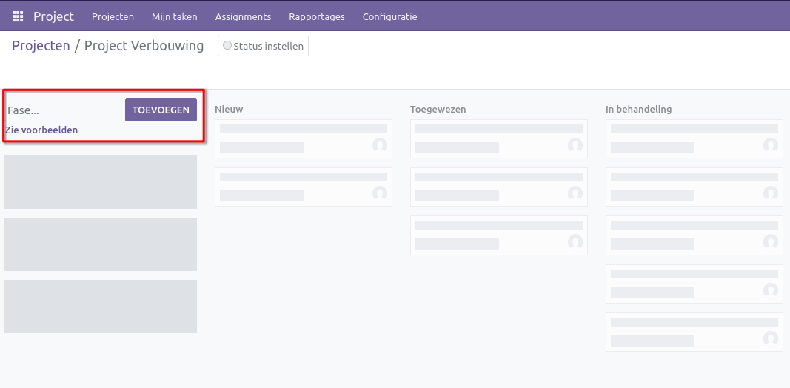
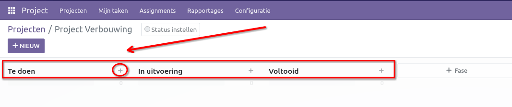
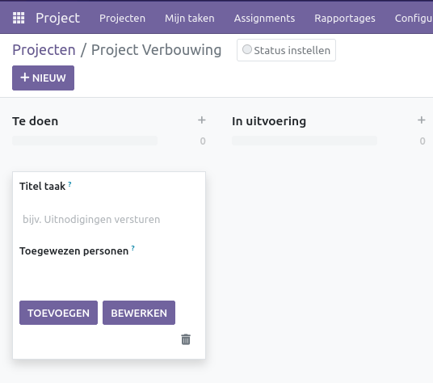
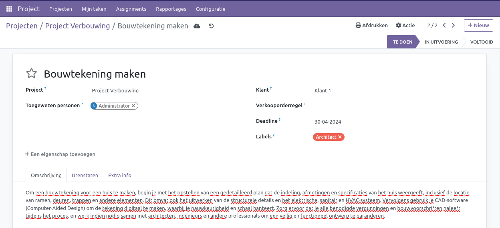
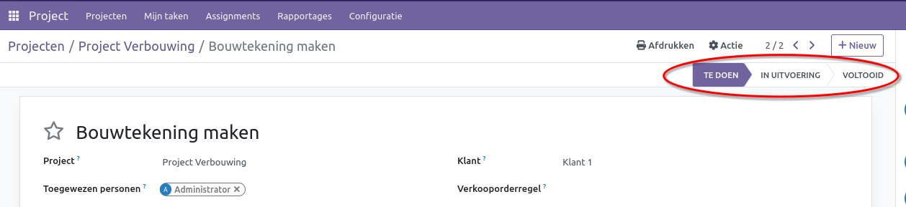
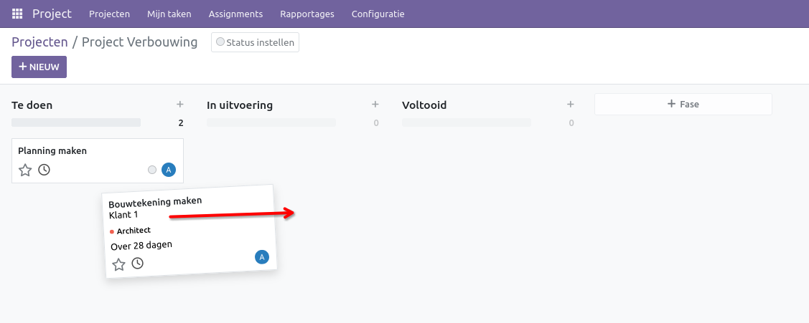

Project taken 
====================================================================

Curq biedt de mogelijkheid om het beheren van projecten en taken via kanban omvat het organiseren van taken in verschillende stadia van voltooiing op een visueel kanbanbord. Eerst identificeer je de projecten die moeten worden beheerd en breek je ze op in specifieke taken. Vervolgens organiseer je deze taken op het kanbanbord, waarbij je kolommen gebruikt om de verschillende fasen van het project weer te geven, zoals "Te doen", "In uitvoering" en "Voltooid". Teamleden worden toegewezen aan taken en de voortgang wordt regelmatig bijgehouden door taken over de kolommen te verplaatsen naarmate ze vorderen.

Door dit gestructureerde aanpak te volgen, kunnen teams efficiënter werken, deadlines halen en projectdoelen bereiken. Het biedt een duidelijk overzicht van de voortgang van elk project, waardoor eventuele knelpunten of achterstanden snel kunnen worden geïdentificeerd en aangepakt. Bovendien bevordert het gebruik van taken en kanbanborden een cultuur van transparantie en verantwoording binnen het team, wat essentieel is voor succesvol projectbeheer op lange termijn.

Taken management
--------------------------------------------------------------------

Zodra een project is aangemaakt, begint het proces met het definiëren van de fasen, wat direct na het maken van het project kan plaatsvinden.

Geef de fase een naam en klik op [TOEVOEGEN]. Als voorbeeld hebben we 3 fasen toegevoegd: "Te doen", "In uitvoering" en "Voltooid". Na het aanmaken ziet het er als volgt uit.

Door op het [+] icoontje te klikken, maak je direct een taak aan in de betreffende fase.

Geef de taak een titel en wijs deze toe aan de juiste persoon. Je kunt de taak vervolgens verder specificeren door deze te bewerken. Als je eerst alle taken wilt aanmaken, klik dan op "Toevoegen".

Je kunt een taak verder uitbreiden door extra informatie toe te voegen, deze te koppelen aan een klant, deadlines in te stellen en labels toe te voegen. Ook is het mogelijk om je uren bij te houden om de voortgang te bewaken. Voor elke taak kun je ook de geplande uren bijhouden, zodat je precies weet hoeveel uren er nog beschikbaar zijn.

Je kunt taken beheren door ze in de juiste fase te plaatsen, wat direct vanuit een taak kan worden gedaan.

In het Kanban-projectoverzicht kun je ook vrij eenvoudig de taak slepen naar een andere fase.

