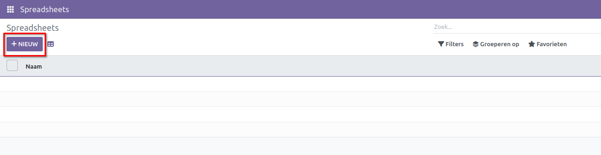
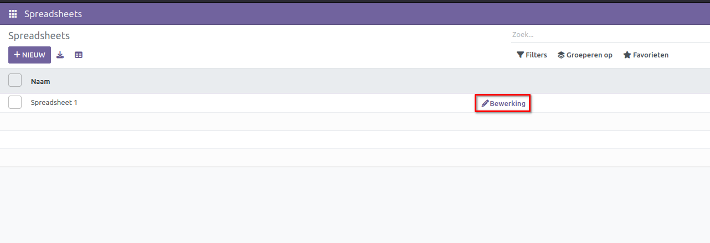
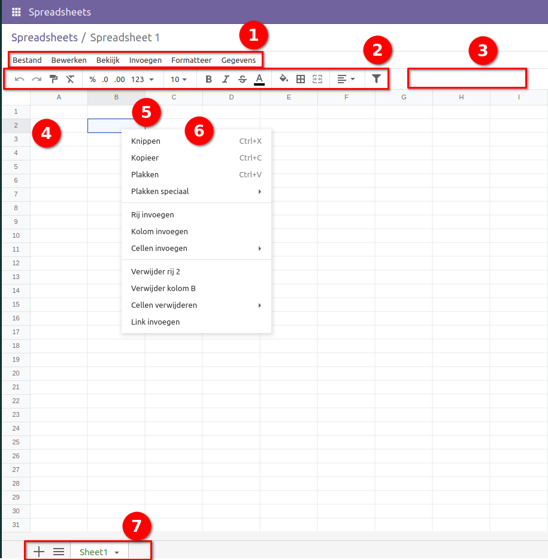

=============
Spreadsheets
=============

Een spreadsheet stelt je in staat om je gegevens in tabelvorm te organiseren, analyseren en visualiseren.

Hoe maak je een nieuw spreadsheet?
----------------------------------
Je kunt een spreadsheet maken door op de knop "Nieuw" te klikken.

Voer de naam in van het spreadsheetbestand dat aangemaakt moet worden. 

.. image:: Spreadsheets_Media/Spreadsheet002.png

De overzichtspagina toont alle aangemaakte spreadsheets. 
Je kunt elk aangemaakt spreadsheetbestand bewerken door de optie "Bewerking" te selecteren.

Enkele van de belangrijkste UI-elementen van de spreadsheet zijn hieronder gemarkeerd en gedefinieerd.

1. Top bar
2. Formula bar
3. Filters button
4. Row header
5. Column header
6. Cell menu
7. Bottom bar
