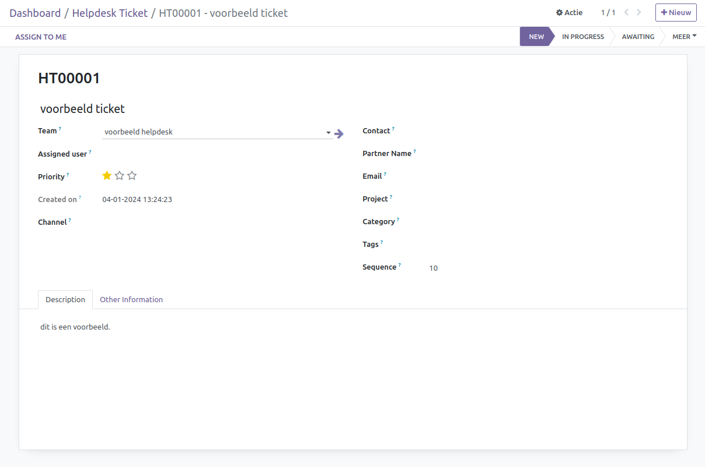

Helpdesk
====================================================================

De Helpdesk App is ontworpen om uw vragen en ondersteuningsbehoeften moeiteloos te beheren en op te lossen. Hier is een overzicht van hoe onze app functioneert:

Inkomende Verzoeken:
---------------------------------------------------------------------------------------------------
De app verzamelt inkomende vragen van verschillende bronnen, zoals e-mails, online formulieren, en directe invoer door gebruikers.
Alle verzoeken worden op een overzichtelijke manier weergegeven, waardoor niets over het hoofd wordt gezien.

Categorisatie in Kanban View:
---------------------------------------------------------------------------------------------------
Verzoeken worden automatisch gecategoriseerd en weergegeven in een intuïtieve Kanban-weergave.
Deze categorisatie helpt bij het prioriteren en organiseren van de verzoeken op basis van hun aard en urgentie.

Ticket Creatie Onder Helpdesk Groepen:
---------------------------------------------------------------------------------------------------
De Helpdesk App is voorzien van helpdesk groepen, waar onder elk van hen specifieke tickets worden aangemaakt.
Dit maakt het mogelijk om de verzoeken gericht te verdelen over teams met de juiste expertise.

.. image:: Helpdesk/Helpdesk002.png

Diverse Invoermogelijkheden:
---------------------------------------------------------------------------------------------------
Verzoeken kunnen op verschillende manieren binnenkomen, waaronder via gelinkte e-mails, online formulieren en directe invoer door gebruikers.
Deze flexibiliteit zorgt ervoor dat alle gebruikers op een handige manier toegang hebben tot de servicedeskfunctionaliteiten.
