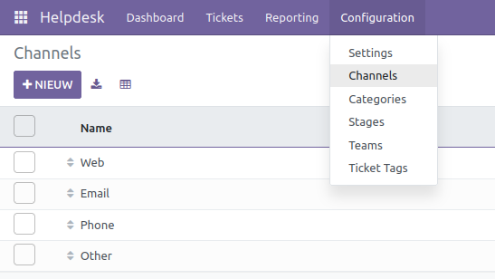
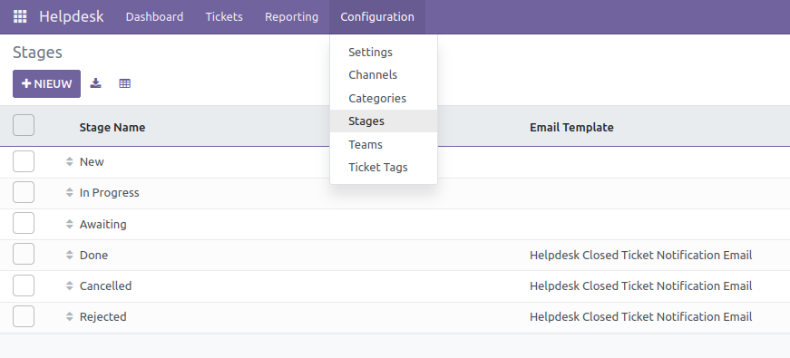
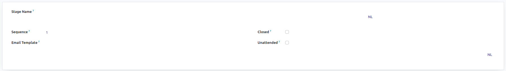
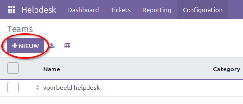

Helpdesk Advanced
=================
In de helpdeskapplicatie zijn diverse functionaliteiten beschikbaar voor de categorisatie van verschillende taken en teams. Deze zijn te vinden onder het configuratiemenu.

Instellingen
------------
Onder het tabblad 'Instellingen' kan worden aangegeven of de verschillende teams vanuit het portaal kunnen worden geselecteerd.

Kanalen
-------
Onder het tabblad 'Kanalen' kunnen de verschillende bronnen van de aangemaakte tickets worden geconfigureerd, zoals web, e-mail, telefoon, enz.

Categorieën
-----------
Onder het tabblad 'Categorieën' kunnen diverse categorieën worden aangemaakt om de tickets te classificeren. Standaard zijn er nog geen categorieën aangemaakt; deze dienen handmatig te worden toegevoegd. Voorbeelden hiervan zijn incidenten, contactverzoeken, spam, enz.

Stadia
------
De verschillende stadia categoriseren de voortgang van de taken. Standaard zijn er 'Nieuw', 'In Behandeling', 'In Afwachting', 'Afgerond', 'Geannuleerd' en 'Afgewezen'. Aangepaste stadia kunnen worden toegevoegd, zoals 'In Afwachting van Interne Werkzaamheden' en 'In Afwachting van Externe Werkzaamheden'. Elk stadium heeft een naam, een volgorde (de plaats in de lijst, waarbij lagere nummers meer naar links staan), een e-mailtemplate voor meldingen aan de melder wanneer de ticket in het stadium belandt, en de optie om de ticket al dan niet als gesloten te markeren wanneer deze in het stadium wordt geplaatst.

Teams
-----
Teams representeren diverse kanalen waar de tickets binnenkomen. Dit kan bijvoorbeeld relevant zijn voor eerstelijns- en tweedelijnssupportkanalen. Onder het kopje 'Teams' kunnen de aangemaakte teams worden beheerd. Nieuwe teams kunnen eveneens worden aangemaakt via de '+ Nieuw' knop linksboven in de hoek.

Hier kan een naam worden toegevoegd en een e-mail aan het team worden gekoppeld, van waaruit tickets kunnen worden aangemaakt. Er kan eveneens worden aangegeven vanuit welke e-mailadressen berichten worden geaccepteerd. Onder 'Toewijzen aan' kan de standaard gebruiker worden ingesteld die aan de tickets wordt toegewezen. In 'Project' kan een project worden toegewezen waar taken onder het project worden aangemaakt met een ticket. Ook kan worden aangegeven of het team kan worden gekozen. Onder het kopje 'Teamleden' kunnen andere gebruikers aan het team worden toegevoegd.

Labels
------
Met labels kan eenvoudige aanvullende informatie aan de tickets worden toegevoegd. Hierbij valt te denken aan een identificatie tussen een incident, probleem of contactverzoek. Ook zou bijvoorbeeld de afdeling waaraan de ticket gerelateerd is, kunnen worden aangegeven.
