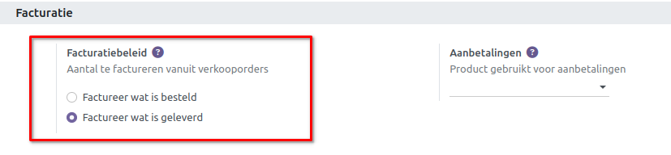
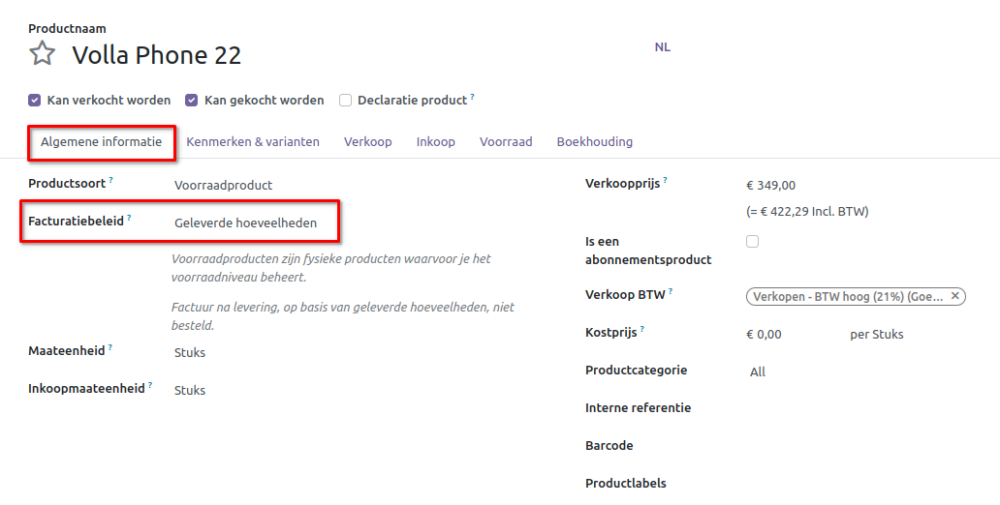
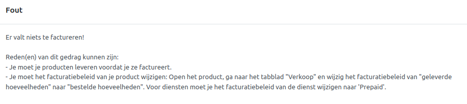

==================
Facturatie Methode
==================

Factuur op basis van geleverde of bestelde hoeveelheden
-------------------------------------------------------

Verschillende bedrijfsbeleidsregels kunnen verschillende opties voor facturering vereisen:

- De regel *Bestelde Hoeveelheden* wordt gebruikt als de standaardmodus in Curq Verkoop, wat betekent dat klanten worden gefactureerd zodra de verkooporder is bevestigd.

- De regel *Geleverde hoeveelheden* factureert klanten zodra de levering is voltooid. Deze regel wordt vaak gebruikt voor bedrijven die voorraadhoudende artikelen verkopen. In deze gevallen kan de bestelde hoeveelheid verschillen van de geleverde hoeveelheid, waardoor het de voorkeur heeft om de daadwerkelijk geleverde hoeveelheid te factureren.

Kenmerken van factureringsbeleid
--------------------------------

Om de benodigde functies voor factureringsbeleid te activeren, ga je naar **Verkoop  ‣ Configuratie ‣ Instellingen**, en onder de kop Facturering, selecteer een Factureringsbeleidsregel: *Factureer wat is besteld* of *Factureer wat is geleverd*.

Note: Als de regel *Factureer wat is geleverd* wordt gekozen, is het niet mogelijk om de functie voor *Automatische Facturering* te activeren, die automatisch facturen genereert wanneer een online betaling is bevestigd.

Factureringsbeleid op productformulier
--------------------------------------

Op elke productpagina kan de optie *Factureringsbeleid* onder het tabblad Algemene informatie handmatig worden gewijzigd. 

Impact op verkoopproces
-----------------------

In Curq Verkoop begint het basisverkoopproces met het aanmaken van een offerte. Vervolgens wordt die offerte naar een klant gestuurd. Daarna moet deze worden bevestigd, wat de offerte omzet in een verkooporder. Dit genereert op zijn beurt een factuur.

Hieronder volgt een uiteenzetting van hoe factureringsbeleidsregels van invloed zijn op het eerder genoemde verkoopproces:

- Factureren wat is besteld: Geen impact op het basisverkoopproces. Een factuur wordt aangemaakt zodra een verkoop is bevestigd.

- Factureren wat is geleverd: Geringe impact op het verkoopproces, omdat eerst de hoeveelheid geleverd moet worden voordat er een factuur kan worden aangemaakt. Wanneer dit niet gebeurd verschijnt er een foutmelding. 

