==============================
Offertes | Orders | Facturatie
==============================

Offertes
--------
Het opstellen van offertes vormt de eerste stap in het ontwikkelen van een verkooprelatie met een klant. Wanneer een klant interesse toont in verkoopgerelateerde diensten, kun je een offerte op maat maken die alle benodigde informatie bevat. Hierbij kun je denken aan *klantgegevens, leveringsadres, betalingsvoorwaarden, prijslijst, productinformatie* en meer. Nadat je de offerte naar de klant hebt gestuurd, kun je deze, indien gewenst, omzetten in een verkooporder na bevestiging van beide partijen. Hieronder vind je een voorbeeld van hoe de lijstweergave van alle offertes in Curq eruit ziet. 

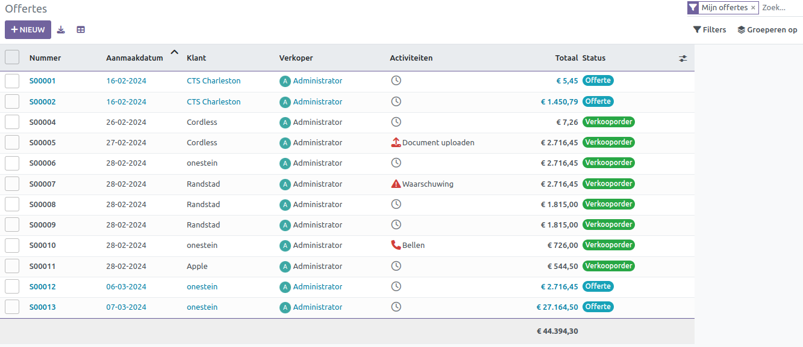

Hier kun je alle reeds aangemaakte offertes bekijken, inclusief details zoals aantal, aanmaakdatum, klant, verkoper, activiteiten, bedrijf, totaalbedrag en status. Naast de standaard lijstweergave heb je ook de mogelijkheid om de offertes te bekijken via kanban, draaitabel, kalender, grafiek en activiteiten. Je kunt filters toepassen op basis van *offertes, verkooporders, jouw eigen offertes* en *aanmaakdatum*. Bovendien kun je de offertes groeperen op verkoper, klant en orderdatum. Om een nieuwe offerte voor een klant aan te maken, klik je eenvoudigweg op de knop *Nieuw*.

.. image:: Verkoop-Media/002.png

Nadat je de klantnaam uit de lijst hebt geselecteerd, worden automatisch het factuuradres, het afleveradres, de prijslijst en de betalingsvoorwaarden weergegeven op basis van vooraf ingestelde gegevens. Als deze gegevens niet beschikbaar zijn, kun je het factuuradres en het afleveradres handmatig invoeren in de daarvoor bestemde velden. In Curq kun je verkoopordersjablonen maken via het configuratiemenu, die vervolgens kunnen worden gebruikt bij het opstellen van offertes. De vervaldatum van de offerte wordt automatisch gevuld en eventueel een geselecteerde prijslijst. Indien de prijslijst optie actief staat zal de standaard *Verkoopprijslijst* worden getoond. Betalingsvoorwaarden voor de klant kunnen worden gedefinieerd in het betreffende veld.

Je kunt de standaard geldigheidsduur van een offerte instellen in het instellingenmenu van de Verkoopmodule. Als dit is geconfigureerd, wordt het veld *Vervaldatum* automatisch ingevuld volgens de standaard geldigheidsduur van de offerte telkens wanneer je een nieuwe offerte maakt.

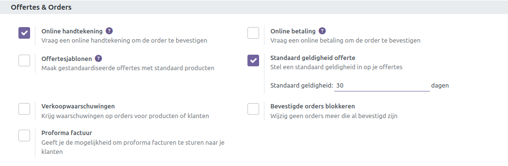

In de aangegeven ruimte kun je de standaard geldigheid instellen. Deze limiet wordt gebruikt om de vervaldatum van uw nieuwe offerte te berekenen.
Keer nu terug naar het offertecreatievenster. Je kunt de producten toevoegen op basis van de vereisten van de klant onder *Orderregel*. Gebruik de knop *Regel toevoegen* om de producten één voor één toe te voegen.

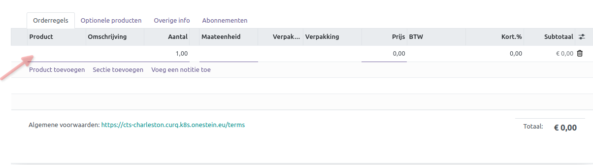

De details omvatten het product, de beschrijving, de hoeveelheid, de eenheid van maat (UoM), de verpakking, de eenheidsprijs, de belastingen, de korting en het subtotaal. Zodra je alle gewenste producten hebt toegevoegd, wordt de totaalprijs onder dit tabblad weergegeven. Hier heb je extra opties om couponcodes en promoties toe te voegen voor eventuele kortingen op je producten. Bovendien kun je in het daarvoor bestemde veld de algemene voorwaarden van de offerte specificeren.

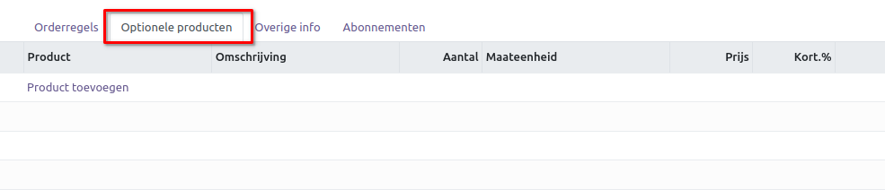

Als er een *Optioneel Product* wordt aangeboden aan de klant, kun je deze toevoegen op het tabblad **Optionele Producten** met de knop Regel toevoegen.

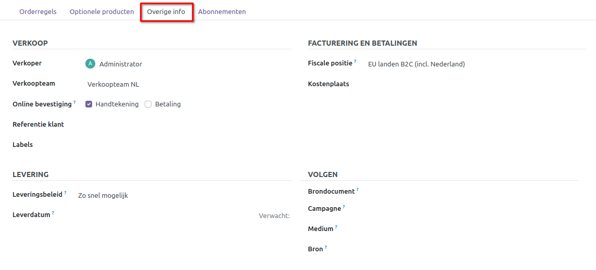

Op het tabblad **Overige info** kun je een verkoper en verkoopteam toewijzen om deze offerte te beheren. De bedrijfsnaam wordt automatisch ingevuld in het bijbehorende veld. Als je wilt zorgen voor online bevestiging, kun je de opties *Handtekening* en *Betaling* activeren, zodat de klant online kan betalen en de bestelling kan bevestigen door een online handtekening toe te voegen. Gebruik het veld *Labels* om passende tags toe te voegen.  

Voor de *Facturatie- en Betalingsgegevens* kun je de *Fiscale Positie* vermelden die zal worden gebruikt om belastingen en rekeningen aan te passen voor bepaalde klanten. Via tab *Levering* kun je het *Verzendbeleid* en *Leverdatum* opgeven. Om beter inzicht te krijgen waar de verkoopkansen vandaan komen kun je *Brondocument, Campagne, Medium* en *Bron* opgeven.

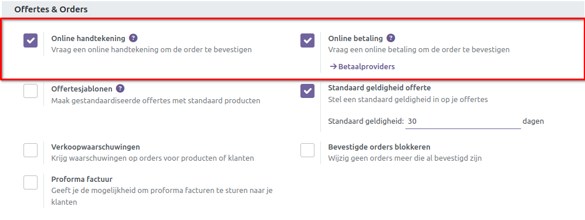

Om de functies voor **Online handtekening** en **Online betaling** op offertes te activeren, kun je de bijbehorende opties activeren in het menu **Instellingen** van de module. Door deze opties te activeren, kun je een online handtekening en betaling aanvragen om de bestellingen te bevestigen en te laten betalen.

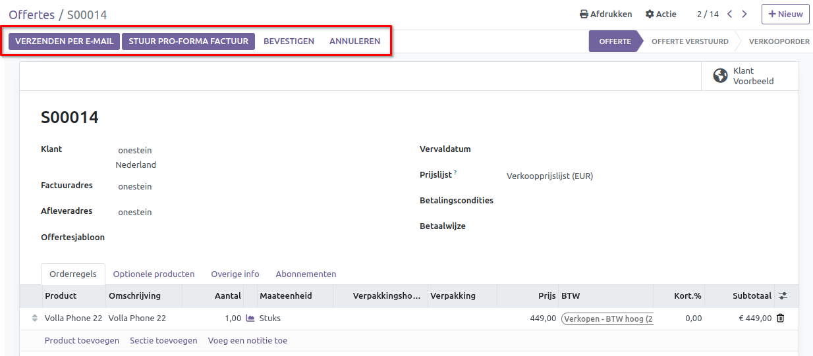

Nadat je een offerte hebt opgesteld, kun je deze naar de desbetreffende klant sturen door op de knop *Verzenden per e-mail* te klikken. Hiermee genereer je automatisch een e-mail met alle details van de offerte.

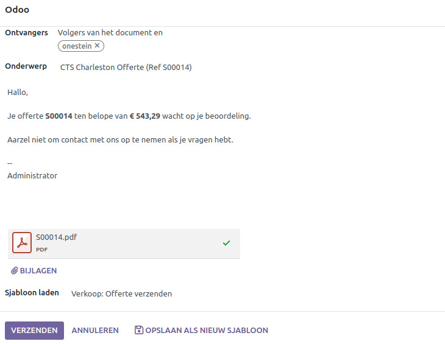

Nadat je de ontvangers hebt geselecteerd en het onderwerp hebt ingevuld, kun je op de knop "Verzenden" klikken. De offerte wordt dan als bijlage aan de e-mail toegevoegd. Zodra de offerte is verzonden, wordt de status automatisch gewijzigd naar "Offerte verzonden".

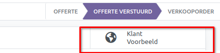

Het Klant Voorbeeld biedt een voorbeeldweergave van het klantenportaal, waar de klant de details van de offerte kan bekijken en kan bevestigen door middel van handtekening en eventueel betaling.

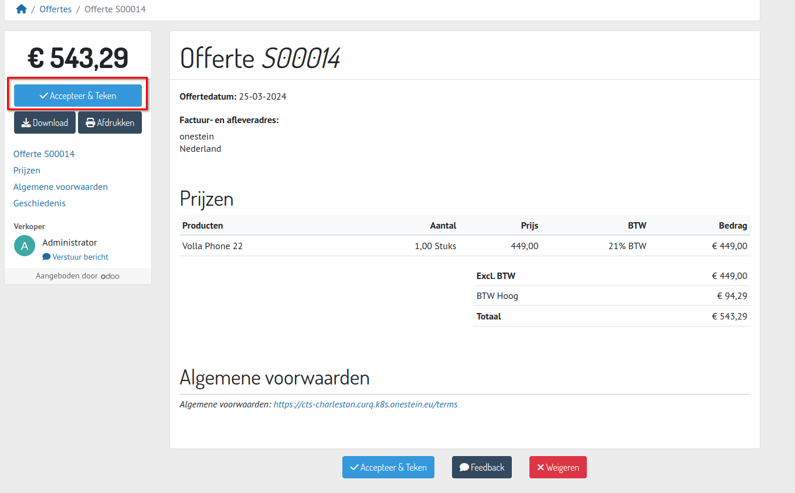

Indien de klant niet tevreden is met de offerte, kan hij de knop *Afwijzen* gebruiken. Om de offerte te bevestigen, kan de knop *Ondertekenen & Betalen* worden gebruikt. Wanneer de klant de offerte bevestigt, wordt deze automatisch omgezet in een verkooporder.

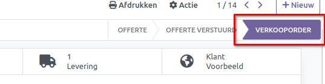

Orders
------

De offerte wordt omgezet in een verkooporder zodra de klant deze bevestigt. Via het klantenportaal op de website kan de klant de offerte ondertekenen en betalen.

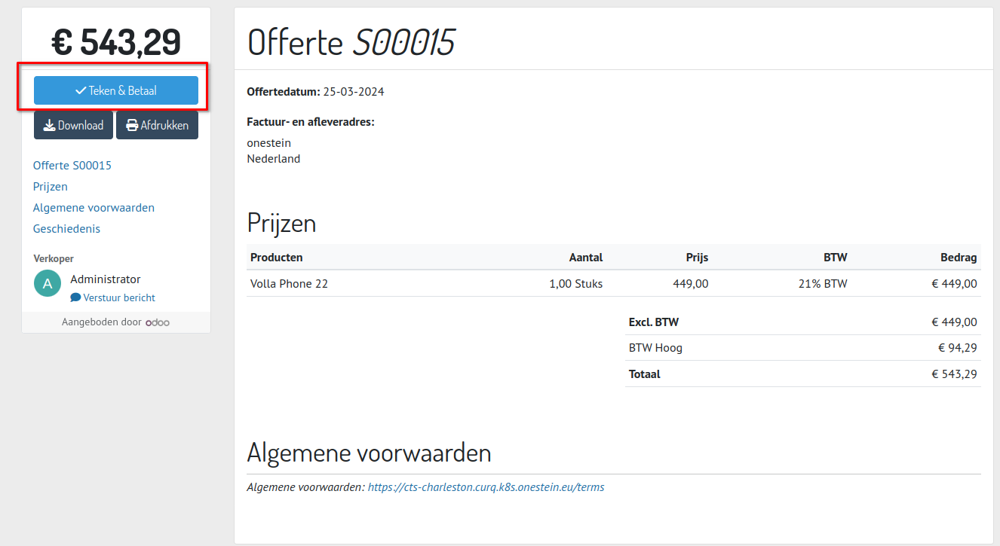

Wanneer de klant op de knop *Teken & Betaal* klikt, wordt een pop-upvenster weergegeven, zoals hieronder afgebeeld.

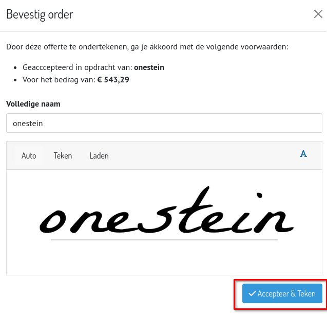

Hier kan de klant een handtekening toevoegen. Na het toevoegen van een handtekening wordt het betalingsvenster weergegeven.

.. image:: Verkoop-Media/015.png

Afhankelijk van het betalingsbeleid kan de klant de bestelling afrekenen. 

Facturatie
----------

Nadat je de verkooporder hebt bevestigd, is de volgende stap het genereren van facturen voor de orders. De knop voor het genereren van facturen verschijnt op het scherm zodra je de verkooporder hebt bevestigd. Let op! Indien je producten hebt die als voorraad product zijn ingesteld, dan moet de levering eerst worden afgerond voordat je de factuur kan maken.

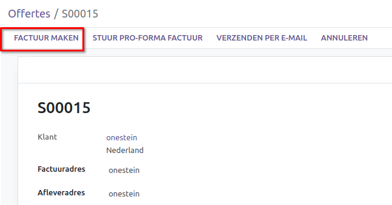

Wanneer je op de knop *Factuur maken* klikt, verschijnt er een pop-upvenster.

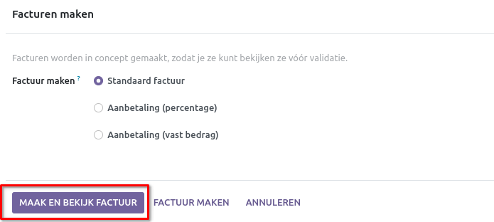

Hier kun je het type factuur selecteren, zoals een **gewone factuur, een aanbetaling (percentage)** of **een aanbetaling (vast bedrag)**. Nadat je het juiste type betaling hebt geselecteerd, klik je op de knop *Maak en bekijk factuur*. 

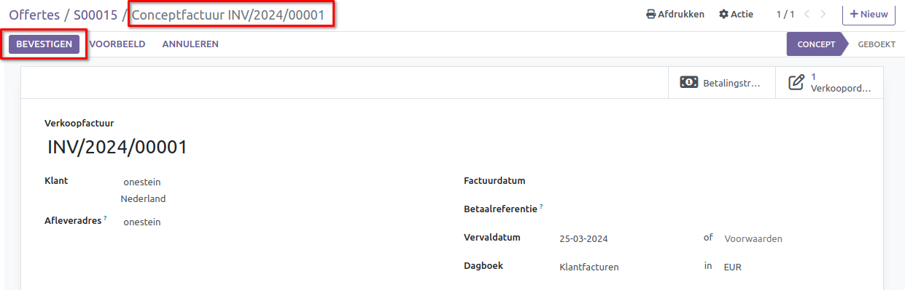

Vervolgens wordt een concept factuur weergegeven die je kunt bevestigen door op de knop *Bevestigen* te klikken.
Na het bevestigen van de factuur, krijg je de optie om de betaling te registreren.

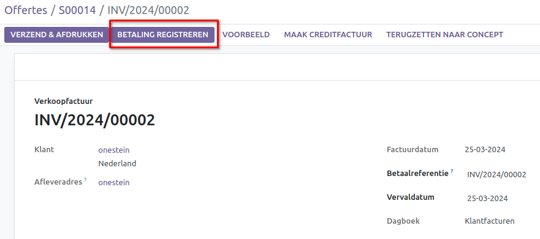

De *betaling registreren* optie hoeft enkel gebruikt te worden als er géén directe koppeling aanwezig is met je bank of indien er **geen** bankafschriften worden ingelezen. De afletter functie zorgt ervoor dat een factuur status *betaald* krijgt als de boekingen tegen elkaar zijn afgeletterd.   

