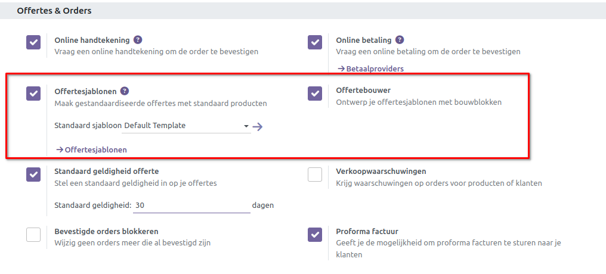
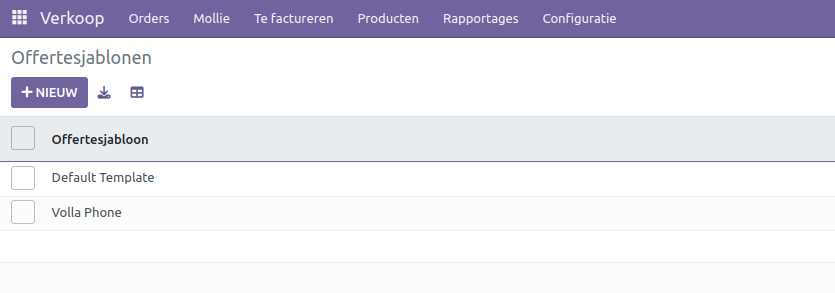
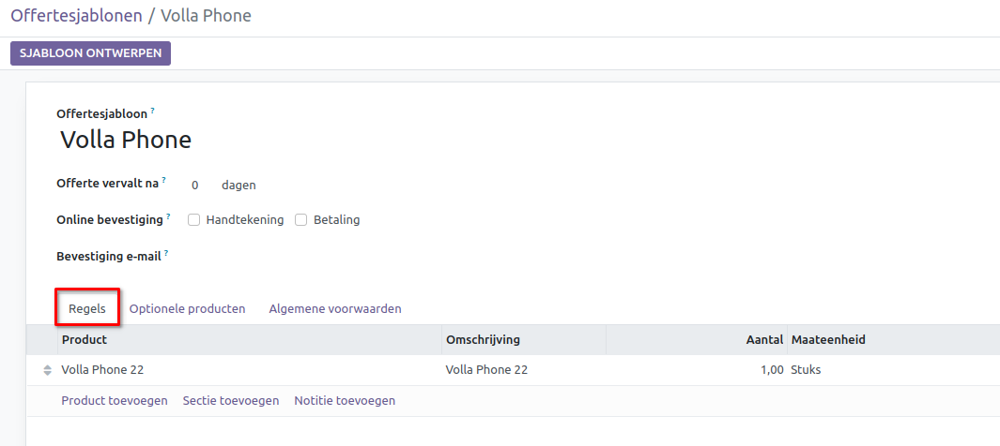
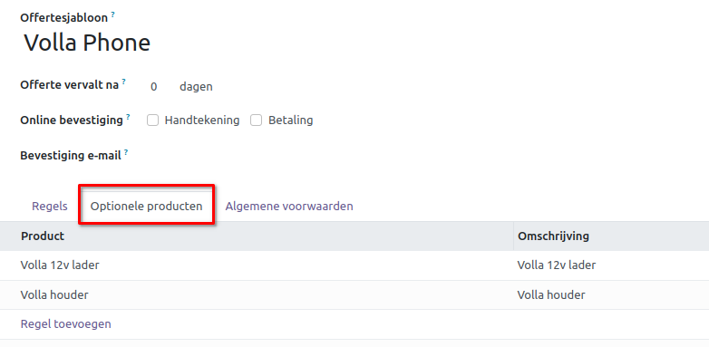
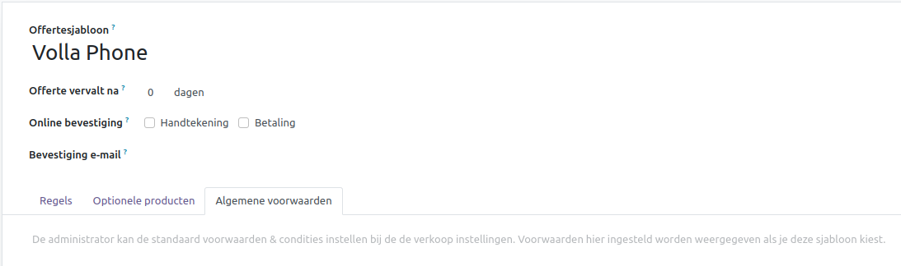
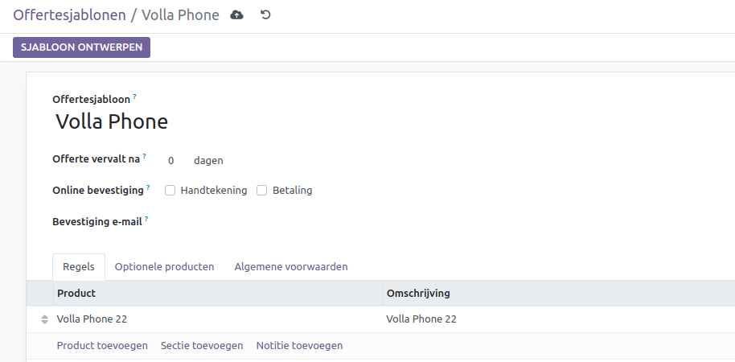
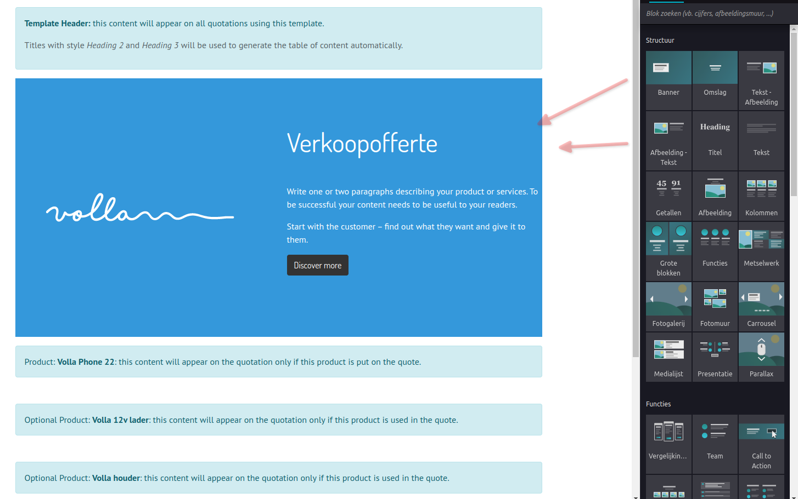
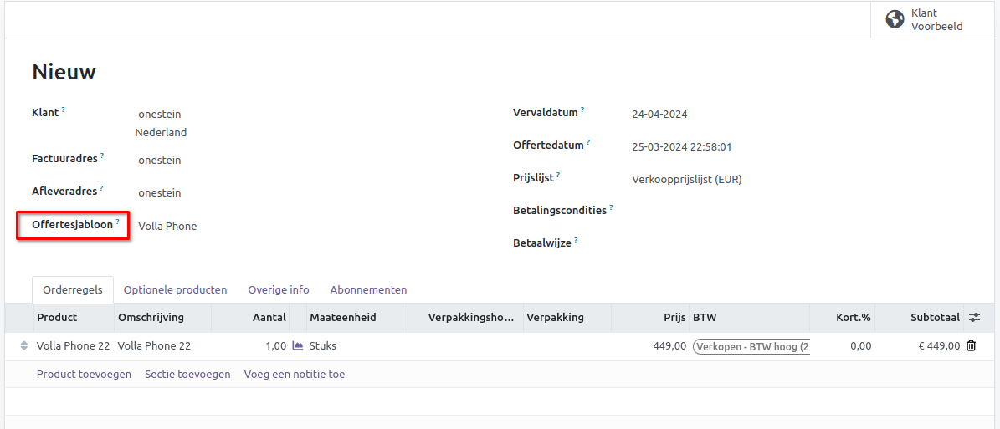
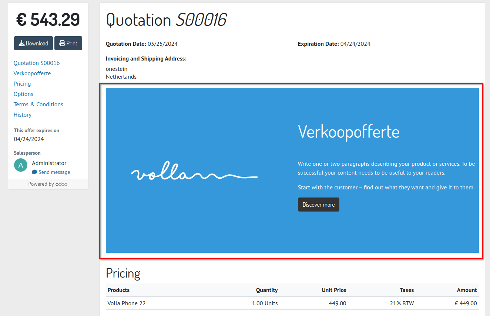

========================
Verkoop	Offertesjablonen
========================

Het creëren van vooraf gedefinieerde formats voor verkoopoffertes is handig voor het beheren van orders met een vergelijkbaar patroon. Door gebruik te maken van deze vooraf gedefinieerde sjablonen bij het aanmaken van nieuwe offertes, worden de handelingen vereenvoudigd. Om deze functie in Curq te activeren, ga je naar het menu Instellingen in verkoop en schakel je de functie *Offertesjablonen* in.

Bovendien kun je ook de optie "Offertebouwer" activeren, waarmee je offertesjablonen kunt ontwerpen met behulp van bouwstenen. Ga vervolgens naar het menu Configuratie en selecteer de knop *Offertesjablonen*.

Hier zie je de reeds geconfigureerde offertesjablonen. Klik op de knop *Nieuw* om een nieuw sjabloon te maken.

Geef de naam van het offertesjabloon op. Het aantal dagen voor de geldigheid van de offerte kan worden opgegeven in het veld *Offerte vervalt na*. Als je de klant wilt toestaan om de offerte te ondertekenen en de betaling online te voltooien, kun je de overeenkomstige opties activeren in het veld *Online bevestiging*. Stel een bevestigingsmail in om een bevestiging naar de betreffende klant te sturen. Op het tabblad *Regels* kun je de standaardproducten kiezen met "Omschrijving", "Hoeveelheid" en "Maateenheid". 

Geef op het tabblad *Optionele producten* de optionele producten voor de offerte op.

Op het tabblad *Algemene voorwaarden* kun je de standaard algemene voorwaarden voor de offerte instellen. Tijdens het aanmaken van een nieuw sjabloon, verschijnt de knop *Sjabloon ontwerpen* om de offertesjabloon te ontwerpen met behulp van verschillende bouwstenen.

Zodra je klikt op *Sjabloon ontwerpen* dan wordt een template geopend, waarbij je de vrijheid hebt om de verschillende blokken te slepen naar het sjabloon.

Bij het aanmaken van een offerte kun je kiezen voor het specifieke sjabloon, waarbij automatisch de velden van de producten en de andere tabs worden gevuld.

De blokken die in de sjabloon staan, worden netjes getoond als de offerte online wordt verzonden.

