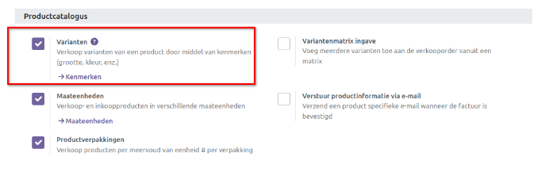
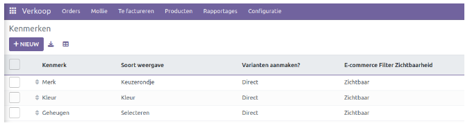
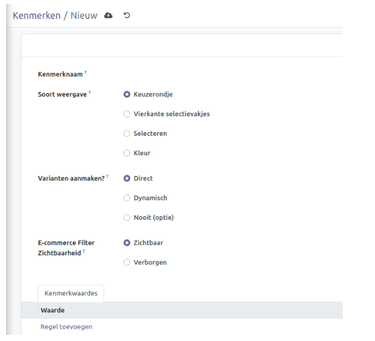
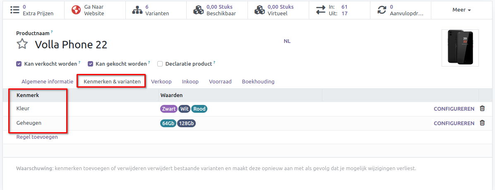
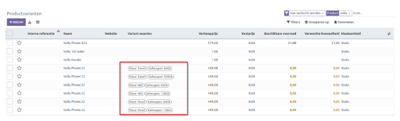

======================================
Verkoop - Productvarianten & kenmerken
======================================

Wanneer een product meerdere varianten heeft, kun je deze gemakkelijk configureren met behulp van de optie *Productvarianten* in de Verkoopmodule. Om van deze functie gebruik te kunnen maken, dien je de optie *Varianten* te activeren in het menu **Instellingen** van de module, zoals weergegeven in de onderstaande afbeelding.

Door deze functie te activeren, krijg je toegang tot een nieuwe optie onder het menu *Producten: Productvarianten*. Hiermee kun je producten verkopen met verschillende kenmerken. 

Om de kenmerken van een productvariant te definiëren, kun je naar het menu *Configuratie* van de module gaan. Hier vind je de optie *Kenmerken*. Wanneer je op deze optie klikt, kom je op een nieuw scherm zoals hieronder weergegeven, waar je een lijst ziet met **Kenmerk, Soort weergave, Variant aanmaken** en **E-commerce Filter Zichtbaarheid**.

Klik op *Nieuw* om een nieuw kenmerk aan te maken.

Geef de kenmerk een naam en selecteer het weergavetype dat wordt gebruikt in de productconfigurator van eCommerce. Dit kan een **keuzerondje, vierkant selectievakje, selecteer** of **kleur** zijn. 
Op de manier hoe de varianten worden aangemaakt heb je 3 opties:

- **Onmiddellijk**: Alle mogelijke varianten worden aangemaakt zodra het kenmerk en de bijbehorende waarden worden toegevoegd aan een product.

- **Dynamisch**: Elke variant wordt alleen gemaakt wanneer de bijbehorende kenmerken en waarden worden toegevoegd aan een verkooporder. *Tip! Gebruik deze optie als je producten hanteert met veel verschillende kenmerken en daardoor vele varianten worden aangemaakt (+1000)*.

- **Nooit**: Er worden nooit varianten gemaakt voor het kenmerk.

De modus voor het maken van varianten kan niet worden gewijzigd zodra het kenmerk wordt gebruikt in ten minste één product. In het veld *Zichtbaarheid eCommerce filter* kun je beslissen of je het kenmerk zichtbaar wilt maken of wilt verbergen voor de beschikbare filters op eCommerce. Onder *Kenmerkwaardes* kun je waarden toevoegen met de knop *Regel toevoegen*. Producten met dit kenmerk kunnen worden bekeken met de slimme knop *Gerelateerde producten* in de formulierweergave.

Configuratie
------------

Via de productkaart kunnen kenmerken worden toegevoegd aan het product. Indien er een prijsverschil moet worden ingesteld, dan kun je naar *configureren*. Per kenmerk kan een extra prijsstijging worden ingesteld in veld *Waarde extra prijs*.

Zodra de kenmerken zijn toegevoegd op de producten dan kun je een overzicht ophalen van alle aangemaakte *Productvarianten*. In dit overzicht staan alle producten, dus ook de producten zonder kenmerk.
Het voorbeeld van de lijst bevat de **Interne referentie, Naam, Website, Variant Waarden, Verkoopprijs, Kosten, Hoeveelheid in voorraad, Verwachte hoeveelheid** en **Maateenheid**. 

