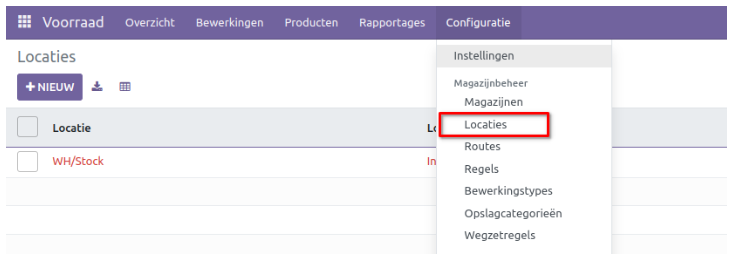
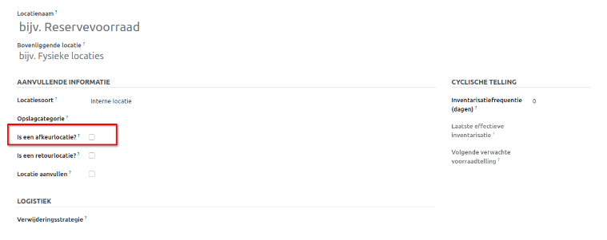
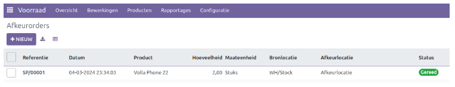
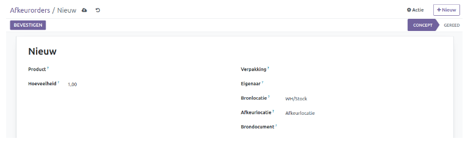
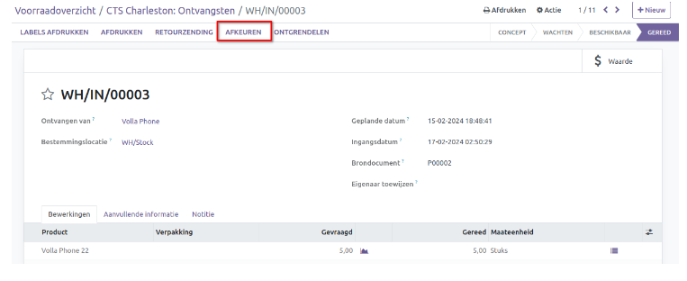

============
Afkeurorders
============

Elk bedrijf dat voorraadbeheer voert heeft te maken met afkeur producten en wat eigenlijk afval is met weinig tot geen economische waarde. Wanneer u een product afkeurt,  wordt het uit de voorraad van het bedrijf verwijderd. Het is van essentieel belang om beschadigde of verlopen producten zo snel mogelijk uit de voorraad te verwijderen. U kunt de afkeur voorraad opslaan in een speciale afkeurlocatie binnen de opslaglocatie van Odoo.
De speciale afkeur locatie kan worden ingesteld in het menu Locaties van de Voorraadmodule.

Klik op 'Nieuw' om een nieuwe locatie aan te maken.

Vermeld de naam van de locatie als bijv. 'Afkeurlocatie' in het daarvoor bestemde veld. U kunt dezelfde stappen volgen zoals eerder vermeld in de handleiding Voorraadbeheer (locaties). 
Activeer vervolgens het veld "Is een afkeurlocatie" om deze locatie als afkeurlocatie te markeren. Laten we nu bekijken hoe u producten in Odoo toevoegt aan de afkeurlocatie. Klik op 'Afkeuren' onder het menu 'Bewerkingen'. Hierdoor wordt het venster 'Afkeurorders' geopend, zoals hieronder weergegeven.

Klik op 'Nieuw' om een nieuwe afkeurorder aan te maken

Selecteer het product en definieer vervolgens de velden zoals 'Hoeveelheid', 'Verpakking', 'Bronlocatie" en eventueel een 'Brondocument'. Klik na het toevoegen van deze informatie op 'Bevestigen'.

Odoo ondersteunt u ook bij het maken van uitvalorders voor verschillende voorraadbewerkingen, zoals interne transfers, ontvangsten, enzovoort. Hieronder ziet u een model van een gevalideerde ontvangst.

