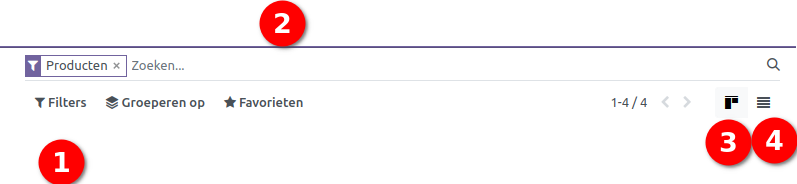
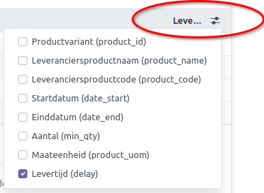

====================================================================
Product configuratie
====================================================================

Een doordachte productconfiguratie is van cruciaal belang voor een
naadloze werking van diverse Curq modules, waaronder Inkoop, Voorraad,
Verkoop, E-commerce en Verhuur. Met Curq kun je producten gestructureerd
categoriseren, waardoor het gemakkelijker wordt om specifieke producten
te identificeren en aan te passen. In deze handleiding nemen we de
mogelijke opties met je door.

Toegang tot producten
====================================================================

Er zijn twee beste opties om toegang te krijgen tot je producten:

1. Via de Verkoop app > **Verkoop - Producten - Producten**

2. Via de Voorraad app > **Voorraad - Producten - Producten**

In dit voorbeeld maak ik gebruik van toegang via de Voorraad app. Als je
deze procedure volgt, krijg je een overzicht te zien van enkele
'standaard' geïnstalleerde producten.

.. image:: Product-Configuratie-Media/image2.png
   :width: 6.26806in
   :height: 1.18056in

Rechtsboven (foto onder)vind je de zoekbalk:

1. **Filter optie:** hiermee kun je een aantal voorgeselecteerde filters
      kiezen zoals 'kan verkocht worden', beschikbaar, product of
      dienst, enz. Tevens is het mogelijk om een aangepaste filter toe
      te voegen.

2. **Zoekbalk:** de zoekbalk maakt het makkelijk om een product
      rechtstreeks op te zoeken. Andere opties zijn productcategorie,
      kenmerken, locatie of magazijn.

3. **Kanban view:** hiermee krijg je producten te zien als pictogram
      overzicht

4. **List view:** hiermee krijg je de producten in lijst overzicht te
      zien.

Productblad
====================================================================

We gaan een nieuw product aanmaken en klikken op **NIEUW +**

Het productblad wordt geopend en heb een smartphone als voorbeeld
genomen.

Tab Algemene informatie
---------------------------------------------------------------------------------------------------

| **Productsoort:**
| Er zijn 3 verschillende opties >

-  Verbruiksartikel > een product waar geen voorraad van wordt
      bijgehouden

-  Dienst > is een immaterieel product (niet tastbaar)

-  Voorraad Product > een product waarvan je de voorraad beheerd

**Facturatiebeleid:**

Je hebt de keuze tussen 'bestelde' en 'geleverde' hoeveelheden. Wanneer
je voor 'geleverd' kiest, is het pas mogelijk om de factuur aan te maken
nadat de pakbon volledig of gedeeltelijk is afgehandeld.

**Maateenheid & inkoopmaateenheid:**

Staat standaard op stuks. Meerdere categorieën zijn beschikbaar zoals
lengte, volume, werktijd, enz.
De maateenheid van een product kan anders zijn dan de inkoopmaateenheid. Voorbeeld: ik kan een kabel verkopen van 50cm en deze inkopen per 10m.

**Verkoopprijs & Verkoop BTW:**

De verkoopprijs wordt excl. BTW ingevuld, de BTW label heeft standaard
keuzes uit 0%, 9%, 21% en export BTW (onderverdeeld in goederen en diensten).

**Kostprijs:**

Dit veld wordt gebruikt om de voorraad te waarderen en om marges op
verkooporders te berekenen. De voorraadwaardering stel je in op
productcategorie. Bij gemiddelde kostprijs en FIFO wordt de kostprijs automatisch berekend.

.. image:: Product-Configuratie-Media/image4.png
   :width: 6.05764in
   :height: 3.46111in

**Productcategorie:**

De lijst met productcategorieën is te vinden in de Voorraad app onder
**'Configuratie' > 'Productcategorieën'.** Dit is een essentiële
instelling die je vooraf kan configureren om snel groepen producten te
selecteren en optimaal gebruik te maken van rapportagemogelijkheden.

In productcategorieën kun je de volgende settings instellen:

**Hoofdcategorie:** dit gebruik je als je een hoofd- en subcategorie
wilt instellen.

**Forceer verwijderingsstrategie:** De verwijderingsstrategie wordt
gebruikt om te bepalen hoe en wanneer producten uit de voorraad moeten
worden verwijderd of afgeschreven. Het heeft betrekking op het proces
van het elimineren van verouderde, beschadigde, onverkoopbare of
overtollige voorraad.

| **Kostprijsbepaling:** dit is de setting om je voorraad te waarderen
  en is een belangrijk aspect van de boekhouding en financieel beheer
  voor bedrijven die fysieke producten kopen, verkopen en opslaan. Het
  heeft meerdere doelen, waaronder winstbepaling en balanswaardering. Je
  hebt keuze uit 3 verschillende settings:
| 1. **Kostprijs:** dit is de vaste verrekenprijs van een artikel en
  moet handmatig worden aangepast indien de inkoopprijs en/of
  inkoopkosten veranderen van dit product.

2 . **First in / First out (FIFO):** producten die het bedrijf als
eerste binnenkomen, verlaten ook als eerste. De kostprijs wordt
automatisch berekend vanaf het moment van leveren van het product.

3. **Gemiddelde kostprijs (AVCO):** de kostprijs wordt berekend dmv een
gewogen gemiddelde waarde van het product.

**Voorraadwaardering:** hierbij de keuze om de voorraadberekening
(boekingen) handmatig uit te voeren of geautomatiseerd.

.. image:: Product-Configuratie-Media/image5.png
   :width: 7.08194in
   :height: 2.34097in

**Interne referentie / barcode**

De interne referentie wordt toegekend aan producten als een intern
artikelnummer. De barcode wordt daarentegen gebruikt voor de EAN-code
van een product. De barcode wordt weergegeven op verzamellijsten en
pakbonnen.

**Productlabels**

Dit is een handige tool waarmee je producten van extra kenmerken
kunt voorzien. Bij het zoeken naar producten kun je indien nodig
filteren op basis van deze kenmerken.

Tab Kenmerken en varianten
---------------------------------------------------------------------------------------------------

.. image:: Product-Configuratie-Media/image6.png
   :width: 6.26806in
   :height: 2.48611in

Via tab Kenmerken en varianten kun je kenmerken instellen voor een
product als deze in verschillende opties verkrijgbaar zijn. Kenmerk en
waarde kun je zelf aanmaken via **Voorraad - configuratie - kenmerken.**
Aan de hand van het aantal waarden maakt Curq automatisch de
verschillende varianten aan (zie 6 Varianten). Via 'configureren' in de
regel kun je prijsverschillen instellen per waarde die is opgegeven.

Tip! *Als je voor een product meerdere kenmerken en waarden instelt, wat
resulteert in 1500 of meer varianten, overweeg dan om 'Dynamisch' te
selecteren in de instellingen. Op deze manier worden varianten pas
aangemaakt wanneer ze daadwerkelijk worden verkocht, wat geen invloed
heeft op de database prestaties.
*

.. image:: Product-Configuratie-Media/image7.png
   :width: 4.39028in
   :height: 2.77222in

Tab Verkoop
---------------------------------------------------------------------------------------------------

.. image:: Product-Configuratie-Media/image8.png
   :width: 6.26806in
   :height: 4.40278in

| In het gedeelte Upsell & Cross-Sell zijn drie velden beschikbaar:
  **Optionele producten, Aanvullende producten en Alternatieve
  producten**.
| **'Optionele producten'** verschijnen op het scherm wanneer de klant
  op 'Toevoegen aan winkelwagen' klikt. Het systeem stelt **'Aanvullende
  Producten'** voor wanneer de klant de winkelwagen bekijkt voordat hij
  betaalt, terwijl **'Alternatieve Producten'** op de productpagina
  verschijnen om alternatieven te verkopen.

| In het gedeelte voor de E-Commerce winkel kun je alle instellingen
  configureren die betrekking hebben op de online winkel. Hier kun je
  specifieke categorieën definiëren, aangeven of een product mag worden
  verkocht wanneer de voorraad op nul staat, en beslissen of de voorraad
  wel of niet wordt weergegeven.
| Bij 'niet op voorraad' kan een specifiek bericht worden weergegeven en
  met een lint gebruik maken om producten extra aandacht te geven. Denk
  aan 'Nieuw', 'Uitverkocht' of een ander label die je zelf kunt
  aanmaken.
| Extra afbeeldingen zijn toe te voegen via **'Extra product media'** en
  er is ruimte om een verkoopomschrijving op te stellen dat zichtbaar is
  op een offerte/order en facturen.

Tab Inkoop
---------------------------------------------------------------------------------------------------

.. image:: Product-Configuratie-Media/image9.png
   :width: 6.26806in
   :height: 3.29167in

In dit overzicht kun je één of meerdere leveranciers koppelen met de
bijbehorende inkoopprijzen en levertijden. Via de filterknop zijn
meerdere 'standaard' velden zichtbaar te maken (zie onder).

Met **Inkoop BTW** kun je de standaard belastingtarieven instellen die
van toepassing zijn bij de aankoop van het product. Onder
**Controlebeleid** kun je kiezen of je de inkoopfactuur wilt baseren op de
bestelde hoeveelheden of de ontvangen hoeveelheden. Daarnaast kun je
notities toevoegen aan inkooporders met behulp van de **'Inkoop
Beschrijving'.** Deze functies helpen bij het beheren van
inkoopgerelateerde aspecten en het vastleggen van belangrijke informatie
voor het inkoopproces.

Tab Voorraad
---------------------------------------------------------------------------------------------------

.. image:: Product-Configuratie-Media/image11.png
   :width: 6.26806in
   :height: 3.75in

| Op basis van de geïnstalleerde modules is het mogelijk om met
  **'Routes'** het traject van het product vast te stellen, zoals of het
  wordt aangekocht, vervaardigd, op bestelling gemaakt, enzovoort.
  Meerdere routes zijn te activeren via **Voorraad - configuratie -
  Routes met meerdere stappen.**
| Zodra dit gereed is verschijnt 'Routes' in het menu.
| *Tip! Via filters - gearchiveerd kun je 2 andere routes activeren. MTO
  (Make to order) kun je gebruiken als voor elke verkooporder
  automatisch een inkooporder moet worden aangemaakt.*
| Binnen de **Logistiek** sectie kun je **'Verantwoordelijke'** veld
  invullen, dat aanduidt wie de verantwoordelijkheid draagt voor de
  verdere logistieke handelingen met betrekking tot het product. Indien
  het product is zonder varianten, dan heb je de optie om het gewicht en
  het volume van het product te vullen. Anders dien je dat te doen op
  variant niveau.
| Via de **'Traceerbaarheid'** optie kun je producten (+ varianten)
  koppelen aan een serienummer of een Lotnummer (partijen).
| Definieer de specificaties van zowel de **'productielocatie'** als de
  **'voorraadlocatie'**, die in plaats van de gebruikelijke locaties
  zullen fungeren als bronlocatie voor voorraad verplaatsingen die
  voortkomen uit respectievelijk productieorders en inventarisatie
  operaties.

Tab Boekhouding
---------------------------------------------------------------------------------------------------

.. image:: Product-Configuratie-Media/image12.png
   :width: 6.26806in
   :height: 2.31944in

Deze setting wordt vaak leeg gelaten. Advies is om de omzet- en
kostenrekening in te stellen op de productcategorie.

Slimme Knoppen
====================================================================

Met de slimme knoppen aan de bovenkant van het productblad heb je direct
inzicht in overige productinformatie:

.. image:: Product-Configuratie-Media/image13.png
   :width: 6.26806in
   :height: 2.125in

-  **Extra prijzen** > inzicht of het product op meerdere prijslijsten
      staat en voor welke prijs

-  **Ga naar website** > hiermee kun je het product online (groen) of
      offline (rood) zetten

-  **Varianten** > aantal varianten van het product

-  **Beschikbaar** > de aantallen die 'direct' beschikbaar zijn

-  **Virtueel** > de aantallen die beschikbaar zijn cumulatief berekend
      met openstaande verkoop- en inkooporders

-  **In / uit:** Dit menu biedt volledige traceerbaarheid van alle
      voorraad gerelateerde handelingen met betrekking tot een specifiek
      product.

-  **Aanvulopdrachten:** met deze setting kun je de min/max instellen
      voor het product. Inkooporders worden automatisch aangemaakt zodra
      de aantallen onder de 'min' komt.

-  **Wegzetregels:** kan ingesteld worden als producten worden
      binnengeboekt en op een specifieke locatie moet worden gezet.

-  Aantal stuks 'verkocht' en 'in gekocht' geeft direct inzicht van de
      laatste 365 dagen.

