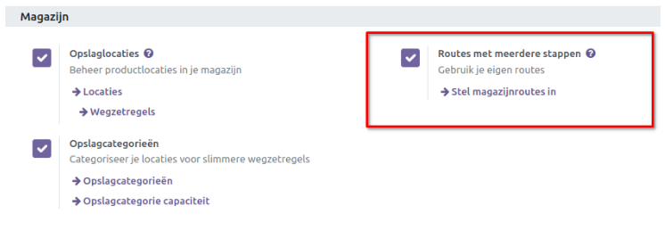
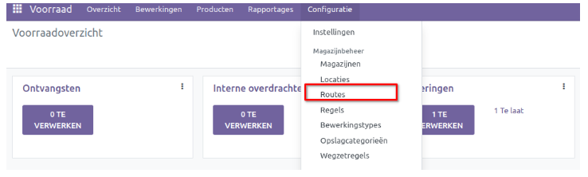
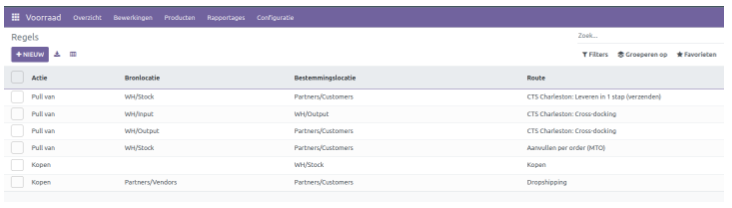
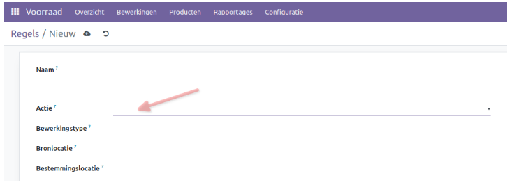
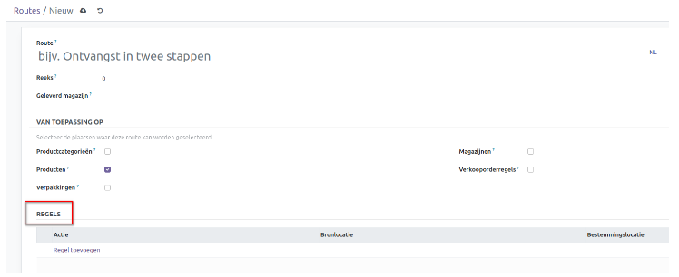
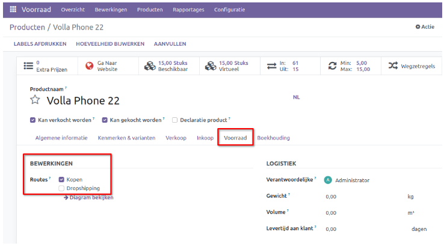
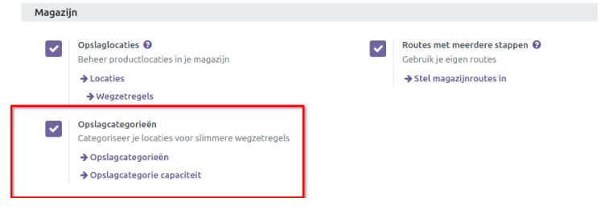
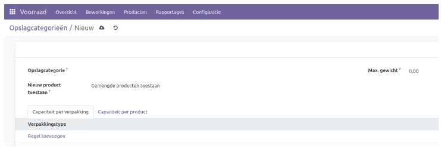
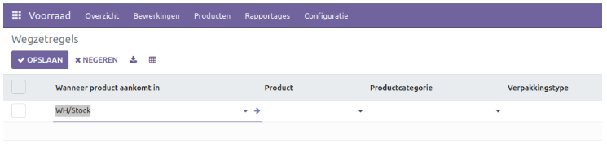
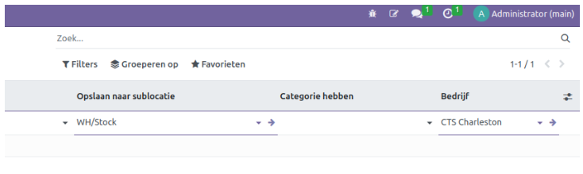

===========================
Routes met meerdere stappen
===========================

Om een nauwkeurige traceerbaarheid van product bewegingen te garanderen, is het van essentieel belang om routes te definiëren. Deze routes bepalen de paden van de operaties die betrokken zijn bij elke voorraadbeweging binnen een bedrijf. 

Voor het instellen van *Routes* ga je naar het menu **Instellingen** en activeer je de optie *Routes in meerdere stappen* op het tabblad **Magazijn**. Het is van cruciaal belang om passende werklocaties en magazijnen te configureren voordat je routes instelt. 

Zodra je deze functie hebt geactiveerd, zal de optie *Routes* beschikbaar zijn onder het menu *Configuratie*. Voordat we nieuwe routes aanmaken, is het raadzaam om nieuwe *Regels* te definiëren voor de routes en product verplaatsingen. 	

Een *Regel* aanmaken
--------------------
In het menu Configuratie kun je de optie *Regels* selecteren onder het tabblad Magazijnbeheer. Hierdoor opent zich een nieuw venster waarin je de vooraf geconfigureerde lijst met verschillende regels in de voorraadmodule kunt bekijken.

De voorvertoning van de lijst toont de details van de**Actie, Bronlocatie, Bestemmingslocatie** en **Route per regel**. Je kunt de standaard- en aanpasbare *Filters* en *Group By* opties gebruiken om het zoeken te vereenvoudigen. Klik op de knop *Nieuw* om een nieuwe *Regel* aan te maken. 

Geef een passende titel voor de nieuwe regel in het veld *Naam*. Je kunt de actie voor deze specifieke regel definiëren in de daarvoor bestemde ruimte. Selecteer een geschikte *actie* uit de dropdown.  

De beschikbare opties zijn:

**Pull van**: Deze actie wordt ingesteld wanneer producten nodig zijn op de bestemmingslocatie, of het nu gaat om een verkooporder of een productieorder. Wanneer er vraag is naar een product op de bestemmingslocatie, genereert Curq een pick bewerking vanaf de bronlocatie om aan deze vraag te voldoen.

**Push naar**: Met deze regel kun je producten van de bronlocatie naar een andere locatie verplaatsen. Zodra de producten op de bronlocatie arriveren, kun je met deze actie naar een andere locatie verplaatsen. In dit geval genereert Curq een pick operatie om de producten naar de bestemmingslocatie te sturen.

**Push & Pull**: Deze actie kan in beide scenario's worden gebruikt. Wanneer er producten nodig zijn op de bestemmingslocatie, wordt er een orderpicking gegenereerd vanaf de bronlocatie om aan deze behoefte te voldoen. Dit vereist productvereisten op de bronlocatie. Zodra de bronlocatie aan deze vereisten voldoet, worden de producten naar de bestemmingslocatie geduwd om aan de behoeften van deze locatie te voldoen.

**Kopen**: Als er producten nodig zijn op de bestemmingslocatie, genereert Curq met behulp van deze actie een offerteaanvraag om het product te kopen en zo aan de behoefte te voldoen.

Routes configureren
-------------------

Om nieuwe routes voor voorraad bewegingen aan te maken, ga je naar het menu *Configuratie* en selecteer je de optie *Routes*. Hier vind je een lijst met reeds aangemaakte routes in de voorraadmodule.

Gebruik de knop *Nieuw* om een nieuwe route aan te maken.

Vul de naam van de voorraadroute in het veld *Route* in. Selecteer vervolgens in het veld *Van toepassing op* de plaatsen waar je deze route wilt gebruiken. Dit kunnen **Producten, Productcategorieën, Verpakkingen, Magazijnen** of **Verkooporderregels** zijn. Op het tabblad *Regels* kun je de regels specificeren voor deze specifieke route.
Je kunt ook de operationele route definiëren op het productformulier. Hierbij heb je de optie *Routes* onder het tabblad **Voorraad**, waarmee je de operationele routes voor dat specifieke product kunt specificeren.

Opslag Categorieën
------------------
De functie *Opslag Categorieën* biedt de meest efficiënte manier om opslaglocaties te beheren in de voorraadmodule, wat de soepele werking van *Wegzetregels* bevordert. De werking van *Wegzetregels* zal verder worden toegelicht in de volgende sectie.

Om deze functie te activeren, ga je naar het menu **Instellingen** en vink je de optie *Opslag Categorieën* aan onder *Magazijn*.

Klik op de knop *Nieuw* om een nieuwe opslagcategorie toe te voegen. Geef het nieuwe record een naam in het veld *Opslagcategorie*. Kies vervolgens een van de drie opties:

- Als de locatie leeg is
- Als alle producten hetzelfde zijn
- Gemengde producten toestaan, om aan te geven onder welke omstandigheden je een nieuw product wilt toestaan.

Onder *Capaciteit per verpakking* kun je attributen zoals het type verpakking en de hoeveelheid definiëren.

Onder *Capaciteit per product* kun je een product, de hoeveelheid en de maatteenheid specificeren.

Wegzetregels
------------

Wegzetregels zijn essentieel voor het correct opslaan van voorraden binnen een bedrijf. Door gebruik te maken van Wegzetregels kun je producten 'automatisch' verplaatsen van ontvangstlocaties naar de meest geschikte plaatsen in het magazijn zelf.

Om toegang te krijgen tot deze functie, ga je naar *Configuratie → Wegzetregels*.

In dit venster zie je een lijst met wegzetregels die eventueel zijn aangemaakt. 
Bij het aanmaken kun je de volgende velden vullen:

- Wanneer een product aankomt in
- Product
- Productcategorie
- Verpakkingstype 

- Opslaan naar sublocatie
- Categorie hebben
- Bedrijf 

Het systeem verplaatst het product naar de locatie die is aangegeven in *Opslaan naar sublocatie* zodra het de locatie bereikt die is opgegeven in het veld *Wanneer product aankomt in*. 

