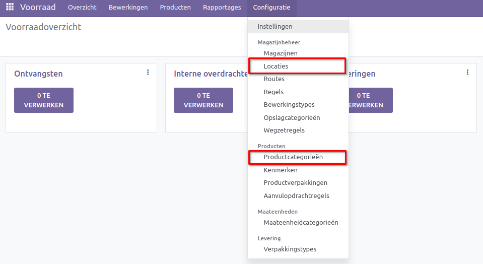
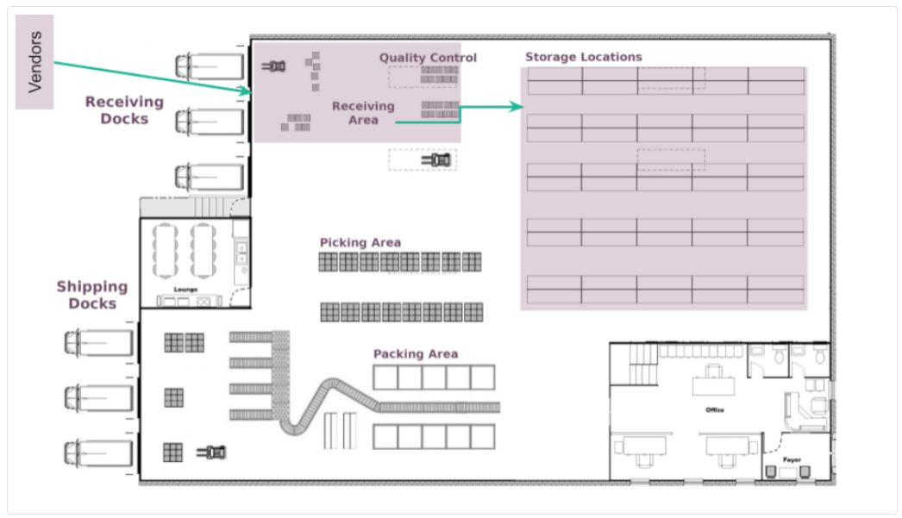
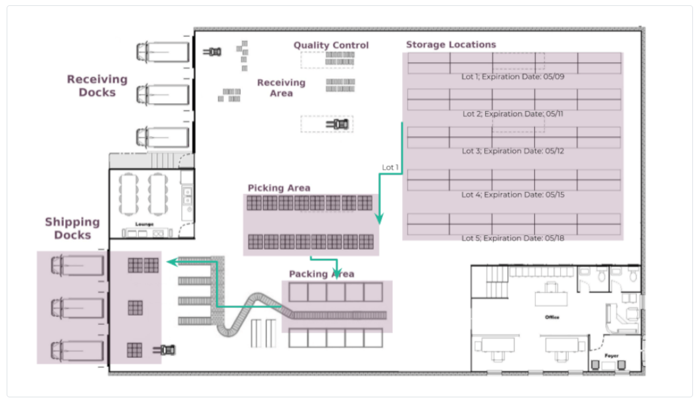
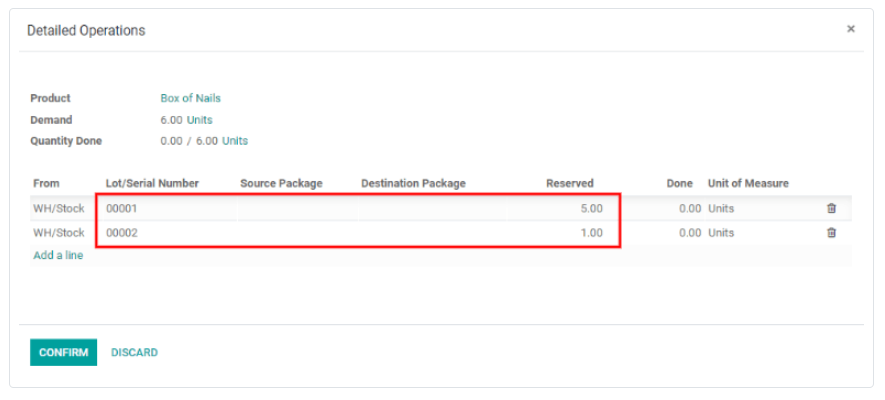
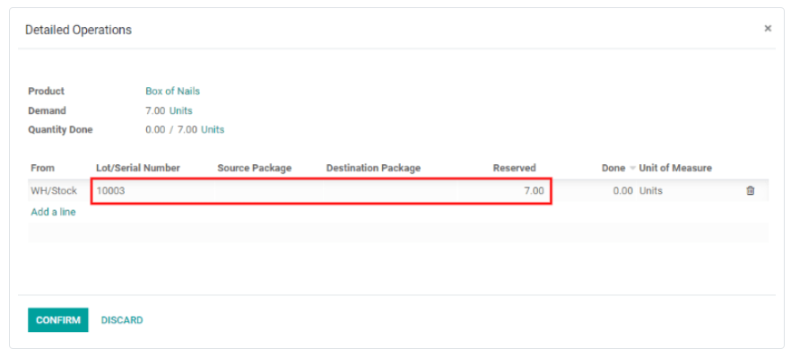
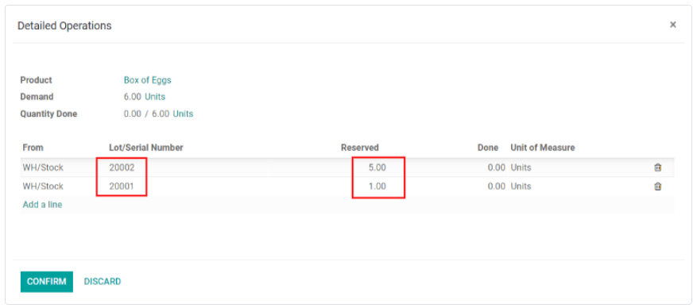
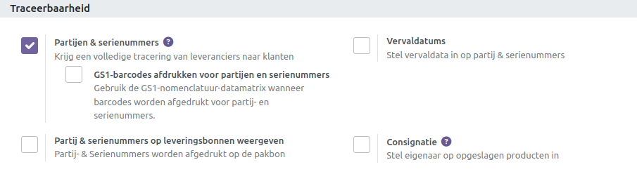
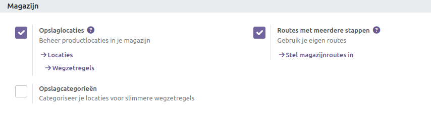
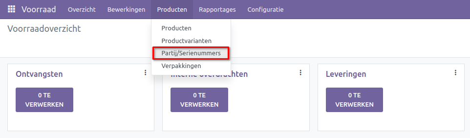

===========================================
Verwijderingsstrategieën (FIFO, LIFO, FEFO)
===========================================

Voor bedrijven met magazijnen bepalen verwijderingsstrategieën welke producten uit het magazijn worden genomen en wanneer. Verwijderingsstrategieën worden meestal gedefinieerd voor specifieke pickoperaties. Dit helpt bedrijven bij het selecteren van de beste producten, optimaliseren van de afstand die werknemers moeten afleggen bij het verzamelen van items voor bestellingen, en rekening houden met kwaliteitscontrole, zoals het verplaatsen van producten met vervaldatums.

Gewoonlijk worden verwijderingsstrategieën gedefinieerd in pickoperaties om de beste producten te selecteren om de afstand voor de werknemer te optimaliseren, voor kwaliteitscontrole doeleinden, of om eerst de producten met de dichtstbijzijnde vervaldatum te verplaatsen.

Wanneer een product moet worden verplaatst, vindt Curq beschikbare producten die aan de transfer kunnen worden toegewezen. De manier waarop Curq deze producten toewijst, is afhankelijk van de verwijderingsstrategie die is gedefinieerd in ofwel de **Productcategorie** of de **Locatie**. 

Om de verwijderingsstrategie te wijzigen, ga naar Configuratie -> Locaties of Productcategorieën. Klik op een Locatie of Productcategorie en klik vervolgens op Bewerken. Wijzig de verplichte verwijderingsstrategie van de productcategorie of de verwijderingsstrategie van de locatie door op het vervolgkeuzemenu te klikken en de gewenste verwijderingsstrategie te selecteren. Nadat de nieuwe verwijderingsstrategie is geselecteerd, klik op Opslaan.

Wat gebeurt er binnen in het magazijn?
--------------------------------------

De meeste magazijnen delen dezelfde belangrijke gebieden: ontvangst- en sorteerplatforms, opslaglocaties, pick- en verpakkingsgebieden, en verzend- en laadplatforms. Hoewel alle producten die het magazijn binnenkomen of verlaten op enig moment door elk van deze locaties kunnen gaan, kunnen verwijderingsstrategieën van invloed zijn op welke producten worden genomen, van waar en wanneer.

In het onderstaande voorbeeld lossen leveranciersvrachtwagens pallets met goederen bij de ontvangstplatforms. Vervolgens scannen operators de producten op het ontvangstgebied, met de ontvangst- en vervaldatum. Daarna worden de producten opgeslagen op hun respectieve opslaglocaties.

In Curq kun je producten ontvangen door naar de Voorraad Dashboard te gaan en in de kanban-weergave te klikken op ofwel de kop 'Ontvangsten' of de knop '# TE VERWERKEN'. Op het dashboard 'Ontvangsten' zoek je en klik je op de individuele ontvangst, wat het formulier voor het ontvangen van de goederen opent. Klik op Bewerken en voer vervolgens de ontvangen hoeveelheid in de kolom 'Gereed' in. Klik om af te ronden op Valideren om de producten te ontvangen en ze te registreren in de Curq database.

Vervolgens, in hetzelfde voorbeeld hieronder, stel je je voor dat er verschillende verkooporders worden gemaakt voor de eerder ontvangen producten, waarbij vervaldatums worden gebruikt. In dit voorbeeld zijn de producten niet op dezelfde dag ontvangen en hebben ze niet dezelfde vervaldatum. In deze situatie heeft het logischerwijs de voorkeur om producten met de dichtstbijzijnde vervaldatum te verzenden, in plaats van producten die als eerste of als laatste zijn ontvangen. Met gebruik van de gekozen verwijderingsstrategie geconfigureerd voor die producten (in dit voorbeeld, FEFO), genereert Odoo een overdracht voor de producten met de eerstvolgende vervaldatum naar het pickgebied, vervolgens naar het verpakkingsgebied, en ten slotte naar de verzendplatforms voor levering aan de klant.

Hoe elke verwijderingsstrategie werkt
-------------------------------------

Verwijderingsstrategieën bepalen welke producten uit het magazijn worden genomen wanneer orders worden bevestigd.

First In, First Out (FIFO)
--------------------------
Bij het gebruik van de First In, First Out (FIFO) strategie, wordt de vraag naar een product geactiveerd door een verwijderingsregel, die een overdracht aanvraagt voor de partij/serienummer die als eerste in de voorraad is gekomen (en dus het langst in voorraad is geweest).

Bijvoorbeeld, stel je voor dat er drie partijen spijkers in het magazijn zijn, met de corresponderende lotnummers: 00001, 00002, 00003. Elke partij heeft vijf dozen spijkers.

Partij 00001 kwam op 23 mei binnen, partij 00002 op 25 mei, en partij 00003 op 1 juni. Een klant bestelt op 11 juni zes dozen.

Met gebruik van de FIFO verwijderingsstrategie zal een overdrachtsaanvraag eerst de vijf dozen uit partij 00001 selecteren, en vervolgens uit de dozen in partij 00002, omdat partij 00001 als eerste in de voorraad kwam. De doos uit partij 00002 wordt vervolgens genomen omdat deze de oudste ontvangstdatum heeft na partij 00001.

Last In, First Out (LIFO)
-------------------------

Vergelijkbaar met de FIFO-methode, verplaatst de Last In, First Out (LIFO) verwijderingsstrategie producten op basis van de datum waarop ze in de voorraad van een magazijn zijn gekomen. In plaats van de oudste voorraad te verwijderen, richt het zich echter op de nieuwste voorraad voor verwijdering.

Elke keer dat een bestelling voor producten met de LIFO-methode wordt geplaatst, wordt een overdracht gemaakt voor het lot/serienummer dat het meest recentelijk in voorraad is gekomen (het laatste lot/serienummer dat in de inventaris van het magazijn is gekomen).

*Waarschuwing: In veel landen is de LIFO-verwijderingsstrategie verboden, omdat deze potentieel kan resulteren in oude, verlopen of verouderde producten die aan klanten worden geleverd.*

Bijvoorbeeld, stel je voor dat er drie partijen dozen schroeven in het magazijn zijn, met de corresponderende lotnummers: 10001, 10002 en 10003, elk met 10 dozen schroeven per partij.
Partij 10001 kwam op 1 juni in voorraad, partij 10002 op 3 juni en partij 10003 op 6 juni. Een klant bestelt op 8 juni zeven dozen.
Met gebruik van de LIFO-verwijderingsstrategie wordt een overdracht aangevraagd voor zeven dozen schroeven uit partij 10003 omdat dat lot het laatste is dat in voorraad is gekomen.

First Expired, First Out (FEFO)
-------------------------------

Terwijl de FIFO- en LIFO-methoden producten targeten voor verwijdering op basis van de datum van binnenkomst in het magazijn, richt de First Expired, First Out (FEFO) methode zich op producten voor verwijdering op basis van hun toegewezen vervaldatums.

Met behulp van de FEFO-verwijderingsstrategie zorgt elke verkooporder die producten met deze verwijderingsstrategie bevat ervoor dat overdrachten worden aangevraagd voor producten met de vervaldatum die het dichtst bij de orderdatum ligt.

Als voorbeeld, stel je voor dat er drie partijen zes-ei dozen zijn. Deze drie partijen hebben de volgende lotnummers: 20001, 20002 en 20003, elk met vijf dozen erin.

Partij 20001 kwam op 1 juli in voorraad en verloopt op 15 juli, partij 20002 kwam op 2 juli binnen en verloopt op 14 juli, en partij 20003 kwam op 3 juli binnen en verloopt op 21 juli. Een klant bestelt op 5 juli zes dozen.

Met gebruik van de FEFO-methode wordt een overdracht aangevraagd voor de vijf dozen uit partij 20002 en één uit partij 20001. Alle dozen in partij 20002 worden overgebracht omdat ze de vroegste vervaldatum hebben. De overdracht vraagt ook één doos uit partij 20001 omdat deze de eerstvolgende vervaldatum heeft na partij 20002.

Gebruik van verwijderingsstrategieën
------------------------------------

Om sommige eenheden van producten te onderscheiden van andere, moeten de eenheden worden bijgehouden, hetzij per lotnummer of serienummer. Ga hiervoor naar Voorraad ‣ Configuratie ‣ Instellingen. Activeer vervolgens de instellingen voor Opslaglocaties, Meerstapsroutes en Lotnummers & Serienummers. Klik op Opslaan. 

*Note: Om de FEFO (First Expired, First Out) verwijderingsstrategie te gebruiken, moet ook de instelling voor Vervaldatums worden geactiveerd. Ga hiervoor naar de Voorraad-app ‣ Configuratie ‣ Instellingen, scrol omlaag naar de sectie Traceerbaarheid en klik op het selectievakje naast Vervaldatums. Vergeet niet op Opslaan te klikken om alle wijzigingen op te slaan.*

Nu kunnen specifieke verwijderingsstrategieën worden gedefinieerd voor productcategorieën. Ga hiervoor naar de Voorraad-app ‣ Configuratie ‣ Productcategorieën, en kies een productcategorie om de verwijderingsstrategie te definiëren. In het veld 'Force Removal Strategy' (Forceer verwijderingsstrategie), kies een verwijderingsstrategie.

De First Expired, First Out (FEFO) strategie verschilt een beetje van de andere twee verwijderingsstrategieën. Voor FEFO is de vervaldatum belangrijk, niet de datum waarop het product in de voorraad is gekomen.

Bijvoorbeeld, stel je voor dat er drie partijen zijn van zes-eierdozen (in dit specifieke geval, vergeet niet om eenheden van maat te gebruiken). Die drie partijen hebben de volgende nummers: 20001, 20002 en 20003, elk met vijf dozen erin.

20001 kwam op 1 juli in de voorraad en vervalt op 15 juli, 20002 kwam op 2 juli binnen en vervalt op 14 juli, en 20003 kwam op 4 juli binnen en vervalt op 21 juli. Een klant bestelt op 5 juli zes dozen. Met de FEFO-strategie geselecteerd, wordt er een overdracht aangevraagd voor de vijf dozen van 20002 en één van 20001. De overdracht voor alle dozen in partij 20002 is omdat ze de dichtstbijzijnde vervaldatum hebben. De overdracht vraagt ook één doos van 20001 aan omdat deze de volgende dichtstbijzijnde vervaldatum heeft na partij 20002.

Kort gezegd, voor elke verkooporder van een product met de FEFO-strategie wordt een overdracht aangevraagd voor het product met de dichtstbijzijnde vervaldatum vanaf de besteldatum.

Dichtstbijzijnde locatie
------------------------

De Dichtstbijzijnde Locatie strategie verschilt volledig van de andere verwijderingsstrategieën. Het heeft geen betrekking op de datum van binnenkomst in het magazijn, maar eerder op de locatie van het product. Het wordt vaak gebruikt voor producten die niet verslechteren met de tijd.

Het doel is om te voorkomen dat de magazijnmedewerker een lange reis moet maken naar de onderkant van de voorraad wanneer het product zich ook op een nabije locatie bevindt. Deze methode is alleen beschikbaar als de instelling voor Opslaglocaties is ingeschakeld. De dichtstbijzijnde locatie is eigenlijk degene die als eerste komt in alfabetische volgorde.

Lot/Serienummers
----------------
Om alle producten te bekijken waarbij lot- of serienummers aan hen zijn toegewezen, navigeer je naar de Voorraad-app ‣ Producten ‣ Lots/Serienummers. Hiermee wordt een pagina geopend met vervolgkeuzemenu's van alle producten met toegewezen lot- of serienummers, standaard gefilterd op product. Om de categorie te wijzigen waarop deze producten zijn gefilterd, klik je op Product (in de zoekbalk, rechtsboven op de pagina) om het standaardfilter te verwijderen, en selecteer je indien gewenst een nieuw filter.

Om de serienummers te bekijken die worden geselecteerd voor een verkooporder, ga naar de Verkoop-app en selecteer de betreffende verkooporder. Klik in de verkooporder op de knop Aflevering in de rechterbovenhoek. In het tabblad Handelingen klik je op het ⦙≣ (Gedetailleerde Handelingen) icoon helemaal rechts voor het desbetreffende product. Het venster Gedetailleerde Handelingen verschijnt en toont de lot- of serienummers die zijn geselecteerd voor dat specifieke product voor de afleveringsorder.

