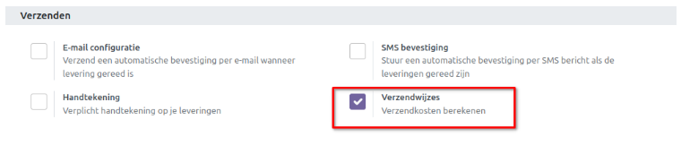
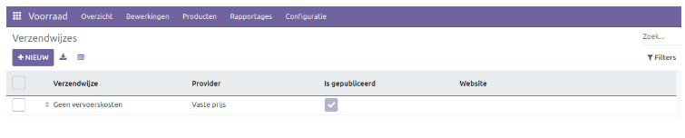
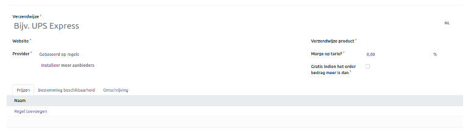
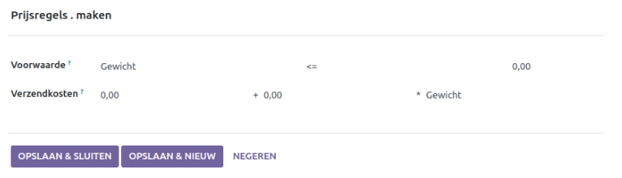
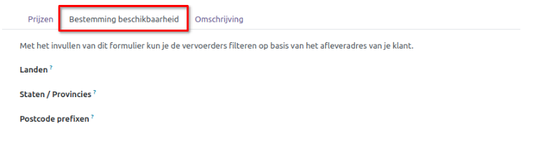
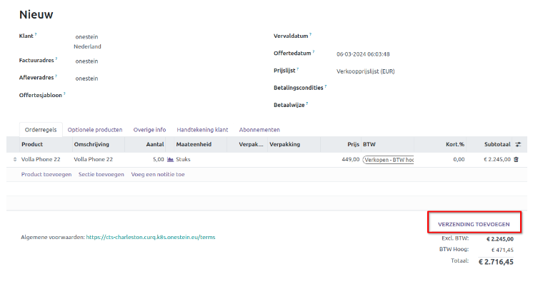
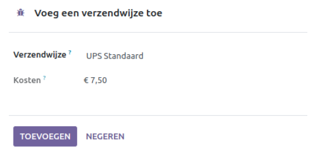

=============
Verzendwijzen
=============

De Verzendwijze functie in de Voorraadmodule, kan worden toegepast voor bedrijven die producten rechtstreeks aan hun klanten leveren of gebruikmaken van derde partij verzend connectoren. Om deze functie in te schakelen, gaat u naar het menu Instellingen en activeert u de optie *Verzendwijzen*. 

De functie verzendwijzen kan worden gebruikt om verzendkosten te berekenen. 
Selecteer de optie *Verzendwijzen* in het menu Configuratie om nieuwe verzendmethoden toe te voegen. De lijst toont de reeds geconfigureerde Verzendoptie met details zoals **Verzendwijze,  Provider, Is Gepubliceerd en Website**. 

In de aangegeven ruimte kunt u de naam van de verzendmethode invoeren. U kunt de provider instellen als *Vaste prijs* of *Gebaseerd op regels*. In de respectievelijke velden kunt u de naam van het bedrijf en het *verzendwijze product* specificeren. Het percentage dat u invoert bij *Marge op Tarief* wordt toegevoegd aan de verzendkosten. U kunt het veld *Gratis verzending vanaf* activeren om gratis verzending aan te bieden voor bestellingen met een *bedrag gelijk aan* of *hoger dan de waarde* die is vermeld in het veld *Bedrag*. Het tabblad *Prijzen* past zich aan op basis van de optie die u selecteert in het veld *Provider*. Als u *Vaste prijs* selecteert, kunt u op het tabblad *Prijzen* het vaste tarief voor de verzending invoeren. Indien u kiest voor *gebaseerd op regels* dan kunt u verschillende voorwaarden selecteren hoe de verzendkosten worden berekend. Voorwaarde opties kan op basis van **gewicht, volume, gewicht * volume, prijs en aantal**.

Voer eventueel het land in, staten/provincies of postcodes in de overeenkomstige velden. Als u extra notities wilt toevoegen aan de verzendmethode, kunt u deze specificeren in het veld *Omschrijving*. 

Nadat de configuratie van de verzendmethode is voltooid, dan kunt u deze gebruiken tijdens het bevestigen van een verkooporder.

