=====================================
Voorraad Bewerkingen & Verplaatsingen
=====================================

Wanneer u de voorraadmodule opent, krijgt u een speciaal dashboard te zien waar bijna alle activiteiten te zien zijn die door de module worden beheerd. Hieronder ziet u het overzichtsvenster van de voorraadmodule.

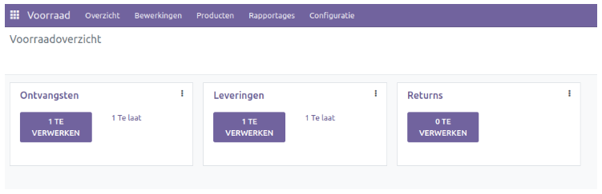

Dit is de Kanban-weergave van het voorraadoverzicht. Via dit venster kunt u **Ontvangsten, Inkooporders en Retouren** beheren. U ziet in een helder overzicht hoeveel orders er klaar staan om te verwerken. 

Om extra settings te zien voor het beheren van elke bewerking die beschikbaar is in dit venster, klikt u op de drie kleine verticale stippen in de rechterbovenhoek van elk bewerking tabblad.

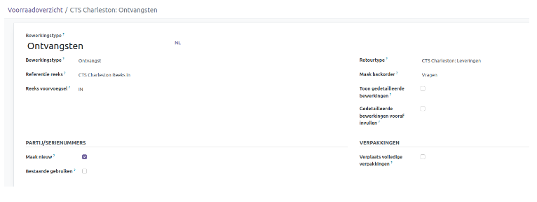

Bewerkingstypes
---------------
Met behulp van bewerkings types kunt u verschillende methoden configureren om voorraden tussen locaties te verplaatsen. Om toegang te krijgen tot deze functionaliteit, klikt u op *Bewerkings Types* in de vervolgkeuzelijst op het tabblad Configuratie.

In dit venster worden alle beschikbare bewerkingen types in de voorraadmodule weergegeven. U kunt individuele records bewerken door erop te klikken of de knop *Nieuw* gebruiken om een nieuw operatie type toe te voegen. 

.. image:: Product-Configuratie-Media/image37.png

Vul de naam in voor het Bewerkings Type in het daarvoor bestemde veld. De vervolgkeuzelijst *Bewerkings Type* toont standaard 3 opties - **Ontvangst, Levering en Interne overboeking**. 
De velden worden automatisch aangepast aan het geselecteerde type bewerking.

Stel het *Reeks voorvoegsel* in het daarvoor bestemde veld. Het veld *Reserveringsmethode* definieert hoe producten in overdrachten van dit specifieke bewerking type moeten worden gereserveerd. U kunt producten reserveren *Bij bevestiging', Handmatig* of *Vóór geplande datum*. In het geval van Vóór Geplande Datum krijgt u een extra veld om de datum voor reservering in te plannen.

Het veld *Maak backorder* kan worden gebruikt om te definiëren hoe backorders moeten worden aangemaakt tijdens het valideren van een overdracht. Met de optie *Vragen* wordt de gebruiker gevraagd of er een nabestelling moet worden gemaakt voor de resterende producten. Bij de optie *Altijd* worden automatisch nabestellingen aangemaakt voor de resterende producten. Als de optie op *Nooit* wordt gezet, worden de resterende producten geannuleerd.

Verplaatsingen
--------------

Als een bedrijf meerdere magazijnen heeft voor het opslaan van producten op verschillende locaties, is het essentieel om aandacht te besteden aan het beheer van product transfers tussen deze locaties. 
Zodra de configuratie van magazijnen en eventuele productielocaties is voltooid, helpt de optie *Overdrachten* bij het definiëren van verschillende product transfers tussen de geconfigureerde magazijnen en locaties.

Het menu *Overdrachten* biedt een overzicht van de verplaatsing van producten van de ene locatie naar de andere. Om dit menu te openen, klikt u op *Overdrachten* in het menu Bewerkingen. 

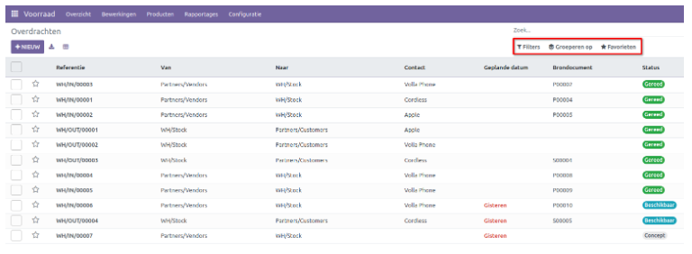

Hier ziet u een gedetailleerd overzicht van de product overdrachten binnen het bedrijf. Standaard worden deze details weergegeven in een lijstweergave, maar u kunt de weergave wijzigen naar Kanban- of Kalenderweergave door op de respectievelijke pictogrammen te klikken. De opties *Filters* en *Groeperen op* maken het gemakkelijker om transfers te volgen door specifieke records te identificeren en te lokaliseren op basis van verschillende criteria. U kunt deze filters opslaan of als standaard instellen met de optie Favorieten.

Het venster toont informatie zoals **Referentie, Contact, Geplande datum, Brondocument** en de **Status**. Als u meer details wilt zien, klikt u op de knop in de rechterbovenhoek. 

Een transfer aanmaken
---------------------

Klik op *Nieuw* om een transfer aan te maken. Voer de benodigde informatie in, zoals het contact, de geplande datum voor het eerste deel van de zending, bewerkings type, bron- en bestemmingslocatie en het brondocument. Via optie *Regel toevoegen* kan een product worden ingegeven waarover de transfer gaat. 

Extra details met betrekking tot de verzending kunnen worden ingevoerd op het tabblad *Aanvullende informatie*.

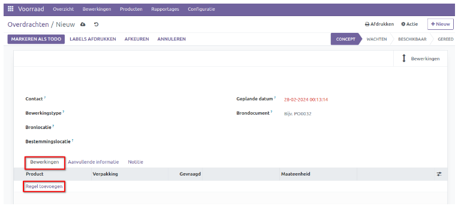

Onder *Aanvullende informatie* kunt u details toevoegen zoals Leveringsbeleid en Verantwoordelijke.

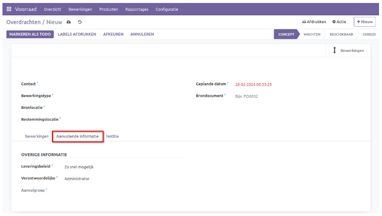

Het *Leveringsbeleid* stelt u in staat om te bepalen of de goederen volledig of gedeeltelijk worden geleverd. U kunt kiezen uit twee opties: *Zo snel mogelijk* en *Wanneer alle producten beschikbaar zijn*. Als u voor de eerste optie kiest, worden alle beschikbare producten geleverd en worden de resterende producten later als nabestelling geleverd. Als u de tweede optie kiest, worden alle producten tegelijk verzonden, zelfs als de huidige voorraad niet voldoende is; het systeem wacht dan op aanvulling.

Batchpickings
-------------

Odoo biedt ondersteuning om meerdere orders gelijktijdig af te handelen of te verwerken. Om deze functie te activeren, gaat u naar **Configuratie - Instellingen**. Zet de optie *Batchpickings* aan onder *Bewerkingen*. Het voordeel van batchpicking is dat het efficiënter is en minder tijd kost om alle items voor een bepaalde batch te verzamelen in vergelijking met het afzonderlijk verzamelen van items voor elke order.

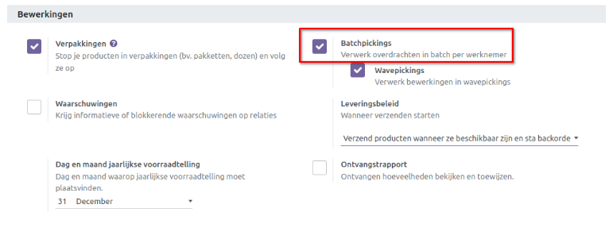

Om een batchpicking aan te maken gaat u naar menu *Bewerkingen* en selecteert u *Batchpickings* in het keuzemenu.

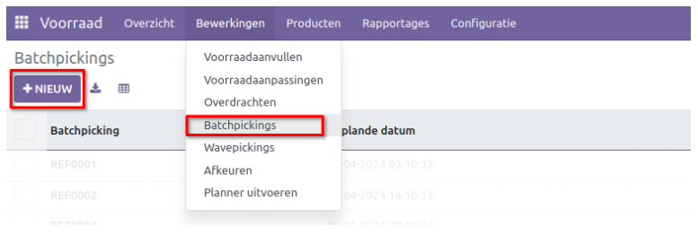

Klik op *Nieuw* om een nieuwe Batchpicking aan te maken. In het venster vindt u de details zoals de Geplande datum, de Verantwoordelijke en Bewerkingssoort.  

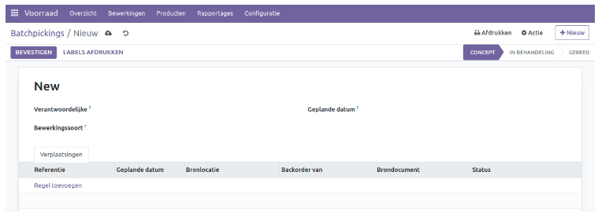

Klik op regel toevoegen. Een nieuw venster wordt geopend met alle verplaatsingen (inkomend, uitgaand, intern).  

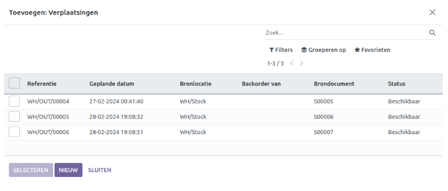

Alleen de leveringen met de status *Gereed* of *Concept* kunnen worden geselecteerd. Leveringen met de status *Wachtend* niet, omdat deze essentiële producten of handelingen missen die nodig zijn om de actie te voltooien. 

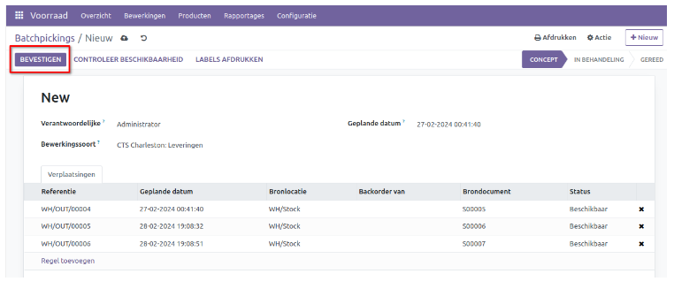

Klik op bevestigen om de batchpicking in behandeling te nemen. Vanaf dit punt kunt u een batchpicking lijst uitprinten.  Klik nogmaals op bevestigen als alle aantallen correct zijn van de leveringen. De batchpicking is nu voltooid.
Het is ook mogelijk om vanaf het *Overdracht* overzicht de leveringen te selecteren en daar een batchpicking van te maken. Zie voorbeeld onder.

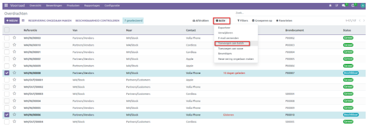

Dit opent een nieuwe pop-up waarbij u de optie heeft om de leveringen toe te voegen aan een bestaande picking of een nieuwe.

Wavepickings
------------

Wavepicking is een methode waarbij orders worden gegroepeerd in golven (waves) op basis van hun deadline of prioriteit. Een medewerker verzamelt alle items voor een wave tegelijkertijd, vergelijkbaar met batchpicking, maar in dit geval zijn de orders gegroepeerd op basis van andere criteria dan alleen de locatie of het producttype. Om van deze functionaliteit gebruik te maken, moeten *Batchpickings* en *Wavepickings* aangevinkt zijn. Zie onderstaand voorbeeld.

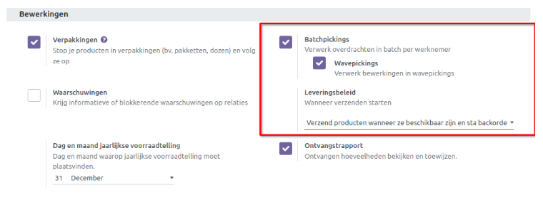

U heeft ook de mogelijkheid om *Leveringsbeleid* in te stellen. Op deze manier kunt u verschillende bewerkingen combineren en als één geheel laten functioneren.

De functie *wave picking* helpt bij het verplaatsen van een groot aantal producten van de ene naar de andere locatie. Eenmaal toegevoegd aan een *wave picking*, kunt u een transfer niet meer uit de wave verwijderen. Deze functie wordt beschouwd als geavanceerder dan batchpicking.  
Het voordeel van *wave picking* is dat het kan helpen bij het prioriteren van orders op basis van deadlines of andere criteria, waardoor de algehele efficiëntie van het orderverzamelproces kan worden verbeterd.

Om een 'wave picking' aan te maken kunt u de leveringen selecteren in het overzicht van *Overdrachten*. Let erop dat de *bewerkingstype* hetzelfde is. De verdere afhandeling is hetzelfde als bij Batchpicking.

