============================================
Voorraad aanvulling en Voorraad aanpassingen
============================================

-------------------
Voorraad aanvulling
-------------------

Met de Aanvulling-functie kunt u de ontbrekende voorraad bijbestellen via verschillende leveranciers en routes. Om deze functie te gebruiken, navigeert u naar het menu *Bewerkingen* en selecteert u *Voorraad Aanvullen*. Hier kunt u de aanvulorders bekijken en beheren die zijn aangemaakt.

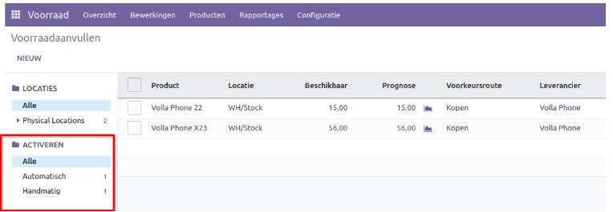

In de afbeelding hierboven ziet u een filter genaamd *Activeren* aan de linkerkant van het scherm. Dit filtergebied is een nieuwe toevoeging aan de Odoo 16 voorraadmodule. Het biedt drie categorieën - **Alle, Automatisch** en **Handmatig**. Per aanvulregel vindt u de betreffende kolom waar de aanvul triggers geactiveerd kunnen worden. 

.. image:: Product-Configuratie-Media/image49.png

Klik op de knop *Aanmaken* om een nieuwe aanvulorder te maken. 

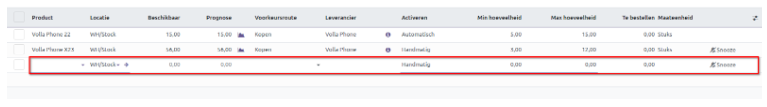

Er wordt een nieuwe regel toegevoegd onder de bestaande lijst om de details in te voeren, zoals het **Product, Locatie, Voorkeursroute, Leverancier, Minimale hoeveelheid, Maximale hoeveelheid** en **Te bestellen hoeveelheid**. De velden *Beschikbaar*, *Prognose* en *Maateenheid* worden automatisch bijgewerkt op basis van het geselecteerde product.

Het informatiepictogram ('i' icoon) hieronder biedt gedetailleerde informatie over de aanvulling.

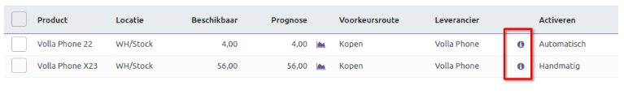

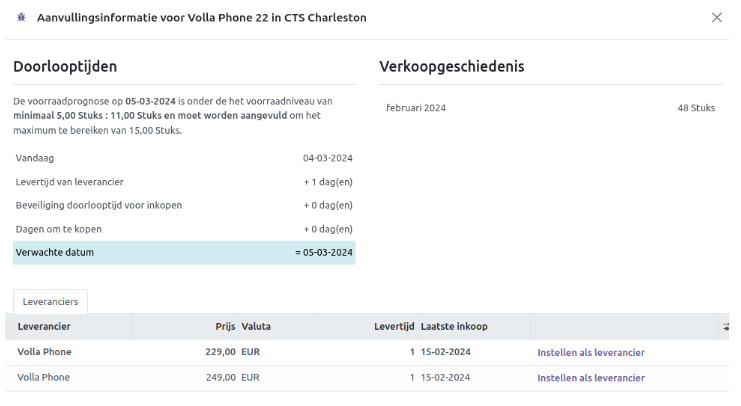

Om snel een aanvulorder te plaatsen, kun je het pictogram *Eenmalig bestellen* gebruiken, zoals hieronder afgebeeld.

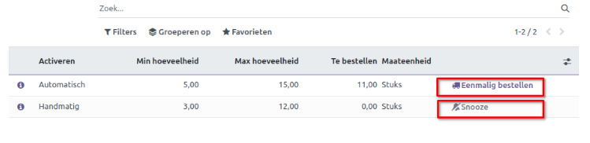

Deze knop is bedoeld voor handmatige aanvulling van het specifieke product. De knop *Snooze* dempt meldingen voor een bepaalde periode. Wanneer u op de *Snooze* knop klikt, wordt het volgende venster weergegeven.

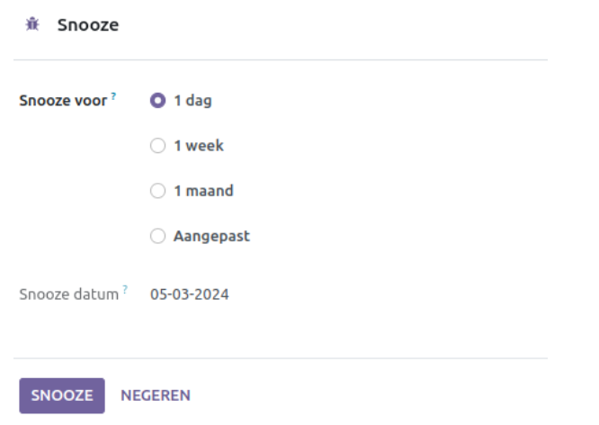

Stel de dag en datum in voor de snooze-periode en klik op *Snooze*.

---------------------
Voorraad aanpassingen
---------------------

Met de Voorraadaanpassingen-functie heeft u een tool om de voorraad van uw bedrijf nauwkeurig bij te houden en efficiënt bij te werken. Deze functie zorgt ervoor dat u altijd voldoende producten hebt voor de vereiste voorraadbewerkingen. Om dit venster te openen, klikt u op *Voorraadaanpassingen* in de vervolgkeuzelijst van het menu *Bewerkingen*.

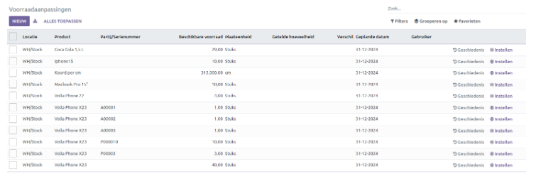

In dit venster wordt de naam van het product weergegeven, samen met relevante informatie zoals lot-/serienummer, beschikbare voorraad, UoM (Maateenheid), getelde hoeveelheid, verschil, geplande datum en gebruiker. Het *Verschil* geeft aan hoeveel de theoretische voorraad afwijkt van de getelde voorraad. De *Geplande datum* geeft aan wanneer de volgende meting van de beschikbare hoeveelheid zal plaatsvinden.

Klik op de knop *Nieuw* om een nieuwe Voorraadaanpassing toe te voegen. Er wordt een nieuwe regel onder de bestaande lijst toegevoegd waar u de benodigde details kunt invullen.

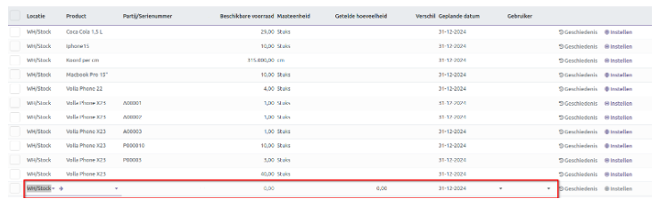

Wanneer u de *Getelde hoeveelheid* invoert, wordt het bijbehorende veld *Verschil* automatisch ingevuld. Om deze nieuwe aanpassing toe te passen, klikt u op *Toepassen*, zoals hieronder weergegeven.

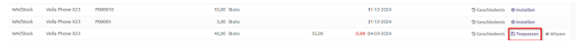

Om de details van de voorraad aanpassingen van een specifiek product te bekijken, klikt u op het pictogram *Geschiedenis* voor dat item. Hieronder ziet u een voorbeeld van het venster *Geschiedenis voorraad aanpassingen*.

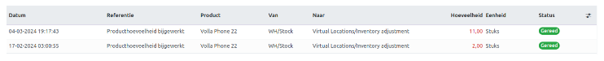

Om de recente voorraadupdate van een product te resetten, klikt u op het bijbehorende **Instellen** pictogram.

Met de voorraadmodule van Odoo 16 kunt u de datum van de jaarlijkse inventarisatie tellingen plannen. Ga naar *Instellingen* onder het tabblad Configuratie om deze timing aan te passen. Onder het gedeelte *Bewerkingen* vindt u de optie *Dag en maand jaarlijkse voorraadtelling*.

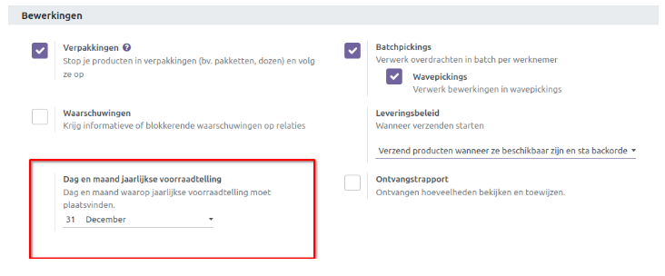

Als de telling negatief of nul is, kiest het systeem automatisch de eerste dag van de maand als teldag. Als het aantal hoger is dan de laatste dag van de maand, selecteert het systeem automatisch de laatste dag van die maand.

---------------------
Hoeveelheid Bijwerken
---------------------

U kunt eenvoudig de hoeveelheid van een specifiek product bijwerken vanuit het *Product sjabloon* zelf. Ga hiervoor naar het tabblad *Producten* en klik op het gewenste product. Dit opent de formulierweergave van het product waar u de hoeveelheid kunt aanpassen.

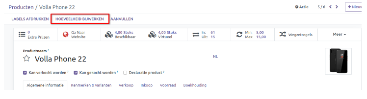

De knop *Hoeveelheid bijwerken* leidt naar een venster waarin u de hoeveelheid van het product dat beschikbaar is in het magazijn kunt invoeren.

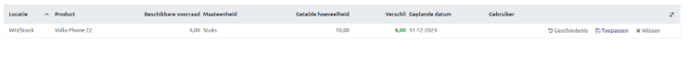

In dit venster geeft u *Getelde hoeveelheid* aan, waarna u het verschil tussen de getelde hoeveelheid en de beschikbare hoeveelheid in het veld *Verschil* ziet. Klik na het toevoegen van de gewenste gegevens op *Opslaan*. Klik op *Toepassen* om de voorraad aanpassing door te voeren.

