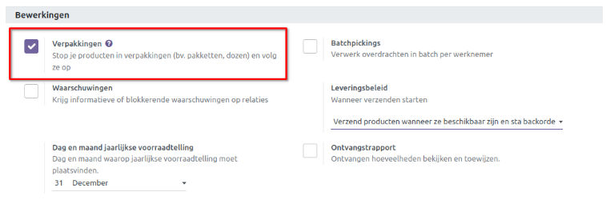
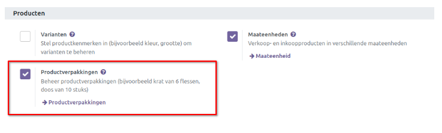
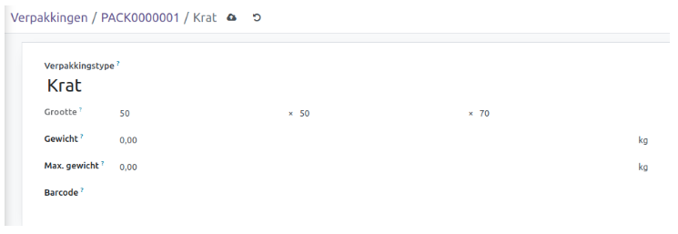
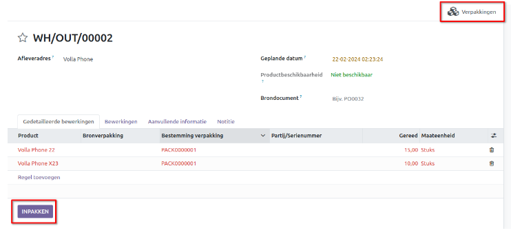
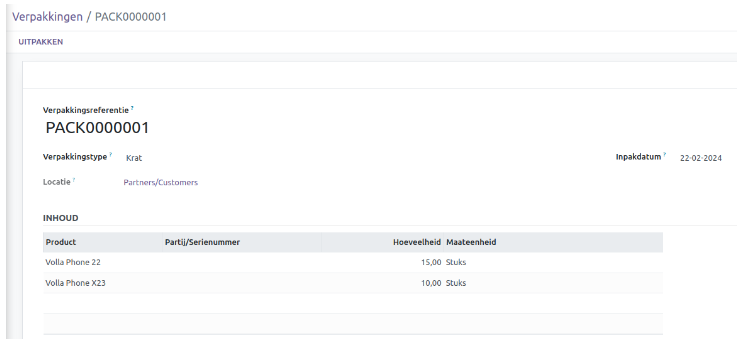
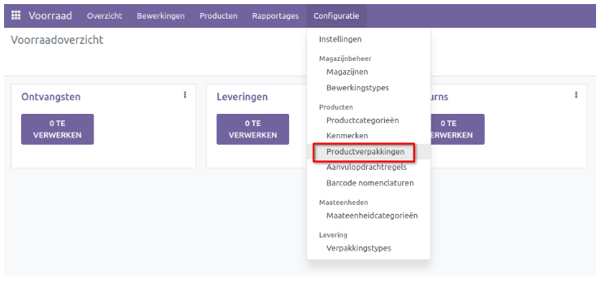
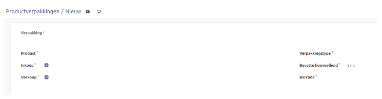
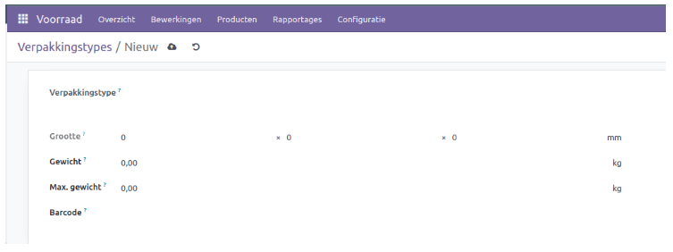

==================
Voorraadmanagement
==================

Met de voorraadmodule van Odoo 16 kunt u de diverse aspecten van voorraadbeheer binnen uw bedrijf gestructureerd organiseren en beheren. Deze module faciliteert niet alleen het overzicht en de opvolging van productvoorraden, maar voert ook verschillende inventarisatie taken uit. Daarnaast biedt het een eenvoudige manier om product hoeveelheden te beheren en alle bestellingen nauwlettend in de gaten te houden. 

Om aan de slag te gaan, dient u eerst alle producten te configureren binnen de voorraadmodule. Meer info over de productconfiguratie vindt u hier.

-------------------
Product categorieën
-------------------
Door het configureren van productcategorieën kunt u producten onderbrengen en groeperen in verschillende categorieën. Het vaststellen van deze categorieën is een cruciale stap om verschillende handelingen met betrekking tot uw producten te beheren. Bovendien biedt deze functie de mogelijkheid om producten te filteren op basis van hun categorieën. U vindt de optie Productcategorieën in het configuratiemenu van de voorraadmodule.

.. image:: Product-Configuratie-Media/image14.png

In dit overzicht vindt u een aantal productcategorieën die standaard zijn geconfigureerd in de voorraadmodule. Met de knop 'Nieuw' kunt u gemakkelijk een nieuwe categorie aanmaken.

.. image:: Product-Configuratie-Media/image15.png

.. image:: Product-Configuratie-Media/image16.png

Stel een naam in voor de nieuwe categorie in de daarvoor bestemde ruimte. Indien deze categorie onder een hoofdcategorie valt, kunt u deze in het betreffende veld specificeren. De 'Forceer verwijderingsstrategie' definieert de strategie om een product van de bronlocatie te verwijderen. 

FIFO (First in First Out):  producten die als eerste op voorraad zijn gezet worden als eerste uitgeleverd.

LIFO (Last in First Out):  producten die als laatste op voorraad zijn gezet worden als eerste uitgeleverd.

Closest location: producten die het dichtst bij de doellocatie bevinden worden als eerste verplaatst.

De rekeningen die worden gebruikt bij het valideren van een klantfactuur en leveranciersfactuur kunnen respectievelijk worden gespecificeerd in de 'Omzetrekening' en 'Kostenrekening'. Op het tabblad 'Voorraadwaardering' kunt u de kosten berekeningsmethode definiëren die wordt gebruikt om de kosten van het product onder deze categorie te berekenen.

Standaardprijs: De kosten van de producten worden berekend op basis van de standaardprijs die is vastgesteld voor elk individueel product.

Gemiddelde kosten (AVCO): De kosten van de producten worden berekend op basis van het gewogen gemiddelde van de kosten.

First in First out (FIFO): De kostprijs van de producten wordt berekend op basis van het principe dat de producten die als eerste binnenkomen, ook als eerste het bedrijf verlaten.

De voorraadwaardering kan worden ingesteld als Handmatig en Geautomatiseerd. Wanneer u de optie 'handmatig' selecteert, dienen de boekingen voor het waarderen van de inventaris handmatig te worden ingevoerd. Echter, bij de 'automatische' voorraadwaardering wordt automatisch een boekhoudkundige boeking aangemaakt voor de waardering van de inventaris zodra een product de inventaris binnenkomt of verlaat. Wanneer u kiest voor 'automatische' voorraadwaardering, worden er extra velden beschikbaar gesteld om de grootboekrekeningen en dagboek te definiëren. 

.. image:: Product-Configuratie-Media/image17.png

Voorraadwaarde rekening: Als geautomatiseerde voorraadwaardering is ingeschakeld voor een product, zal deze rekening de actuele waarde van de producten bevatten.

Voorraad dagboek: Dit is het rekening journaal waarin boekingen automatisch worden vastgelegd wanneer voorraadmutaties worden verwerkt, indien de voorraadwaardering geautomatiseerd is.

Voorraadtoename rekening: Tegenboekingen voor alle inkomende voorraad verplaatsingen worden geboekt op deze rekening, tenzij er een specifieke waardering rekening is ingesteld op de bronlocatie. Dit geldt als standaardinstelling voor alle producten in deze categorie, maar kan ook direct worden ingesteld voor elk product.

Voorraadafname rekening: Bij geautomatiseerde voorraadwaardering worden tegenboekingen voor alle uitgaande voorraadmutaties geboekt op deze rekening, tenzij er een specifieke waarderingsrekening is ingesteld op de bestemmingslocatie.

Nadat de configuratie van de nieuwe productcategorie is voltooid, krijgt u toegang tot de slimme knop 'Producten' om de producten onder deze categorie te bekijken. 

-------------------
Productverpakkingen
-------------------

De Voorraad module biedt een optie om methoden te definiëren voor het verpakken van de producten en het bijhouden van hun locatie. Verpakkingen zijn essentieel voor het veilig transporteren van producten. In de Voorraadmodule kunt u twee soorten verpakkingsmethoden definiëren. U kunt meerdere verpakkingen maken voor één product, of één verpakking voor verschillende producten.

Om toegang te krijgen tot de instellingen van verpakkingen, navigeert u naar menu 'Instelingen' van de module. Activeer vervolgens de optie 'Verpakkingen' op het tabblad 'Bewerkingen' en de optie 'Productverpakkingen' op het tabblad 'Producten', zoals te zien is in de onderstaande schermafbeeldingen.

Hier worden de opties 'Verpakkingen' en 'Productverpakkingen' gebruikt voor verschillende functies. De optie 'Verpakkingen' wordt gebruikt om verpakkingen te definiëren voor verschillende producten, terwijl 'Productverpakkingen' u helpen bij het verpakken van verschillende hoeveelheden van hetzelfde product. Laten we deze opties in detail bekijken.

Verpakkingen
------------
Zodra de functie 'Verpakkingen' is geactiveerd vanuit het menu "Instellingen", vindt u het submenu 'Verpakkingen' onder het menu "Producten". Hier kunt u reeds aangemaakte pakketten bekijken.

Om een nieuwe verpakking aan te maken, kunt u de knop "Nieuw" gebruiken. Dit opent een nieuw formulier zoals hieronder weergegeven.

.. image:: Product-Configuratie-Media/image20.png

In het veld verpakking referentie verschijnt een opvolgend nummer van de verpakking. Tevens kunt u een verpakkingstype selecteren uit de beschikbare opties. Standaard is er geen type aanwezig. Bij het aanmaken heeft u de mogelijkheid om een aantal gegevens in te stellen, zoals LxBXH, gewicht en max. gewicht. Ook kan een barcode gekoppeld worden.

Het tabblad "Inhoud" toont de producten die in dit pakket zitten. Wanneer u dit pakket gebruikt voor het verplaatsen van de voorraad, kunt u de details van het product, het lot/serienummer, de hoeveelheid en de maateenheid bekijken.

Bij het bevestigen van een levering order krijgt u de optie om meerdere producten in één pakket te stoppen, zoals hieronder getoond.

Op het tabblad 'Gedetailleerde bewerkingen' van de levering order vindt u de optie 'Inpakken'. 
Wanneer u op deze knop klikt, worden alle producten in de levering order samengevoegd in één pakket.

De knop 'Verpakkingen' kan worden gebruikt om de inhoud van de bijbehorende levering order te bekijken.

Product verpakking
------------------
De Productverpakking Functie wordt gebruikt om diverse hoeveelheden van identieke producten te verpakken. Binnen een enkele verpakking kunnen meerdere eenheden van hetzelfde artikel worden opgenomen. Om toegang te krijgen tot deze settings, navigeert u naar het Configuratie-menu - productverpakkingen.

Klik op 'Nieuw' om een productverpakking aan te maken.

In dit overzicht kunt u de naam van de verpakking invoeren in het daarvoor bestemde veld. Selecteer vervolgens het product dat u aan deze verpakking wilt koppelen in het Product-veld. Als u van plan bent deze verpakking te gebruiken in inkoop- en verkooporders, kunt u respectievelijk de Inkoop- en Verkoop-velden activeren. Kies uit de beschikbare opties een geschikt verpakkingstype voor deze verpakking. Geef de hoeveelheid van het product in de verpakking op in het Hoeveelheid-veld. Stel eventueel een barcode in voor de identificatie van de verpakking. 

Soort verpakking
----------------
Voor het configureren van meerdere soorten verpakkingen, navigeert u naar het configuratiemenu en selecteer u de optie verpakkingstype. Dit opent een overzicht waarin de verschillende verpakkingstypes zijn geconfigureerd. 

Klik op 'Nieuw' om een nieuw verpakkingstype aan te maken. 

Geef de naam van het verpakkingstype op in het daarvoor bestemde veld, samen met de bijbehorende afmetingen. Vul vervolgens de velden in met informatie zoals het gewicht van het pakkettype, het maximale gewicht dat het kan dragen en de eventuele barcode.

-----------------------------
Traceerbaarheid van producten
-----------------------------

In Odoo 16 is het mogelijk om partijen en serienummers te gebruiken om producten te traceren. Deze traceerbaarheid functies verschillen in hun functie. 

Over het algemeen dienen partijen als unieke identificatienummers om een groep producten van hetzelfde type te onderscheiden. Producten die klein en lastig individueel te tellen zijn, kunnen worden samengevoegd in een enkele verpakking met een partijnummer. Deze producten worden als batches in de inventaris opgenomen. 

Serienummers daarentegen worden gebruikt voor individuele producten in de voorraad en fungeren als identificatienummers voor afzonderlijke producten.

Om de volledige functionaliteit van traceerbaarheid in de Voorraad module te activeren, gaat u naar het menu Instellingen. Daar vindt u onder het tabblad 'Traceerbaarheid' de optie om Partijen & serienummers te activeren.

.. image:: Product-Configuratie-Media/image27.png

Nadat deze functie is geactiveerd, vindt u een extra submenu 'Partij/serienummers' onder het menu 'Producten' van de Voorraadmodule. 

.. image:: Product-Configuratie-Media/image28.png

Bij het openen ziet u de vooraf geconfigureerde lijst met partij- en serienummers. In de lijstweergave worden details weergegeven zoals het partij/serienummer, het interne referentienummer, het product en de aanmaakdatum. 

.. image:: Product-Configuratie-Media/image29.png

Om de traceerbaarheid van een product te bepalen, navigeert u naar het tabblad 'Voorraad' in de weergave van het product formulier.

.. image:: Product-Configuratie-Media/image30.png

U kunt de traceerbaarheid instellen op basis van unieke serienummers of partijen. Als u geen traceerbaarheid voor het product wilt instellen, kunt u de optie 'Geen tracering' selecteren.

Wanneer u een nieuw product ontvangt in de voorraad, kunt u een nieuw lot/serienummer toewijzen aan dat product. Dit kan worden gedaan voor een bevestigde inkooporder.

.. image:: Product-Configuratie-Media/image31.png

Om een nieuw lot/serienummer aan een product toe te kennen, kunt u klikken op de knop 'Detail' op de inkooporder.

.. image:: Product-Configuratie-Media/image32.png

In de pop-upvenster kan het lot/serienummer voor dit product worden toegevoegd. Er is een mogelijkheid om serienummers automatisch toe te wijzen, of deze handmatig in te stellen (regel toevoegen).

.. image:: Product-Configuratie-Media/image33.png

Op het productblad is er een smartbutton 'Partijen/serienummers' beschikbaar waarbij u de voorraad op serienummer kan bekijken.

.. image:: Product-Configuratie-Media/image34.png

.. image:: Product-Configuratie-Media/image35.png

