==================
Voorraadmanagement
==================

Met de voorraadmodule van Curq kun je de diverse aspecten van voorraadbeheer binnen je bedrijf gestructureerd organiseren en beheren. Deze module faciliteert niet alleen het overzicht en de opvolging van productvoorraden, maar voert ook verschillende inventarisatie taken uit. Daarnaast biedt het een eenvoudige manier om product hoeveelheden te beheren en alle bestellingen nauwlettend in de gaten te houden. 

Om aan de slag te gaan, dien je eerst alle producten te configureren binnen de voorraadmodule. Meer info vindt u in de handleiding **Product-Configuratie**. 

-------------------
Product categorieën
-------------------
Door het configureren van productcategorieën kun je producten onderbrengen en groeperen in verschillende categorieën. Het vaststellen van deze categorieën is een cruciale stap om verschillende handelingen met betrekking tot uw producten te beheren. Bovendien biedt deze functie de mogelijkheid om producten te filteren op basis van hun categorieën. Je vindt de optie Productcategorieën in het configuratiemenu van de voorraadmodule.

.. image:: Product-Configuratie-Media/image14.png

In dit overzicht vind je een aantal productcategorieën die standaard zijn geconfigureerd in de voorraadmodule. Met de knop *Nieuw* kun je gemakkelijk een nieuwe categorie aanmaken.

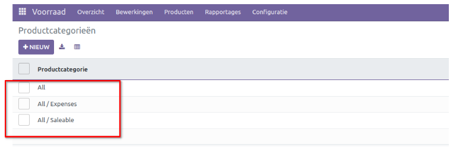

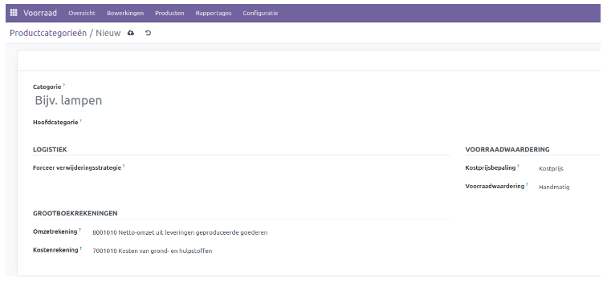

Stel een naam in voor de nieuwe categorie in de daarvoor bestemde ruimte. Indien deze categorie onder een hoofdcategorie valt, kun je deze in het betreffende veld specificeren. De verwijderingsstrategie definieert de strategie om een product van de bronlocatie te verwijderen. We bespreken de verwijderingsstrategie in een aparte handleiding. 

De rekeningen die worden gebruikt bij het valideren van een klantfactuur en leveranciersfactuur kunnen respectievelijk worden gespecificeerd in de *Omzetrekening* en *Kostenrekening*. Op het tabblad *Voorraadwaardering* kun je de kosten berekeningsmethode definiëren die wordt gebruikt om de kosten van het product onder deze categorie te berekenen.

**Standaardprijs**: De kosten van de producten worden berekend op basis van de standaardprijs die is vastgesteld voor elk individueel product.

**Gemiddelde kosten (AVCO)**: De kosten van de producten worden berekend op basis van het gewogen gemiddelde van de kosten.

**First in First out (FIFO)**: De kostprijs van de producten wordt berekend op basis van het principe dat de producten die als eerste binnenkomen, ook als eerste het bedrijf verlaten.

De voorraadwaardering kan worden ingesteld als **Handmatig** en **Geautomatiseerd**. Wanneer je de optie *handmatig* selecteert, dienen de boekingen voor het waarderen van de inventaris handmatig te worden ingevoerd. Echter, bij de *automatische* voorraadwaardering wordt automatisch een boekhoudkundige boeking aangemaakt voor de waardering van de inventaris zodra een product de inventaris binnenkomt of verlaat. Wanneer je kiest voor *automatische* voorraadwaardering, worden er extra velden beschikbaar gesteld om de grootboekrekeningen en dagboek te definiëren. 

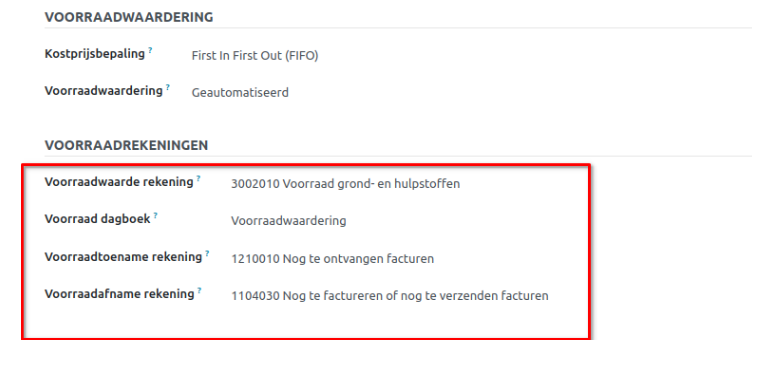

**Voorraadwaarde rekening**: Als geautomatiseerde voorraadwaardering is ingeschakeld voor een product, zal deze rekening de actuele waarde van de producten bevatten.

**Voorraad dagboek**: Dit is het rekening journaal waarin boekingen automatisch worden vastgelegd wanneer voorraadmutaties worden verwerkt, indien de voorraadwaardering geautomatiseerd is.

**Voorraadtoename rekening**: Tegenboekingen voor alle inkomende voorraad verplaatsingen worden geboekt op deze rekening, tenzij er een specifieke waardering rekening is ingesteld op de bronlocatie. Dit geldt als standaardinstelling voor alle producten in deze categorie, maar kan ook direct worden ingesteld voor elk product.

**Voorraadafname rekening**: Bij geautomatiseerde voorraadwaardering worden tegenboekingen voor alle uitgaande voorraadmutaties geboekt op deze rekening, tenzij er een specifieke waarderingsrekening is ingesteld op de bestemmingslocatie.

Nadat de configuratie van de nieuwe productcategorie is voltooid, krijg je toegang tot de slimme knop *Producten* om de producten onder deze categorie te bekijken. 

-----------------------------
Traceerbaarheid van producten
-----------------------------

In Curq is het mogelijk om partijen en serienummers te gebruiken om producten te traceren. Deze traceerbaarheid functies verschillen in hun functie. 

Over het algemeen dienen partijen als unieke identificatienummers om een groep producten van hetzelfde type te onderscheiden. Producten die klein en lastig individueel te tellen zijn, kunnen worden samengevoegd in een enkele verpakking met een partijnummer. Deze producten worden als batches in de inventaris opgenomen. 

Serienummers daarentegen worden gebruikt voor individuele producten in de voorraad en fungeren als identificatienummers voor afzonderlijke producten.

Om de volledige functionaliteit van traceerbaarheid in de Voorraad module te activeren, ga je naar het menu Instellingen. Daar vind je onder het tabblad *Traceerbaarheid* de optie om Partijen & serienummers te activeren.

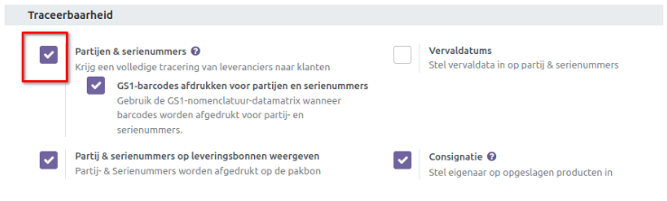

Nadat deze functie is geactiveerd, vind je een extra submenu *Partij/serienummers* onder het menu *Producten* van de Voorraadmodule. 

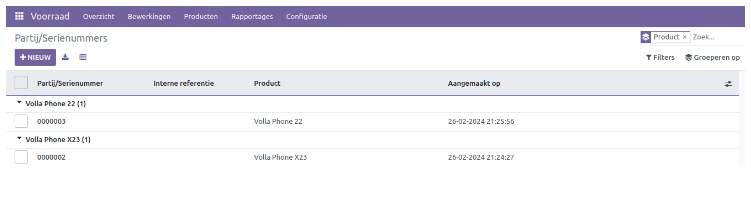

Bij het openen zie je vooraf de geconfigureerde lijst met partij- en serienummers. In de lijstweergave worden details weergegeven zoals het partij/serienummer, het interne referentienummer, het product en de aanmaakdatum. 

Om de traceerbaarheid van een product te bepalen, navigeer je naar het tabblad **Voorraad** in de weergave van het product formulier.

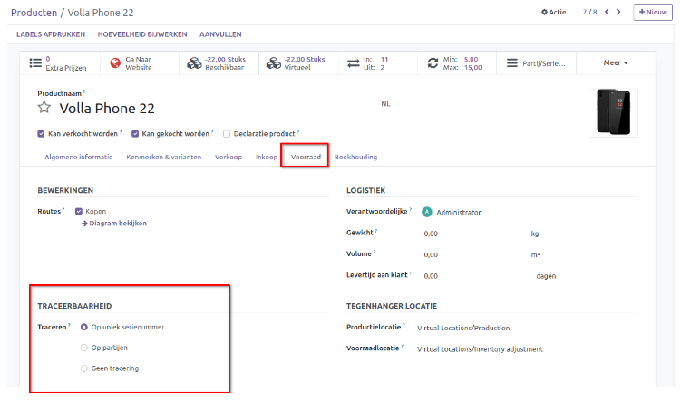

Je kunt de traceerbaarheid instellen op basis van unieke serienummers of partijen. Als je geen traceerbaarheid voor het product wilt instellen, kun je de optie *Geen tracering* selecteren.

Wanneer je een nieuw product ontvangt in de voorraad, kun je een nieuw lot/serienummer toewijzen aan dat product. Dit kan worden gedaan voor een bevestigde inkooporder.

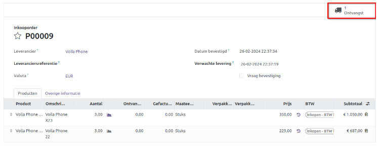

Om een nieuw lot/serienummer aan een product toe te kennen, kun je klikken op de knop *Detail* op de inkooporder.

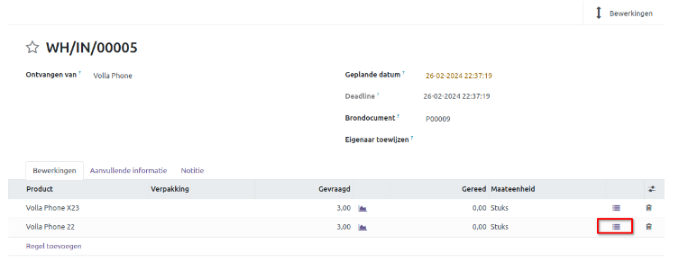

In de pop-upvenster kan het lot/serienummer voor dit product worden toegevoegd. Er is een mogelijkheid om serienummers automatisch toe te wijzen, of deze handmatig in te stellen (regel toevoegen).

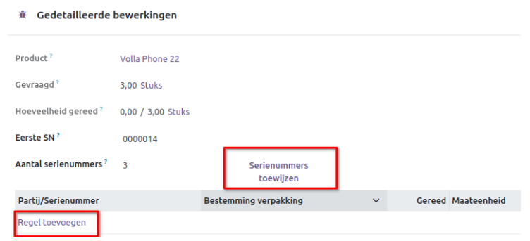

Op het productblad is er een smartbutton *Partijen/serienummers* beschikbaar waarbij je de voorraad op serienummer kan bekijken.

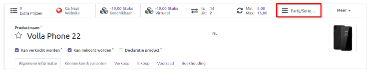

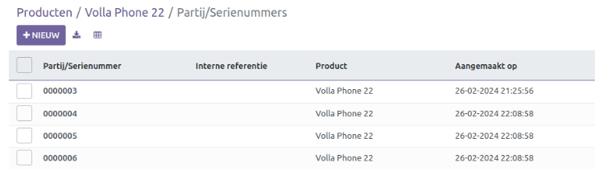

