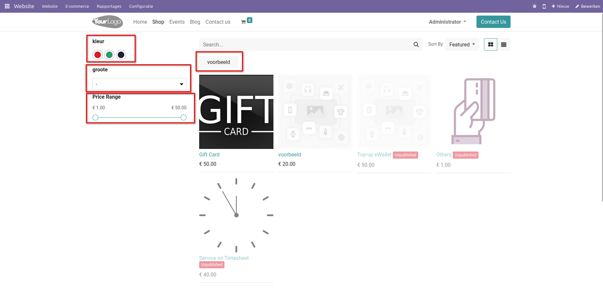

E-commerce
==========

De e-commerce module is een geavanceerd en veelzijdig systeem van Curq dat bedrijven in staat stelt om krachtige webshops te creëren die voldoen aan de hoogste normen van de industrie. Met deze module kunnen ondernemingen snel en efficiënt online winkels opzetten en beheren, die voldoen aan essentiële certificeringen en veeleisende standaarden op het gebied van veiligheid en betrouwbaarheid.

Deze module biedt een uitgebreid scala aan functies en mogelijkheden om het volledige e-commerceproces te stroomlijnen. Het stelt gebruikers in staat om een breed assortiment producten en diensten aan te bieden, inclusief cadeaubonnen, eWallets en kortingsaanbiedingen. Met intuïtieve tools voor up- en cross-selling kunnen bedrijven eenvoudig aanbevelingen doen aan klanten en de verkoop maximaliseren.

Daarnaast biedt de e-commerce module krachtige functionaliteiten voor het beheer van orders, klantgegevens en betalingstransacties. Bedrijven kunnen nauwkeurige analyses uitvoeren van verkoopprestaties, klantgedrag en markttrends, wat waardevolle inzichten biedt voor het optimaliseren van de bedrijfsstrategieën.

Met een focus op gebruiksvriendelijkheid en klanttevredenheid, maakt deze module het mogelijk om webshops te ontwikkelen die gemakkelijk navigeerbaar zijn en een naadloze winkelervaring bieden aan klanten. Door gebruik te maken van geavanceerde categorisering, tagging en filteropties kunnen gebruikers snel en efficiënt vinden wat ze zoeken, waardoor de conversieratio's worden verhoogd.

Bovendien biedt de e-commerce module de flexibiliteit om de webshop aan te passen aan de specifieke behoeften van het bedrijf. Met een uitgebreide reeks aanpasbare instellingen kunnen bedrijven de prijsstructuur, belastingregels, verzendopties en facturatieprocessen naar wens configureren, waardoor ze volledige controle hebben over hun online verkoopomgeving.

Kortom, de e-commerce module is een essentieel instrument voor bedrijven die streven naar succes in de digitale markt. Door geavanceerde functionaliteiten te combineren met gebruiksgemak en flexibiliteit, stelt deze module bedrijven in staat om een sterke online aanwezigheid op te bouwen en te profiteren van de kansen die de wereld van e-commerce te bieden heeft.
