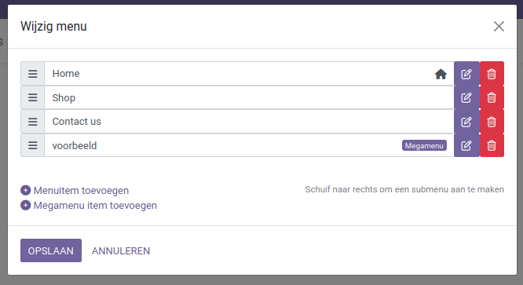
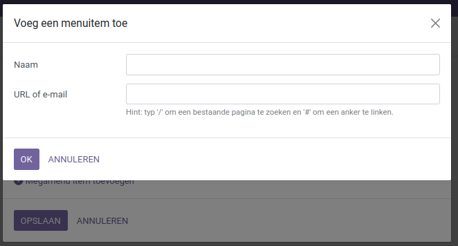
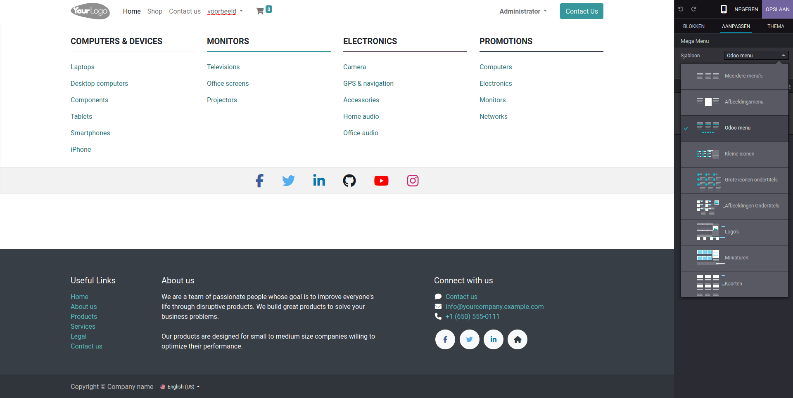
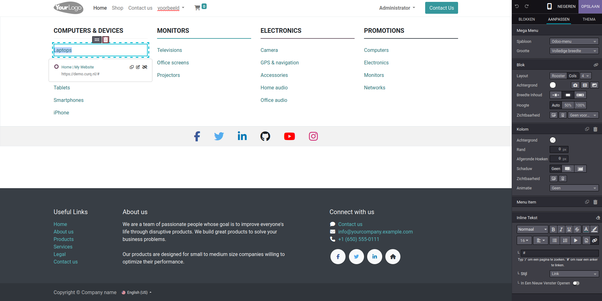

Menu-editor
===========================

Met de menu-editor kunnen de menu-items van de header worden ingesteld. Dit kunnen directe links zijn naar pagina's binnen en buiten je website. Ook kunnen supermenu's worden aangemaakt en aangepast.

In de editor worden alle items onder elkaar weergegeven. Hoe hoger het item in de lijst staat, hoe meer naar links het staat.
Om een menu-item toe te voegen zijn er twee opties: een normaal menu-item en een megamenu-item.

Bij een menu-item wordt een naam aan het item toegevoegd, dit is de naam die op de header wordt getoond. Onder url of e-mail kan de locatie waar het item naar linkt worden ingevuld. Voor een interne locatie kan een slash worden ingevuld om te linken naar een bestaande pagina en een hashtag voor een anker die linkt naar een locatie binnen een pagina. Voor een externe pagina moet de volledige URL worden ingevuld. Ook kan een e-mailadres worden opgegeven die je een e-mail kan laten sturen naar het e-mailadres via je eigen e-mailclient.

Bij een Megamenu wordt alleen een naam opgegeven. Om het menu aan te passen moet dit in de editor worden gedaan. De menu's kunnen op verschillende manieren worden ingesteld.

Om de submenu-items aan te passen moet dit ook in de web-editor worden gedaan waar de naam aangepast kan worden door de kopjes te selecteren. Om de locatie aan te passen kan dit in het inline tekstkopje worden aangepast.

