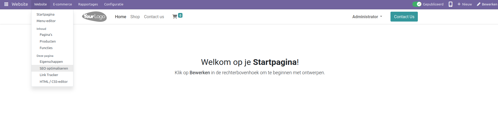
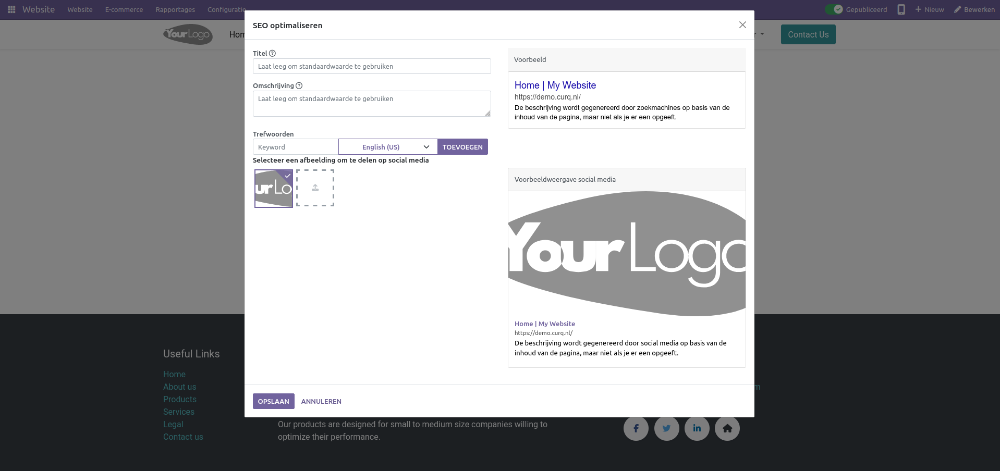
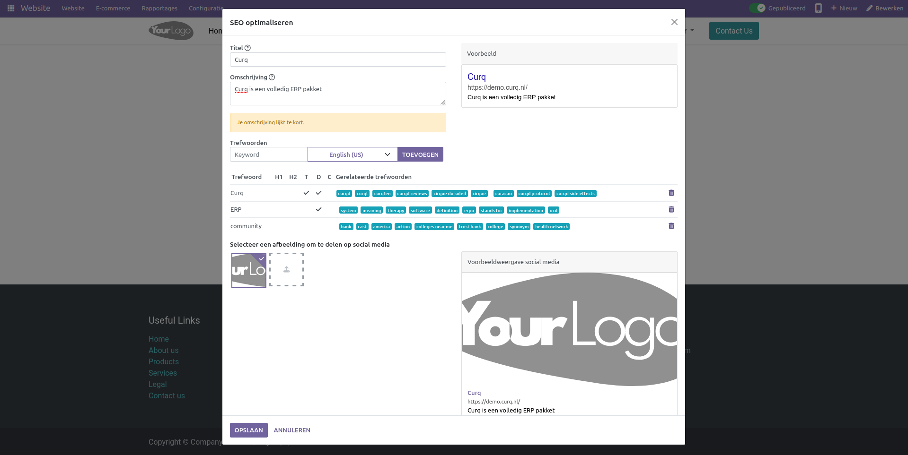

SEO optimalisatie
===========================

Zoekmachineoptimalisatie (SEO) is een verzameling van beste praktijken voor het optimaliseren van je website zodat deze hoger scoort in zoekmachines. Kort gezegd stelt een solide SEO je in staat om meer bezoekers te krijgen.

SEO is essentieel voor de werking van een website omdat het ervoor zorgt dat een website zichtbaar is voor zoekmachines en het beoogde publiek. Dit helpt om websiteverkeer, leadgeneratie en uiteindelijk verkopen te verbeteren. SEO helpt ook om de gebruikerservaring van een website te verbeteren door deze navigeerbaarder te maken, wat kan leiden tot meer conversies. SEO helpt ook bij het opbouwen van een reputatie en vertrouwen bij potentiële klanten, wat kan leiden tot verhoogde verkopen.

De Curq Website-module biedt uitzonderlijke SEO-optimalisatieoplossingen voor de robuustheid en verbetering van uw website. Er is een specifiek menu voor het aanpakken van het SEO-component van de webpagina's in de module. De optie Optimaliseer SEO vind je terug onder het Site-menu van de website-module zoals hieronder getoond.

Het menu stelt je in staat om een titel voor de webpagina op te geven, die zal verschijnen in het voorbeeldgebied. In het overeenkomstige veld kun je ook een beschrijving van de webpagina opnemen. Deze beschrijving zal ook worden weergegeven in de preview aan de rechterkant van het venster. Bovendien kun je zoekwoorden toevoegen die kunnen helpen om het verkeer te verbeteren. 

Elke webpagina moet de metadata-tags titel en beschrijving definiëren. Zoekmachines gebruiken deze informatie om je website te promoten. Ze worden automatisch gegenereerd op basis van de paginatitel en inhoud, maar je kan deze aanpassen. Zorg ervoor dat ze relevant zijn voor de inhoud van de pagina, anders wordt deze mogelijk genegeerd door zoekmachines.

Voeg zoveel zoekwoorden in als nodig. Naast het zoekwoord kun je de taal van het zoekwoord opgeven in het daarvoor bestemde veld. Curq heeft een zoekwoordvinder om je te helpen geweldige inhoud te genereren en het verkeer te vergroten. Dit zijn de zoekopdrachten waarmee je verkeer naar de website wil leiden. Je ziet hoe elk term wordt gebruikt in de tekst (H1, H2, paginatitel, paginabeschrijving, paginainhoud) en welke zoekopdrachten ermee verband houden. Hoe meer zoekwoorden worden gebruikt, hoe beter.

Je kunt ook een afbeelding selecteren die wordt weergegeven in het geval van een zoekopdracht naar de webpagina.
