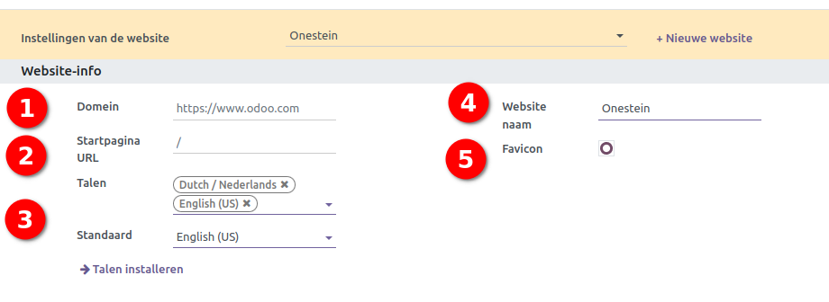
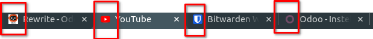
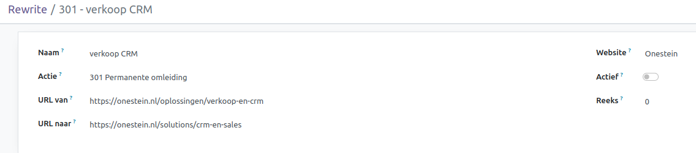
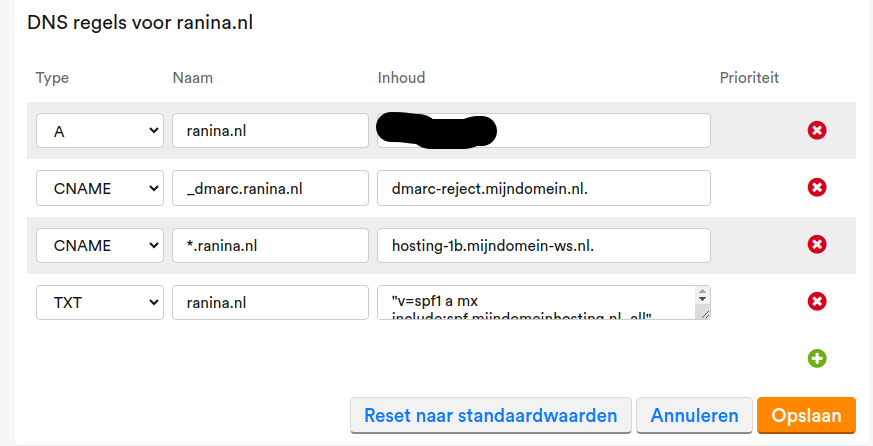
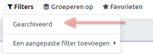

Webdomein instellen
====================================================================

In Curq biedt de 'Website' module een krachtige functionaliteit waarmee je de mogelijkheid hebt om meerdere websites te beheren binnen één Curq-instantie. Deze functionaliteit is buitengewoon handig voor bedrijven en organisaties die diverse online aanwezigheden willen onderhouden zonder de complexiteit van afzonderlijke installaties te beheren.

Een belangrijk concept binnen de context van Curq is het gebruik van 'domeinen' bij het beheren van één of meerdere websites. Het kan zijn dat er al een bestaande website bestaat of dat je begint met de website in Curq. Voor beide geldt dat uiteindelijk het domein van de website ingesteld moet worden. We nemen de belangrijkste stappen met je door. 

Set-up Curq
---------------------------------------------------------------------------------------------------

Via Website - Configuratie - Instellingen, kom je bij de settings om je website(s) te beheren.

1. Geef hier het domein op van je website. **Doe dit pas als de wijziging  is doorgevoerd in de DNS settings van je domein!**
2. Je kunt een startpagina aangeven die geopend moet worden als een bezoeker de website bezoekt. Gebruikelijk staat deze altijd op 'Homepage'  = / (teken)
3. Indien je producten of diensten in het buitenland aanbiedt, dan kan het interessant zijn om meerdere talen te activeren. Ook de standaardtaal kan ingesteld worden.  
4. Geef de naam in van je website
5. De Favicon die je gebruikt wordt zichtbaar in de Tab van de browser. Voorbeeld zie onder:

Redirect oude URL
---------------------------------------------------------------------------------------------------

Deze stap geldt enkel als je een bestaande website wilt omzetten naar Curq. Om te zorgen dat oude 'links' van de website blijven werken is het verstandig om deze te koppelen aan de nieuwe URL's in Curq. Een voorbeeld:  stel je hebt een webpagina over verkoop & CRM op je huidige website > https://onestein.nl/oplossingen/verkoop-en-crm.  In Curq zou de opzet van het menu anders kunnen zijn waarbij de juiste pagina https://onestein.nl/solutions/crm-en-sales is.  Wat je wilt voorkomen is dat een klant die de oude website pagina heeft opgeslagen of eventueel voorkomt in een blog, etc, wordt doorgeleid naar een 404 pagina. De oplossing is om deze redirects alvast klaar te zetten zodat na de omzetting van de DNS server, de redirects geactiveerd kunnen worden.

Hoe stel je de doorverwijzing in? (redirect) **zet hiervoor de developers modus aan!**

Ga naar **Website - configuratie - doorverwijzing**
Klik op **+Nieuw**

Onderstaand een voorbeeld hoe een doorverwijzing kan worden ingesteld. **Belangrijk! Zet de redirect op INACTIEF!**

Bij actie heb je een 4-tal mogelijkheden:

1. **'404 Niet Gevonden':** is een HTTP-statuscode die aangeeft dat de pagina die je probeert te openen op een website niet kan worden gevonden op de server.
2. **'301 Permanente omleiding':** De 301-redirect wordt vaak gebruikt wanneer een pagina permanent naar een nieuwe locatie is verplaatst. Wanneer een browser of zoekmachine een 301-redirect tegenkomt, wordt de oorspronkelijke URL als permanent gewijzigd beschouwd. Subsequente verzoeken naar die URL zullen direct naar de nieuwe locatie worden gestuurd zonder verdere navraag.
3. **'302 Tijdelijke omleiding':** Een 302 redirect geeft aan dat de verplaatsing slechts tijdelijk is. Dit betekent dat de oorspronkelijke URL in de toekomst weer beschikbaar kan zijn op de oorspronkelijke locatie. Anders dan de 301 redirect, behoudt een 302 redirect de oorspronkelijke URL in de browser. Bij een volgend bezoek zal de browser opnieuw naar de oorspronkelijke URL gaan in plaats van naar de nieuwe locatie.
4. **'308 Redirect / Rewrite':** De 308-redirect is ook een vorm van een permanente redirect, maar het belangrijkste verschil ligt in hoe het omgaat met de oorspronkelijke HTTP-methode (bijvoorbeeld GET of POST). In tegenstelling tot de 301, behoudt de 308-redirect de oorspronkelijke HTTP-methode tijdens het volgen van de redirect. Als het oorspronkelijke verzoek bijvoorbeeld een POST-verzoek was, blijft het een POST-verzoek op de nieuwe locatie.

In de praktijk wordt de 308-redirect vaak gebruikt in situaties waarbij het belangrijk is dat de oorspronkelijke HTTP-methode behouden blijft. Dit is vooral van belang bij het omleiden van formulieren of bij andere interactieve verzoeken waarbij de HTTP-methode van belang is.

Set-up DNS Server
---------------------------------------------------------------------------------------------------

Als je inlogt bij je eigen domeinprovider, dan heb je een optie om je DNS gegevens in te stellen of te wijzigen.  Onderstaand heb ik een voorbeeld genomen van 'mijndomein'. 

In bovenstaand voorbeeld dien je het IP adres van Curq in te stellen > **217.20.194.215**
Klik vervolgens op 'Opslaan' om de wijziging te bewaren. De omzetting kan normaliter maximaal 1 uur duren voordat het is omgezet.

De laatste stappen
---------------------------------------------------------------------------------------------------

1. Vul nu het domein in zoals beschreven in **Set-up Curq.**
2. Exporteer alle redirect regels om deze in 1 x op 'Actief' te zetten. Als het goed is staan er geen regels bij redirects. Deze staan op 'Gearchiveerd'

3. Selecteer alle regels en klik op Actie - Exporteer
4. Vinkje aanzetten 'Ik wil gegevens bijwerken' en exporteer
5. Vul in het veld Actief 'Waar' in ipv 'Onwaar. Sla het bestand op.
6. Ga naar Favorieten - Records importeren
7. Upload het bestand wat is opgeslagen

Controleer nu met regelmaat of het domein correct is omgezet en leidt naar de Curq website omgeving.
