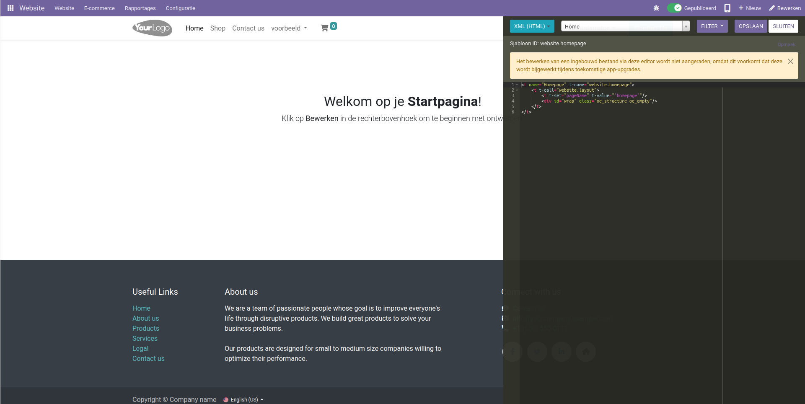

HTML/CSS editor
============================

Binnen de website kan ook de html en de css code van de website handmatig worden aangepast. Hierdoor kan worden aanpassingen niet door de blokken worden gemaakt maar door de aanpassingen direcct met de code uit te voeren. Hierdoor kan de functionaliteid en het uiterlijk worden geoptimaliseerd. Binnen de editor kunnen aanpassingen worden gemaakt aan de paginas en elke individuele component.

Wanneer de html is aangepast kunnen er geen standaard aanpassingen worden gedaan aan de website
