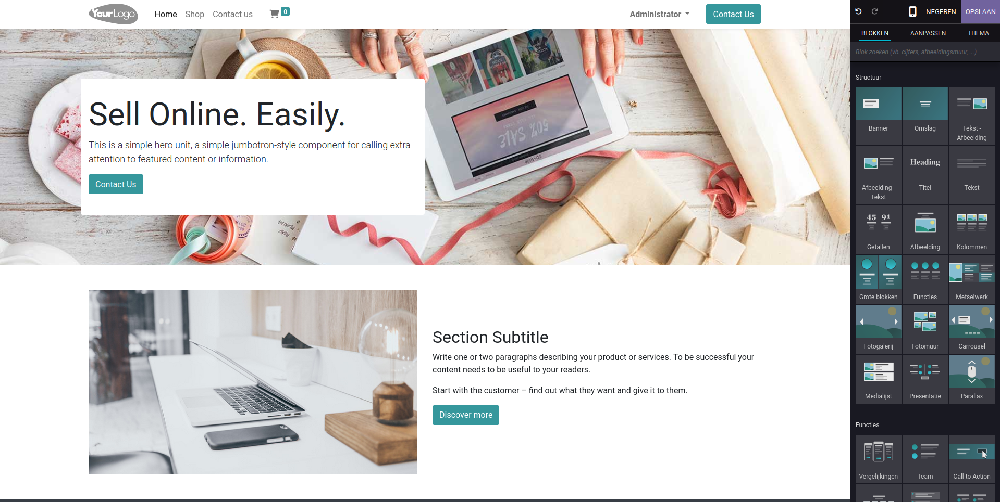

Website
====================================================================

Binnen de Curq-omgeving is het moeiteloos om een volledige en professionele website te creëren met behulp van thema's en de intuïtieve bouwer die pagina's opbouwt met bouwblokken. Met de website-applicatie kun je niet alleen je eigen webshop opzetten, maar ook blogs starten en bijhouden, vacatures plaatsen, evenementen adverteren, en nog veel meer.

Bovendien biedt Curq naadloze integratie met populaire tools zoals OpenStreet Maps, waardoor je locatiegerichte functies kunt toevoegen aan je website, zoals kaarten, routebeschrijvingen en locatiepinnen. Daarnaast heb je toegang tot de uitgebreide Font Awesome-bibliotheek, waarmee je je website kunt verrijken met een breed scala aan prachtige iconen voor een unieke visuele uitstraling.

Door de volledige integratie met alle andere applicaties binnen Curq, kun je jouw website aanpassen aan de specifieke behoeften van jouw bedrijf. Of het nu gaat om het automatiseren van marketingcampagnes of directe interacie met uw klanten. Curq biedt een naadloze ervaring om jouw online aanwezigheid te optimaliseren en je bedrijf te laten groeien.

Met Curq kun je ook eenvoudig de stijl van je website aanpassen wanneer je maar wilt, dankzij verschillende thema's, animaties en een uitgebreide selectie van lettertypen. Of je nu een strak en professioneel design wilt of een creatieve en levendige uitstraling nastreeft, Curq biedt alle tools die je nodig hebt om je website te laten opvallen en je merk te versterken.

.. toctree::
    :maxdepth: 2
    :hidden:

    website_pagina_editor
    Menu_editor
    html_editor
    E-commerce
    SAO optimalisatie
    Webdomein_instellen
    Website_Configuratie
    
