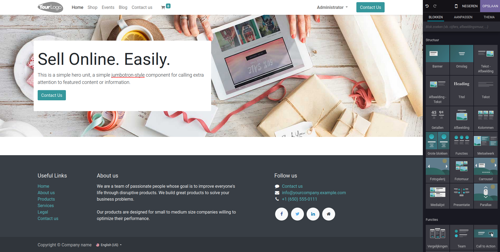
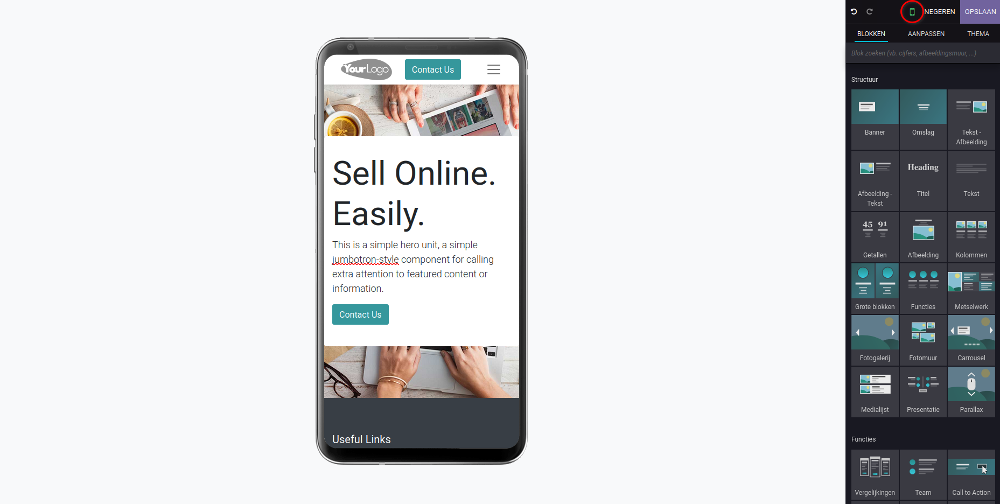
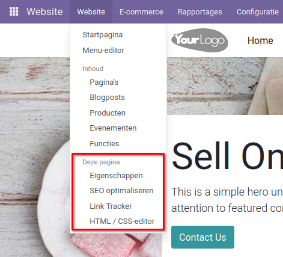

Websitepagina-editor
====================================================================

Met de websitebuilder kun je snel en eenvoudig verschillende pagina's aanmaken. Ga naar de pagina die aangepast moet worden en selecteer "Bewerken" rechtsboven in de hoek. Nu kun je de pagina aanpassen. In het veld dat aan de rechterzijde van het scherm is verschenen, zijn alle bouwblokken te zien. Door de blokken naar de pagina te slepen, kun je de pagina inrichten zoals jij dat wilt.

Er zijn vier typen blokken:

#. **Structuur:** Dit zijn de grootste blokken en brengen een vaste structuur aan de website.
#. **Functies:** Deze blokken zijn gericht op specifieke functies zoals een prijslijst of een call-to-action.
#. **Dynamische inhoud:** Onder dynamische inhoud staan blokken met meer interactiviteit zoals kaarten, formulieren en pop-ups.
#. **Binnenste inhoud:** Deze blokken zijn kleinere functionaliteiten die aan andere blokken kunnen worden toegevoegd.

De blokken zelf kunnen ook aangepast worden onder het tabblad "Aanpassen". Hier kan het lettertype en de grootte van de tekst aangepast worden, de grootte van de kolommen ingesteld worden, animaties toegevoegd worden en nog veel meer. Ook kan het thema aangepast worden onder het themaveld. Hier kies je de kleuren van de website en op welke manier deze worden weergegeven, en de algemene stijl van de website bepaalt met het uiterlijk van de knoppen en tekstvakken.

Wanneer een bouwblok op de website is gesleept, kan deze ook handmatig worden aangepast. Elke foto kan veranderd worden met een van de beschikbare foto's of ze kunnen geïmporteerd worden. Ook kan er via een link video's aan de website worden toegevoegd. In de tekstvakken kan de tekst zelf worden aangepast en door een '/' te gebruiken krijg je meerdere opties om de website aan te passen:

- Pas de structuur aan met opsommingen, checklijsten, tabellen, citaten en eigen code, ook kan het vlak verdeeld worden in meerdere kolommen.
- Pas de opmaak van het vlak aan met koppen, de richting van de tekst en creëer tekstblokken.
- Voeg media zoals afbeeldingen en video's toe.
- Creëer snelkoppelingen en knoppen.
- Voeg widgets zoals sterren toe.
- Voeg snippets zoals kaarten, grafieken, badges en citaten toe.
- Creëer een veld om handtekeningen toe te voegen.

Boven de velden is ook een optie aanwezig om de website in een telefoonweergave te zien en hier ook aanpassingen in te maken.

Wanneer alle gewenste aanpassingen aan de pagina zijn gedaan, selecteer dan rechtsboven in de hoek "Opslaan". Als de aanpassingen niet doorgevoerd moeten worden, selecteer dan "Negeren".

Om de menu's aan te passen, ga dan naar het website menu en selecteer daar onder "Menu-editor". Hier zijn de verschillende pagina's zichtbaar en kunnen er meerdere menu-items aangemaakt worden, waaronder supermenu's om de verschillende menu's te categoriseren en te verduidelijken.

Er kan een SEO-optimalisatie uitgevoerd worden om uw website beter vindbaar te maken met zoekmachines onder het "Dezepagina" veld in de website-tab. Ook kan de website aangepast worden met eigen HTML- en CSS-code en de geïntegreerde editor. Hier kan voor elke pagina en item de code worden aangepast om de puntjes op de i te zetten. Wanneer de HTML-code wordt aangepast, wordt de website echter niet meegenomen in de updates en dit kan voor complicaties zorgen wanneer Curq naar een nieuwe versie gaat.

