====================================================================
Odoo 15 Membership Module
====================================================================
---------------------------------------------------------------------------------------------------
How to configure and register using the Membership Module
---------------------------------------------------------------------------------------------------

Author: Richard Varghese, Angelene Naidoo

Date: 2023-03-24

**Table of Contents**

`Introduction 3 <#introduction>`__

`1. Configuration 4 <#configuration>`__

`1.1 Create Job Position 4 <#create-job-position>`__

`1.2 Set up Job Stages 5 <#set-up-job-stages>`__

`1.2.1 Administrator Access (Debug mode)
5 <#administrator-access-debug-mode>`__

`1.2.2 Job stages 6 <#job-stages>`__

`1.3 Membership Section and Mailing List
7 <#membership-section-and-mailing-list>`__

`1.3.1 Create Mailing List 7 <#create-mailing-list>`__

`1.3.2 Create Membership Sections (Areas of Interest)
8 <#create-membership-sections-areas-of-interest>`__

`1.3.3 Member Registration Page 13 <#member-registration-page>`__

`1.3.4 Customize Registration Page 14 <#customize-registration-page>`__

`1.3.5 Configure Mollie Payment 15 <#configure-mollie-payment>`__

`1.4 Membership Products 19 <#membership-products>`__

`1.4.1 Free Member Product 19 <#free-member-product>`__

`1.4.2 Paid Member Product: One- time Payment
20 <#paid-member-product-one--time-payment>`__

`1.4.3 Subscription Product 21 <#subscription-product>`__

`2. Registering as a New Member 23 <#registering-as-a-new-member>`__

`2.1 Free Membership 25 <#free-membership>`__

`2.2 Premium Membership 27 <#premium-membership>`__

`3. Intake process 28 <#intake-process>`__

`4. User Settings 32 <#user-settings>`__

`5. Creating members/employees from contact
35 <#creating-membersemployees-from-contact>`__

`5.1 Create a contact 35 <#create-a-contact>`__

`5.2 Convert contact into member 35 <#convert-contact-into-member>`__

`5.3 Convert member into Employee 39 <#convert-member-into-employee>`__

Introduction
====================================================================

The membership module is created to enable individuals to register on
platforms, join communities and/or organizations. The membership module
gives individuals various options, allowing for an experience customized
to the needs of the members. One can join as a Free Member or a Premium
Member of the organization, and has the ability to follow or participate
in various areas of interest. These options are configured from the
backend.

After registering on the page and verifying their email, members are
taken through an intake procedure. The stages of the intake procedure
can be customized. From an administration perspective this allows for
easy viewing of important information such as Areas of Interest,
Projects, and Type of Membership. From a member perspective, individuals
are granted access to the portal in which they can view their projects,
assigned tasks, and do general expense reimbursement for their project
work.

1. Configuration
====================================================================

1.1 Create Job Position
---------------------------------------------------------------------------------------------------

Roles supported: Administrator/ Employees officer group rights

-  Select Recruitment section

-  Create Job Position for Volunteer Member

   .. image:: Membership-Module-Media/image1.png
      :width: 6.68958in
      :height: 1.31736in

-  Publish Job Position

.. image:: Membership-Module-Media/image2.png
   :width: 6.68958in
   :height: 1.51389in

-  Navigate to Settings, Website, Membership Registration

-  Check ´Allow Membership Registration´

-  Select Membership Job ´Volunteer Member´

-  Choose a number of days after which unverified members will be
   cleaned up.

-  Save

.. image:: Membership-Module-Media/image3.png
   :width: 6.68958in
   :height: 3.69375in

**1.2 Set up Job Stages**
---------------------------------------------------------------------------------------------------

1.2.1 Administrator Access (Debug mode)
~~~~~~~~~~~~~~~~~~~~~~~~~~~~~~~~~~~~~~~

To create job stages, administration access and Developer Mode (debug
mode) is needed.

-  Navigate to Settings, General Settings

-  Select ´Activate the developer mode´ at the bottom of the page

.. image:: Membership-Module-Media/image4.png
   :width: 6.68958in
   :height: 3.16389in

1.2.2 Job stages
~~~~~~~~~~~~~~~~~

-  Navigate to Recruitment section.

-  Configuration, Stages, and select a stage.

.. image:: Membership-Module-Media/image5.png
   :width: 6.68958in
   :height: 1.80556in

-  Click Edit, rename the stage (Example: Application Date)

-  In Job Specific select ´Volunteer Member´

.. image:: Membership-Module-Media/image6.png
   :width: 6.68958in
   :height: 2.90556in

**1.3 Membership Section and Mailing List**
---------------------------------------------------------------------------------------------------

Connect to the membership section (Area of interest) to a mailing list.

**1.3.1 Create Mailing List**
~~~~~~~~~~~~~~~~~~~~~~~~~~~~~~

Roles supported: Administrator/Email marketing

-  Navigate to Email Marketing.

-  Select ´Mailing Lists´ and click Create.

.. image:: Membership-Module-Media/image7.png
   :width: 4.64931in
   :height: 0.86806in

.. image:: Membership-Module-Media/image8.png
   :width: 4.61111in
   :height: 1.47708in

-  The Mailing List should be the same as the membership section.
   Example: Green Energy

-  Check ´Is Public´

|image1|
---------------------------------------------------------------------------------------------------

For more information on creating mailing lists refer to the
documentation on Email Marketing.

1.3.2 Create Membership Sections (Areas of Interest)
~~~~~~~~~~~~~~~~~~~~~~~~~~~~~~~~~~~~~~~~~~~~~~~~~~~~

Roles supported: Administrator/Membership Manager

-  Navigate to Members

-  Configuration, Sections and click Create

.. image:: Membership-Module-Media/image10.png
   :width: 6.68958in
   :height: 1.18472in

-  Name the Section (Example: Green Energy).

-  Select/create the relevant mailing list (if it has not already been
   created).

-  Human Resources: Department – This links section to an HR Department
   (not necessary to the process to select one).

-  Committee – Link to a committee (group of people that take decisions
   on the Section). Not mandatory for the process.

-  In Website Description tab, upload an icon to be displayed on the
   registration page.

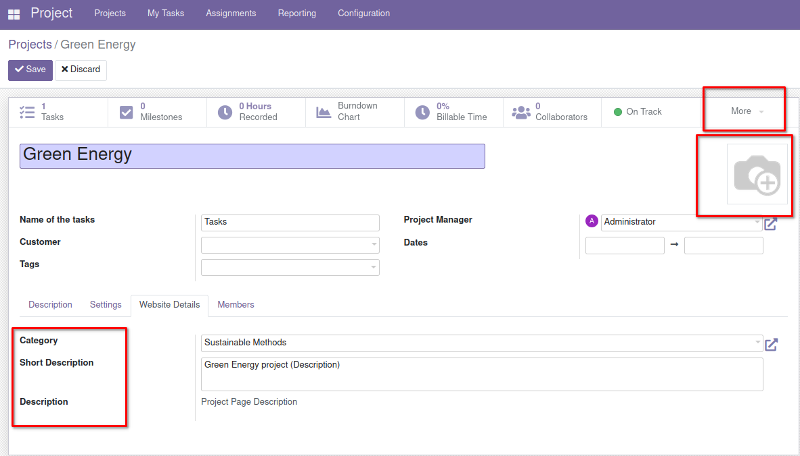

The user can now either create the section on the website **or** link
the Section to a current website page.

To create the membership section on the website:

-  Select Website Description tab

-  Upload icon and image

-  In Website Top and Website Bottom write the title and description.

-  Save.

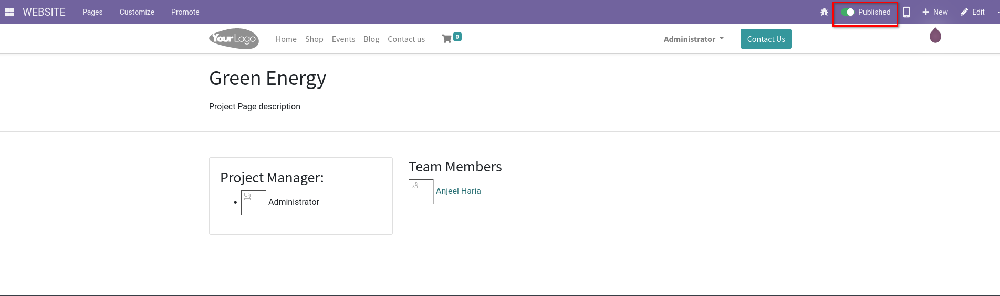

-  Click ´Go to Website´

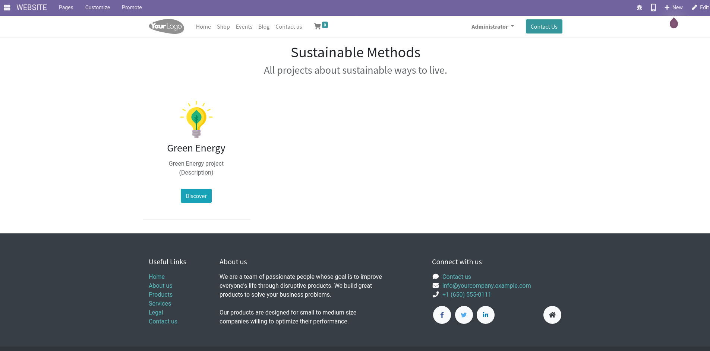

-  Click Published

.. image:: Membership-Module-Media/image14.png
   :width: 6.68958in
   :height: 3.21389in

**Alternatively**, to link the membership section to a current website
page:

-  Fill in Section Name

-  Select Mailing list

-  In Website Description tab upload icon

-  Save

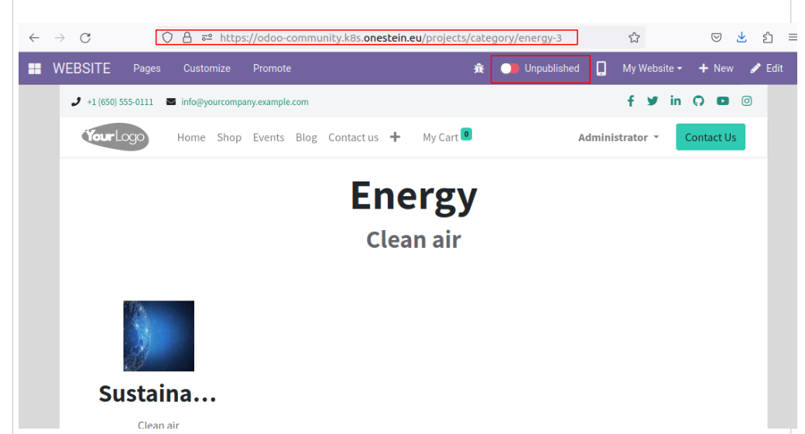

-  Click ´Go to Website´

-  Check Published

.. image:: Membership-Module-Media/image16.png
   :width: 6.68958in
   :height: 3.15694in

-  Go back to the relevant section, click Edit

-  Website: Page – Select relevant page

-  Save

.. image:: Membership-Module-Media/image17.png
   :width: 6.68958in
   :height: 3.30694in

Now a Membership Section is created on the website. Clicking on the
section name/attached icon on the registration page will open to the
website page.

1.3.3 Member Registration Page
~~~~~~~~~~~~~~~~~~~~~~~~~~~~~~~

The user can view the registration page by following the link:

|image2|\ **https://{Your domain}/membership-registration**

1.3.4 Customize Registration Page
~~~~~~~~~~~~~~~~~~~~~~~~~~~~~~~~~~

Roles supported: Administrator/Website Designer

-  Settings, Website, Membership

-  Background type: Colour, Linear gradient, Radial gradient or Image

-  Choose Gradient Colour start and end, and Save

.. image:: Membership-Module-Media/image19.png
   :width: 5.05764in
   :height: 3.24861in

.. _section-1:

.. image:: Membership-Module-Media/image20.png
   :width: 6.68958in
   :height: 2.6375in

1.3.5 Configure Mollie Payment
~~~~~~~~~~~~~~~~~~~~~~~~~~~~~~~

Roles supported: Administrator/Settings

-  Navigate to Invoicing, Configuration, Payment Acquirers

.. image:: Membership-Module-Media/image21.png
   :width: 6.69306in
   :height: 2.93403in

-  Select Mollie and Edit

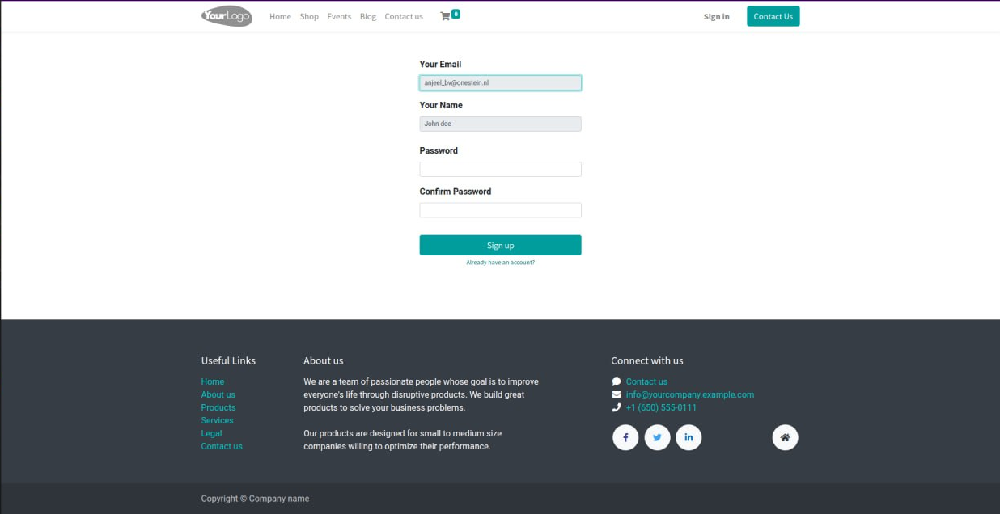

-  State – select ´Enabled´

-  API Key – Fill in details

-  Check ´Mollie Components´

-  Mollie Profile ID – Fill in details

-  If user wishes to save card details for future purposes, enable
   Single- click Payments

.. image:: Membership-Module-Media/image23.png
   :width: 6.69306in
   :height: 2.525in

-  Select Configuration Tab

-  Payment Journal – Select or define Journal as per userś requirement

.. image:: Membership-Module-Media/image24.png
   :width: 6.69306in
   :height: 2.57639in

-  Select Fees Tab, enable Extra Fees if needed

   .. image:: Membership-Module-Media/image25.png
      :width: 6.68958in
      :height: 2.68819in

-  Select Messages Tab, customize simple messages members will receive
   when registering

   .. image:: Membership-Module-Media/image26.png
      :width: 6.68958in
      :height: 2.7625in

-  Save

-  Select Mollie Payment Methods Tab, and click Sync Payments

-  |image3|\ Check Enabled on shop

1.4 Membership Products
---------------------------------------------------------------------------------------------------

Roles supported: Administrator/Membership Manager

-  Navigate to Members, Configuration, Membership Products

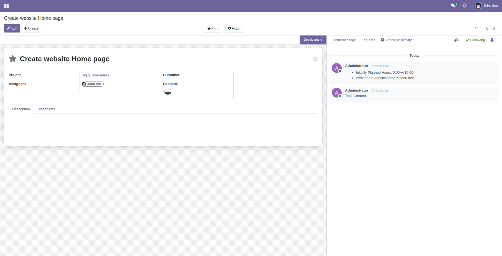

-  Click on Create and fill in the details (Product Name, Membership
   duration, and Membership fee).

-  Product category: Select relevant category

-  Check ´Active´ and ´visible on current website´

-  Save

1.4.1 Free Member Product
~~~~~~~~~~~~~~~~~~~~~~~~~~

For the Free Membership Product the membership fee should be set at 0.0

.. image:: Membership-Module-Media/image29.png
   :width: 6.52569in
   :height: 2.84375in

1.4.2 Paid Member Product: One- time Payment
~~~~~~~~~~~~~~~~~~~~~~~~~~~~~~~~~~~~~~~~~~~~

For the One-Time Payment Product fill in the relevant membership fee.

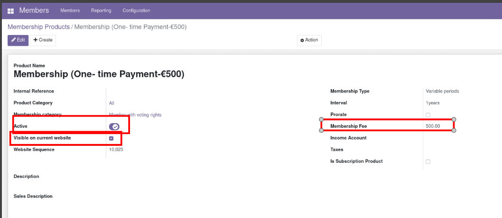

The Membership Products will appear on the registration page as:

.. _section-2:

.. _section-3:

1.4.3 Subscription Product
~~~~~~~~~~~~~~~~~~~~~~~~~~

Roles supported: Administrator/Membership Manager

Alongside the free and paid membership products, it is possible to
configure a subscription product.

-  Navigate to Member, Configuration, Membership Products

-  Product Name – Describe subscription (Example: Subscription Monthly
   x3)

-  Fill in details: Duration, Fee, product category

-  Check ´Active´ and ´Visible on current website´

-  Check ´Is Subscription Product´

-  Frequency – Fill in how many times per subscription period (Example:
   once monthly)

-  Subscription Period – Day/Month/Year

-  Times - Total number of charges for completing the subscription

-  Click Save

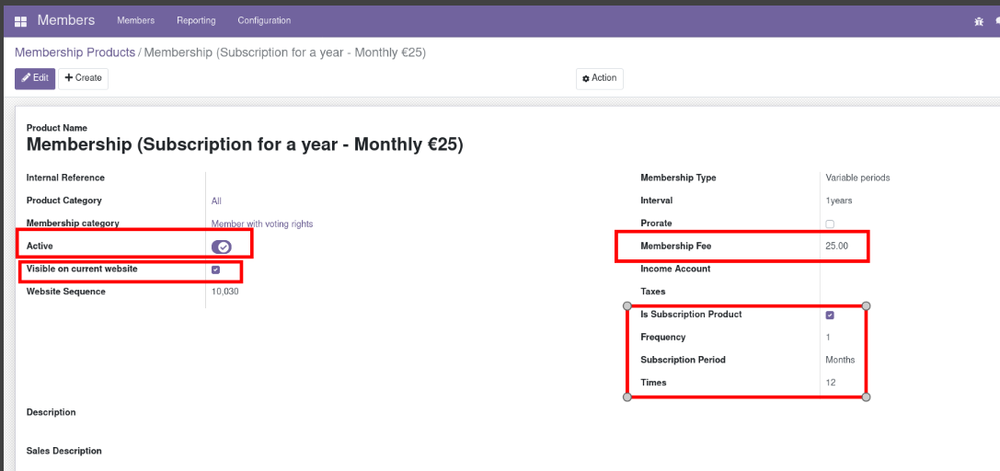

2. Registering as a New Member
====================================================================

Use the URL: https://{**domain**}/membership-registration.

.. _section-4:

|image4|
---------------------------------------------------------------------------------------------------

.. _section-5:

.. _section-6:

.. _section-7:

.. _section-8:

.. _section-9:

.. _section-10:

.. _section-11:

-  Fill in basic personal information (Name, Email ID, Phone Number)

-  Select Area(s) of Interest, use respective checkboxes to Follow
   and/or Collaborate

-  Check ´Publish me as a member´

-  Select Membership Level.

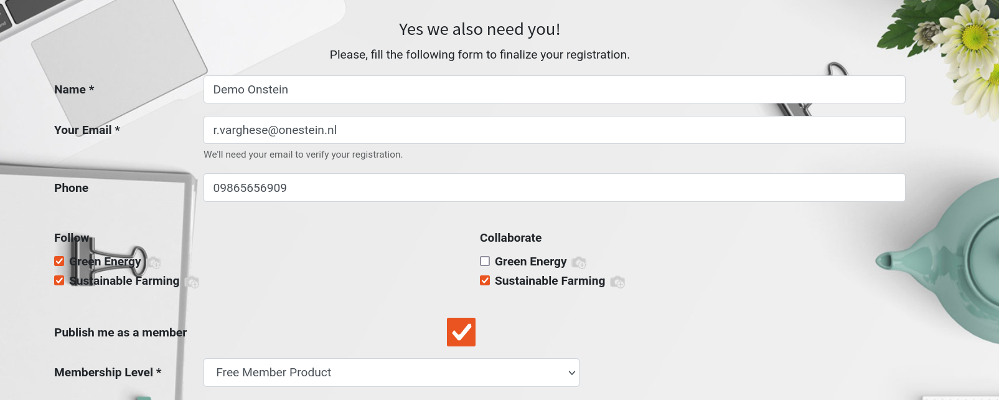

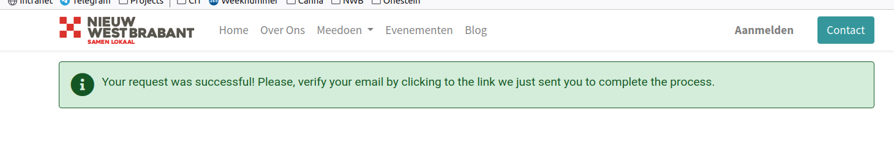

If the email ID is already registered it will prompt with an alert.

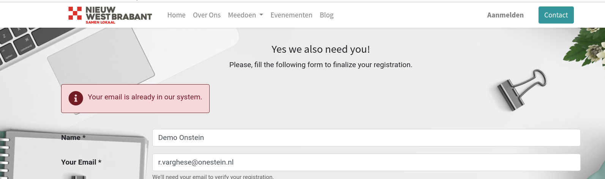

**2.1 Free Membership**
---------------------------------------------------------------------------------------------------

The new Free Member will receive an Email.

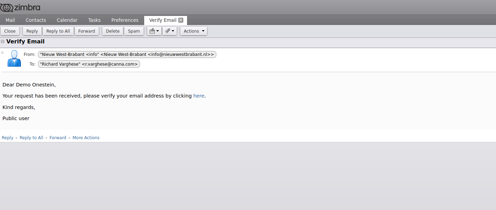

The Free Member should validate their Email ID by clicking **here**.

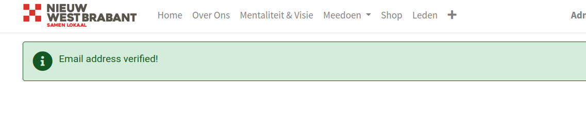

The user is sent an Email to **activate & reset password** for portal
access.

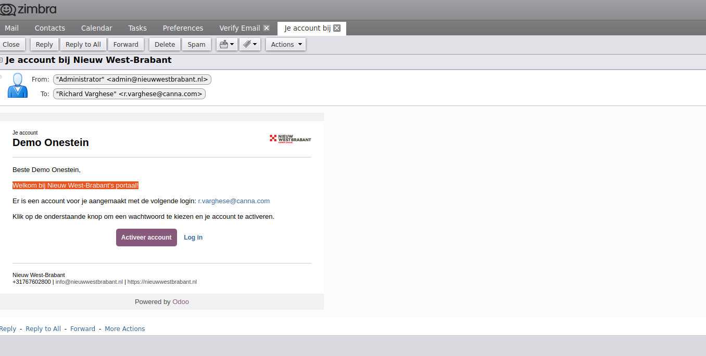

The user should reset their password.

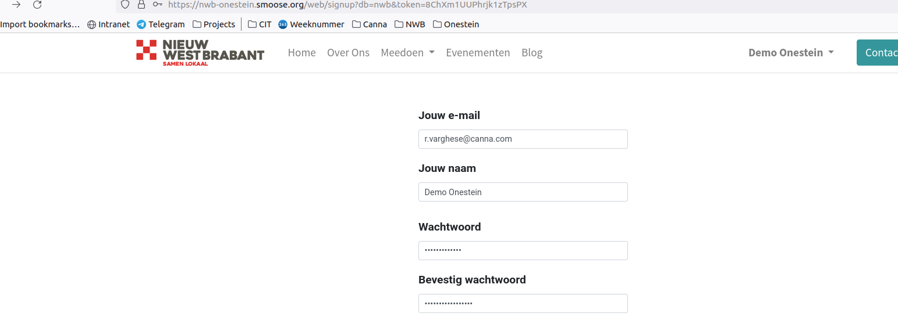

The user is then granted access to the portal.

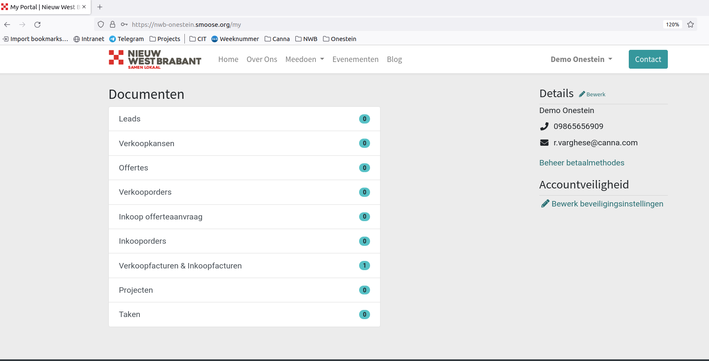

**2.2 Premium Membership**
---------------------------------------------------------------------------------------------------

When user presses Send on registration page they are taken to a payment
page. As Premium Members enter verified payment information, no
verification email is needed.

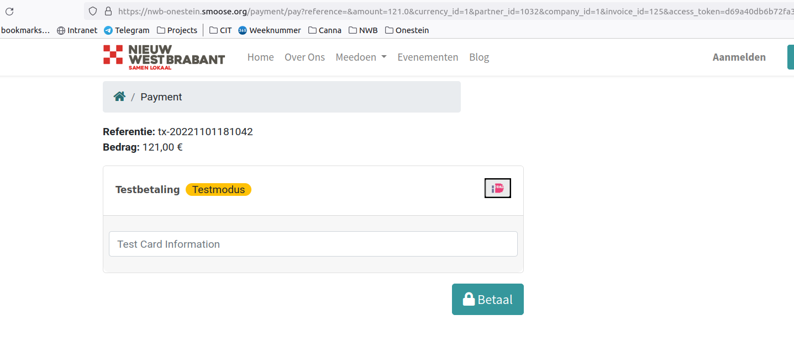

**3. Intake process**
====================================================================

Roles supported: Administrator/ Employees officer

-  Navigate to Recruitment

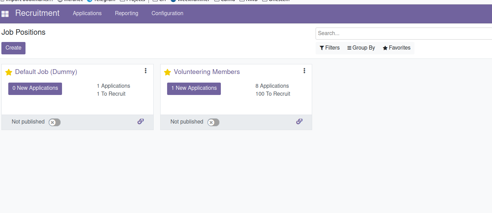

-  Volunteering Members is the new job position created for members.

-  Click on ´New Applications´ under Volunteering Members to open the
   Kanban view of all the member applications.

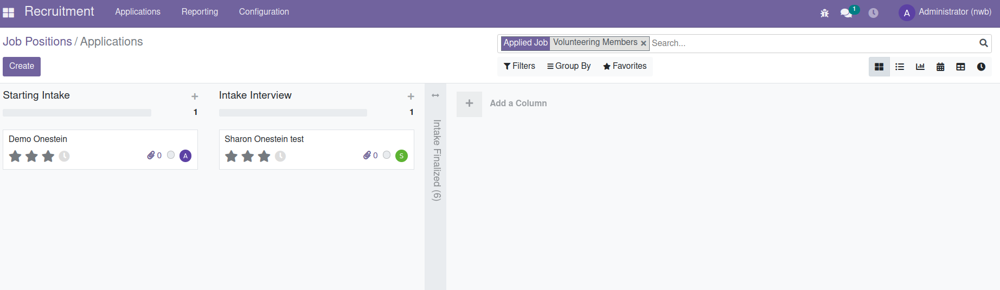

-  Click on the applicant to view their basic information such as
   contact details.

-  Membership Tab shows their Areas of Interest.

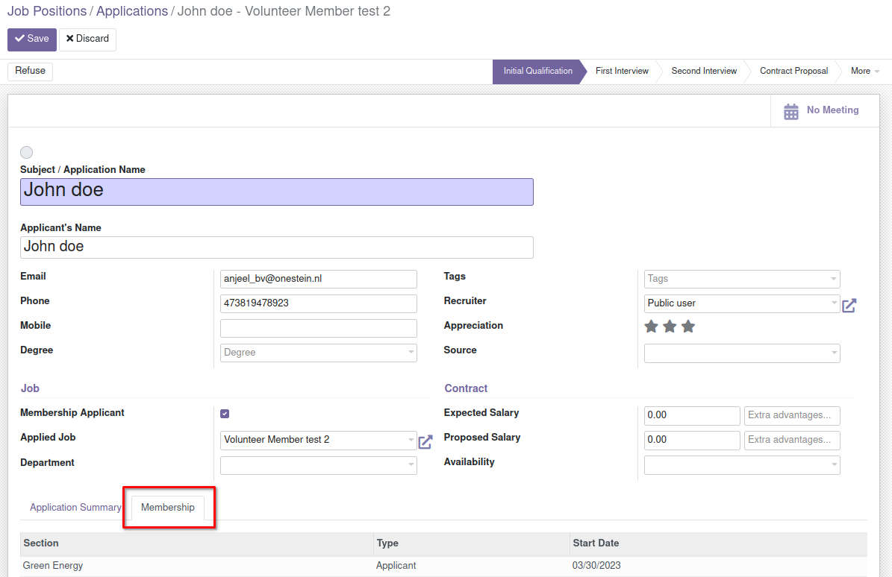

-  Click on various stages of intake as the intake officer progresses.

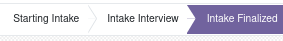

-  The last stage of the intake process will place the employee in the
   Hired stage.

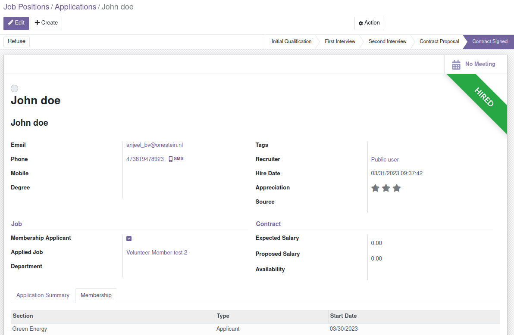

-  Click Create Employee to convert the hired applicant to a **Member
   Employee.** This opens a window to edit employee details.

-  Enter additional employee details (bank account, address, contact
   details)

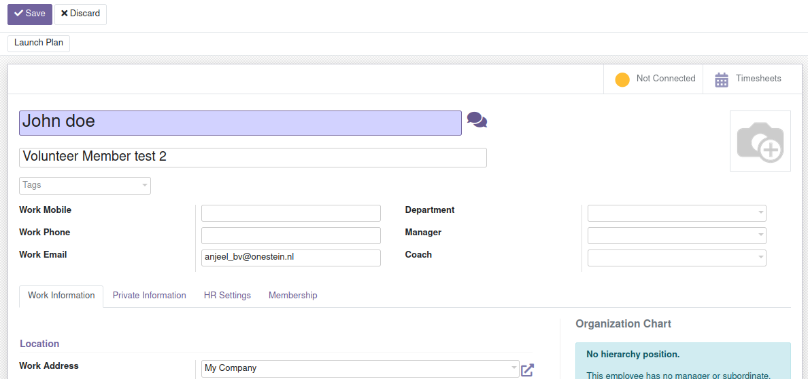

-  HR Settings tab: The Employee Type should stay as ´Member´

-  |image5|\ Save

-  The member can now be viewed in the Employees section. The Member
   Employee now has access to Expense claim, Project etc…

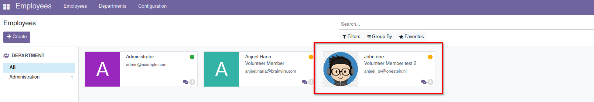

4. User Settings
====================================================================

Roles supported: Administrator/Settings

-  Navigate to Settings, General Settings, Manage Users

-  Remove Internal User filter

-  Click on member

.. image:: Membership-Module-Media/image50.png
   :width: 6.69306in
   :height: 1.14444in

-  User Type: User types - Change the setting from Portal to Internal
   User

-  Services: Project – Select ´user´

-  Services: Time-sheet – Select ´User: own time-sheets only´

-  Save

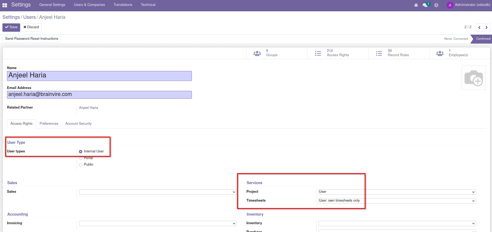

-  The member will receive an email to activate their account:

.. image:: Membership-Module-Media/image52.png
   :width: 5.88681in
   :height: 3.69167in

.. _section-12:

.. image:: Membership-Module-Media/image53.png
   :width: 6.90625in
   :height: 3.64097in

5. Creating members/employees from contact
====================================================================

5.1 Create a contact
---------------------------------------------------------------------------------------------------

-  Go to Contacts ,Click on Create

-  Enter name , email id , billing address details etc.

   .. image:: Membership-Module-Media/image54.png
      :width: 6.43958in
      :height: 3.97569in

-  Save the record.

5.2 Convert contact into member
---------------------------------------------------------------------------------------------------

We can convert a newly created contact or an existing contact (Which is
not a member) into a member by opening the relevant contact, going into
membership tab and click on “Buy Membership” as shown in the screenshot

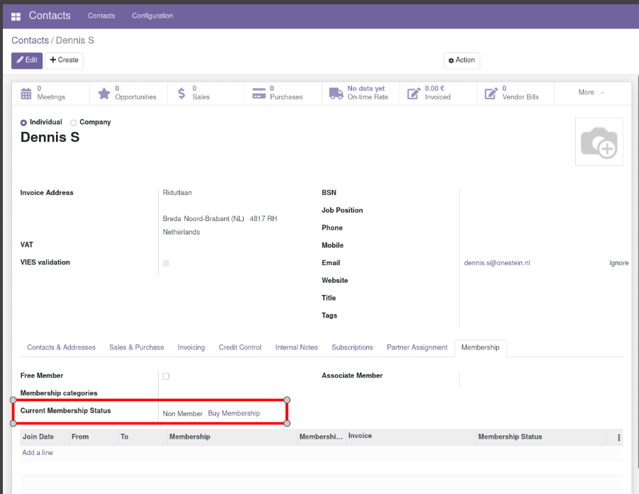

-  Wizard will show up with the available membership options like Paid
   Membership, Free Membership etc.

   .. image:: Membership-Module-Media/image56.png
      :width: 6.43958in
      :height: 4.97569in

-  Select the appropriate option for Membership and click on “Invoice
   Membership” button . You will see the list of Invoices.

   .. image:: Membership-Module-Media/image57.png
      :width: 5.89444in
      :height: 4.00625in

-  Open the invoice, Confirm it and register the payment if its a paid
   membership.

   .. image:: Membership-Module-Media/image58.png
      :width: 5.84722in
      :height: 3.54097in

-  If you check the contact, It would now be a member. You can see the
   membership details in the membership tab.

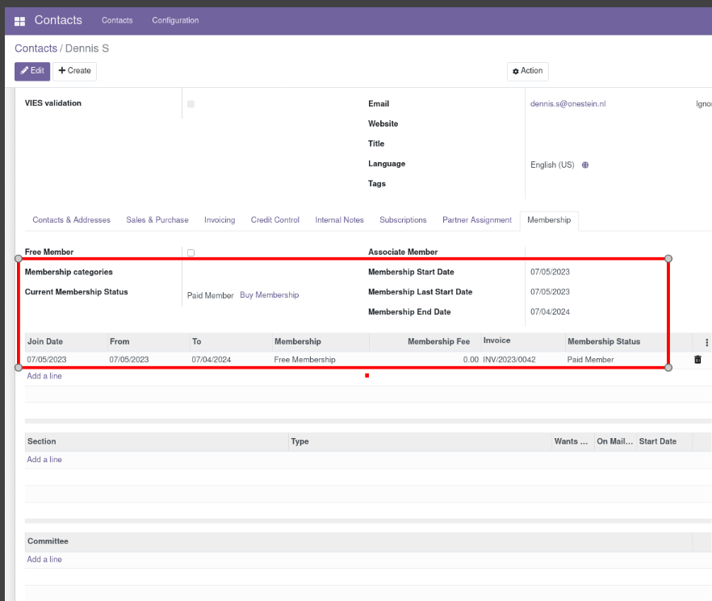

**5.3 Convert member into Employee**
---------------------------------------------------------------------------------------------------

Go into Action → Click on Grant Portal Access. This would make members
portal users of the system.

-  |image6|\ Go to Users and remove all the filter → Select the user→Go
   to Access Right and make it as Internal User from User Type

-  Under Sales , Select Own documents only

-  Under Project , Select User

-  Under Timesheet, Select Own timesheet only

-  Click on Save

   .. image:: Membership-Module-Media/image61.png
      :width: 6.43958in
      :height: 4.97569in

-  “Create Employee” button will be visible after saving the record.

-  Click on the button to make a member an employee.

   .. image:: Membership-Module-Media/image62.png
      :width: 6.43958in
      :height: 4.97569in

-  Employee will be created for user and you can find it under Employees
   section. Now this employee can be assigned to projects, tasks etc.

   .. image:: Membership-Module-Media/image63.png
      :width: 6.1125in
      :height: 4.72292in

To assign members to projects, publish projects and members, create
tasks and fill time-sheets,please refer to the Odoo 15 Project
Management documentation.

For the checklist refer to the Community Container Checklist File.

.. |image1| image:: Membership-Module-Media/image9.png
   :width: 6.68958in
   :height: 1.59375in
.. |image2| image:: Membership-Module-Media/image18.png
   :width: 5.97222in
   :height: 2.40694in
.. |image3| image:: Membership-Module-Media/image27.png
   :width: 6.69306in
   :height: 2.425in
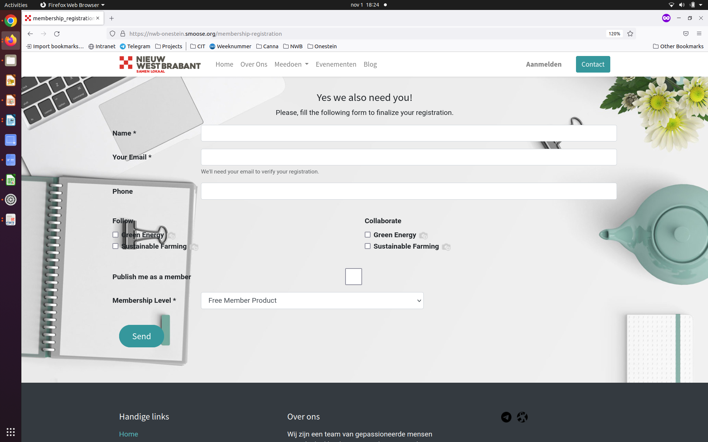
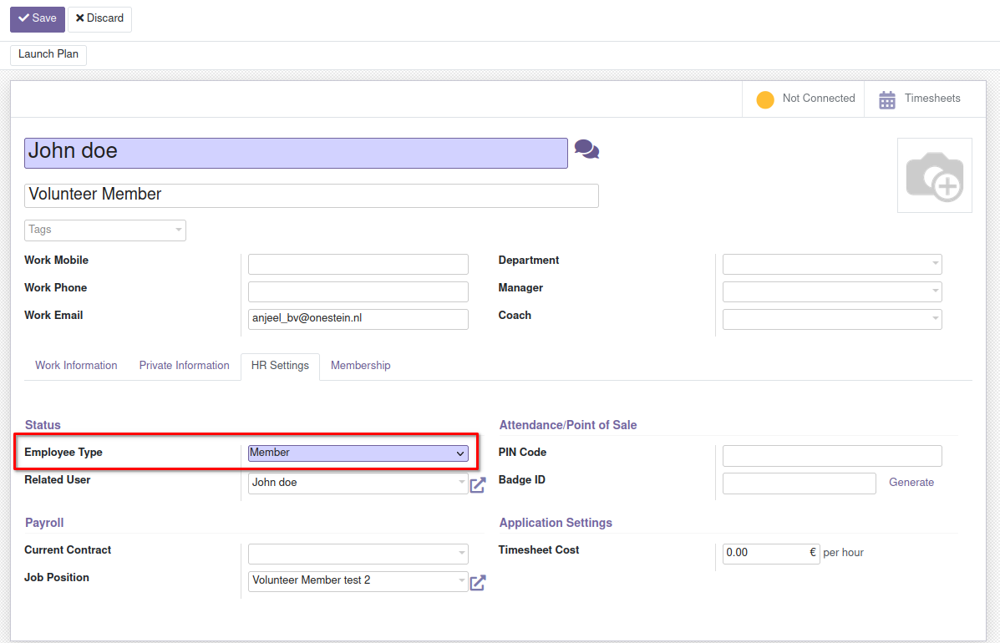
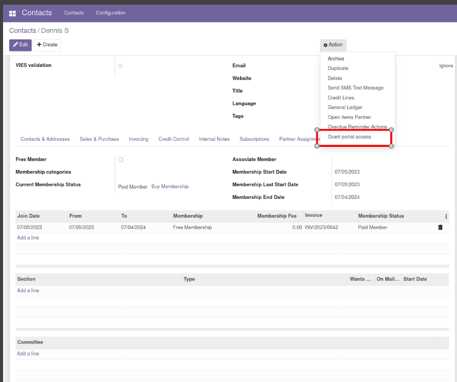
