====================================================================
Odoo 15 Project Management
====================================================================
---------------------------------------------------------------------------------------------------
Project Management Configuration
---------------------------------------------------------------------------------------------------

Author: Richard Varghese, Angelene Naidoo

Date: 2023-03-24

Table of Contents

`Introduction 3 <#introduction>`__

`1 Assign Member to Project 4 <#assign-member-to-project>`__

`1.1 Create Project 4 <#create-project>`__

`1.2 Create Project Roles 4 <#create-project-roles>`__

`1.3 Connect Project role to Project & member
6 <#connect-project-role-to-project-member>`__

`1.4 Create Project Categories 8 <#create-project-categories>`__

`2 Publish Project / Categories
9 <#publish-project-categories-members>`__

`2.1 Publish Categories 12 <#publish-categories>`__

`2.2 Publish member 12 <#publish-member>`__

`3 Create/Assign Tasks to Members 15 <#createassign-tasks-to-members>`__

`3.1 User Settings 15 <#user-settings>`__

`3.2 Create and Assign Task 18 <#create-and-assign-task>`__

`3.3 Fill Time-sheets 23 <#fill-time-sheets>`__

Introduction
====================================================================

The membership module is created to enable individuals to register on
platforms, join communities and/or organizations. The membership module
gives individuals various options, allowing for an experience customized
to the needs of the members. One can join as a Free Member or a Premium
Member of the organization, and has the ability to follow or participate
in various areas of interest.

The member can be assigned to projects and tasks. Projects can be
published on the website with a project image, description, list of
members and member image/information.

**1 Assign Member to Project** 
====================================================================

1.1 Create Project 
---------------------------------------------------------------------------------------------------

Roles supported: Administrator/ Project administrator

-  Navigate to Projects

-  Click Create and name the Project

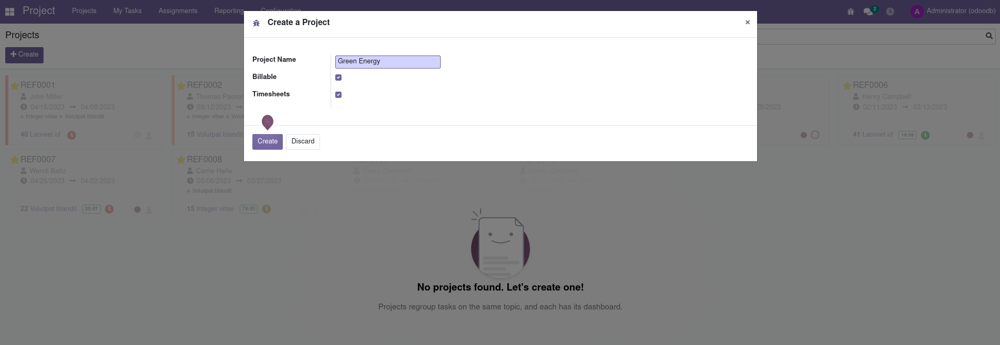

1.2 Create Project Roles
---------------------------------------------------------------------------------------------------

Roles supported: Administration/settings

-  Navigate to Projects, Configuration, Project Roles

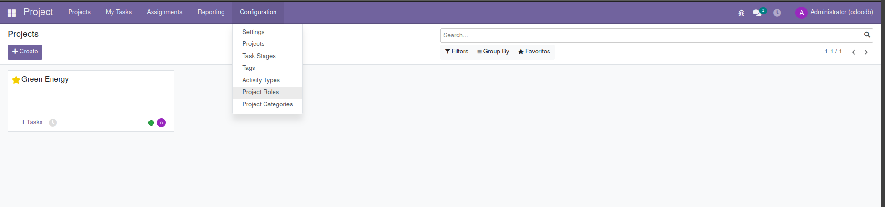

-  Click Create

-  In Parent Role write main role (Example: Developer) and click Create

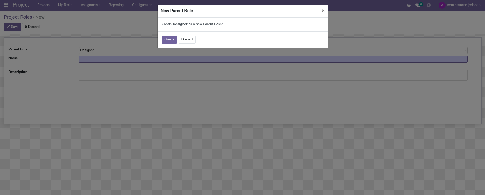

-  Save

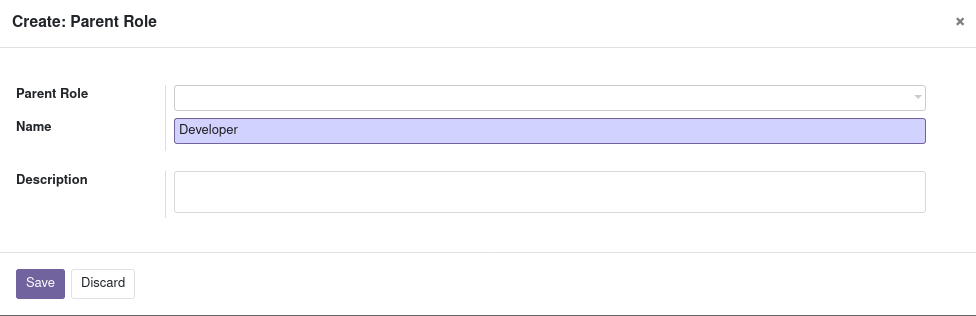

-  Parent Role: select required role (Example: Developer)

-  Name: fill in the role (Example: Front-end developer)

-  Save

.. image:: Project-Management-Media/image5.png
   :width: 6.68958in
   :height: 1.84931in

1.3 Connect Project role to Project & member
---------------------------------------------------------------------------------------------------

Roles supported: Administrator/ Project Administrator

To connect the project role to the project and assign the role to a
member select Assignments.

-  Select Project, Role and User. Save

.. image:: Project-Management-Media/image6.png
   :width: 6.68958in
   :height: 0.92153in

-  Navigate to Project, select required project, Edit

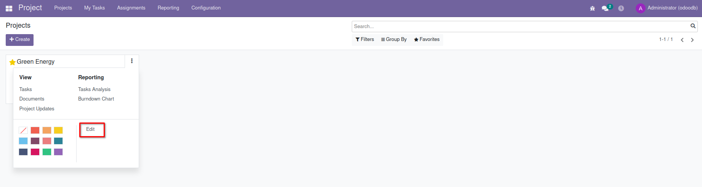

-  Members Tab: the new member can be viewed in the project.

.. image:: Project-Management-Media/image8.png
   :width: 6.68958in
   :height: 3.86319in

1.4 Create Project Categories
---------------------------------------------------------------------------------------------------

Roles supported: Administrator/ Project Administrator

Project Categories are displayed on the website with the related
projects underneath. Example: In the category of Sustainable Methods is
the project Green Energy.

-  Navigate to Project, Configuration, Project Categories

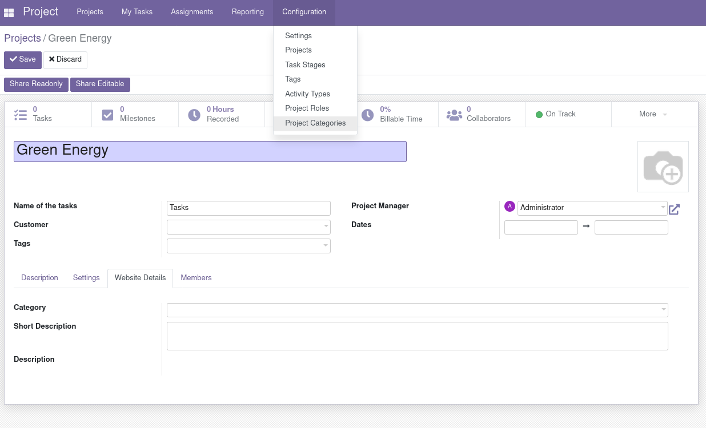

-  Click Create

-  Name the category (displayed as Heading on the website)

-  Write a description (displayed as sub-Heading on the website)

-  Select Project

-  Save

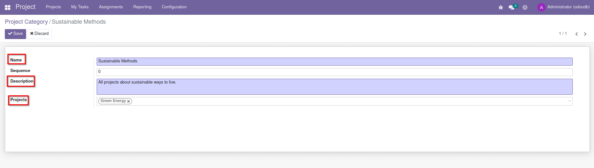

2 Publish Project / Categories / Members
====================================================================

Roles supported: Administrator/ Project Administrator

-  Navigate to Project Edit Page : Project>> {project} >> Edit

-  Select Website Details tab

-  Category: select relevant option

-  Fill in Short Description to be shown on list of projects on the
   website (only text).

-  Fill in Description to be shown on project page itself (can contain
   HTML formatted text).

-  Upload Project image (the ratio is 1:1). Note: images deviating from
   the ratio will get distorted, especially landscape images.

-  Save

-  Select ´More´ and ´Go to Website´

.. image:: Project-Management-Media/image11.png
   :width: 6.36736in
   :height: 3.64167in

-  Click Published

.. image:: Project-Management-Media/image12.png
   :width: 6.68958in
   :height: 1.98611in

-  Users can view list of projects at **https://{Your domain}/projects**

.. image:: Project-Management-Media/image13.png
   :width: 6.68958in
   :height: 3.31111in

-  Click´Discover´ to view the Project and Members

.. image:: Project-Management-Media/image14.png
   :width: 6.68958in
   :height: 3.26042in

2.1 Publish **Categories**
---------------------------------------------------------------------------------------------------

-  Navigate to Project >> Configuration >> Project Categories

-  Select the {category}

-  Click **Go to website**

-  Click <Unpublished> to **Publish**

-  Use the URL in your any page during content creation

.. image:: Project-Management-Media/image15.png
   :width: 6.68958in
   :height: 3.61458in

2.\ **2** Publish member 
---------------------------------------------------------------------------------------------------

Roles supported: Administrator/Settings

-  Members can opt for being published during registration or can be
   published from a member website page

-  An option to publish the memberś picture on the website is available
   if the member wishes.

-  Navigate to Settings, General Settings, select Manage Users

.. image:: Project-Management-Media/image16.png
   :width: 6.69306in
   :height: 3.10278in

-  Remove internal users filter

-  Click on the member, Edit

-  Add image

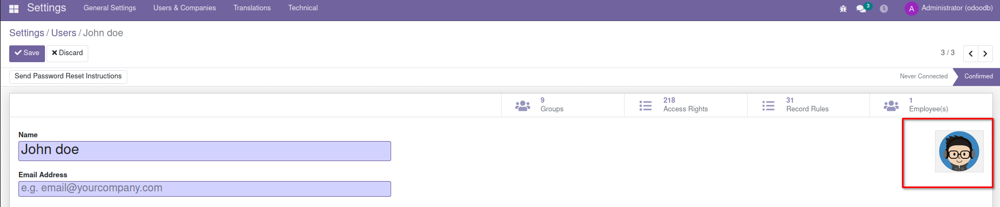

For members who do not want to be published at the time of registration:

-  They have to uncheck the box ´Publish me as a member´ during Member
   registration

-  Member can also be unPublished from the Member Page >> {Go to
   Website}

-  Name will display with no link to click for further information on
   the member.

.. image:: Project-Management-Media/image18.png
   :width: 6.68958in
   :height: 2.56875in

3 Create/Assign Tasks to Members 
====================================================================

3.1 User Settings
---------------------------------------------------------------------------------------------------

Roles supported: Administrator/Settings

-  Navigate to Settings, General Settings, select Manage Users

-  Remove Internal User filter

-  Click on member

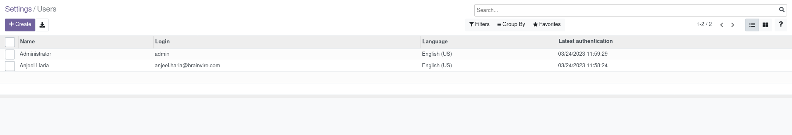

-  User Type: User types - Change the setting from Portal to Internal
   User

-  Services: Project – Select ´user´

-  Services: Time-sheet – Select ´User: own time-sheets only´

-  Click Save

.. image:: Project-Management-Media/image20.png
   :width: 6.69306in
   :height: 3.15417in

-  The member will receive an email to activate their account:

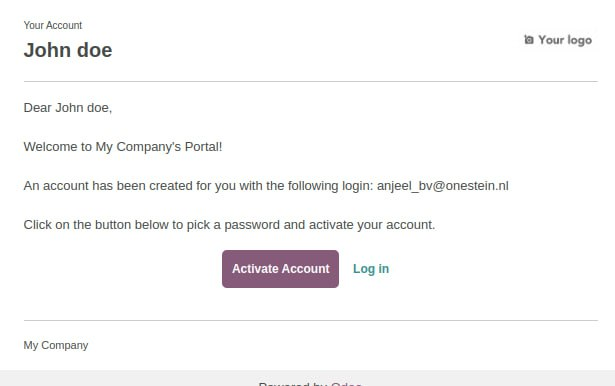

.. image:: Project-Management-Media/image22.png
   :width: 6.90625in
   :height: 3.64097in

**3.2 Create and Assign Task**
---------------------------------------------------------------------------------------------------

Roles supported: Administrator/ Project Manager can create tasks for all
member. Members (internal user) can only create their own tasks.

By setting the member as an Internal User, and visibility of projects as
´Invited Employees´, the members are able to view only the projects they
are invited to, their tasks and time-sheets.

-  Navigate to Project, select required project

-  Settings tab: check Time-sheets

-  Visibility – Select ´Invited employees´

-  Save

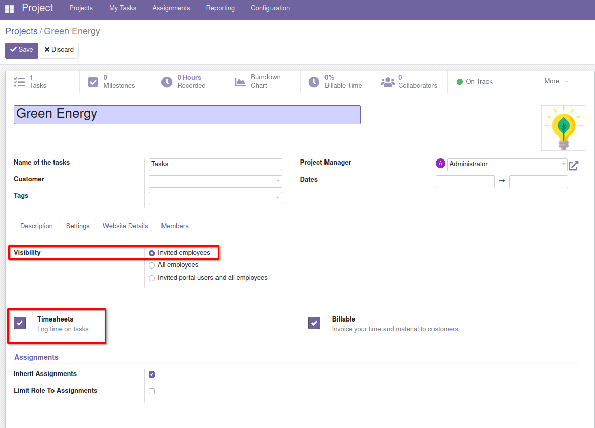

-  Navigate to Project, Select Project, Tasks

.. image:: Project-Management-Media/image24.png
   :width: 6.20833in
   :height: 3.10069in

-  Click Create, fill in Task Title and Add

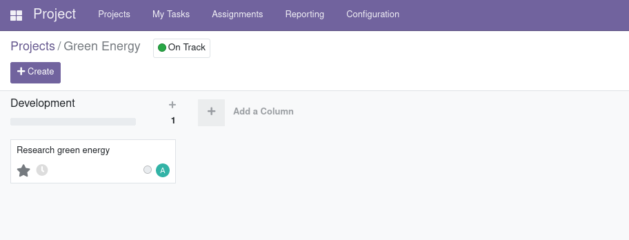

-  Select the task, click Edit

-  Assignee: Select member

-  Time sheets tab: fill in Initially Planned Hours

-  Save

.. image:: Project-Management-Media/image26.png
   :width: 6.69306in
   :height: 4.175in

3.3 Fill Time-sheets 
---------------------------------------------------------------------------------------------------

Roles supported: Member (can only edit their time-sheets)/ Project
Administrator

Once the task is assigned to the member:

-  The member receives email notification of task.

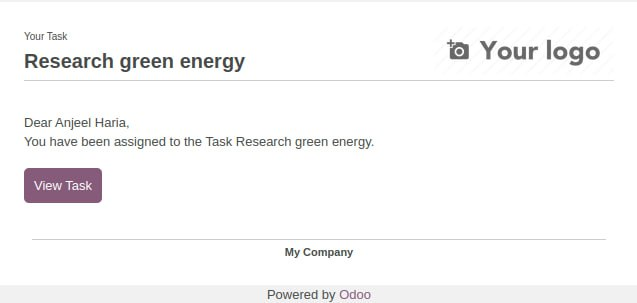

-  Member clicks View Task

-  Logs into account and views task

.. image:: Project-Management-Media/image28.png
   :width: 6.68958in
   :height: 3.41667in

-  Click Edit

-  Time-sheet Tab: add the date, description and hours spent

-  Save

.. image:: Project-Management-Media/image29.png
   :width: 6.29722in
   :height: 3.2125in
